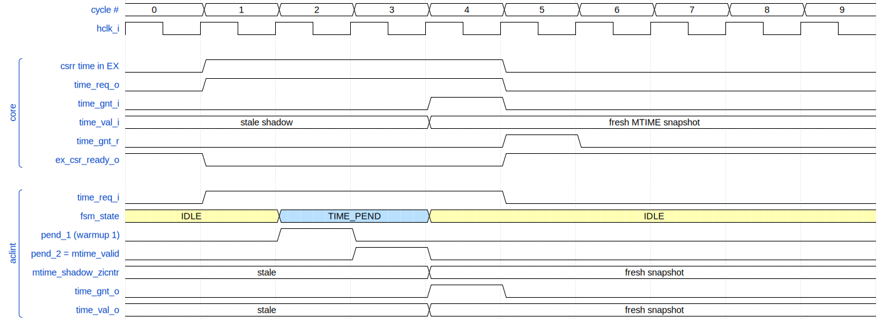

<p align="center">
  
</p>

# ACLINT Interrupt Controller (AHB-Lite)

*RISC-V ACLINT-spec interrupt controller with always-on MTIMER for wake-from-WFI.*

---

## Contents

- [Overview](#overview)
  - [Design parameters](#design-parameters)
  - [Module hierarchy](#module-hierarchy)
  - [Port summary](#port-summary)
  - [Access control](#access-control)
  - [Integration requirements](#integration-requirements)
  - [Clock gating](#clock-gating)
  - [Lint waivers](#lint-waivers)
- [Address map](#address-map)
  - [MSWI window](#mswi-window)
  - [MTIMER window](#mtimer-window)
  - [SSWI window](#sswi-window)
- [Clock-domain crossing architecture](#clock-domain-crossing-architecture)
  - [MTIME read gray-sync](#mtime-read-gray-sync)
  - [MTIMECMP write CDC](#mtimecmp-write-cdc)
  - [MTIMER AHB / Zicntr arbitration](#mtimer-ahb--zicntr-arbitration)
  - [Zicntr time-port handshake](#zicntr-time-port-handshake)
- [Wake-from-WFI](#wake-from-wfi)
- [Repository layout](#repository-layout)
- [Verification](#verification)
- [Synthesis](#synthesis)
- [License](#license)

---

## Overview

The **`ahb_aclint`** module is a parametrisable IP that implements the
RISC-V **ACLINT** (*Advanced Core-Local INTerruptor*) specification as a
single AHB-Lite slave. It consolidates the four ACLINT register banks —
**MSWI**, **MTIMER**, **SSWI** — behind one AHB port and
exposes per-hart machine / supervisor software-interrupt signals plus a
per-hart machine-timer interrupt to the aRVern core.

The MTIME counter lives in an **always-on low-frequency clock domain**
(`clk_lf_i`, typically a 32 kHz crystal oscillator) so that timer ticks
continue to advance while the SoC's main oscillator is powered-off. The bus-side **read** path
samples the LF-domain Gray-encoded MTIME counter directly through a
per-bit 2-FF synchronizer plus a 2-cycle hclk warmup; the bus-side
**write** path crosses to LF through a level-toggle handshake (one per
MTIMECMP half, per hart).

The IP also exposes a small **Zicntr time port** that returns a fresh
64-bit MTIME snapshot to the core's `time` CSR; the AHB MTIME read and
this side-band request share a single gray-sync read path.

### Design parameters

| Parameter         | Default       | Range        | Purpose |
|-------------------|---------------|--------------|---------|
| `SU_MODE_EN`      | `1`           | `0` or `1`   | Enable the SSWI (supervisor-software-IRQ) sub-module. Match the core's `SU_MODE_EN`: when the core is M-only, no S-mode IRQ source is needed. |
| `NUM_HARTS`       | `1`           | `1..16`      | Number of harts (sets the width of `irq_m_software_o`, `irq_m_timer_o`, `irq_s_software_o`, `mtimer_wake_lf_o` and the per-hart MTIMECMP / MSIP / SSIP register depth). |
| `PRIV_CHECK_EN`   | `1`           | `0` or `1`   | IP-level **per-window** privilege filter using `hprot_i[1]` + `hsmode_i` (MSWI/MTIMER → M-only, SSWI → M-or-S, U-mode → always denied). When `1` (default), denied accesses get a two-cycle AHB ERROR per the policy in [Access control](#access-control). When `0`, all accesses are accepted regardless of bus privilege (the integrator must rely on a fabric-level access check). |
| `ASYNC_RST_EN`    | `1`           | `0` or `1`   | Reset architecture: `1` = asynchronous active-low reset (default); `0` = synchronous reset. Threaded to every flop via the shared `arv_ipdff` primitive. Synchronous mode requires the clock to be running during reset assertion. See the repo README's *Reset architecture* section. |

> **Parameter check.** Out-of-range parameters trigger a simulation-time
> `$fatal` (e.g. `NUM_HARTS` outside `1..16`, `SU_MODE_EN` not 0 or 1).
> The checks are inside a `pragma translate_off` block — synthesis is
> unaffected.

### Module hierarchy

```
ahb_aclint
├── aclint_mswi                        always present
├── aclint_mtimer                      always present
│   ├── aclint_mtimer_count_lf         64-bit Gray counter + per-hart comparators (LF)
│   ├── aclint_mtimer_gray_sync        per-bit 2-FF sync on the LF Gray bus (hclk)
│   │   └── aclint_gray2bin            combinational Gray -> binary
│   └── aclint_mtimer_write_cdc        hclk -> LF MTIMECMP handshakes (LO/HI per hart)
└── aclint_sswi                        present iff SU_MODE_EN = 1
```

`SU_MODE_EN=0` elides `aclint_sswi`: `irq_s_software_o` is tied low and the
SSWI window is RAZ/WI.

### Port summary

| Direction | Port              | Width             | Description |
|-----------|-------------------|-------------------|-------------|
| in        | `hclk_i`          | 1                 | AHB clock |
| in        | `hresetn_i`       | 1                 | Active-low reset — **asynchronous** assertion when `ASYNC_RST_EN=1` (default), **synchronous** when `ASYNC_RST_EN=0`. Sync-deasserted on `hclk_aon_i` (so the always-on flops always observe the deassertion edge). Shared by both `hclk_i` and `hclk_aon_i` domains. |
| in        | `hclk_aon_i`      | 1                 | Always-on AHB-frequency clock. Same source and frequency as `hclk_i` but **never gated**. Drives the LF→hclk MTIP synchronizer chain inside `aclint_mtimer`, so a programmed `mtimecmp` expiry can propagate to `irq_m_timer_o` even when `hclk_i` is gated. See [Clock gating](#clock-gating). |
| out       | `hclk_en_o`       | 1                 | Combinational clock-gate advisory: HIGH when the ACLINT needs an `hclk_i` edge this cycle. Drive a SoC-side latch-based ICG. See [Clock gating](#clock-gating). |
| in        | `clk_lf_i`        | 1                 | Always-on low-frequency clock for MTIME |
| in        | `resetn_lf_i`     | 1                 | Active-low reset — **asynchronous** assertion when `ASYNC_RST_EN=1` (default), **synchronous** when `ASYNC_RST_EN=0`. Sync-deassert in the LF domain. |
| in        | `hsel_i`          | 1                 | AHB-Lite slave select |
| in        | `haddr_i`         | 16                | Byte address (64 KB window) |
| in        | `hwrite_i`        | 1                 | AHB write enable |
| in        | `hsize_i`         | 3                 | Transfer size — ignored. This IP treats every accepted transfer as a 32-bit word access (the ACLINT spec is silent on sub-word access). |
| in        | `htrans_i`        | 2                 | Transfer type (NONSEQ/SEQ start an access) |
| in        | `hprot_i`         | 4                 | AHB-Lite protection. Bit `[1]`: 1 = privileged, 0 = unprivileged. Other bits are ignored. Consumed only when `PRIV_CHECK_EN=1`. |
| in        | `hsmode_i`        | 1                 | aRVern AHB extension. When `hprot_i[1]=1`: 0 = M-mode, 1 = S-mode. Don't-care when `hprot_i[1]=0`. Consumed only when `PRIV_CHECK_EN=1`. |
| in        | `hready_i`        | 1                 | Bus ready in |
| in        | `hwdata_i`        | 32                | Write data |
| out       | `hrdata_o`        | 32                | Read data |
| out       | `hreadyout_o`     | 1                 | Bus ready out. Drops for 2 hclk cycles on every `MTIME_LO` read (sync-chain warmup), during MTIMECMP write back-pressure, and on the first cycle of a denied-access two-cycle ERROR response. |
| out       | `hresp_o`         | 1                 | Normally `0`. Driven `1` for both cycles of the two-cycle ERROR response when an S- or U-mode access is denied (only meaningful when `PRIV_CHECK_EN=1`). |
| out       | `irq_m_software_o` | `NUM_HARTS`       | MSIP per hart — connect each bit to the matching hart's `irq_m_software_i` on the aRVern core |
| out       | `irq_m_timer_o`    | `NUM_HARTS`       | MTIP per hart (hclk domain) — connect each bit to the matching hart's `irq_m_timer_i` on the aRVern core. Held LOW during a per-hart MTIMECMP write CDC roundtrip to prevent stale-value re-trap; see [MTIMECMP write CDC](#mtimecmp-write-cdc). |
| out       | `mtimer_wake_lf_o` | `NUM_HARTS`       | MTIP per hart (`clk_lf_i` domain) — same comparator output as `irq_m_timer_o`, but **before** the LF→hclk synchroniser AND **not** masked during MTIMECMP write CDC. Valid even when `hclk_i` is fully gated off; route to an LF-domain power/clock controller to re-enable the main hclk oscillator on a programmed `mtimecmp` expiry. Can be left unconnected if the SoC never turns off its main oscillator. |
| out       | `irq_s_software_o` | `NUM_HARTS`       | SSIP per hart — connect each bit to the matching hart's `irq_s_software_i` on the aRVern core (tie low when `SU_MODE_EN=0`) |
| in        | `time_req_i`      | 1                 | Level — asserted by the core while a `csrr time` / `csrr timeh` is waiting in EX; the FSM samples its first cycle of assertion to launch a gray-sync read. Bypasses the privilege check (this is a dedicated core-private port, not an AHB transaction). See [Zicntr time-port handshake](#zicntr-time-port-handshake) for the timing. |
| out       | `time_gnt_o`      | 1                 | 1-cycle pulse alongside a valid `time_val_o`. See [Zicntr time-port handshake](#zicntr-time-port-handshake). |
| out       | `time_val_o`      | 64                | Latched 64-bit MTIME snapshot. Held stable from the grant cycle until the next gray-sync read completes. |

### Access control

The IP enforces a per-access privilege check controlled by the
`PRIV_CHECK_EN` parameter (default `1`). With it enabled, the IP
enforces the spec's per-window privilege **classification** (Ch.1
Table 1) at the bus level via an AHB-Lite ERROR response on
unauthorized access. The classification is spec-mandated; the choice
to enforce it in hardware (rather than rely on a fabric-level decoder)
is an aRVern IP convention — the ACLINT spec itself is silent on the
hardware enforcement mechanism. With `PRIV_CHECK_EN=0`, every access
is accepted (the integrator must then rely on a fabric-level decoder
for privilege filtering).

**Per-window classification.** Per ACLINT 1.0-rc4 Chapter 1 / Table 1
each sub-device carries its own privilege level:

- **MSWI** / `MSIP[hart]` (Machine) — triggers a machine-software
  interrupt to a hart. Only M-mode firmware should issue an MSI.
- **MTIMER** / `MTIME` / `MTIMECMP[hart]` (Machine) — only M-mode
  programs `mtimecmp`. (The U-mode `time` CSR read path is the separate
  Zicntr `time_req_i` / `time_val_o` side-band, which bypasses this
  check.)
- **SSWI** / `SETSSIP[hart]` (Supervisor classification per Ch.1
  Table 1) — S-mode software can issue a supervisor-software IPI to
  another hart by writing `SETSSIP[target]`. M-mode writes are also
  allowed (M-mode SBI firmware can forward IPIs via the same path).
  U-mode is always denied.

**Privilege encoding** (aRVern AHB dialect):

| `hprot_i[1]` | `hsmode_i` | Privilege |
|--------------|------------|-----------|
| 1            | 0          | M-mode    |
| 1            | 1          | S-mode    |
| 0            | x          | U-mode    |

**Policy:**

| Privilege | MSWI | MTIMER | SSWI | Unmapped offsets |
|-----------|:----:|:------:|:----:|:----------------:|
| M-mode    | RW   | RW     | RW   | RAZ/WI           |
| S-mode    | DENY | DENY   | **RW** | RAZ/WI         |
| U-mode    | DENY | DENY   | DENY | RAZ/WI           |

Unmapped offsets stay RAZ/WI even from a denied privilege mode: the
error FSM gates on the *raw* sub-window decode, so an access that
doesn't decode into one of the three windows can never trigger the
error path. This is an aRVern IP convention that avoids leaking the
address-layout map to a denied master via ERROR-vs-OK probing — the
spec calls out RESERVED offsets (§3.1, §4.1) but does not mandate any
specific behavior for them.

**Denial behaviour.** A denied access produces a standard AHB-Lite
**two-cycle ERROR response** (the ACLINT spec is silent on bus-level
denial behavior; the two-cycle pattern is an AHB-Lite convention):

| Cycle             | `hreadyout_o` | `hresp_o` |
|-------------------|:-------------:|:---------:|
| Data phase, cycle 1 | 0 (stall)   | 1 (ERROR) |
| Data phase, cycle 2 | 1 (release) | 1 (ERROR) |

After cycle 2 the slave returns to idle. The addressed sub-block's
`reg_sel_i` is gated to 0 throughout the denied data phase, so the write
does not reach storage and any read returns `0` from the OR-mux — the
ACLINT register file is fully insulated from a denied access. The
two-cycle pattern lets the AHB master observe `HRESP` both as
`hreadyout` falls AND on the release cycle, eliminating the race that a
one-cycle ERROR pulse would expose. In the aRVern core this surfaces as
a `load_access_fault` (cause 5) on a denied read or a
`store_access_fault` (cause 7) on a denied write.

**Disabling the filter.** Set `PRIV_CHECK_EN=0` if the SoC fabric
already enforces the per-window policy at the address-decoder level.
`hprot_i` and `hsmode_i` remain inputs (so the integrator wires them up
regardless) but the IP ignores them, `hresp_o` stays at `0`, and
`hreadyout_o` only reflects MTIMER back-pressure.

### Integration requirements

The IP intentionally delegates a small number of integration-level concerns
to the surrounding SoC. Implement these at the boundary or the design will
malfunction in silicon even if it simulates cleanly.

- **Reset (`hresetn_i` / `resetn_lf_i`)** — both are active-low; the
  assertion style follows `ASYNC_RST_EN` (asynchronous when `1` (default),
  synchronous when `0` — see the [Design parameters](#design-parameters)
  row). The discussion below assumes the default asynchronous-assertion
  mode. The **de-assert edge of each must be
  synchronised to its own clock** (`hclk_aon_i` and `clk_lf_i`
  respectively — `hresetn_i` is shared by the `hclk_i` and `hclk_aon_i`
  domains and must be sync-deasserted on the always-on copy so the AON
  flops always observe the deassertion edge). The IP contains no
  internal reset synchroniser; an unsynchronised de-assert produces
  metastability on the first capture edge in that domain. The two
  resets are otherwise independent — the LF reset may outlast the hclk
  reset (e.g. an always-on PMU domain). Order of de-assertion does not
  matter for **functional correctness**; MTIME starts ticking on the
  first `clk_lf_i` edge after `resetn_lf_i` de-asserts.

  > **Reset ordering and the first MTIMECMP write.** A MTIMECMP write
  > issued while `hresetn_i` is already de-asserted but `resetn_lf_i`
  > is *still* asserted will be back-pressured by `hreadyout_o = 0`
  > and **stall** until `resetn_lf_i` finally de-asserts (the LF side
  > can't complete the write-CDC handshake while held in reset). The
  > stall is benign — `busy_lo` / `busy_hi` clears correctly once the
  > LF side wakes — but its duration is bounded only by the
  > integrator's reset sequencer. Typical boot sequences release both
  > resets before firmware runs, so this is invisible in practice;
  > flag it for low-level bring-up / RTL-emulation environments where
  > boot code may execute before the always-on LF domain is alive.

- **Low-frequency clock (`clk_lf_i`)** — must be a free-running clock
  asynchronous to `hclk_i`. The architecture is designed for clocks in the
  tens-of-kHz range (a 32 kHz watch crystal is the canonical source) but
  imposes no hard upper bound; the CDC paths tolerate any `clk_lf_i :
  hclk_i` ratio. The MTIME tick rate **is** `clk_lf_i`, so firmware must
  size `mtimecmp` deltas against that rate (e.g. 32 768 ticks ≈ 1 s for a
  32 kHz crystal).

- **AHB-Lite signalling** — `htrans_i[0]` (BUSY) is ignored: a NONSEQ/SEQ
  start (`htrans_i[1]=1`) launches an access; BUSY beats are not
  meaningful for a register-bank slave. `hsize_i` is ignored — this IP
  treats every accepted transfer as a 32-bit word access. The ACLINT
  spec is silent on sub-word access (§2.2, §3.1, §4.1 only define
  register width); integrators that need byte-strobe semantics should
  filter at the fabric.

- **Posted write back-pressure** — `hreadyout_o` may drop for a handful of
  hclk cycles during a `MTIME_LO` read (2 cycles of gray-sync warmup),
  during a rapid second write to the same MTIMECMP half (the prior
  write's LF handshake has not yet completed), or for one cycle on the
  first cycle of a denied-access ERROR response (see [Access
  control](#access-control)). Bus masters must honour `hready` per AHB-Lite.

- **`time_req_i` handshake** — `time_req_i` is a level signal, asserted
  by the core while a `csrr time` / `csrr timeh` is stalled in EX, and
  deasserted one cycle after the core has observed `time_gnt_o = 1`. The
  ACLINT samples the first cycle of the assertion to launch a gray-sync
  read and ignores subsequent cycles of that same assertion until the
  next gap (matching the aRVern core's `arv_csr_cntr` implementation).
  If both an AHB `MTIME_LO` read and a `time_req_i` arrive in the same
  cycle, the AHB read goes first and the `time_req_i` waits one extra
  read (see [MTIMER AHB / Zicntr
  arbitration](#mtimer-ahb--zicntr-arbitration)). See [Zicntr time-port
  handshake](#zicntr-time-port-handshake) for the full timing diagram.

- **`mtimer_wake_lf_o` wake routing** — if the SoC may fully gate
  `hclk_i` off in deep sleep, route this per-hart LF-domain signal into
  the SoC's clk_lf-domain power/clock controller so a `mtime ≥
  mtimecmp[hart]` expiry can re-enable the main hclk PLL/oscillator. If
  the wake path is already covered upstream of this slave (e.g. by an
  always-on interrupt aggregator), leave it unconnected. See
  [Wake-from-WFI](#wake-from-wfi) for the full picture.

### Clock gating

The IP exposes **two AHB-frequency clock inputs** (same source/frequency,
different gating policy):

- **`hclk_i`** — the **gated** AHB clock, driven through a SoC-side ICG
  enabled by `hclk_en_o`. Used by everything that has on-demand
  semantics: AHB phase trackers, register banks, the MTIME read FSM, the
  gray-sync warmup pipeline, MTIME shadow flop, the per-hart MTIMECMP
  write CDC, SSIP edge generator.

- **`hclk_aon_i`** — the **always-on** AHB-frequency clock (never
  gated). Drives only the LF→hclk MTIP synchronizer (`irq_meta`,
  `irq_sync` inside `aclint_mtimer`). This is the **load-bearing**
  always-on logic: without it, a programmed `mtimecmp` expiry could never
  propagate from the LF comparator into `irq_m_timer_o` while `hclk_i`
  is gated, deadlocking the wake path. Cost in always-on power is
  `2 × NUM_HARTS` flops (≤ 32 flops for the supported parameter range).

Both share `hresetn_i`, which integrators must **synchronously deassert
on `hclk_aon_i`** (so the always-on flops always observe the deassertion
edge regardless of `hclk_i` gating).

**`hclk_en_o` scope.** Combinational; HIGH whenever some `hclk_i`-domain
flop inside the ACLINT still needs to update.

**Integration pattern (SoC side).** Wire `hclk_en_o` into a latch-based
ICG and use the gated output as `hclk_i`. Wire the free-running
AHB-frequency clock straight into `hclk_aon_i`.

The testbench at `bench/verilog/tb_ahb_aclint.v` models a
proper ICG:

```verilog
// SoC-side ICG model (reference)
reg hclk_en_latch;
always @(free_clk or hclk_en_o)
    if (~free_clk)
        hclk_en_latch <= hclk_en_o;
assign hclk_i     = free_clk & hclk_en_latch;
assign hclk_aon_i = free_clk;                    // never gated
```

### Lint waivers

The RTL ships clean under `verilator --lint-only -Wall -Wpedantic` with an
empty waiver file (see `sim/rtl_sim/run/waivers.vlt`). Intentionally
unused signals (e.g. `htrans_i[0]`, `hsize_i`, `hprot_i[3:2]` /
`hprot_i[0]`, the upper bits of the SSWI write data) are routed to
explicit sink wires named with an `_unused` suffix so a single
tool-agnostic regex (`*_unused*`) can waive the residual warning in any
lint tool. When `PRIV_CHECK_EN=0`, the privilege-decode wires also have
no consumer and are sunk under a `G_PRIV_OFF_SINK` generate. Keep the
suffix when adding RTL.

The `aclint_gray2bin` module uses a per-bit XOR-reduction form
(`binary[i] = ^gray_i[W-1:i]`) instead of the textbook recursive form
(`binary[i] = binary[i+1] ^ gray_i[i]`) — the two are logically identical,
but the per-bit form avoids a Verilator `UNOPTFLAT` false positive on the
recursive `binary -> binary` dataflow.

---

## Address map

The AHB slave occupies a **64 KB window**. ACLINT 1.0-rc4 (§1, §2.1,
§3.1, §4.1) defines each sub-device as **modular** with its own
independent base address — the spec does **not** mandate the offsets
between MSWI / MTIMER / SSWI, nor the offset between MTIMECMP and MTIME
inside MTIMER. The fixed layout below is an **aRVern IP convention**
chosen to match the SiFive CLINT memory layout so that a CLINT-compatible
memory map at `0x0200_0000` is automatic when the SoC drops this slave
there.

| Offset            | Window      | Always present? |
|-------------------|-------------|-----------------|
| `0x0000 – 0x3FFF` | **MSWI**    | yes |
| `0x4000 – 0x7FFF` | **MTIMER**  | yes |
| `0x8000 – 0xBFFF` | reserved    | RAZ/WI |
| `0xC000 – 0xCFFF` | **SSWI**    | only if `SU_MODE_EN = 1` |
| `0xD000 – 0xFFFF` | reserved    | RAZ/WI |

### MSWI window

One 32-bit MSIP register per hart, packed contiguously at the bottom of
the window.

| Offset        | Register                 | Bits           |
|---------------|--------------------------|----------------|
| `0x0000`      | `MSIP[0]`                | `[0]=msip`, `[31:1]=0` |
| `0x0004`      | `MSIP[1]`                | (same)         |
| ...           | ...                      | (same)         |
| `4*hart`      | `MSIP[hart]`             | (same)         |
| above `4*NUM_HARTS` | reserved (RAZ/WI)  | — |

Software writes `MSIP[hart][0] = 1` to assert `irq_m_software_o[hart]`,
and `0` to clear it. Bits `[31:1]` are RAZ/WI. Single-cycle access — no
back-pressure on hclk.

### MTIMER window

Per-hart MTIMECMP pairs followed by the 64-bit MTIME.

| Offset                | Register             | Notes |
|-----------------------|----------------------|-------|
| `0x0000 + 8*hart`     | `MTIMECMP_LO[hart]`  | write triggers hclk → LF handshake |
| `0x0004 + 8*hart`     | `MTIMECMP_HI[hart]`  | write triggers hclk → LF handshake |
| `0x0000 + 8*NUM_HARTS`| `MTIME_LO`           | read samples the per-bit Gray sync output after a 2-cycle warmup; both halves are latched (LO returned now, HI buffered) |
| `0x0004 + 8*NUM_HARTS`| `MTIME_HI`           | read returns the buffered HI from the prior LO read (no sync, no wait) |
| above `MTIME_HI`      | reserved (RAZ/WI)    | — |

> **64-bit atomicity (aRVern IP convention — not normative in ACLINT 1.0-rc4).**
> A read of `MTIME_LO` samples the synchronized 64-bit Gray bus (after a
> 2-hclk warmup), converts it to binary, latches the upper 32 bits into
> an hclk-domain buffer (`mtime_shadow[63:32]`), and returns the lower
> 32 bits on the data phase. A subsequent read of `MTIME_HI` simply
> returns that buffered value — no sync, no wait. **Firmware must read
> `MTIME_LO` first, then `MTIME_HI`.** A bare read of `MTIME_HI` returns
> whatever was last buffered (typically stale, or `0` after reset).
>
> The ACLINT 1.0-rc4 spec (Chapter 2) is **explicitly silent** on RV32
> read-half atomicity for the 64-bit `MTIME` register:
> - it defines `MTIME` only as a 64-bit register (Section 2.2);
> - the only synchronization example in Section 2.4 ("Listing 1") is for
>   RV64 using the `ld` instruction; no RV32 equivalent is provided;
> - no canonical "LO then HI" pattern is mandated, no required read
>   order, no hardware-snapshot contract.
>
> The implementer is therefore free to define the semantics. This IP
> picks the SiFive-CLINT-compatible "LO triggers a fresh atomic snapshot,
> HI returns the buffered upper half" semantics — the same convention
> implemented by QEMU `riscv_aclint_mtimer`, OpenSBI `aclint_mtimer.c`,
> and the Linux RISC-V ACLINT driver. Portable drivers targeting other
> ACLINT implementations should not assume this contract holds in
> general; the spec-conservative pattern is the textbook RV32 retry
> loop (`rdtimeh / rdtime / rdtimeh / compare`).

> **MTIMECMP back-pressure.** A second write to the same MTIMECMP half
> while the prior write's LF handshake is still in flight is back-pressured
> by `hreadyout_o = 0` until the first handshake completes. The two halves
> of a single MTIMECMP are independent — software may write LO then HI
> back-to-back without stalling.

> **MTIMECMP read-back.** Reads of `MTIMECMP_LO[hart]` / `MTIMECMP_HI[hart]`
> return the hclk-domain shadow inside the write CDC — no LF sampling,
> single-cycle. The shadow is updated on every write, so the read-back
> matches the most recently issued write, even if the LF side has not yet
> latched the new value.

### SSWI window

Same layout as MSWI but for the per-hart **SSIP** flag.

| Offset        | Register                 | Bits |
|---------------|--------------------------|------|
| `0x0000`      | `SSIP[0]`                | `[0]=ssip`, `[31:1]=0` |
| `0x0004`      | `SSIP[1]`                | (same) |
| ...           | ...                      | (same) |
| `4*hart`      | `SSIP[hart]`             | (same) |
| above `4*NUM_HARTS` | reserved (RAZ/WI)  | — |

Writes from M-mode (or S-mode, per the spec — see [Access
control](#access-control)) follow the standard pattern. Writing `1` to
`SETSSIP[N][0]` emits a one-cycle edge on `irq_s_software_o[N]` which the
core's `mip.SSIP` flop latches; reads always return 0.

Present only when `SU_MODE_EN = 1`. When elided, the SSWI address window
returns 0 on reads and silently drops writes.

---

## Clock-domain crossing architecture

`ahb_aclint` has exactly one CDC boundary: between `hclk_i` (the AHB
domain) and `clk_lf_i` (the always-on MTIME domain). Two independent
mechanisms cross it: the **MTIME read gray-sync** (LF→hclk, per-bit) and
the **MTIMECMP write handshakes** (hclk→LF, one per half per hart). All
other registers (MSIP, SSIP) live purely in hclk and have no CDC.

### MTIME read gray-sync

Implemented in `aclint_mtimer_gray_sync.v`. A 64-bit per-bit 2-FF
synchronizer samples the LF Gray-encoded MTIME bus directly into hclk;
a 2-stage `read_req` pipeline absorbs the sync-chain warmup delay
before the parent FSM samples the binary snapshot.

```
   (LF)                       (hclk)
   mtime_gray_lf  -->  [64 x 2-FF sync]  -->  gray2bin  -->  mtime_bin_w
                                                                  |
                                                                  | (sampled when pend_1)
                                                                  v
                                                          mtime_binary_r --> mtime_binary_o
   read_req_i  -->  pend_1  -->  pend_2  ----------------------> mtime_valid_o
                    (latch)        (pulse)
```

**Why per-bit 2-FF sync is safe here.** The MTIME counter is stored as
a **Gray-encoded** 64-bit register inside the LF domain (the binary
view needed by the local incrementer and the per-hart comparators is
derived combinationally each cycle via `aclint_gray2bin`). By
construction the Gray register transitions **exactly one bit per LF
tick**, so an hclk sample of the 64-bit bus catches at most one bit
mid-transition. After 2 FFs of synchronization, that bit resolves to
either its pre- or post-transition value — both correspond to a valid
Gray code, either `G(N)` or `G(N+1)`. The hclk-side `gray2bin` then
produces a binary value of `N` or `N+1` (a ±1 LF-tick sampling
uncertainty, which is inherent to any CDC at this ratio). This is the
canonical CDC pattern for Gray counters crossing into a faster clock
domain (Cummings, "Clock Domain Crossing Design & Verification
Techniques," SNUG 2008, §5.2).

> **Why Gray-only storage.** Keeping only the Gray view (and deriving
> the binary on demand) saves the 64 flops of a parallel binary register
> — a substantial fraction of the LF-domain area — without changing the
> CDC contract above. The 64-bit `+1` incrementer feeds the next-state
> binary into both a `bin -> gray` re-encoder (for the Gray register
> update) and the per-hart comparators in section 7 (see below). At LF
> speeds (e.g. 32 kHz, 31 µs period) the gray2bin → `+1` → bin2gray
> critical path is many decades below timing.

**Why the 2-cycle warmup.** A per-bit 2-FF synchronizer is only useful
when the destination clock has had time to flush stale samples through
the chain. `hclk_i` may be **gated** by the SoC clock controller (for
example, during a WFI sleep) and then ungated coincident with the bus
read that wakes the system; on that wake cycle, both stages of the
synchronizer still hold whatever stale Gray values they had at the
gating moment. Walking `read_req_i` through a 2-stage pipeline before
sampling the binary snapshot guarantees that the sync chain has seen at
least 2 fresh hclk edges between the request and the latch — enough for
both stages to have propagated the live LF Gray value into hclk.

**Latency.** Worst-case AHB round-trip is now `1 hclk` (request latch)
+ `2 hclk` (warmup, latching binary into `mtime_binary_r`) = **3 hclk
cycles per `MTIME_LO` read**, of which 2 cycles are seen as
`hreadyout_o = 0` AHB wait states. This is independent of the LF clock
period (compared to ~125 µs in the prior level-toggle handshake
implementation — a >3000× reduction at 32 kHz LF / 100 MHz hclk).

**No deadlock contract.** Because there is no LF-side state machine to
synchronize with, the caller can re-assert `read_req_i` immediately
after the previous `mtime_valid_o` pulse. The parent's 3-state FSM
(IDLE → *_PEND → IDLE) still serializes AHB and Zicntr requesters; this
is for arbitration, not handshake correctness.

### MTIMECMP write CDC

Implemented in `aclint_mtimer_write_cdc.v`. Each MTIMECMP half (LO, HI)
per hart has an independent write handshake.

```
  (hclk)                                                   (LF)
  reg_wr_en_i & sel  --> latch new value + toggle level --> 2-FF sync + edge
                                                                |
                                                                v
                                                         copy hclk-side value
                                                         into mtimecmp_lf[hart]
                                                                |
                                                                v
  busy = (sent_level ^ ack_level) <-- 2-FF sync <-- toggle ack_level
```

The hclk side keeps the most recently written value in a hclk-domain
shadow register; this is what `MTIMECMP_LO/HI` reads return.
`hreadyout_o` drops while a write handshake is in flight, so the AHB
master cannot issue a second write to the same half before the first
has been committed in LF.

**Reset value (aRVern IP convention — spec defines reset as "unknown
state", §2.3).** Both halves reset to `32'hFFFF_FFFF` (i.e. MTIMECMP =
`64'hFFFF_FFFF_FFFF_FFFF`), so a freshly-reset comparator never asserts
`irq_m_timer_o` before firmware has had a chance to program it.
Portable firmware should not rely on this — the spec permits any reset
state.

**MTIP suppression during a write CDC roundtrip.** While the per-hart
`write_lo_busy` or `write_hi_busy` flag is set, the hclk-side
`irq_m_timer_o[hart]` is **combinationally forced to 0** at the
synchronizer **output** (`irq_m_timer_o = irq_sync & ~mtimecmp_write_busy`).
The synchronizer itself tracks the raw LF-domain comparator output —
keeping its inputs free of combinational gates avoids glitch hazards from
asynchronous transitions of `irq_m_timer_lf` (LF) and
`mtimecmp_write_busy` (hclk) racing through a shared AND/NOT into the
metastability-prone meta flop, and lets `busy` rising drop the output
within one gate delay instead of two `hclk_aon_i` sync cycles.

The suppression eliminates the "trap-storm" pattern where firmware
writes a future `mtimecmp` inside an MTI handler, MRETs, and the
still-asserted (stale) MTIP re-fires the trap before the LF side has
committed the new value. The roundtrip is ~5 hclk + ~5 LF cycles
(≈ 150 µs at 32 kHz / 100 MHz), after which `busy` clears, the
synchronizer is already tracking the LF comparator (which is now
evaluating against the new `mtimecmp_lf`), and the resulting
`irq_m_timer_o` level reflects the new value combinationally. Total
firmware-observable MTI latency penalty: bounded by the same ~150 µs
CDC window.

The **LF-domain** `mtimer_wake_lf_o` wake output is deliberately NOT
masked — the busy flag is in the hclk domain, so if `hclk_i` is gated
off (deep sleep) while a write is mid-flight, `busy` would be stuck and
masking the LF wake would deadlock the SoC. The LF wake therefore
always reflects `(mtime + 1) >= mtimecmp_lf` regardless of CDC state.

### MTIMER AHB / Zicntr arbitration

The single gray-sync read path is shared between two requesters:

- The AHB master reading `MTIME_LO`.
- The aRVern core requesting a fresh `time` CSR value via `time_req_i`.

A 3-state FSM inside `aclint_mtimer` (IDLE → AHB_PEND → IDLE, or IDLE →
TIME_PEND → IDLE) arbitrates them with **strict AHB priority**: if both
arrive on the same hclk cycle, the AHB request goes first, and the
`time_req_i` is held pending until the AHB read completes, at which
point the FSM launches the second read and asserts `time_gnt_o` when
its value lands.

The AHB master is naturally back-pressured by `hreadyout_o = 0` during
its 2-cycle warmup. The Zicntr consumer (the core's counter block)
simply waits an extra slot when both fire together — the contract on
`time_req_i` / `time_gnt_o` permits arbitrary latency.

### Zicntr time-port handshake

The aRVern core asserts `time_req_o` (= ACLINT `time_req_i`) **as a
level** for the entire duration that a `csrr time` / `csrr timeh`
instruction is stalled in the EX stage. It deasserts one cycle after it
has observed `time_gnt_i = 1` (the core registers the grant — see
`arv_csr_cntr.v:139-150`). The ACLINT's arbiter FSM samples the level on
the first hclk it can launch a gray-sync read; once `mtime_valid`
returns internally, the FSM pulses `time_gnt_o` for one cycle alongside
a freshly-latched `time_val_o`. `time_val_o` is then held stable from
the grant cycle onwards (the `mtime_shadow` register only updates on
the next gray-sync read completion).



Cycle-by-cycle:

| Cycle | Core                                                                          | ACLINT                                                                                |
|:-----:|-------------------------------------------------------------------------------|---------------------------------------------------------------------------------------|
| 0     | idle                                                                          | `IDLE`                                                                                |
| 1     | `csrr time` enters EX → `time_req_o = 1`, `ex_csr_ready_o = 0` (stall)        | `IDLE` samples `time_req_i = 1`, next-state `TIME_PEND`, `read_req` pulses            |
| 2     | stalled, `time_req_o` held                                                    | `TIME_PEND`, gray-sync warmup cycle 1 (`pend_1 = 1`; one fresh hclk edge through the 2-FF sync chain) |
| 3     | stalled                                                                       | `TIME_PEND`, warmup cycle 2 (`pend_2 = 1` = `mtime_valid`); next-state `IDLE`         |
| 4     | sees `time_gnt_i = 1`; registers it (NBA → `time_gnt_r` next cycle)           | `IDLE`; `time_gnt_o = 1` (1-cycle pulse); `mtime_shadow_zicntr` latches the fresh snapshot, `time_val_o` now holds it |
| 5     | `time_gnt_r = 1` → `time_req_o = 0`, `ex_csr_ready_o = 1`; `csrr time` retires reading `time_val_i` | `IDLE`; `time_gnt_o = 0`; `time_val_o` still held                                     |
| 6+    | back to normal pipeline flow                                                  | `IDLE`; `time_val_o` continues to hold until the next request                         |

A `csrr time` therefore retires in **~5 hclk cycles** end-to-end (the 2
gray-sync warmup cycles dominate). This is a >2000× reduction vs the
prior CDC-handshake implementation, and the latency is now independent
of the LF clock period — the synchronous-to-`hclk` alternative in the
aRVern integration guide is no longer required for performance
reasons.

> **Multiple back-to-back reads.** A second `csrr time` issued before
> the first has retired is automatically serialised by the core: the
> first instruction holds the EX stage until it observes its grant, so
> the second doesn't enter EX until afterwards, and re-asserts
> `time_req_o` then. The ACLINT's `time_req_pending` latch handles the
> case where the second request arrives during the brief window where
> the FSM is busy completing the previous read.

---

## Wake-from-WFI

The `WFI` instruction lets the aRVern core drop `hclk_en_o` and gate the
main clock. In that state, hclk-domain IRQ sources (MSWI, SSWI)
remain at their last value and can only be changed by another bus
master — exactly as the spec intends.

The MTIMER, however, must continue to advance and must be able to wake
the core. This works because:

- `aclint_mtimer_count_lf` runs on `clk_lf_i`, which is **not** gated by
  `hclk_en_o`. MTIME continues to increment in the LF domain.
- A **registered** per-hart comparator inside that same LF block
  evaluates `(mtime + 1) >= mtimecmp[hart]` combinationally and samples
  the result into a dedicated flop on every LF edge. The `+ 1` offset
  pre-compensates exactly for the 1 LF cycle of register latency, so
  the registered output rises on the **same LF cycle** as an
  unregistered comparator on `mtime` would have — no firmware-visible
  latency penalty.
- The registered flop output is exposed directly on the top-level port
  **`mtimer_wake_lf_o[hart]`** (in addition to the hclk-synchronised
  `irq_m_timer_o[hart]`). The integrator's always-on power/clock
  controller wires `mtimer_wake_lf_o[]` into the same OR-tree as the
  other wake sources to re-enable the main hclk oscillator on a
  `mtime ≥ mtimecmp` expiry.

```
        clk_lf domain                                hclk domain
        +-----------------------+                    +-----------------+
        | mtime_count_lf        |                    |                 |
        |                       | -mtimer_wake_lf -> | 2-FF sync       | -> irq_m_timer_o
        | gray state (flop) ──┐ |   (registered;     |                 |    (to core MTIP)
        |                     │ |    glitch-free)    +-----------------+
        | gray2bin (comb) ────┤ |
        |                     │ |
        | (mtime+1) >= cmp ───┘ |
        |   |                   |
        |   v reg (per-hart)    |
        |   |                   |
        +---+-------------------+
            v
        always-on power/clock controller
        (re-enables hclk PLL on rising edge)
```

The two outputs carry the same logical level — `mtimer_wake_lf_o` is
purely the upstream copy. Integrators that don't need wake-from-deep-sleep
(or that route the wake signal through an upstream aggregator) can leave
`mtimer_wake_lf_o` unconnected; the hclk-side path is unaffected.

**Why two outputs instead of just one?** A SoC-internal arbitrary
power-controller can not assume that `irq_m_timer_o` will toggle while
`hclk_i` is gated — the 2-FF synchroniser has no clock. Exposing the
upstream LF signal directly avoids that chicken-and-egg between "clock
gated off" and "needs a clock edge to wake up."

**Why the comparator output is registered.** A combinational comparator
on `gray2bin(mtime) >= mtimecmp` would briefly **glitch through invalid
binary intermediates** while the gray2bin XOR-chain settles at each LF
clock edge. The registered output filters those glitches at the source,
guaranteeing both the LF-domain wake consumer and the hclk-side 2-FF
sync see a stable level at every PVT corner. The `+ 1` offset trick
costs nothing (the `mtime + 1` is the same value the counter is about
to flop in next cycle, and is already on a shared wire) while
eliminating the 1 LF cycle of latency the register would otherwise
introduce.

---

## Repository layout

```
ahb_aclint/
├── rtl/verilog/
│   ├── ahb_aclint.v                  Top-level AHB-Lite slave + sub-instances
│   ├── aclint_mswi.v                 Per-hart MSIP register bank
│   ├── aclint_sswi.v                 Per-hart SSIP register bank (gated by SU_MODE_EN)
│   ├── aclint_mtimer.v               MTIMER composition + AHB/time arbitration FSM
│   ├── aclint_mtimer_count_lf.v      64-bit MTIME counter + comparators (LF)
│   ├── aclint_mtimer_gray_sync.v     LF -> hclk per-bit Gray sync + 2-cycle warmup
│   ├── aclint_mtimer_write_cdc.v     hclk -> LF MTIMECMP write handshake
│   ├── aclint_gray2bin.v             Combinational Gray -> binary helper
│   └── filelist.f                    RTL source list (consumed by both sim & synth)
├── sim/rtl_sim/
│   ├── bin/                          Sim runner + log parsers
│   └── run/                          Run wrappers (run_lint, waivers.vlt)
└── doc/
    ├── ahb_aclint.md                 This document
    └── img/                          (reserved for future block diagrams)
```

---

## Verification

The IP ships with a standalone Verilog testbench at
`bench/verilog/tb_ahb_aclint.v` driven by an AHB-Lite BFM. The sim
runner exposes per-test and sweep modes; both lint and sim sweeps cover
the parameter space (single / multi-hart, `SU_MODE_EN` on/off,
`PRIV_CHECK_EN` on/off — defaults to `1` for the typical sweep
config).

```bash
cd sim/rtl_sim/run
./run_lint                # single-config lint (Verilator)
./run_lint -sweep         # lint sweep across the supported parameter grid
../bin/runsim <test>      # run one sim test under the default config
./run_all                 # run the default-config regression
./run_all -sweep          # full sim sweep -- all tests x all configs
```

Coverage at a glance (full list in `sim/rtl_sim/src/`):

| Area exercised                                    | Tests |
|---------------------------------------------------|-------|
| MSWI register RW + `irq_m_software_o`             | `mswi_basic`, `mswi_multihart` |
| MTIMER MTIMECMP RW + write back-pressure          | `mtimer_cmp_writeback`, `mtimer_multihart` |
| MTIME 64-bit atomic read via CDC                  | `mtimer_atomic_read` |
| MTIME-driven MTIP wake (comparator → sync)        | `mtimer_wake` |
| SSWI register RW + edge-set semantics             | `sswi_basic`, `sswi_multihart` |
| Unmapped address RAZ/WI                           | `unmapped_access` |
| `PRIV_CHECK_EN=1` per-window policy + state-integrity + S-mode SSWI live edge | `priv_check` |
| `SU_MODE_EN=0` elision (no SSWI)                  | `su_disabled` |

---

## Synthesis

A Synopsys Design Compiler flow is not yet wired up for this IP. When
added, it will follow the same pattern as the other `arvern-ips` blocks
(see e.g. `arvern-ips/arv_custom_csr/synthesis/synopsys/`) with a
`LIB_FLAVOR` selector for technology setup.

---

## License

BSD 3-Clause — see [`LICENSE`](../../LICENSE) at the repo root.
