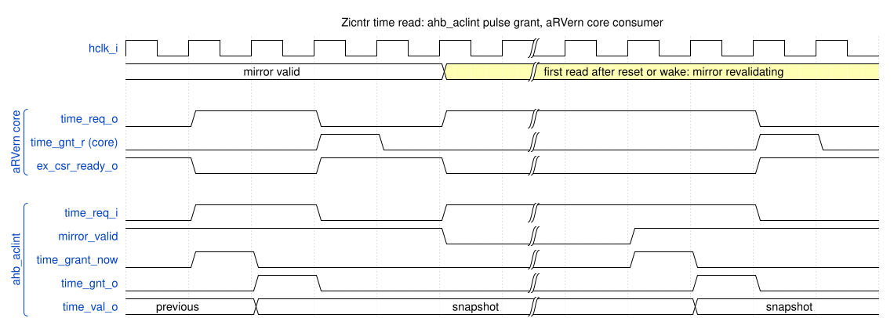

<p align="center">
  
</p>

# ACLINT Interrupt Controller (AHB-Lite)

*RISC-V ACLINT interrupt controller with an always-on MTIMER that keeps time —
and can restart the oscillator — while the rest of the chip is asleep.*

---

## Contents

- [Quick start](#quick-start)
- [Programming model](#programming-model)
  - [Address map](#address-map)
  - [MSWI — machine software interrupts](#mswi--machine-software-interrupts)
  - [MTIMER — MTIME and MTIMECMP](#mtimer--mtime-and-mtimecmp)
  - [SSWI — supervisor software interrupts](#sswi--supervisor-software-interrupts)
  - [Privilege and access control](#privilege-and-access-control)
  - [Wait states](#wait-states)
- [Integration](#integration)
  - [Parameters](#parameters)
  - [Ports](#ports)
  - [Clocks](#clocks)
  - [`hclk_aon_en_i` — telling the IP its clock is going away](#hclk_aon_en_i--telling-the-ip-its-clock-is-going-away)
  - [Minimum clk_lf timing](#minimum-clk_lf-timing)
  - [Resets](#resets)
  - [Clock gating](#clock-gating)
  - [Wake routing](#wake-routing)
  - [DFT](#dft)
- [Design internals](#design-internals)
  - [The tick](#the-tick)
  - [Reads: an exact mirror](#reads-an-exact-mirror)
  - [Writes: two shadow stages](#writes-two-shadow-stages)
  - [The MTIME load](#the-mtime-load)
  - [MTIP and the wake](#mtip-and-the-wake)
  - [Constraint-protected, not protocol-protected](#constraint-protected-not-protocol-protected)
- [Verification and signoff](#verification-and-signoff)
  - [Lint conventions](#lint-conventions)
- [License](#license)

---

## Quick start

`ahb_aclint` implements the RISC-V **ACLINT** specification (1.0-rc4) as a single
AHB-Lite subordinate: the three ACLINT register banks — **MSWI**, **MTIMER** and
**SSWI** — behind one AHB port, driving per-hart software and timer interrupts
to the aRVern core.

The MTIME counter lives in an always-on low-frequency domain (`clk_lf_i`,
typically a 32 kHz crystal), so time keeps advancing while the SoC's main
oscillator is off — and the timer can assert the wake that restarts it.

### Instantiate

```verilog
ahb_aclint #(
    .NUM_HARTS      ( 1    ),   // 1..16
    .SU_MODE_EN     ( 1    ),   // 1 = build the SSWI bank; set equal to the core's SU_MODE_EN
    .PRIV_CHECK_EN  ( 1    ),   // 1 = enforce the per-window privilege policy
    .LF_SYNC_EN     ( 0    ),   // 0 = real LF domain (silicon), 1 = FPGA
    .ASYNC_RST_EN   ( 1    )
) u_aclint (
    // Clocks and resets
    .hclk_i           ( hclk         ),   // gated by hclk_en_o via a SoC ICG
    .hclk_aon_i       ( hclk_free    ),   // same source, never gated
    .hresetn_i        ( hresetn      ),   // sync-deassert on hclk_aon_i
    .clk_lf_i         ( clk_32k      ),   // free-running timebase
    .resetn_lf_i      ( resetn_lf    ),   // sync-deassert on clk_lf_i
    .hclk_aon_en_i    ( osc_clk_en   ),   // arv_osc_ctrl clk_en_o: falls 1 edge before the clock stops; tie 1 if it never stops
    .scan_mode_i      ( scan_mode    ),   // DFT test mode; 0 functionally
    .hclk_en_o        ( aclint_hclk_en ),

    // AHB-Lite subordinate
    .hsel_i           ( sel      ), .haddr_i    ( addr[15:0] ),
    .hwrite_i         ( write    ), .hsize_i    ( size       ),
    .htrans_i         ( trans    ), .hready_i   ( ready      ),
    .hprot_i          ( prot     ), .hsmode_i   ( smode      ),
    .hwdata_i         ( wdata    ), .hrdata_o   ( rdata      ),
    .hreadyout_o      ( readyout ), .hresp_o    ( resp       ),

    // Interrupts
    .irq_m_software_o ( msip ), .irq_m_timer_o   ( mtip ),
    .irq_s_software_o ( ssip ), .mtimer_wake_lf_o( timer_wake ),

    // Zicntr time port
    .time_req_i       ( time_req ), .time_gnt_o ( time_gnt ), .time_val_o ( time_val )
);
```

**Minimum tie-off**, if the SoC never stops any clock:

| Port | Tie to | Why |
|---|---|---|
| `hclk_aon_i` | same net as `hclk_i` | no clock gating |
| `hclk_aon_en_i` | `1'b1` | `hclk_aon_i` never stops |
| `scan_mode_i` | `1'b0` | functional mode (route the chip's scan mode when there is a DFT flow) |
| `mtimer_wake_lf_o` | unconnected | nothing to wake |
| `hprot_i` / `hsmode_i` | wire them | ignored when `PRIV_CHECK_EN=0` |
| `resetn_lf_i` | `1'b1` only with `LF_SYNC_EN=1` | nothing is clocked by `clk_lf_i` in that mode; otherwise it is a real reset (see [Resets](#resets)) |

### Program a timer

With the window based at `0x0200_0000` (the CLINT-compatible layout):

```c
#define MTIMECMP(h)  (*(volatile uint32_t *)(0x02004000 + 8*(h)))
#define MTIMECMPH(h) (*(volatile uint32_t *)(0x02004004 + 8*(h)))
#define MTIME_LO     (*(volatile uint32_t *)(0x0200BFF8))
#define MTIME_HI     (*(volatile uint32_t *)(0x0200BFFC))

/* Read MTIME. LO first: on this IP the LO read latches HI for the following
   read (rule 1 below). Portable code uses the hi, lo, hi' retry idiom instead. */
uint64_t now(void) {
    uint32_t lo = MTIME_LO;          /* also snapshots HI */
    return ((uint64_t)MTIME_HI << 32) | lo;
}

/* Arm a one-second deadline on hart 0, at a 32.768 kHz tick. */
uint64_t t = now() + 32768;
MTIMECMP(0)  = 0xFFFFFFFF;           /* disarm: no smaller than the OLD comparand */
MTIMECMPH(0) = t >> 32;              /* no smaller than the NEW comparand         */
MTIMECMP(0)  = (uint32_t)t;          /* new value                                 */
/* MTIP follows each store within one hclk. The wake comparator sees the new
   deadline up to two clk_lf periods later; `wfi` right here is still safe,
   because hclk_en_o is held until the deadline has crossed to it. */
```

### Send an IPI

```c
#define MSIP(h)    (*(volatile uint32_t *)(0x02000000 + 4*(h)))   /* level  */
#define SETSSIP(h) (*(volatile uint32_t *)(0x0200C000 + 4*(h)))   /* edge   */

MSIP(1)    = 1;    /* raise M-software IRQ on hart 1; write 0 to clear   */
SETSSIP(1) = 1;    /* pulse S-software IRQ on hart 1; reads return 0     */
```

---

## Programming model

### Address map

16-bit window matching the SiFive CLINT layout (ACLINT 1.0-rc4 §1.1, Table 2),
so a CLINT-compatible map at `0x0200_0000` is drop-in.

| Offset          | Bank   | Notes |
|-----------------|--------|-------|
| `0x0000-0x3FFF` | MSWI   | `MSIP[hart]` at `4*hart` |
| `0x4000-0xBFFF` | MTIMER | `MTIMECMP[hart]` from the bottom, `MTIME` at the top |
| `0xC000-0xCFFF` | SSWI   | `SETSSIP[hart]` at `4*hart`; present only if `SU_MODE_EN=1`, RAZ/WI from every privilege otherwise |
| `0xD000-0xFFFF` | —      | reserved, RAZ/WI from every privilege |

Inside a window, offsets above the last per-hart register (`4*NUM_HARTS` in
MSWI and SSWI, `8*NUM_HARTS` in MTIMER, with `MTIME` at the top) and any
non-word-aligned offset are **RAZ/WI from a privilege the window admits**. From
a privilege the window denies, every offset in it — mapped or not — returns
ERROR (see [Privilege and access control](#privilege-and-access-control)).

`hsize_i` is ignored. A sub-word access to a non-word-aligned offset is RAZ/WI
rather than aliasing onto the word below, so a byte store to `msip + 1` cannot
clear a pending IPI (aRVern replicates a store byte across all four lanes). A
byte or half-word write to an aligned register offset commits all 32 bits of
`hwdata_i` — there is no byte-lane merging. Use word stores.

### MSWI — machine software interrupts

| Offset   | Register     | Behaviour |
|----------|--------------|-----------|
| `4*hart` | `MSIP[hart]` | bit `[0]` = `irq_m_software_o[hart]`, read-write **level**, reset `0`. Bits `[31:1]` RAZ/WI. |

Single-cycle, no back-pressure. Write `1` to assert, `0` to clear.

### MTIMER — MTIME and MTIMECMP

| Offset            | Register            | Behaviour |
|-------------------|---------------------|-----------|
| `0x0000 + 8*hart` | `MTIMECMP_LO[hart]` | RW, reset all-ones (disarmed). A separate register from HI: MTIP follows a write to it within one `hclk`, the wake comparator up to two LF periods later. |
| `0x0004 + 8*hart` | `MTIMECMP_HI[hart]` | RW, reset all-ones. As LO — a LO/HI pair is **not** applied together; see the three-store sequence below. |
| `0x7FF8`          | `MTIME_LO`          | RW, reset `0`. A read also snapshots HI for the next read. |
| `0x7FFC`          | `MTIME_HI`          | RW, reset `0`. A read returns the snapshot taken by the last `MTIME_LO` read. |

`MTIME` sits at the **top** of the window, so its address does not move with
`NUM_HARTS`: at base `0x0200_4000` that is the legacy **`0x0200_BFF8`**.

Two comparators watch `MTIMECMP`, and the rest of this section names them:

- **MTIP** (`irq_m_timer_o`) is compared on the `hclk` side against `MTIMECMP`
  exactly as written, half by half, and follows a write within one `hclk`.
- **The wake comparator** (`mtimer_wake_lf_o`) lives in the LF domain and reads a
  copy of `MTIMECMP` that follows on the next LF edge, so it sees a new deadline
  up to two LF periods after the store. It exists to restart a stopped
  oscillator; MTIP is what the hart takes.

**MTIME is read-write** (ACLINT 1.0-rc4 §2.2). A write replaces the count on the
LF edge it lands on rather than incrementing, so a read-back returns what was
written plus whatever has since accrued. MTIP is not sticky: loading past
`MTIMECMP` raises it, loading back below clears it.

Four rules for firmware:

1. **Read `MTIME_LO` before `MTIME_HI`.** The LO read latches the upper half into
   a shadow that the HI read returns; a bare `MTIME_HI` read returns whatever was
   last latched. This latch is a convenience of this IP, not a spec guarantee:
   the spec is silent on RV32 read atomicity, so portable drivers use the
   `hi, lo, hi'` retry idiom, which also works here.

2. **The LO/HI shadow is shared by all readers.** A second manager, or an ISR
   preempting main code, that reads `MTIME_LO` between another reader's LO and HI
   silently re-targets the shadow. The values only differ across a 2^32-tick
   boundary — about 1.5 days at 32 kHz — so this is a correctness requirement,
   not a likelihood: serialise the pair, or use the retry idiom. `csrr time` uses
   a separate snapshot and never disturbs the MMIO shadow; on a single hart the
   only hazard is an ISR that reads `MTIME_LO` between main code's two reads.

3. **A 64-bit write is atomic; a half-write touches only its own half.** Both
   halves share one shadow and one load request, so a back-to-back LO/HI pair
   reaches the counter as a single load — there is no "write HI first" rule and
   no intermediate-match hazard. Writing one half alone loads only that half; the
   other keeps counting, apart from holding still for the single LF edge the load
   consumes.

4. **`csrr time` is not ordered against an MTIME write.** A CSR read is not a
   memory operation under RVWMO, and `FENCE` orders memory against memory, so
   neither creates ordering here. **Read back through MMIO `MTIME_LO`**: a load
   *is* a memory operation and the core issues them in program order, so polling
   the read-back until it reflects the write is the portable barrier. On aRVern
   a `FENCE` that names an I/O bit (a bare `fence` included) between the two
   holds the read until the write has completed on the bus, so `sw` → `fence` →
   `csrr time` works here; `fence rw,rw` does not. An implementation property,
   not an ISA guarantee. A boot-time concern only.

**Writing MTIMECMP is not atomic**, and unlike an MTIME write (rule 3) nothing
merges the pair: the two halves are separate registers read straight by the MTIP
comparator, so between the stores the comparand is `{new HI, old LO}`. If that
intermediate falls below MTIME, MTIP asserts spuriously. Use the three-store
sequence the privileged spec gives for RV32 — store `-1` to LO, then HI, then LO —
which keeps every intermediate value no smaller than the lesser of the old and new
comparands. A two-store `HI, LO` pair is safe only while the new HI is at or above
the old one; moving a deadline to a lower HI with it can fire an immediate
interrupt. The wake comparator's copy is refreshed half by half too, so an LF
edge between the two stores can show it a mixed pair for one LF period: a spurious
oscillator restart at most, never a missed wake, and nothing at all with the
three-store sequence.

**MTIMECMP read-back** returns the register as written — single-cycle, and it
matches the most recently issued write even before the wake comparator's copy has
taken it.

### SSWI — supervisor software interrupts

| Offset   | Register        | Behaviour |
|----------|-----------------|-----------|
| `4*hart` | `SETSSIP[hart]` | **Write-only, edge, no state.** Writing `1` emits a one-cycle pulse on `irq_s_software_o[hart]` (back-to-back writes to the same hart merge into one longer pulse; the core sets SSIP on it, so this is equivalent); writing `0` does nothing; reads return `0`. |

As ACLINT 1.0-rc4 §4.2: the receiving hart clears its own `sip.SSIP`, there is
no level here to clear. Because the pulse can be emitted while the target hart's
clock is gated, the consumer must be able to wake on it combinationally (in
aRVern, `wfi_wakeup_live_o`).

Present only when `SU_MODE_EN=1`; otherwise the window is RAZ/WI and
`irq_s_software_o` is tied low.

### Privilege and access control

With `PRIV_CHECK_EN=1` the IP enforces the spec's per-window privilege
classification (§1, Table 1) at the bus level. Privilege is encoded as:

| `hprot_i[1]` | `hsmode_i` | Privilege |
|:---:|:---:|---|
| 1 | 0 | M-mode |
| 1 | 1 | S-mode |
| 0 | x | U-mode |

| Privilege | MSWI | MTIMER | SSWI | Outside all windows (`0xD000-0xFFFF`) |
|---|:---:|:---:|:---:|:---:|
| M | RW | RW | RW | RAZ/WI |
| S | DENY | DENY | **RW** | RAZ/WI |
| U | DENY | DENY | DENY | RAZ/WI |

An unmapped or misaligned offset *inside* a window follows that window's cell:
RAZ/WI where the cell says RW, ERROR where it says DENY. With `SU_MODE_EN=0` the
SSWI column reads RAZ/WI for every privilege — the window is then a hole, not a
device.

A denied access gets the AHB-Lite **two-cycle ERROR** (`hreadyout_o=0` then `1`,
`hresp_o=1` for both). The addressed bank's select is gated throughout, so
writes never land and reads return `0`. An aRVern hart reports that error
response as a **resumable NMI** (`mncause=0x80000003`, faulting address in
`marv_eaddr`), not as a synchronous access fault: causes 5 and 7 come from its
PMP checkers only.

The gate is applied per **window**, not per mapped offset: any offset inside MSWI,
MTIMER or SSWI is denied when that window's privilege rule denies it, whether or
not a register lives there. So a denied manager gets the ERROR everywhere in the
window and cannot map its contents by ERROR-vs-OK. Offsets outside all three
windows are RAZ/WI regardless of privilege, since no window claims them. The Zicntr `time_req_i` port bypasses
the check entirely; it is a core-private side band, not a bus transaction.

`PRIV_CHECK_EN=0` accepts everything and holds `hresp_o` low; the integrator must
then filter at the fabric. `hprot_i` / `hsmode_i` are then ignored but stay wired.

### Wait states

Cycles with `hreadyout_o` low, beyond the single-cycle transfer. **R** is the
number of `hclk_aon_i` cycles per `clk_lf_i` period (a few thousand for a
32.768 kHz crystal). The **mirror** is the hclk-side copy of MTIME that every read
returns, refreshed after each LF edge.

| Access | Wait states |
|---|---|
| `MSIP` / `SETSSIP` read or write | **0** |
| `MTIMECMP` read or write | **0** |
| `MTIME` read or write | **0** |
| `MTIME_LO` read while the mirror is untrustworthy | ≤ **2R**, typically ≤ R |
| Denied by `PRIV_CHECK_EN` | **1** (`hreadyout_o=0`, `hresp_o=1`), then the transfer completes with `hresp_o=1` |
| Unmapped offset, from an admitted privilege or outside all windows | **0** |

The mirror is untrustworthy only out of reset and once per osc-off deep-sleep
exit; it is the only data-dependent stall in the block. `MTIME_HI` never stalls:
it returns the snapshot of the last `MTIME_LO` read, which waiting would not
refresh. The bound assumes `clk_lf_i` is running: the mirror is revalidated by an
LF edge, so an `MTIME_LO` read or `csrr time` issued before the first one stalls
without bound (see
[Clocks](#clocks)).

On the Zicntr port, `time_req_i` is a level held until granted; `time_gnt_o` is a
one-cycle pulse with `time_val_o` valid alongside. Normal latency is **1** cycle,
plus the same mirror wait if it happens to land in that window. The request must
be low again on the cycle after the grant pulse — the aRVern core drops it on
the cycle the read completes; a request still held then is granted a second time
with a refreshed `time_val_o`.



The block assumes `hready_i` equals its own `hreadyout_o` during its data phase,
which is the AHB-Lite rule for the selected subordinate. A fabric that lowers
`hready_i` there stretches the SSIP pulse into a level and repeats the ERROR's
first cycle after its second.

Two effects cost no bus cycles but are worth knowing: a **MTIMECMP** write
reaches the wake comparator up to two LF periods later, and a **MTIME** write
reaches the counter two to three LF periods later (a quiet tick, a launch tick,
then the LF edge that consumes it), with reads served from the pending value
meanwhile. MTIP itself reacts to a MTIMECMP write in **one hclk cycle**, because
it is compared against the register as written rather than the wake comparator's
copy.

---

## Integration

### Parameters

| Parameter | Default | Range | Purpose |
|---|---|---|---|
| `NUM_HARTS` | `1` | `1..16` | IRQ vector widths and per-hart register depth. `mtimer_wake_lf_o` stays 1 bit: the OR across harts. |
| `SU_MODE_EN` | `0` | `0`/`1` | Build the SSWI bank. Same default as the core's `SU_MODE_EN`; **keep the two equal.** |
| `PRIV_CHECK_EN` | `1` | `0`/`1` | Enforce the per-window privilege policy in hardware. |
| `LF_SYNC_EN` | `0` | `0`/`1` | Where MTIME lives — see below. |
| `ASYNC_RST_EN` | `1` | `0`/`1` | `1` = asynchronous reset assertion, `0` = synchronous. |

**`LF_SYNC_EN`** picks the timebase architecture. `clk_lf_i` is the timebase
source either way — both modes sample it as data to derive the tick.

- **`0` (silicon).** The counter and comparators are real `clk_lf_i` flops, so
  they keep running when `hclk_aon_i` stops. **Osc-off deep sleep is supported.**
- **`1` (FPGA).** No flop is clocked by `clk_lf_i`; everything runs on
  `hclk_aon_i`, advanced by the tick. Single-clock STA and DFT, no max-delay
  exceptions, no read mirror — at the cost of osc-off deep sleep: MTIME itself
  runs on `hclk_aon_i`, so that clock must never be stopped, and
  `mtimer_wake_lf_o` is **held asserted** so that a controller honouring the wake
  cannot stop it. Ordinary WFI wake still works. MTIME does not survive a warm
  reset of the AHB domain in this mode (see [Resets](#resets)). Tie
  `hclk_aon_en_i` high: every low pulse on it withdraws trust in the tick, and
  in this mode the tick *is* the count, so each pulse loses one or two MTIME
  ticks. `hclk_en_o` is still held for up to one LF period after every MTIMECMP
  write, for a copy nothing reads in this mode — a power cost, not a functional
  one.

Out-of-range parameters trigger a simulation-time `$fatal` inside a
`pragma translate_off` block; synthesis is unaffected.

### Ports

| Dir | Port | Width | Description |
|---|---|---|---|
| in | `hclk_i` | 1 | AHB clock, gated by `hclk_en_o` through a SoC ICG |
| in | `hclk_aon_i` | 1 | Always-on AHB clock — same source and frequency as `hclk_i`, never gated |
| in | `hresetn_i` | 1 | Active-low reset for both hclk domains |
| in | `clk_lf_i` | 1 | Low-frequency timebase, required in both modes |
| in | `resetn_lf_i` | 1 | Active-low reset for the LF domain. Unused when `LF_SYNC_EN=1` — tie high |
| in | `hclk_aon_en_i` | 1 | Oscillator controller: `hclk_aon_i` is, or is about to be, running. Must de-assert **one rising edge before** the clock stops — see [`hclk_aon_en_i`](#hclk_aon_en_i--telling-the-ip-its-clock-is-going-away) |
| in | `scan_mode_i` | 1 | DFT test mode. Low functionally |
| out | `hclk_en_o` | 1 | Combinational clock-gate request for `hclk_i` |
| in | `hsel_i` | 1 | Subordinate select |
| in | `haddr_i` | 16 | Byte address |
| in | `hwrite_i` | 1 | Write enable |
| in | `hsize_i` | 3 | **Ignored** — every transfer is treated as a 32-bit word |
| in | `htrans_i` | 2 | NONSEQ/SEQ start an access; BUSY is ignored |
| in | `hready_i` | 1 | Bus ready in |
| in | `hprot_i` | 4 | Bit `[1]` = privileged. Other bits ignored |
| in | `hsmode_i` | 1 | With `hprot_i[1]=1`: 0 = M, 1 = S |
| in | `hwdata_i` | 32 | Write data |
| out | `hrdata_o` | 32 | Read data |
| out | `hreadyout_o` | 1 | Bus ready out — see [Wait states](#wait-states) |
| out | `hresp_o` | 1 | ERROR response; only meaningful with `PRIV_CHECK_EN=1` |
| out | `irq_m_software_o` | `NUM_HARTS` | MSIP level per hart |
| out | `irq_m_timer_o` | `NUM_HARTS` | MTIP level per hart. Combinational (a 64-bit compare straight to the port): **sample on `hclk_i`**, never use as a live wake — `mtimer_wake_lf_o` is the clean level for that |
| out | `irq_s_software_o` | `NUM_HARTS` | SSIP **edge** per hart — a one-cycle pulse per write (back-to-back writes merge), sample on `hclk_i` |
| out | `mtimer_wake_lf_o` | 1 | Any hart's deadline expired, valid with all hclk stopped; constant 1 with `LF_SYNC_EN=1` |
| in | `time_req_i` | 1 | Zicntr: level, held until granted and dropped on the cycle after the grant pulse — see [Wait states](#wait-states) |
| out | `time_gnt_o` | 1 | Zicntr: one-cycle grant pulse |
| out | `time_val_o` | 64 | Zicntr: MTIME snapshot, stable between grants |

### Clocks

| Clock | Gating | Carries |
|---|---|---|
| `hclk_i` | gated by `hclk_en_o` | AHB phase tracking, register banks, read mux, Zicntr grant, SSIP edge, the bus-side write registers |
| `hclk_aon_i` | never, except osc-off deep sleep | LF observation, the MTIME read mirror, the copy of MTIMECMP the wake comparator reads, the MTIME load request |
| `clk_lf_i` | **never** | The MTIME timebase in **both** modes: the counter and wake comparators at `LF_SYNC_EN=0`, and the tick that clock-enables the counter at `LF_SYNC_EN=1` |

`hclk_aon_i` must be the **ungated source** of `hclk_i`: the same net, same
frequency, edges aligned. Without it a programmed deadline could never propagate
to `irq_m_timer_o` while `hclk_i` is gated, deadlocking the wake path.

> **`clk_lf_i` is a boot dependency. It must be running before the system leaves
> reset, and it must never stop.** This holds in *both* `LF_SYNC_EN` settings, for
> different reasons, and neither is optional:
>
> - `LF_SYNC_EN=0` — it clocks MTIME and the wake comparators directly. In an
>   `ASYNC_RST_EN=0` build `resetn_lf_i` additionally takes effect only on its
>   clock edges (see [Resets](#resets)), so with no `clk_lf_i` the LF flops never
>   initialise and MTIME comes up at a **random value instead of 0**.
> - `LF_SYNC_EN=1` — the counter moves to `hclk_aon_i`, but `clk_lf_i` is still
>   sampled as data and edge-detected into the tick, and **that tick is MTIME's
>   clock enable**. No `clk_lf_i` edges means no ticks, which means no time at all.
>   Tying `clk_lf_i` to `hclk_aon_i` does not "simplify" this mode — it violates the
>   phase floor below and stops the counter dead.
>
> Absent or late, the symptoms are quiet: MTIME never advances, the first `MTIME_LO`
> read stalls without bound, the first `csrr time` is never granted, and nothing
> on the bus says why. A platform can make the rule structural by holding system
> reset until the LF-domain reset has released —
> [`arv_reset_gen`](../../arv_primitives/doc/arv_primitives.md#arv_reset_gen--reference-soc-reset-generator)
> with `LF_GATE_EN=1` does exactly that. The failure then becomes a hart visibly
> held in reset, which a debugger can see, instead of a bus transaction that never
> completes.

### `hclk_aon_en_i` — telling the IP its clock is going away

No flop clocked by `hclk_aon_i` can detect that its own clock stopped, so the
oscillator controller has to say so. This input carries that, and its edge
behaviour is part of the contract:

- **De-asserts synchronously, at least one `hclk_aon_i` rising edge before the
  clock stops.** *Before* is literal, and it is the whole requirement: there must be
  a rising edge at which `hclk_aon_en_i` is **already low**. An enable that falls on
  the last edge, or after it, does not satisfy this.
- **Asserts asynchronously** on wake, *before* the clock restarts.

> **Integration requirement — a controller that stops `hclk_aon_i` without leaving
> that edge breaks the IP silently.** In an `ASYNC_RST_EN=0` build the trust flops
> never reach their reset value, so after the wake the IP serves its pre-sleep MTIME
> as valid, and the sampling pipeline can emit a tick with no relationship to any
> `clk_lf_i` edge — a **torn** 64-bit capture, not merely a stale one. Nothing on the
> bus reports it. An `ASYNC_RST_EN=1` build clears the same state from the falling
> edge itself and needs no edge at all, so a controller that violates this works
> there by accident; do not rely on that if the reset style is a build option.

The reference controller
[`arv_osc_ctrl`](../../arv_primitives/doc/arv_primitives.md#arv_osc_ctrl--reference-oscillator-controller)
meets the contract by construction: its `clk_en_o` falls one edge before
`osc_en_o` stops the oscillator, and its wake input is an asynchronous preset.
Drive `hclk_aon_en_i` from `clk_en_o` and route `mtimer_wake_lf_o` to its wake.

The IP withdraws trust in its LF observation on that last edge and restores it
only after the observation pipeline has been refilled with fresh samples (see
[Reads: an exact mirror](#reads-an-exact-mirror)). The release goes through a
synchroniser, so a wake that arrives while the clock is still running (a sleep
entry aborted after the enable dropped) cannot leave that state metastable; it
costs two `hclk_aon_i` edges of trust latency on every wake. The synchroniser is
asynchronously reset in both reset styles: the enable drops only one edge before
the clock stops, so a synchronous reset would never reach its output.

**Tie high** if the SoC never stops `hclk_aon_i`.

### Minimum clk_lf timing

`clk_lf_i` is sampled as data, so the requirement is on each **phase**, not the
period:

> **Every `clk_lf_i` phase must be at least 2 `hclk_aon_i` periods.**

| Consequence | Why |
|---|---|
| **R ≥ 6** | Two phases of at least 2 periods give R ≥ 4; hclk-side registers then move up to 5 hclk after the LF edge, and the hclk → LF crossing needs at least one hclk of budget before the next LF edge (see [The tick](#the-tick)). |
| **R ≥ 10** | The number to quote when you only know the ratio: it keeps both phases above the floor down to a 20/80 duty cycle. Use this unless you can bound the duty cycle. |

**Both phases, not just the high one.** The tick is a rising-edge detect, so the
synchroniser must observe a `0` and then a `1`. Too narrow a LOW phase leaves the
sampled level stuck at `1`, the next rising edge produces no transition, and the
tick is lost — the same failure as a narrow HIGH phase, from the other direction.

> **Simulation cannot check this.** The 2-period figure is ordinary 2-FF
> synchroniser practice, enforced by CDC review and STA. In zero-delay RTL
> simulation there is no setup/hold window and no metastability, so a phase
> *one* period wide samples perfectly. `mtimer_lf_duty` checks the edge
> detector's *logic* at a lopsided duty cycle; it does not establish the floor.

`clk_lf_i` **may** be asynchronous to `hclk_i` — that is the case the tick
detector is built for and the one the SDC exceptions cover — but it does not have
to be. A clock divided down from `hclk_aon_i` is a strictly easier case: the
synchroniser never has a metastable event to resolve, and the crossing stops
being a crossing. Only the phase floor above, and the free-running rule under
[Clocks](#clocks), have to hold either way. The MTIME tick rate **is**
`clk_lf_i`, so size `mtimecmp` deltas against it (32 768 ticks ≈ 1 s at 32 kHz).

### Resets

Both resets are active-low; the assertion style follows `ASYNC_RST_EN`. The
**de-assert edge of each must be synchronised to its own clock** — `hresetn_i` on
`hclk_aon_i`, `resetn_lf_i` on `clk_lf_i`. The IP contains no reset synchroniser
for its primary reset inputs.

The two are otherwise independent, and **either may be asserted alone, at any
time** — for any duration in an `ASYNC_RST_EN=1` build, and subject to the
minimum widths below in a synchronous-reset one. A warm reset of the AHB domain
with the LF domain left running is the scenario MTIME's placement exists to
serve.

**What each reset does** (`LF_SYNC_EN=0`; with `LF_SYNC_EN=1` nothing is clocked
by `clk_lf_i`, every row is in the `hresetn_i` column, and MTIME restarts from
zero on a warm reset):

| State | `hresetn_i` alone | `resetn_lf_i` alone |
|---|---|---|
| `MTIME` | **survives** | reset to `0` |
| `MTIMECMP` | disarmed to all-ones | survives |
| `MSIP` | cleared | survives |
| in-flight AHB transfer | abandoned; firmware must re-issue | completes normally |
| MTIME write completed on the bus, not yet on the counter | applied in full or dropped in full, not predictable which; invisible to software, since the writer is reset by the same `hresetn_i` | **discarded** after two to three LF periods of forwarded reads — see below |
| MTIMECMP write completed on the bus, not yet at the wake comparator | disarmed with the register | kept; reaches the wake comparator when `resetn_lf_i` releases — see below |
| `hclk_en_o` | released (nothing left in flight) | unaffected: still held while a write is crossing |

MTIMECMP being reset by `hresetn_i` is deliberate: ACLINT 1.0-rc4 §2.3 leaves its
reset value unspecified, and a warm reset of the AHB domain also resets the hart
that programmed the deadline, so disarming is the coherent choice.
`mtimer_warm_reset` pins the behaviour.

An asynchronous assertion is untimed against the other domain, so one sample can
tear at the instant it lands; each case is a one-period event with no lasting
state. `hresetn_i` landing in the LF sampling window can tear a MTIME load being
taken on that edge, and can leave `mtimer_wake_lf_o` wrong for one LF period
(the wake comparator's copy of MTIMECMP goes to all-ones mid-compare — a
spurious oscillator restart at most). `resetn_lf_i` landing on a tick can give
one torn mirror value, returned only by a read that completes in that LF period.

> **MTIME writes issued while `resetn_lf_i` is asserted are discarded. MTIMECMP
> writes are kept.** (A request still raised when `resetn_lf_i` releases is taken
> on the release edge.) The MTIME load is open-loop by design — the request is raised
> on one tick and dropped on the next, whether or not the LF side took it, which is
> what keeps a handshake out of the crossing. With the LF domain held in reset
> nothing takes it, while ticks carry on (the tick generator has no `resetn_lf_i`),
> so the write completes on the bus, is **forwarded to reads for two to three LF
> periods**, and then vanishes when the read path reverts to the mirror. During
> that window `irq_m_timer_o` compares the written value, so a large MTIME write
> can raise a transient MTIP. Boot code that zeroes MTIME here would read back
> success and lose the write.
>
> This window exists only where the bus is live while the LF domain is not, which
> is a reset-ordering property, not a timer one: release `resetn_lf_i` before
> `hresetn_i` and it never opens.
> [`arv_reset_gen`](../../arv_primitives/doc/arv_primitives.md#arv_reset_gen--reference-soc-reset-generator)
> with `LF_GATE_EN=1` does that; its `resetn_lf_o` is POR-only in either setting,
> so the LF domain is never reset alone after boot. `mtimer_warm_reset` pins the
> behaviour for platforms that do not.

A MTIMECMP write issued while `hresetn_i` is released but `resetn_lf_i` is still
asserted completes on the bus immediately and is kept: MTIP follows it within one
`hclk`, and the copy the wake comparator reads is refreshed by ticks, which do not
pause. Only the wake comparator itself is held in reset, so the wake takes effect
when `resetn_lf_i` releases. `hclk_en_o` is held only until the first tick has
moved the value into that copy — an always-on flop `resetn_lf_i` does not touch —
so the deadline is delayed, not lost.

**Minimum reset width, `ASYNC_RST_EN=0`.** A sync-reset flop takes its reset
value only on a clock edge, so each reset needs edges of the clock that samples
it:

| Reset | Must span | Why |
|---|---|---|
| `resetn_lf_i` | at least **two `clk_lf_i` rising edges** | one edge resets the LF flops; the second guarantees one clean sample when the assertion is not aligned to the clock. Released before a 32 kHz crystal is oscillating, or pulsed for less than an LF period, the LF flops never initialise: MTIME comes up at a random value instead of `0`, the wake can assert for the first LF period, and nothing reports either. Hold it until the crystal runs — `arv_reset_gen` does — or use `ASYNC_RST_EN=1`. |
| `hresetn_i` | at least **one `hclk_aon_i` rising edge** | no LF flop is reset by it. A reset asserted while the oscillator is stopped takes effect only when the clock returns, and the gated `hclk_i` domain sees it only through the ICG's `\| ~hresetn_i` term (see [Clock gating](#clock-gating)). |

Osc-off deep sleep works in **either** reset style, but only because the
oscillator controller leaves one running edge after de-asserting `hclk_aon_en_i`
— see [`hclk_aon_en_i`](#hclk_aon_en_i--telling-the-ip-its-clock-is-going-away).
That is a requirement on the controller, not a property the IP provides for
free.

### Clock gating

`hclk_en_o` is combinational and high whenever an `hclk_i`-domain flop still
needs to update: an AHB phase in flight, a Zicntr request outstanding, the SSWI
pulse asserted, or **a write still crossing to the LF domain**. That last term is
correctness, not power: without it, `sw mtimecmp; wfi` could stop the oscillator
with the new deadline still short of the copy the wake comparator reads, leaving
nothing running to wake the chip.

Wire it into a latch-based ICG and use the gated output as `hclk_i`; wire the
free-running clock straight into `hclk_aon_i`:

```verilog
// SoC-side ICG model (see bench/verilog/tb_ahb_aclint.v)
reg hclk_en_latch;
always @(free_clk or hclk_en_o or hresetn_i)
    if (~free_clk)
        hclk_en_latch <= hclk_en_o | ~hresetn_i;   // see the note below
assign hclk_i     = free_clk & hclk_en_latch;
assign hclk_aon_i = free_clk;                      // never gated
```

> **The `| ~hresetn_i` term is mandatory when `ASYNC_RST_EN=0`.** In sync-reset
> mode the flops need clock edges to reach their reset values, but `hclk_en_o` is
> built from those very flops — so an idle bus at power-up can leave the gate
> closed and the domain never initialises. It is harmless with `ASYNC_RST_EN=1`.

**The assumed chip architecture is one ICG per IP**, each driven by that IP's own
request; `hclk_i` here is the ACLINT's own gated clock. Two consequences are easy
to get backwards:

- **`hclk_en_o` does not keep the SoC awake.** It opens this block's gate and,
  through the interconnect's OR, the interconnect's clock; it does not reach the
  CPU's gate, and the CPU can enter WFI at the same time. What it *does* reach is
  `hclk_aon_en_i`, since the oscillator controller ORs every IP's request; that
  is what makes `sw mtimecmp; wfi` safe.
- **A one-cycle interrupt pulse can be emitted into a gated consumer.** The
  ACLINT's clock may run while the target hart's does not, so a `SETSSIP` pulse
  can land with the hart asleep — see
  [SSWI](#sswi--supervisor-software-interrupts). MSIP needs no such care (it is
  a level) and MTIP has `mtimer_wake_lf_o`.

The aRVern core testbench
([`ahb_bus_system.v`](https://github.com/Arvern-Silicon/arvern/blob/main/bench/verilog/ahb_bus_system.v))
builds this structure without the `| ~hresetn_i` term; that bench runs an
asynchronous-reset build.

### Wake routing

If the SoC may stop the main oscillator, route `mtimer_wake_lf_o` into the
LF-domain power/clock controller so any hart's expiry can restart it. It is a
single bit — the OR across harts — because restarting an oscillator is a
system-wide action; which hart expired is carried by `irq_m_timer_o[]` once the
clock is back. This IP's bench routes it to the oscillator controller's wake
input; the aRVern core testbench ORs it into the **CPU's** clock enable, not the
ACLINT's, because a wake is only useful to the domain that has to wake up.

Leave it unconnected if the wake path is already covered upstream, or if the
oscillator never stops.
Under `LF_SYNC_EN=1` it is held at `1`, so a clock enable ORed with it never
drops: route it only in `LF_SYNC_EN=0` builds.

### DFT

`scan_mode_i` must be declared to the DFT flow as a test-mode constant:

```tcl
set_dft_signal -view spec         -type Constant -port scan_mode_i -active_state 1
set_dft_signal -view existing_dft -type Constant -port scan_mode_i -active_state 1
```

It does three things in the RTL, and the checker needs the declaration to
credit them:

- isolates the one place a clock is deliberately used as data (`clk_lf_i` into
  the tick synchroniser) — without the declaration DRC walks `clk_lf_i`
  structurally to the flop's D pin and reports **D10**;
- takes `hclk_aon_en_i` out of the trust-reset path, so that reset is
  controllable from `hresetn_i` alone in test;
- bypasses the trust reset's release synchroniser, whose flops are on the scan
  chain and would otherwise drive an uncontrollable reset (**D3**).

Leaving scan mode does not restore functional state: apply `hresetn_i` (and `resetn_lf_i`)
after `scan_mode_i` falls. Without it the tick pipeline refills from its scan values and can
emit one tick with no `clk_lf_i` edge — one extra MTIME count under `LF_SYNC_EN=1`.

With `ASYNC_RST_EN=0` the resets reach flops through the D-side mux rather than
an async pin, so declaring them `-type Reset` would make DRC treat them as clocks
feeding data pins and report D10 on every flop they touch. `synthesis.tcl`
branches on the reset style. The two flops of the trust release synchroniser are
the exception: they keep an asynchronous reset in both styles (see
[`hclk_aon_en_i`](#hclk_aon_en_i--telling-the-ip-its-clock-is-going-away)), which in scan mode reduces to `hresetn_i`,
and the gate-level reset-style check lists them as asynchronous by design.

---

## Design internals

*For the RTL maintainer. Nothing here is needed to use or integrate the IP.*

The MTIMER does **not** negotiate across its two clock domains with a handshake.
It observes `clk_lf_i` from the always-on domain and constrains *when* each side
may move, so almost everything becomes one clock domain with a slow enable.

### The tick

`aclint_lf_tick` samples `clk_lf_i` as data through a 2-FF synchroniser, one
more sampling stage, and an edge detector:

```verilog
lf_sync    <= 2FF_sync(clk_lf_i);
lf_sync_s3 <= lf_sync;
lf_sync_d  <= lf_sync_s3;
lf_tick     = lf_sync_s3 & ~lf_sync_d;   // one hclk_aon_i pulse per LF rising edge
```

`lf_tick` pulses 2–4 `hclk_aon_i` cycles **after** the `clk_lf_i` edge — never
before, never on it — so everything that moves on it moves 3–5 cycles after that
edge. That ordering is what makes both directions of the boundary
ordinary registered paths: LF flops have settled by the time the tick fires, and
an `hclk_aon_i` register that may change *only* on the tick is stable for nearly
a whole LF period before the next LF edge samples it. No Gray coding, no
handshake, no busy flag.

The two numbers are the budgets of the SDC exceptions: LF → hclk paths get
`3 × CLOCK_PERIOD` (launch on the LF edge, capture at least 3 hclk later),
hclk → LF paths get `CLK_LF_PERIOD − 5 × CLOCK_PERIOD` (launch at most 5 hclk
after the LF edge, sample on the next). The third stage is what gives the first
budget its margin: a 2-FF synchroniser alone would capture as early as 2 hclk
after the LF edge, leaving exactly `2 × CLOCK_PERIOD` with nothing for clock
uncertainty. The derivation lives in the header of `aclint_lf_tick.v`;
`constraints.tcl` and `aclint_mtimer_wr_shadow.v` refer to it.

### Reads: an exact mirror

`mtime_mirror` is a 64-bit `hclk_aon_i` copy refreshed on every tick. Between
ticks it is not an approximation but the **exact** value — MTIME only changes on
LF edges — lagging only in the few-cycle window between the edge and the tick.
Both the AHB and Zicntr paths read it at zero wait states, and the 64-bit LO/HI
pair comes from one coherent register.

`mirror_valid` is the only protocol, and it rests on `hclk_aon_en_i` rather
than on a handshake. Every
`hclk_aon_i` flop freezes at its pre-sleep value while the oscillator is stopped,
so on resumption nothing in that domain can tell that time passed — the mirror
would advertise itself as valid while holding a value hours old.
`hclk_aon_en_i` therefore drives the reset of the two flops that vouch for
tick-derived state: `mirror_valid` and the tick warm-up counter. The mirror
itself, stage 2 and the load request keep their pre-sleep values and are reset
by `hresetn_i` alone. That reset is combinational from the pin, so it is asserted
while the clock still runs in either reset style: an `ASYNC_RST_EN=1` build clears
on the falling edge itself, an `ASYNC_RST_EN=0` build on the one running edge the
oscillator controller must still deliver.

That also gates the tick itself, which matters more. For the first edges after
resumption the sampling pipeline holds a **mix** of pre-stop and fresh values, so
its edge detector can fire with no defined relationship to any `clk_lf_i` edge.
Consumers capture 64-bit LF state on the tick, so a mis-timed one captures MTIME
*mid-increment* — a torn value, not merely a stale one. Ticks are therefore
suppressed until the pipeline has been refilled: two edges for the trust reset
to release through its synchroniser, then four to refill the four sampling
stages. **Missing ticks are safe; invented ones are not.** Recovery costs up to
two LF periods, typically one: those six `hclk_aon_i` edges plus the wait for the
next tick.

### Writes: two shadow stages

| Stage | Clock | Update rule |
|---|---|---|
| stage 1 | `hclk_i` (gated) | written by the AHB data phase, any cycle, **0 wait states** |
| stage 2 | `hclk_aon_i` | `stage2 <= stage1` on `lf_tick` **only** |

The pair is what buys zero back-pressure: a single shadow would put the AHB write
and the LF sampling edge in direct conflict, leaving only a stall or a race.

The two stages sit on different clocks deliberately. Stage 1's enable is an AHB
strobe, which cannot occur while `hclk_i` is gated, so the gated clock costs it
nothing and stops the bank toggling on an idle bus. Stage 2 must be always-on:
`lf_tick` fires regardless of bus activity, and the LF side has to read a settled
value with `hclk_i` gated. `stage1 → stage2` is not a domain crossing — the SDC
declares one clock across both ports.

**MTIMECMP is read out of stage 2 directly; there is no LF-resident copy.**
Stage 2 loads half by half on every tick, with no quiet-tick guard, so a tick
between the two half-stores puts a mixed pair on the wake comparator for one LF
period — a spurious wake at most, never a missed one, and the three-store
sequence keeps the intermediate harmless; MTIP compares stage 1 and is
unaffected. Stage 2 moves at most 5 hclk after the `clk_lf_i` edge, so against the next LF
edge it offers a setup margin of an LF period less 5 hclk (the
`CLK_LF_PERIOD − 5 × CLOCK_PERIOD` exception) and a hold margin of at least
3 hclk; the 64-bit comparator on that path spends nanoseconds of that budget.
Re-registering it in the LF domain would cost 64 flops per hart and an extra LF
period of arming latency to buy nothing.

### The MTIME load

The hclk side can *see* the LF edges, so it counts instead of handshaking: raise
`load_req` on one tick, and the `clk_lf_i` edge before the next tick is
guaranteed to have consumed it, so drop it there. No acknowledge path, no busy
flag, and none of the reset-domain failure modes a toggle handshake has.

Three details are load-bearing:

- **A settle tick before launching.** A launch only happens on a tick with no
  write since the previous one. Without that, a tick landing between the HI and
  LO stores would launch with the new HI and the stale LO — a value firmware
  never wrote. This is what makes a 64-bit MTIME write atomic at the counter.
- **Per-half write enables.** The un-written half's shadow holds the last value
  *software* put there, not the live count, so applying it would clobber that
  half. On a load edge each half either loads or **holds** — holding is also what
  keeps LO's carry out of a just-loaded HI.
- **An LF-side one-shot.** The LF domain loads on `load_req & ~load_req_d`. If
  `hclk_aon_i` stops with the request asserted, a level-sensitive load would
  re-apply the same value on every LF edge and freeze MTIME for the whole sleep.
  This is the safety argument and it does not depend on the integrator;
  `hclk_en_o` holding the clock is liveness only.

The load request, value and enables are AHB-domain flops that the LF side reads
directly, which is the reset-domain crossing described under
[Resets](#resets): a warm reset of the AHB domain during a load drops or
applies the write as a whole, and only a reset inside the LF sampling window
can tear it.

### MTIP and the wake

Two comparators against two copies of MTIMECMP, deliberately:

- **`irq_m_timer_o`** compares the read view against the hclk-side register —
  exactly the two values firmware reads back, so MTIP cannot contradict a read.
  Both operands are `hclk_aon_i`, so it needs no synchroniser and reacts to a
  write in one cycle. An LF-sourced MTIP would instead show the old deadline as
  met for the LF period a write takes to cross, and a handler that reprograms
  then MRETs would re-trap.
- **`mtimer_wake_lf_o`** is the LF-resident comparator, which must stay there
  because it restarts a stopped oscillator and so cannot depend on any
  hclk-derived signal. Built only under `LF_SYNC_EN=0`; held asserted otherwise,
  since MTIME then runs on `hclk_aon_i` and the clock must never stop.

They disagree for the duration of a write — bounded and self-correcting: a WFI'd
hart wakes, finds nothing pending, re-sleeps. A stale mirror can only
under-report, so it may delay MTIP but never invent one.

The LF comparator is registered (a 64-bit compare glitches while it settles, and
the consumer is an always-on power controller that needs a clean level) and
compares against the counter's *next* value, which cancels the flop's LF cycle of
latency so it rises on the same edge MTIME first reaches MTIMECMP.

### Constraint-protected, not protocol-protected

This is the cost of having no handshake, and the thing most likely to be got
wrong. Both crossings are ordinary timing paths, so they must be **constrained**,
not declared asynchronous. Getting it wrong does not produce a timing violation —
it produces a clean report and an intermittent part. `constraints.tcl` therefore:

- declares **no** `set_clock_groups -asynchronous` between `hclk` and `clk_lf`;
- constrains both directions with `set_max_delay` written `-from`/`-to` **register
  collections, not clocks** — at a ~3000:1 period ratio a clock-based exception
  exceeds DC's clock-expansion limit (1000) and is silently dropped.

The gate is `results/report.check_timing_pre`: **no endpoint may appear under
"not constrained for maximum delay"**; `results/report.lf_crossing` shows the
worst path of each direction against its budget. `LF_SYNC_EN=1` removes all of
this, since there is no crossing.

**The same applies at chip level.** An SoC SDC that puts `clk_lf` in a
`set_clock_groups -asynchronous` with the AHB clock false-paths the crossing and
undoes the protection, however clean the IP-level run was. Copy the two
register-collection exceptions (`all_registers -clock clk_lf` against the
ACLINT's `hclk` registers) into the SoC constraints instead, with the budgets
from `constraints.tcl`; the
[`chip_example`](https://github.com/Arvern-Silicon/arvern-soc/tree/main/asic/chip_example)
SoC shows the form.

---

## Verification and signoff

```bash
cd sim/rtl_sim/run
./run_all                 # default-config regression + coverage report
./run_all -sweep          # every test x every config + coverage gate
./run_lint  -sweep        # Verilator, all configs
../bin/runsim <test>      # one test

cd ../../../lint/vc_static
./run_vclint -rtl_sweep   # VC Static signoff lint, all configs

cd ../../synthesis/synopsys
./run_syn -rtl_sweep      # DC synthesis + DFT DRC, all configs
```

All four gates must pass:

| Gate | Criterion |
|---|---|
| Simulation sweep | 0 failed, 0 inconclusive, and all mandatory coverage bins hit |
| Verilator lint | 0 warnings, all configs; `ahb_aclint.core` lists exactly the files of `filelist.f` (`run_lint` checks) |
| VC Static lint | 0 errors, 0 warnings, **0 stale waivers**, all configs |
| Synthesis | 0 timing violations, **0 unconstrained endpoints**, 0 DFT violations |

`sim/rtl_sim/bin/rtl_configs.py` is the single config set, shared by the
simulation sweep, both lint sweeps and synthesis, so a config cannot mean one
thing to one flow and something else to another. `sim_configs.py` adds the
sim-only axes (clock ratio, duty cycle).

**The `clk_lf_i : hclk_i` ratio is a sweep axis, and the dangerous end is the
FAST one** — a slow LF trivially satisfies the phase requirement. The default
config therefore sits at **R = 10** so every test runs at the tight end, with
`slow_lf40` and `slow_lf400` approaching the real 32 kHz operating point. Test
waits are written in LF periods (`` `LF_CYCLES(n) ``) so they scale with the
ratio instead of silently shrinking.

The bench also checks the IP's side of the integration contracts on every run:
that a transfer or time request never stays pending with `hclk_aon_en_i` low
(an oscillator controller ignoring `hclk_en_o` would otherwise hang the bus
silently), that `time_gnt_o` and the SSIP pulse are never emitted with
`hclk_en_o` low, and that no output is X after reset.

Tests that opt out of a config report **SKIP**, not a pass — the four LF-domain
tests skip under `LF_SYNC_EN=1`, where the hardware they exercise is not built.
A test that produces no verdict at all reports **INCONCLUSIVE** and fails the
sweep.

### Lint conventions

Deliberately unused signals are routed to sink wires with an `_unused` suffix, so
one tool-agnostic regex waives the residual warning in any lint tool. Keep the
suffix when adding RTL, and sink with `|{1'b0, ...}`, not `&{1'b0, ...}` — a
constant 0 is folded away by a structural linter and the warnings come back.
VC Static reports *stale* waivers — ones that matched nothing — and a non-zero
stale count fails the run, so a waiver cannot outlive the code it covered.

Declare every net and `localparam` before its first use. Verilator and Icarus
accept a forward reference; VC Static and Design Compiler reject it.

---

## License

BSD 3-Clause — see [`LICENSE`](../../LICENSE) at the repo root.
