<p align="center">
  
</p>

# AHB Interconnect

*Parameterizable AHB-Lite multi-manager / multi-subordinate fabric with three
performance/area variants and a built-in default-subordinate ERROR responder.*

---

## Contents

- [Overview](#overview)
  - [Choosing a variant](#choosing-a-variant)
  - [Glossary](#glossary)
- [Architecture](#architecture)
  - [Common building blocks](#common-building-blocks)
  - [Generic fabric](#generic-fabric)
  - [High-performance fabric](#high-performance-fabric)
  - [Fused fabric](#fused-fabric)
  - [Global `hready` wiring](#global-hready-wiring)
  - [Address-map requirements](#address-map-requirements)
- [Parameters](#parameters)
- [Port summaries](#port-summaries)
  - [Generic ports](#generic-ports)
  - [Hiperf ports](#hiperf-ports)
  - [Fused ports](#fused-ports)
- [Integration requirements](#integration-requirements)
- [Operation](#operation)
  - [Single read through the generic fabric](#single-read-through-the-generic-fabric)
  - [Arbitrated grant switch](#arbitrated-grant-switch)
  - [Default-subordinate ERROR response](#default-subordinate-error-response)
  - [Hiperf parallel access](#hiperf-parallel-access)
  - [Fused Port-A vs Port-B contention](#fused-port-a-vs-port-b-contention)
- [Lint waivers](#lint-waivers)
- [Repository layout](#repository-layout)
- [Verification](#verification)
- [Synthesis](#synthesis)
- [License](#license)

---

## Overview

The **`ahb_interconnect`** IP is the central AHB-Lite fabric of the aRVern
SoC family. It connects up to *N*<sub>M</sub> managers (CPU bus masters,
DMAs, etc.) to *N*<sub>S</sub> subordinates (memories, peripherals,
debug, etc.) using strict AHB-Lite semantics: two-phase pipelined
transfers (address phase + data phase), centralised arbitration, and a
combinational subordinate-mux selecting `hrdata` / `hreadyout` / `hresp`
from the active slave.

Three fabric variants are shipped, each implementing the same external
AHB contract but trading **simplicity**, **parallel I/D bandwidth**, and
**timing closure** differently:

| Variant                       | Optimised for                                        | Manager interface             | Subordinate space                                        | Memory-controller integration              |
|-------------------------------|------------------------------------------------------|-------------------------------|----------------------------------------------------------|--------------------------------------------|
| `ahb_interconnect_generic`    | **Simplicity** (small / low-bandwidth sub-systems)   | `NR_M` symmetric              | One shared bus                                           | External (AHB-attached)                    |
| `ahb_interconnect_hiperf`     | **Parallel I/D bandwidth** (CPU fetch ∥ data access) | 1 executable + `NR_M` non-exec | Split: `NR_S_X` exec + `NR_S_NX` non-exec               | External (AHB-attached)                    |
| `ahb_interconnect_fused`      | **Parallel I/D + higher frequency** (timing-critical SoCs) | 1 executable + `NR_M` non-exec | Split exec + non-exec, exec ports are direct memory pins | **Built-in** (ROM + SRAM controllers fused) |

A **default subordinate** is instantiated by every variant: any AHB
transfer with no matching one-hot decoder bit is steered to it, which
drives a two-cycle ERROR response (`hresp = 1`) — protecting masters from
hanging on unmapped addresses.

### Choosing a variant

- **Pick `generic`** when the sub-system has a single CPU/DMA bus, or
  when the master mix is unlikely to issue instruction-fetch and
  load-store traffic in parallel. The generic fabric uses one shared
  bus, sustains one transfer per cycle, and is the smallest of the
  three.
- **Pick `hiperf`** when the CPU benefits from issuing instruction
  fetches *in parallel* with load-store transfers — typically a
  Harvard-style master pair driving an interconnect with separate
  executable (ROM, code-RAM) and non-executable (peripherals, data-RAM)
  subordinate spaces. The fabric sustains **two transfers per cycle**
  in the common-case no-conflict pattern.
- **Pick `fused`** when you need the same parallelism as `hiperf` but
  also need to **close timing at a higher clock frequency**. Folding the
  executable memory controllers inside the fabric removes one external
  AHB hop and one mux level in the address-decode → memory-port path —
  enough to shave critical-path delay at the cost of a small dual-port
  arbiter inside each fused controller (which only fires when both an
  instruction fetch and a data access hit the same memory in the same
  cycle).

> **Default recommendation: start with `fused`.** It has the same
> parallel-I/D bandwidth as `hiperf` but closes timing at a higher
> frequency, at the cost of a small built-in arbiter that rarely fires
> in practice (the typical I-cache-vs-D-cache or ROM-vs-SRAM traffic
> pattern never collides on a single fused controller). Fall back to
> `hiperf` only when your executable memory doesn't fit the fused
> controller's single-port contract (e.g. executable flash with its own
> controller, ECC SRAM with side-channel pins, multi-port banks), or
> when you want to keep the executable subsystem as a separate IP
> boundary for verification scope or third-party-IP reuse reasons.

### Glossary

A few abbreviations used throughout this document and in the AHB-Lite
spec ([ARM IHI 0033](https://developer.arm.com/documentation/ihi0033/)):

| Term         | Meaning |
|--------------|---------|
| APH          | **A**ddress **ph**ase — cycle in which `haddr` / `htrans` / `hwrite` / `hsize` are presented on the bus. |
| DPH          | **D**ata **ph**ase — cycle in which `hwdata` / `hrdata` are valid. Always one cycle after the corresponding APH, extended by `hready=0` wait states. |
| NONSEQ / SEQ | `htrans = 2'b10` / `2'b11` — start of a new transfer / continuation of a burst. |
| IDLE / BUSY  | `htrans = 2'b00` / `2'b01` — no transfer / burst pause. |
| `hready_i`   | Bus-ready input to a slave (the integrator's combined `hreadyout` from all slaves). When `0`, the slave must hold its `dph_*` latches. |
| HAUSER       | AHB sideband user-defined bits — repurposed here as the security / supervisor-mode signal `hsmode`. |
| X / NX       | Short for **e**xecutable / **n**on-**e**xecutable, the two address-space partitions exposed by the hiperf and fused variants. |

---

## Architecture

### Common building blocks

All three variants compose the same five leaf modules:

| Leaf                       | Role |
|----------------------------|------|
| `ahb_manager_if`           | Per-master front-end: detects address-phase, latches it when the bus is busy (`m_aph_pending`), tracks data-phase ongoing (`m_dph_ongoing`), drives `m_request_o`, replays the cached APH once `m_grant_i` arrives. Provides the master with a stalling `m_hreadyout_o` that masks the global bus while the master's APH waits for grant. |
| `ahb_manager_mux`          | Hierarchical wrapper: instantiates `NR_M` × `ahb_manager_if` and an OR-of-AND grant-mux that drives a single APH onto the shared bus from the granted master. Forwards subordinate-side `hrdata` / `hreadyout` / `hresp` to all masters (gated by each master's `m_dph_ongoing`). |
| `ahb_subordinate_mux`      | One-hot subordinate select: fans the shared APH out to `NR_S` slaves (asserting one `s_hsel_o` based on `s_decoder_1hot_i`), and one-hot-muxes `hrdata` / `hreadyout` / `hresp` back. Also routes `hmaster_o` so a slave can tell which master is talking. |
| `ahb_default_subordinate`  | Synthesises a two-cycle ERROR response (`hresp=1`, `hreadyout` low then high) whenever it is selected. Returns `hrdata=0`. Selected combinationally when the decoder one-hot is all zero. |
| `ahb_arbiter_2m`           | 2-manager round-robin arbiter using a single toggle-priority flop. *Used by hiperf and fused only — for the executable side. The generic fabric expects the integrator to supply an external arbiter.* |

### Generic fabric

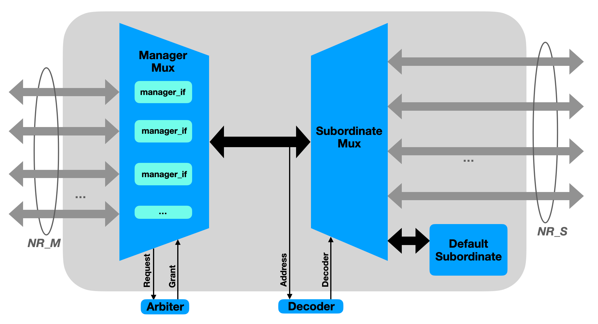

`ahb_interconnect_generic` is a thin top-level that wires:

- One `ahb_manager_mux` (with `NR_M` embedded `ahb_manager_if` instances).
- One `ahb_subordinate_mux` sized for `NR_S+1` slots (the extra slot is
  the default subordinate).
- One `ahb_default_subordinate` selected when `s_decoder_1hot_i == 0`.

Arbitration is delegated to the integrator: the manager mux drives
`m_request_o[NR_M-1:0]` outward, and consumes `m_grant_i[NR_M-1:0]` from
an external arbiter. The decoder is also external — the IP receives an
already-decoded `s_decoder_1hot_i` and emits the system address
`s_decoder_addr_o` to feed it.

The fabric is fully combinational below the address-latching FFs inside
`ahb_manager_if`: address-phase signals propagate from master to slave
within one cycle, and data-phase signals (`hrdata`, `hreadyout`,
`hresp`) likewise return within one cycle.

### High-performance fabric

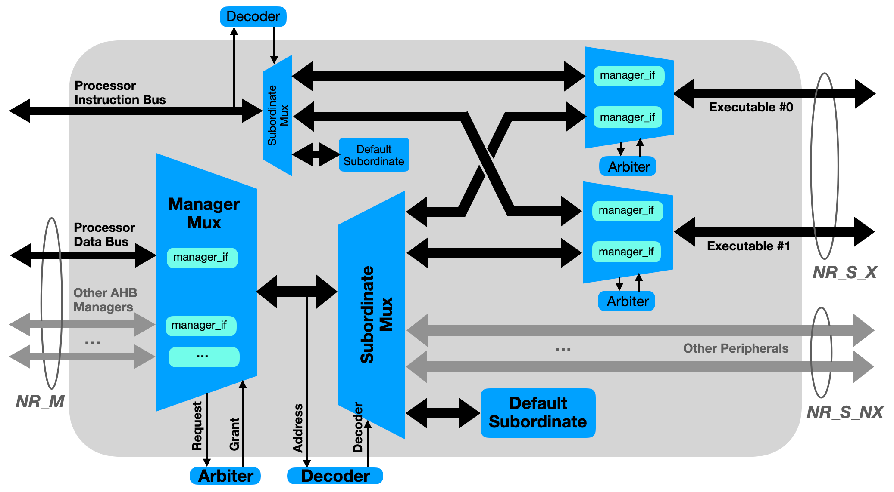

`ahb_interconnect_hiperf` extends the generic fabric with a *parallel
executable path*. The subordinate space is split:

- `NR_S_X` **executable subordinates** (typically ROM + executable RAM).
- `NR_S_NX` **non-executable subordinates** (peripherals, data RAM,
  debug, ...).

Two manager interfaces are exposed:

- **`m_x_*`** — one dedicated executable-side manager (intended for CPU
  instruction fetch). Drives directly into a per-executable-slave
  arbitration + manager-if pair.
- **`m_nx_*[NR_M-1:0]`** — `NR_M` standard non-executable managers
  (CPU data bus, DMAs, ...). Same arbitration scheme as the generic
  fabric (external arbiter on `m_nx_request_o` / `m_nx_grant_i`).

The non-executable side **can also target executable subordinates** (a
CPU data access to ROM, for example). To make this work without sharing
the executable bus with the instruction-fetch path, each executable
subordinate is fronted by **a pair of `ahb_manager_if` instances and an
`ahb_arbiter_2m`** (one channel from `m_x`, one from the NX-side mux).
The two managers and the arbiter live *inside* the interconnect — the
integrator never sees them.

**Concurrency:** in the common case where the executable manager fetches
an instruction from one executable subordinate (e.g. ROM) while a
non-executable manager reads/writes a non-executable subordinate (e.g. a
peripheral), the two transfers proceed in parallel and the fabric
sustains *two transfers per cycle*.

### Fused fabric

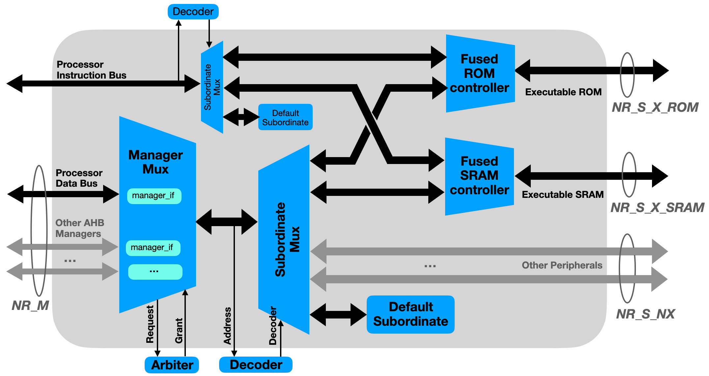

`ahb_interconnect_fused` keeps the X / NX split of the hiperf variant
but replaces each external executable AHB subordinate with an *internal,
dual-port memory controller*:

- `NR_S_X_ROM` × `ahb_fused_rom_ctrl` instances driving ROM macros.
- `NR_S_X_SRAM` × `ahb_fused_sram_ctrl` instances driving SRAM macros.

Each fused controller exposes **two AHB ports**:

- **Port A** — fed by the `m_x` (instruction-fetch) manager. Read-only
  for the ROM controller; read + write (with byte enables) for the SRAM
  controller.
- **Port B** — fed by the NX subordinate-mux (i.e. *any* non-executable
  manager whose access hits the executable address region).

Both ports share a single memory-macro chip-enable + address bus. When
both ports race the same controller in the same cycle, an internal
arbiter picks one to drive the macro this cycle and stalls the other
(`hreadyout = 0`) for one extra wait state.

The `FIXED_B_PRIO` parameter (default `1'b0`, round-robin) lets the
integrator force a fixed Port-B priority instead — Port-B always wins,
which simplifies the memory-address mux fan-in (Port-A's `a_hsel_i` no
longer drives the address-select) at the cost of letting heavy NX
traffic *starve* the executable side. Both schemes are
regression-covered (see [Verification](#verification)).

#### Fused leaves: `ahb_fused_rom_ctrl` and `ahb_fused_sram_ctrl`

The two fused controllers live in this IP rather than in their parent
IPs (`ahb_rom_controller`, `ahb_sram_controller`) because they are not
standalone AHB slaves — they have direct memory-macro pins on one side
and *two* AHB ports on the other. Both are sized for arbitrary memory
depth via a `MEM_SIZE` parameter (bytes), matching the parent IPs.

- **`ahb_fused_rom_ctrl`** — Port A read-only, Port B read-with-write-
  attempt (any write returns AHB ERROR but does not corrupt the
  ROM). One-cycle read latency. ~280 lines of RTL, no FSM (purely
  combinational arbitration + APH/DPH bookkeeping FFs).
- **`ahb_fused_sram_ctrl`** — both ports support read + write with byte
  enables. Reuses the same read-after-write pause-buffer logic as the
  standalone `ahb_sram_controller`, but extended with the dual-port
  arbiter. ~480 lines of RTL.

Per-leaf operational waveforms are best read from their unit
testbenches in `bench/verilog/tb_ahb_fused_{rom,sram}_ctrl.v` (driven by
the dedicated `run_fused_rom` / `run_fused_sram` regressions).

### Global `hready` wiring

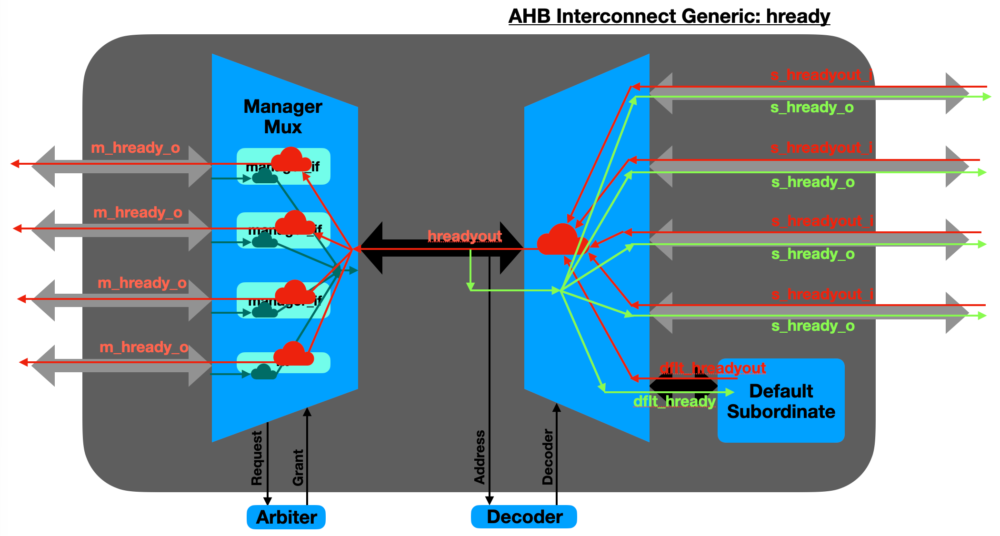

Per AHB-Lite, the **active subordinate's `hreadyout`** must be broadcast
back to every subordinate as `hready_i` (so they all see the same DPH
extension), and to every manager as `m_hready_o`. The
`ahb_subordinate_mux` collapses the per-slave `s_hreadyout_i[NR_S-1:0]`
vector down to a single `hreadyout_o` via the same one-hot select that
muxes `hrdata`; that single `hreadyout` is then fed back into all
slaves' `hready_i` and (through `ahb_manager_mux`) into all masters'
`m_hready_o`. The diagram above traces this fan-out for the generic
fabric.

The hiperf and fused variants run **two independent `hready` broadcast
networks** — one per sub-fabric (X and NX) — so a wait state on one
side doesn't stall the other side and the variants can sustain their
2-transfer-per-cycle peak throughput:

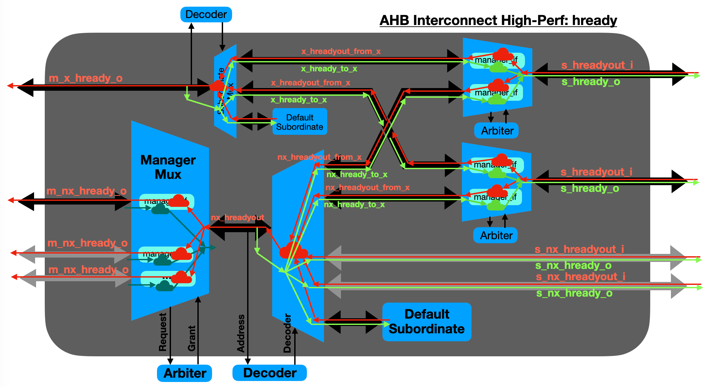

### Address-map requirements

The interconnect itself doesn't impose an address map — that's the
integrator's decoder. But the **fused** variant has one subtle ordering
constraint worth highlighting: the `s_x_decoder_1hot_i` one-hot bits
must be ordered as `{ NR_S_X_SRAM SRAM bits, NR_S_X_ROM ROM bits }` —
ROM controllers occupy the **low** decoder bits, SRAM controllers
occupy the **high** decoder bits. This is the implicit contract baked
into the fused top-level's port-bundling order; getting it wrong sends
SRAM accesses to the ROM controller (write-attempt → ERROR) and vice
versa.

The generic and hiperf variants impose no such ordering — every
subordinate slot is symmetrically wired to its `s_*[i]` port group.

---

## Parameters

| Variant | Parameter      | Default | Purpose                                                                   |
|---------|----------------|---------|---------------------------------------------------------------------------|
| generic | `NR_M`         | `3`     | Number of (symmetric) AHB managers.                                       |
| generic | `NR_S`         | `5`     | Number of AHB subordinates (excludes the default subordinate slot).       |
| generic | `HAUSER_W`     | `1`     | Width of the `HAUSER` sideband bus. Minimum `1`.                          |
| hiperf  | `NR_M`         | `2`     | Number of non-executable managers (the executable manager is hard-coded as 1). |
| hiperf  | `NR_S_X`       | `2`     | Number of executable subordinates (ROM, code-RAM, …).                     |
| hiperf  | `NR_S_NX`      | `3`     | Number of non-executable subordinates.                                    |
| hiperf  | `HAUSER_W`     | `1`     | Same as generic.                                                          |
| hiperf  | `NR_S` (local) | `NR_S_X + NR_S_NX` | Derived total slave count; not directly exposed at instance level. |
| fused   | `NR_M`         | `2`     | Same role as hiperf.                                                      |
| fused   | `NR_S_X_ROM`   | `1`     | Number of fused ROM controllers (low decoder bits).                       |
| fused   | `NR_S_X_SRAM`  | `1`     | Number of fused SRAM controllers (high decoder bits).                     |
| fused   | `NR_S_NX`      | `3`     | Number of non-executable subordinates.                                    |
| fused   | `HAUSER_W`     | `1`     | Same as generic.                                                          |
| fused   | `FIXED_B_PRIO` | `1'b0`  | Arbitration policy inside all fused controllers. `0` = round-robin (toggle), `1` = fixed Port-B priority (data bus wins; removes `a_hsel_i` from the memory-address mux fan-in for tighter timing, at the cost of allowing Port-A starvation). |
| generic | `ASYNC_RST_EN` | `1`     | Reset architecture: `1` = asynchronous active-low reset (default); `0` = synchronous reset. Common to all variants; threaded to every flop via the shared `arv_ipdff` primitive (and `arv_synchronizer` for CDC). Synchronous mode requires a running clock during reset assertion. See the repo README's *Reset architecture* section. |
| hiperf  | `ASYNC_RST_EN` | `1`     | Same as generic.                                                          |
| fused   | `ASYNC_RST_EN` | `1`     | Same as generic.                                                          |

---

## Port summaries

Buses below are vector-packed in `{slot[N-1], …, slot[1], slot[0]}`
LSB-first order — e.g. `m_haddr_i[31:0]` belongs to master 0,
`[63:32]` to master 1, and so on. Same convention applies to all
`NR_*`-multiplied ports.

### Generic ports

| Direction | Port                | Width                  | Description                                                    |
|-----------|---------------------|------------------------|----------------------------------------------------------------|
| in        | `hclk_i`            | 1                      | Bus clock                                                      |
| in        | `hresetn_i`         | 1                      | Active-low reset — **asynchronous** assertion when `ASYNC_RST_EN=1` (default), **synchronous** when `ASYNC_RST_EN=0` (sync-deassert required) |
| out       | `hclk_en_o`         | 1                      | Combined clock-gate enable; drives the integrator's ICG cell   |
| in        | `m_haddr_i`         | `32*NR_M`              | Per-master AHB address                                         |
| in        | `m_hauser_i`        | `HAUSER_W*NR_M`        | Per-master HAUSER sideband (per-IP semantics; e.g. `hsmode`)   |
| in        | `m_hburst_i`        | `3*NR_M`               | Per-master burst type                                          |
| in        | `m_hmastlock_i`     | `NR_M`                 | Per-master locked transfer indicator                           |
| in        | `m_hprot_i`         | `4*NR_M`               | Per-master protection control (cache / buf / priv / data)      |
| in        | `m_hsize_i`         | `3*NR_M`               | Per-master transfer size (byte / half / word / …)              |
| in        | `m_htrans_i`        | `2*NR_M`               | Per-master transfer type (IDLE / BUSY / NONSEQ / SEQ)          |
| in        | `m_hwdata_i`        | `32*NR_M`              | Per-master write data                                          |
| in        | `m_hwrite_i`        | `NR_M`                 | Per-master write enable                                        |
| out       | `m_hrdata_o`        | `32*NR_M`              | Per-master read data (gated by each master's DPH ownership)    |
| out       | `m_hready_o`        | `NR_M`                 | Per-master `hready` (stalls master while its APH waits)        |
| out       | `m_hresp_o`         | `NR_M`                 | Per-master `hresp` (gated by DPH ownership)                    |
| out       | `m_request_o`       | `NR_M`                 | Arbiter request — goes to integrator's arbiter                 |
| in        | `m_grant_i`         | `NR_M`                 | Arbiter grant — from integrator's arbiter                      |
| in        | `s_decoder_1hot_i`  | `NR_S`                 | One-hot subordinate select from integrator's decoder           |
| out       | `s_decoder_addr_o`  | 32                     | System address feeding the integrator's decoder                |
| in        | `s_hrdata_i`        | `32*NR_S`              | Per-slave read data                                            |
| in        | `s_hreadyout_i`     | `NR_S`                 | Per-slave ready-out                                            |
| in        | `s_hresp_i`         | `NR_S`                 | Per-slave response                                             |
| out       | `s_haddr_o`         | `32*NR_S`              | Per-slave address (broadcast; effective only when `s_hsel_o[i]` is asserted) |
| out       | `s_hauser_o`        | `HAUSER_W*NR_S`        | Per-slave HAUSER sideband (forwarded from the granted master)  |
| out       | `s_hburst_o`        | `3*NR_S`               | Per-slave burst type (forwarded)                               |
| out       | `s_hmaster_o`       | `4*NR_S`               | 4-bit master ID derived from the grant one-hot                 |
| out       | `s_hmastlock_o`     | `NR_S`                 | Per-slave locked transfer indicator (forwarded)                |
| out       | `s_hprot_o`         | `4*NR_S`               | Per-slave protection control (forwarded)                       |
| out       | `s_hready_o`        | `NR_S`                 | Global `hready` broadcast back to each slave                   |
| out       | `s_hsel_o`          | `NR_S`                 | Per-slave select (one-hot, mirrors `s_decoder_1hot_i`)         |
| out       | `s_hsize_o`         | `3*NR_S`               | Per-slave transfer size (forwarded)                            |
| out       | `s_htrans_o`        | `2*NR_S`               | Per-slave transfer type (forwarded)                            |
| out       | `s_hwdata_o`        | `32*NR_S`              | Per-slave write data (forwarded)                               |
| out       | `s_hwrite_o`        | `NR_S`                 | Per-slave write enable (forwarded)                             |

### Hiperf ports

The hiperf top adds (a) a single dedicated **executable-side manager**
(`m_x_*`) and (b) a second decoder over the executable address sub-set
(`s_x_decoder_1hot_i`, `s_x_decoder_addr_o`); it splits the subordinate
fan-out into `s_x_*` (`NR_S_X` executable slaves) and `s_nx_*`
(`NR_S_NX` non-executable slaves). Clock, reset and the
non-executable-side arbiter contract are identical to the generic
fabric.

**Executable manager** (single instance, no `[NR_M]` repetition):

| Direction | Port              | Width        | Description                                     |
|-----------|-------------------|--------------|-------------------------------------------------|
| in        | `m_x_haddr_i`     | 32           | Executable-side APH address                     |
| in        | `m_x_hauser_i`    | `HAUSER_W`   | Executable-side HAUSER sideband                 |
| in        | `m_x_hburst_i`    | 3            | Executable-side burst type                      |
| in        | `m_x_hmastlock_i` | 1            | Executable-side locked transfer indicator       |
| in        | `m_x_hprot_i`     | 4            | Executable-side protection control              |
| in        | `m_x_hsize_i`     | 3            | Executable-side transfer size                   |
| in        | `m_x_htrans_i`    | 2            | Executable-side transfer type                   |
| in        | `m_x_hwdata_i`    | 32           | Executable-side write data                      |
| in        | `m_x_hwrite_i`    | 1            | Executable-side write enable                    |
| out       | `m_x_hrdata_o`    | 32           | Executable-side read data                       |
| out       | `m_x_hready_o`    | 1            | Executable-side ready (stalls `m_x` while its APH waits inside the fabric) |
| out       | `m_x_hresp_o`     | 1            | Executable-side response                        |

**Non-executable managers** (`NR_M` of them — same shape as the generic
fabric's `m_*` group, just renamed `m_nx_*`):

| Direction | Port               | Width                   |
|-----------|--------------------|-------------------------|
| in        | `m_nx_haddr_i`     | `32*NR_M`               |
| in        | `m_nx_hauser_i`    | `HAUSER_W*NR_M`         |
| in        | `m_nx_hburst_i`    | `3*NR_M`                |
| in        | `m_nx_hmastlock_i` | `NR_M`                  |
| in        | `m_nx_hprot_i`     | `4*NR_M`                |
| in        | `m_nx_hsize_i`     | `3*NR_M`                |
| in        | `m_nx_htrans_i`    | `2*NR_M`                |
| in        | `m_nx_hwdata_i`    | `32*NR_M`               |
| in        | `m_nx_hwrite_i`    | `NR_M`                  |
| out       | `m_nx_hrdata_o`    | `32*NR_M`               |
| out       | `m_nx_hready_o`    | `NR_M`                  |
| out       | `m_nx_hresp_o`     | `NR_M`                  |
| out       | `m_nx_request_o`   | `NR_M`                  |
| in        | `m_nx_grant_i`     | `NR_M`                  |

**Decoders** — one decoder over the full address space (covering
**both** X and NX slaves), one extra decoder over the executable
sub-set only:

| Direction | Port                  | Width    | Description                                                   |
|-----------|-----------------------|----------|---------------------------------------------------------------|
| in        | `s_decoder_1hot_i`    | `NR_S`   | One-hot select over ALL slaves (`NR_S = NR_S_X + NR_S_NX`)    |
| out       | `s_decoder_addr_o`    | 32       | Address feeding the full-system decoder                       |
| in        | `s_x_decoder_1hot_i`  | `NR_S_X` | One-hot select over executable slaves only                    |
| out       | `s_x_decoder_addr_o`  | 32       | Address feeding the executable-sub-set decoder                |

**Executable subordinates** (`s_x_*`, `NR_S_X` slaves) and
**non-executable subordinates** (`s_nx_*`, `NR_S_NX` slaves) share the
same per-port shape as the generic fabric's `s_*` group, just split
into two bundles sized by `NR_S_X` and `NR_S_NX` respectively.

> **Internal X-side arbitration.** Each executable subordinate is
> fronted by two internal `ahb_manager_if` instances + an
> `ahb_arbiter_2m` (one channel from `m_x`, one from the NX-side mux
> for an NX-master access into the X region). The integrator does
> **not** wire a second external arbiter — the X-side arbitration is
> fully internal.

### Fused ports

Same X / NX manager + decoder layout as hiperf, but the executable
subordinate AHB ports are **replaced by direct memory-macro pins**:

| Direction | Port                                            | Width                                | Description                                            |
|-----------|-------------------------------------------------|--------------------------------------|--------------------------------------------------------|
| in        | `rom_dout_i`                                    | `32*NR_S_X_ROM`                      | ROM macros' read data (one per fused ROM controller)   |
| out       | `rom_addr_o`                                    | `30*NR_S_X_ROM`                      | ROM macros' word addresses                             |
| out       | `rom_cen_o`                                     | `NR_S_X_ROM`                         | ROM macros' chip-enable (active-low)                   |
| out       | `rom_clk_o`                                     | `NR_S_X_ROM`                         | ROM macros' clock (gated `hclk_i`)                     |
| in        | `sram_dout_i`                                   | `32*NR_S_X_SRAM`                     | SRAM macros' read data                                 |
| out       | `sram_addr_o`                                   | `30*NR_S_X_SRAM`                     | SRAM macros' word addresses                            |
| out       | `sram_cen_o`                                    | `NR_S_X_SRAM`                        | SRAM macros' chip-enable (active-low)                  |
| out       | `sram_clk_o`                                    | `NR_S_X_SRAM`                        | SRAM macros' clock (gated `hclk_i`)                    |
| out       | `sram_din_o`                                    | `32*NR_S_X_SRAM`                     | SRAM macros' write data                                |
| out       | `sram_wen_o`                                    | `4*NR_S_X_SRAM`                      | SRAM macros' per-byte write enables (active-low)       |

The `s_nx_*` group is unchanged from hiperf. The `s_x_*` AHB group is
**not exposed** — the fused controllers consume that path internally.
The `m_x_*` executable-manager group, the `m_nx_*` non-executable
manager group, the `s_decoder_*` / `s_x_decoder_*` decoder groups, and
the `s_nx_*` subordinate group are all identical in shape to the hiperf
variant.

> **Decoder-bit ordering.** `s_x_decoder_1hot_i` is laid out as
> `{ NR_S_X_SRAM SRAM bits, NR_S_X_ROM ROM bits }` — ROM controllers
> occupy the low decoder bits, SRAM controllers the high. The
> integrator's executable-side decoder must match this ordering. See
> [Address-map requirements](#address-map-requirements).

---

## Integration requirements

- **Reset (`hresetn_i`)** — active-low; assertion style follows
  `ASYNC_RST_EN` (`1` = asynchronous, default; `0` = synchronous).
  De-assertion **must be synchronised to `hclk_i`** by the integrator.
  The IP contains no internal reset synchroniser.

- **Clock gating (`hclk_en_o` → `hclk_i`)** — `hclk_en_o` is a
  **combinational** enable that aggregates the per-block enables from
  all manager-ifs, the subordinate mux, and the default subordinate. It
  must drive a latch-based ICG cell at the SoC clock root. It asserts
  whenever there is any AHB activity (pending APH, ongoing DPH, or
  default-subordinate error response in flight).

- **External arbiter (generic + hiperf NX side)** — the integrator
  must supply a request-grant arbiter over `m_request_o` /
  `m_grant_i`. The grant is consumed combinationally by
  `ahb_manager_mux` — the arbiter therefore needs to settle the grant
  within the same cycle as the request. A simple round-robin or
  priority-encoder arbiter suffices; the bundled `bench/verilog/ahb_arbiter.v`
  model implements one such reference for the testbench.

- **External decoder (generic + hiperf NX side)** — the integrator
  must supply a one-hot decoder mapping the system address
  `s_decoder_addr_o` to `s_decoder_1hot_i`. The decoder is purely
  combinational. An all-zero output triggers the default subordinate
  ERROR response. For hiperf, a second decoder over the executable
  address range (`s_x_decoder_1hot_i`) is also required.

- **Slave `hready_i` feedback** — the bundled `ahb_subordinate_mux`
  drives `s_hready_o[NR_S-1:0]` with the global muxed `hreadyout`;
  the integrator must connect each slave's `hready_i` from the
  corresponding `s_hready_o` bit. **Do not** independently tie any
  slave's `hready_i`, or pipelined transfers will desynchronise.

- **Manager `hsel_i`** — each top-level interconnect ties the embedded
  `ahb_manager_mux`'s `m_hsel_i` input to `{NR_M{1'b1}}` (every master
  always selects the fabric). There is no `m_hsel` port on the
  interconnect's external interface — if the integrator wants per-master
  select gating, it must drive `m_htrans_i = IDLE` upstream of this IP
  instead.

- **Fused: memory-macro contract** — for the fused variant, the
  attached ROM and SRAM macros must implement the same synchronous
  pin-level interface as the bundled `bench/verilog/rom.v` /
  `bench/verilog/sram.v` models: registered address + write data on the
  rising edge of `rom_clk_o` / `sram_clk_o` (= `hclk_i`) when
  `*_cen_o` is asserted (low), with `*_dout_i` returned combinationally
  one cycle later. The fused controllers expect single-port macros (no
  separate read/write ports) — internal arbitration takes care of read
  vs. write contention exactly like the standalone
  `ahb_sram_controller`.

- **Misaligned accesses** — the fabric **does not** check for misaligned
  transfers; it assumes the masters and/or the executable subordinates
  filter them upstream (CPUs raise the alignment exception themselves).
  The default subordinate is the only path that ever drives `hresp = 1`
  from inside this IP.

---

## Architectural Constraints

The fabric's protocol-level correctness relies on a small set of architectural constraints
established at one site and consumed at another. They are listed here so
that maintainers extending the IP (a new arbiter, a new subordinate, a
parameter sweep) can verify each one is preserved.

| # | Architectural Constraints | Established at | Consumed at | Failure mode if violated |
|---|-----------|----------------|-------------|--------------------------|
| **1** | `grant_o` from any arbiter feeding the fabric is one-hot in every cycle (at most one bit high). | `ahb_arbiter_2m.v` by construction; external arbiters by integrator contract. | `ahb_manager_mux.v` grant-aware MUXes and data-phase OR-combine. | Multi-driver collision on the address-phase bus; silent corruption of the muxed haddr / hprot / hsize / … |
| **2** | At most one `m_dph_ongoing[i]` is high in any cycle. | (I1) + `m_request_o = (m_aph_valid \| m_aph_pending) & hreadyout_i` in `ahb_manager_if.v:107` — masters do not request during another master's data-phase wait. | OR-combine of `hwdata_int` in `ahb_manager_mux.v` `assign hwdata_o = mux_to_32b(hwdata_int);`. | Silent corruption of `hwdata` from two masters ORing together. |
| **3** | Subordinates connected to the fabric **must register their `hreadyout`**, i.e. `hreadyout` must not depend combinationally on `hready_i`. | Integrator contract; satisfied by all in-tree subordinates (`ahb_default_subordinate`, `ahb_fused_*_ctrl`, `ahb_rom_controller`, `ahb_sram_controller`). | Closed-loop AHB hready path: `ahb_manager_if.hready_o` → slave → slave `hreadyout` → `hreadyout_i` → `m_hreadyout_o` → loopback `m_hready_i` → `hready_o`. | Combinational loop; synthesis will infer a latch or fail with a feedback error. |
| **4** | `m_hready_i` of every `ahb_manager_if` instance is wired to the same instance's own `m_hreadyout_o` at the next hierarchy level. | `ahb_interconnect_generic.v`, `_hiperf.v`, `_fused.v` — the same external net is connected to both ports of `ahb_manager_mux`. | `ahb_manager_if.v` uses `m_hready_i` to compute `m_aph_valid` (line 96). No path inside `ahb_manager_if` closes a comb loop. | Decoupling the loopback (e.g. tying `m_hready_i = 1`) would cause the manager to keep re-issuing the same APH after it has been latched into the cache. |
| **5** | The attached SRAM / ROM macros in the fused variant return read data combinationally one cycle after the read command, with no wait state from the macro. | Memory-macro contract (see *Integration requirements*). | `ahb_fused_sram_ctrl.v` and `ahb_fused_rom_ctrl.v` — `m*_dph_ongoing` flushes unconditionally next cycle; `a_hrdata_o` / `b_hrdata_o` are gated by the 1-cycle DPH window. | Read data dropped; manager reads garbage. |
| **6** | Reset-style dependent (`ASYNC_RST_EN`): in async mode (`1`, default) `hresetn_i` de-assertion must be synchronised to `hclk_i` before reaching the fabric; in sync mode (`0`) the clock must be running while `hresetn_i` is asserted. | Integrator contract (no internal reset synchroniser). | All FFs use `posedge hclk_i or negedge hresetn_i` when `ASYNC_RST_EN=1`, or `posedge hclk_i` with synchronous reset when `ASYNC_RST_EN=0`. | Async: reset-removal metastability / asymmetric reset across FFs. Sync: flops fail to initialise if the clock is gated during reset. |

---

## Operation

In the waveforms below, manager-0 (`m0`) accesses use yellow, manager-1
(`m1`) uses orange, and arbitration-pending / wait-state cycles use
blue.

### Single read through the generic fabric

A single non-pipelined read from manager 0 to subordinate 0
(`htrans = NONSEQ`, `hwrite = 0`, `haddr = 0x10`). The arbiter grants
M0 in the same cycle as the APH; the subordinate mux routes the APH
fan-out to slave 0; one cycle later the slave's `s_hrdata_i` reaches
`m_hrdata_o[m0]` via the data-phase mux.

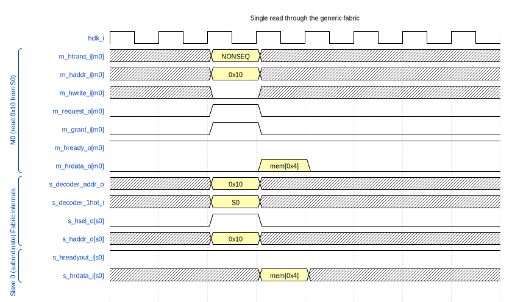

### Arbitrated grant switch

Two managers raise `m_request_o` simultaneously. The external
round-robin arbiter grants M0 first; M1's APH is captured into its
`m_aph_pending` cache and replayed on the next cycle when the arbiter
flips priority. M1's `m_hreadyout_o` is held low while its APH waits —
the master sees a one-cycle wait state from its own point of view, even
though the fabric never inserts a wait state on the bus side.

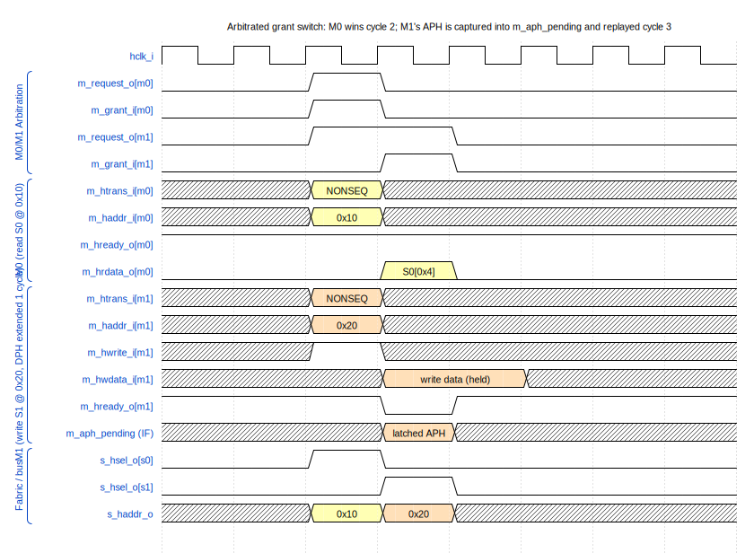

### Default-subordinate ERROR response

An access to an unmapped address: the integrator's decoder returns
`s_decoder_1hot_i == 0`, the interconnect routes the APH to the default
subordinate, which raises a two-cycle ERROR sequence — `hreadyout = 0`
on the first DPH cycle with `hresp = 1`, then `hreadyout = 1` with
`hresp = 1` on the second cycle (the master samples `hresp` on the
second cycle and aborts its burst).

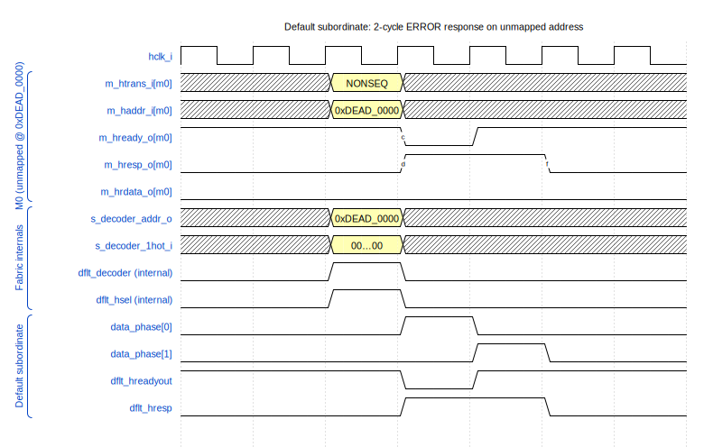

### Hiperf parallel access

The executable manager fetches an instruction from executable
subordinate 0 (ROM) on the same cycle a non-executable manager reads
non-executable subordinate 1 (a peripheral). Both transfers traverse
the fabric independently — peak throughput is **two AHB transfers per
cycle**. The X-side internal arbiter (`ahb_arbiter_2m`) only kicks in
when an NX master targets an X subordinate, which is not the case here.

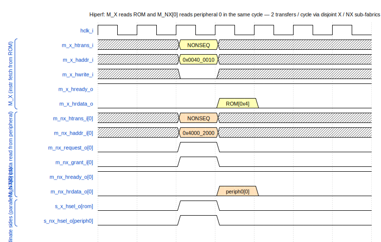

### Fused Port-A vs Port-B contention

Both ports of a fused SRAM controller see an APH in the same cycle:
Port A from `m_x` (instruction fetch), Port B from an NX master routed
through the subordinate mux. With the default round-robin arbitration
(`FIXED_B_PRIO = 0`), the controller's arbiter starts at the
`ARB_RESET = 2'b01` state (= "Port A priority") so Port A wins the
first contest; Port B sees `b_hreadyout = 0` for one cycle while its
APH is held inside the controller, then completes its DPH one cycle
after Port A. Subsequent collisions alternate winners (toggle priority).

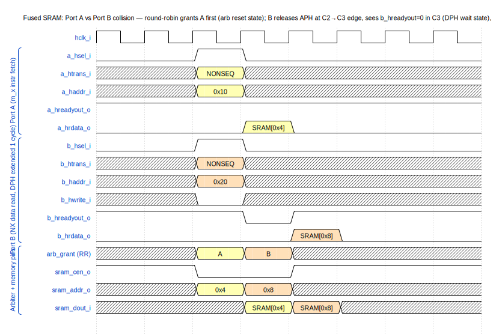

---

## Lint waivers

Same `_unused` postfix convention as the rest of the aRVern IP family —
unused upper bits of architectural-maximum vectors (e.g. the
`m_hmaster` constant table sized for 16 masters but driving only
`NR_M` ports) and unused write-side signals into the default
subordinate end in `_unused`. See
[`arv_custom_csr.md`](../../arv_custom_csr/doc/arv_custom_csr.md#lint-waivers)
for the per-tool waiver recipes.

The repository ships fabric-specific Verilator waiver files alongside
the run scripts:

```
sim/rtl_sim/run/
├── waivers_generic.vlt
├── waivers_hiperf.vlt
└── waivers_fused.vlt
```

These are consumed automatically by `run_lint` (one lint pass per
fabric variant).

---

## Repository layout

```
ahb_interconnect/
├── rtl/verilog/
│   ├── ahb_interconnect_generic.v   Top-level: generic fabric
│   ├── ahb_interconnect_hiperf.v    Top-level: high-performance fabric
│   ├── ahb_interconnect_fused.v     Top-level: fused fabric
│   ├── ahb_manager_if.v             Per-master front-end (APH cache, request/grant)
│   ├── ahb_manager_mux.v            Manager-side mux (NR_M × manager_if + grant mux)
│   ├── ahb_subordinate_mux.v        Subordinate-side fan-out + one-hot return mux
│   ├── ahb_default_subordinate.v    Unmapped-access ERROR responder
│   ├── ahb_arbiter_2m.v             2-manager round-robin (used by hiperf X side + fused)
│   ├── ahb_fused_rom_ctrl.v         Dual-port ROM controller (fused variant only)
│   ├── ahb_fused_sram_ctrl.v        Dual-port SRAM controller (fused variant only)
│   └── filelist.f                   RTL source list (consumed by sim & synth)
├── bench/verilog/
│   ├── tb_ahb_interconnect.v        Top-level testbench (generic + hiperf + fused)
│   ├── tb_ahb_fused_rom_ctrl.v      Unit testbench for the fused ROM controller
│   ├── tb_ahb_fused_sram_ctrl.v     Unit testbench for the fused SRAM controller
│   ├── ahb_arbiter.v                Reference external arbiter for the TB
│   ├── ahb_decoder.v                Reference external decoder for the TB
│   ├── ahb_waitstate_inserter.v     Optional random wait-state injector (slave-side)
│   ├── ahb_tasks*.v                 Reusable AHB read/write tasks (per-master variants)
│   ├── mem_strobes.v                Strobe / event helpers
│   ├── rom.v, sram.v                Reference memory macros for the fused variant
│   └── timescale.v
├── sim/rtl_sim/
│   ├── src/                         Per-test stimulus files + submit.f variants
│   ├── run/                         Run wrappers (run_all, run_lint, run_fused_*)
│   └── bin/                         Sim runner + log parsers
├── synthesis/synopsys/
│   ├── synthesis.tcl                Top-level Design Compiler flow
│   ├── library.tcl                  Tech-library selection via LIB_FLAVOR
│   ├── read.tcl
│   ├── constraints.tcl              Top-level constraints (clock, path groups)
│   ├── constraints_ports.generic.tcl Boundary I/O delays for the generic fabric
│   ├── constraints_ports.hiperf.tcl  Boundary I/O delays for the hiperf fabric
│   ├── constraints_ports.fused.tcl   Boundary I/O delays for the fused fabric (ROM/SRAM macro pins + AHB)
│   ├── run_syn, run_syn_d           Synthesis launchers (host / dockerised)
│   ├── run_syn_generic              Wrapper: pin DESIGN_NAME to the generic top
│   ├── run_syn_hiperf               Wrapper: pin DESIGN_NAME to the hiperf top
│   └── libraries/                   setup_*.tcl per technology + .db symlinks
└── doc/
    ├── ahb_interconnect.md          This document
    └── img/                         Block diagrams (PNG) + WaveDrom sources + SVG
```

---

## Verification

The verification flow uses **Verilator** for linting and **Icarus
Verilog** (default) for simulation. The testbench
`bench/verilog/tb_ahb_interconnect.v` is **shared across all three
fabric variants**: `+define+GENERIC` / `+define+HIPERF` /
`+define+FUSED` selects which fabric is instantiated, and
`+define+RANDOM_WS` injects random wait states from the slave side via
`ahb_waitstate_inserter` (see below).

### Wait-state injector

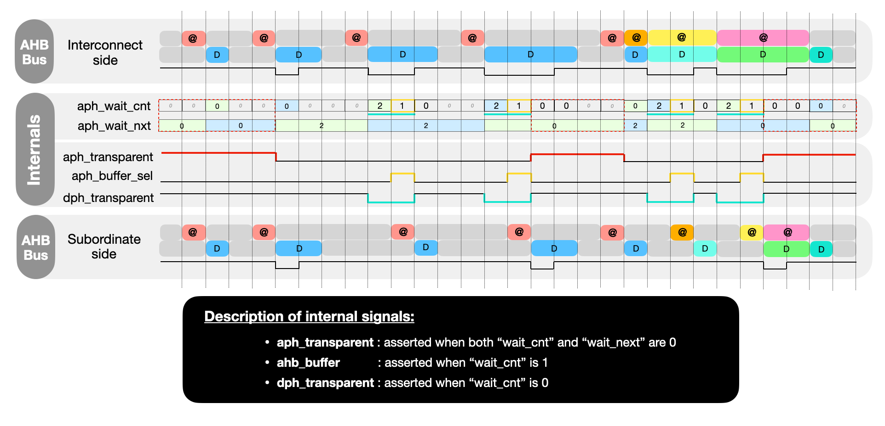

`bench/verilog/ahb_waitstate_inserter.v` is a transparent AHB
pass-through module that can optionally hold `hreadyout=0` for `N`
cycles after each address phase, simulating a slow slave. The diagram
above traces the inserter's internal state during back-to-back transfers:
`aph_wait_cnt` / `aph_wait_nxt` track the current and queued wait counts,
and the derived `aph_transparent` / `aph_buffer_sel` / `dph_transparent`
selectors gate the AHB-side fan-out so the subordinate sees a delayed
copy of the interconnect-side APH. The TB
instantiates one inserter **between the fabric output and each
subordinate** (`ahb_waitstate_inserter_rom_inst`,
`*_sram_inst`, `*_periph0_inst`, `*_periph1_inst`, …), guarded by
`` `ifdef RANDOM_WS ``:

- Default (no `RANDOM_WS`): every inserter is configured with
  `number_wait_state = 0` and `random_wait_state_enable = 0` —
  fully transparent, zero overhead.
- With `+define+RANDOM_WS`: every inserter gets
  `number_wait_state = 5` and `random_wait_state_enable = 1` — each
  APH on that subordinate triggers a fresh `$urandom_range(0, 6)`
  wait count, so the slave's DPH is held off for 0..5 cycles.

This stresses the fabric's manager-side DPH tracking (the
`m_dph_ongoing` register in `ahb_manager_if`) and the global `hready`
broadcast path — and, on the fused variant, the dual-port arbiter's
behavior when the memory macro takes wait states.

The `-random_ws` flag on `runsim` translates to `+define+RANDOM_WS` at
compile. Every test in `run_all` is invoked **twice**: once without
wait states (16 tests) and once with `-random_ws` (16 tests).

### Lint

```bash
cd sim/rtl_sim/run
./run_lint        # runs Verilator over all 3 fabrics (generic / hiperf / fused)
```

### Run a single test

```bash
cd sim/rtl_sim/run
../bin/runsim simple_rdwr                       # default: generic fabric
../bin/runsim pipelined_advanced -hiperf        # hiperf fabric
../bin/runsim fused_arbiter      -fused         # fused fabric (round-robin)
../bin/runsim fused_arbiter      -fused -fixed_b_prio
                                                # fused fabric (fixed Port-B priority)
```

### Run the full regression

```bash
cd sim/rtl_sim/run
./run_all                                       # 32 tests, one iteration (~18 s)
./run_all 5                                     # 5 iterations (different seeds)
./run_fused_rom                                 # unit TB for ahb_fused_rom_ctrl  (round-robin + fixed Port-B)
./run_fused_sram                                # unit TB for ahb_fused_sram_ctrl (round-robin + fixed Port-B)
```

### Test suite

| Test                | Coverage |
|---------------------|----------|
| `simple_rdwr`       | Non-pipelined word/half-word/byte reads + writes; verifies basic 2-phase pipeline and `hsize`-derived byte enables. Runs against all 3 fabrics. |
| `pipelined_rdwr`    | Back-to-back NONSEQ reads (peak throughput) and back-to-back writes; verifies the AHB pipeline correctly hands data one cycle after each APH. Runs against all 3 fabrics. |
| `pipelined_advanced`| Stresses APH-cache replay paths in `ahb_manager_if` and the read-after-write handling in the (fused) SRAM controller. Runs against all 3 fabrics. |
| `simple_arbiter`    | Two-manager contention through the external arbiter: M0 / M1 ping-pong; verifies fair grant rotation and the cached-APH replay in `ahb_manager_if`. *Generic fabric only.* |
| `hiperf_arbiter`    | Two-manager contention on the executable side of the hiperf fabric: covers the internal `ahb_arbiter_2m` per executable subordinate. *Hiperf fabric only.* |
| `fused_arbiter`     | Port-A vs Port-B contention on the fused ROM/SRAM controllers; covers both round-robin and fixed-Port-B-priority arbitration via `-fixed_b_prio`. *Fused fabric only.* |

Each test is also run under `-random_ws` (slave-side wait-state
injection) so the manager-side data-phase tracking is exercised under
non-trivial DPH timing. Total regression count: **32 tests**
(`run_all`).

A test passes when its log contains `SIMULATION PASSED`; aggregated
results land in `log/<iter>/summary.<iter>.log`, with a replay command
(`runsim -seed <N> …`) per test.

---

## Synthesis

The Design Compiler flow lives under `synthesis/synopsys/` and uses the
standard `LIB_FLAVOR` env-var mechanism shared by the rest of the
aRVern IP family. A `-design <variant>` flag picks the synthesis top
among the three fabrics; per-fabric wrappers
(`run_syn_generic` / `run_syn_hiperf`) pin the variant so you don't
need to remember the full top-level name.

```bash
cd synthesis/synopsys
./run_syn                            # default: ahb_interconnect_fused with lib_default
./run_syn_generic                    # synthesise ahb_interconnect_generic with lib_default
./run_syn_hiperf  -lib <flavor>      # synthesise ahb_interconnect_hiperf with a specific library
./run_syn         -lib <flavor> -design ahb_interconnect_hiperf -i
                                     # interactive mode (keep dc_shell open)
./run_syn_d       -lib <flavor>      # same, inside the dockerised DC image
```

`-design` accepts `ahb_interconnect_generic`, `ahb_interconnect_hiperf`,
or `ahb_interconnect_fused`. Each variant has its own boundary-timing
file (`constraints_ports.generic.tcl`, `constraints_ports.hiperf.tcl`,
`constraints_ports.fused.tcl`); `constraints.tcl` dispatches on
`DESIGN_NAME`. The fused variant uses ROM / SRAM macro pins on its
`s_x_*` boundary instead of AHB ports; integrators will typically
re-synthesise it inside their SoC with the actual memory macros' `.lib`
resolved into `link_library`, and wrap `rom_clk_o` / `sram_clk_o` with
`create_generated_clock` once the macros are in scope.

Available `<flavor>` values are derived from `setup_*.tcl` files under
`synthesis/synopsys/libraries/` — running `./run_syn` with an unknown
flavor prints the full list.

Outputs land in `synthesis/synopsys/results/`:

| File                                | Description                                  |
|-------------------------------------|----------------------------------------------|
| `ahb_interconnect_<variant>.gate.v` | Gate-level netlist                           |
| `ahb_interconnect_<variant>.ddc`    | Synopsys DDC database                        |
| `ahb_interconnect_<variant>.spf`    | DFT scan test protocol (when DFT enabled)    |
| `report.area`, `report.full_area`   | Area summary (incl. NAND2-equivalent)        |
| `report.timing`, `report.paths.*`   | Timing and worst-path reports                |
| `report.constraints`                | Constraint compliance                        |
| `report.dft_*`                      | DFT DRC, coverage, scan-chain configuration  |
| `synthesis.log`                     | Full dc_shell transcript                     |

---

## License

BSD 3-Clause — see [`LICENSE`](../../LICENSE) at the repo root.
