<p align="center">
  
</p>

# AHB Interconnect

*Parameterizable AHB-Lite multi-manager / multi-subordinate fabric in three
variants, with a built-in ERROR responder for unmapped addresses.*

---

## Contents

- [Overview](#overview)
  - [Choosing a variant](#choosing-a-variant)
  - [What differs between variants](#what-differs-between-variants)
  - [Glossary](#glossary)
- [Architecture](#architecture)
  - [Building blocks](#building-blocks)
  - [Generic fabric](#generic-fabric)
  - [High-performance fabric](#high-performance-fabric)
  - [Fused fabric](#fused-fabric)
  - [`hready` wiring](#hready-wiring)
  - [Address map](#address-map)
- [Parameters](#parameters)
- [Ports](#ports)
  - [Generic](#generic)
  - [Hiperf](#hiperf)
  - [Fused](#fused)
- [Integration requirements](#integration-requirements)
  - [Manager-supplied HMASTER bits](#manager-supplied-hmaster-bits)
- [Architectural constraints](#architectural-constraints)
- [Operation](#operation)
- [Lint waivers](#lint-waivers)
- [Repository layout](#repository-layout)
- [Verification](#verification)
  - [Bench structure](#bench-structure)
  - [Monitors](#monitors)
  - [What is not covered](#what-is-not-covered)
  - [Lint](#lint)
  - [Simulation](#simulation)
  - [Test suite](#test-suite)
  - [Unit benches](#unit-benches)
- [Synthesis](#synthesis)
- [License](#license)

---

## Overview

`ahb_interconnect` is the central AHB-Lite fabric of the aRVern SoC
family. It connects `NR_M` managers (CPU buses, DMAs, debug) to `NR_S`
subordinates (memories, peripherals) with standard AHB-Lite semantics:
two-phase pipelined transfers, centralised arbitration, and a
combinational subordinate mux returning `hrdata` / `hreadyout` / `hresp`
from the selected subordinate.

Three variants share the same port groups and AHB-Lite semantics and
trade simplicity, parallel instruction/data bandwidth and timing closure
differently; the behaviours that differ between them are listed under
[What differs between variants](#what-differs-between-variants).

| Variant                    | Optimised for                                     | Managers                          | Subordinates                                              | Executable memories       |
|----------------------------|---------------------------------------------------|-----------------------------------|-----------------------------------------------------------|---------------------------|
| `ahb_interconnect_generic` | Simplicity (small or low-bandwidth systems)       | `NR_M` symmetric                  | One shared bus                                            | External AHB subordinates |
| `ahb_interconnect_hiperf`  | Parallel fetch and data traffic                   | 1 executable + `NR_M` non-executable | Split: `NR_S_X` executable + `NR_S_NX` non-executable  | External AHB subordinates |
| `ahb_interconnect_fused`   | Parallel fetch and data traffic at higher clock   | 1 executable + `NR_M` non-executable | Split; executable side exposed as memory-macro pins     | Built-in ROM / SRAM controllers |

Every variant contains a **default subordinate** per bus: one on the
generic bus; on hiperf and fused, one on the non-executable bus and one
on the executable bus. A transfer whose address matches no bit of the
decoder that serves its bus is routed to it and answered with the AHB
two-cycle ERROR response, so a manager never hangs on an unmapped
address. On the executable bus this is what keeps `m_x` inside the
executable space; on fused it also answers an `m_x` write.

### Choosing a variant

- **`generic`** — one shared bus, one transfer per cycle, the smallest
  of the three. Right for a single CPU/DMA bus or for master mixes that
  rarely fetch and load/store at the same time.
- **`hiperf`** — a Harvard-style pair of manager ports with separate
  executable (ROM, code RAM) and non-executable (peripherals, data RAM)
  subordinate spaces. Fetch and data transfers proceed in parallel: two
  transfers per cycle when they target different spaces.
- **`fused`** — the same parallelism as `hiperf`, with the executable
  memory controllers folded into the fabric. That removes one AHB hop
  and one mux level between the address decode and the memory port,
  which is what buys the higher clock frequency; the price is a small
  arbiter in each fused controller, which costs a wait state only when
  the two ports collide on the same memory or when a data write's data
  phase coincides with a read on either port (the SRAM controller's
  one-cycle write hold).

**Start with `fused`.** Fall back to `hiperf` when an executable memory
does not fit the fused controller's single-port macro contract
(executable flash with its own controller, ECC SRAM with side-channel
pins, multi-port banks), or when the executable subsystem must stay a
separate IP boundary.

### What differs between variants

The detailed statements live in the sections named in the first column;
this table is the index.

| Behaviour | `generic` | `hiperf` | `fused` |
|-----------|-----------|----------|---------|
| Manager ports ([Ports](#ports)) | `NR_M` symmetric `m_*` | `m_x_*` + `NR_M` × `m_nx_*` | As hiperf |
| Subordinate ports ([Ports](#ports)) | `NR_S` × `s_*` | `NR_S_X` × `s_x_*` + `NR_S_NX` × `s_nx_*` | `NR_S_NX` × `s_nx_*`; executable side as `rom_*` / `sram_*` macro pins |
| Decoders ([Address map](#address-map)) | One | Two; bit *i* of both must decode the same executable range | Two; ROM controllers on the low bits, SRAM on the high bits, same order on both |
| Default subordinates ([Overview](#overview)) | One | Two: non-executable bus and executable bus | Two, as hiperf |
| A write presented by `m_x` ([Hiperf](#hiperf), [Fused fabric](#fused-fabric)) | n/a | Forwarded to the executable subordinate unchanged | Diverted to the executable-side default subordinate, answered ERROR |
| `s_hmaster_o` value ([Manager-supplied HMASTER bits](#manager-supplied-hmaster-bits)) | `M_HMASTER_ID` (default: manager index), OR the manager's tagged `m_hmaster_i` bits | `m_x` = `4'h0`; `m_nx[i]` = `M_NX_HMASTER_ID` (default: `i+1`), OR its tagged `m_nx_hmaster_i` bits | As hiperf |
| Executable-side arbitration ([High-performance fabric](#high-performance-fabric), [Fused fabric](#fused-fabric)) | External arbiter | One `ahb_arbiter_2m` per executable subordinate: priority goes to the channel NOT granted last (every grant counts, contested or not); `m_x` first after reset | Inside each controller, `FIXED_B_PRIO`: `0` Port A first after reset then the port that lost the previous contest, `1` Port B always |
| `hmaster` / `hprot` / `hauser` / `hmastlock` on the executable side ([Fused fabric](#fused-fabric)) | Forwarded | Forwarded to `s_x_*` | Not delivered to the controllers |
| `hready` of an executable subordinate ([`hready` wiring](#hready-wiring)) | Bus `hready` | Its own `hreadyout` fed back | Internal |
| Sources of `hresp = 1` ([Integration requirements](#integration-requirements)) | Default subordinate | Both default subordinates | Both default subordinates and the ROM controller on a Port-B write |
| Transfer sizes above a word ([Integration requirements](#integration-requirements)) | Forwarded | Forwarded | SRAM controller ignores `hsize[2]`, `hsize[1:0] = 2'b11` produces no byte strobe; ROM controller ignores `hsize` |

### Glossary

| Term         | Meaning |
|--------------|---------|
| APH          | Address phase: the cycle in which `haddr` / `htrans` / `hwrite` / `hsize` are presented. |
| DPH          | Data phase: the cycle(s) in which `hwdata` / `hrdata` are valid, one cycle after the APH, extended by wait states (`hready = 0`). |
| NONSEQ / SEQ | `htrans = 2'b10` / `2'b11`: a new transfer / the continuation of a burst. |
| IDLE / BUSY  | `htrans = 2'b00` / `2'b01`: no transfer / a pause inside a burst. Both are answered with a zero-wait OKAY. |
| HAUSER       | AHB user-defined sideband, `HAUSER_W` bits wide. The aRVern peripherals use it as the secure-mode signal `hsmode`; the fabric only forwards it. |
| X / NX       | Executable / non-executable: the two address-space partitions of the hiperf and fused variants. |
| Level-2 channel | Hiperf only: the pair of `ahb_manager_if` instances (one fed by `m_x`, one by the non-executable bus) and the `ahb_arbiter_2m` in front of each executable subordinate. Internal to the fabric. |

The AHB-Lite specification is
[ARM IHI 0033](https://developer.arm.com/documentation/ihi0033/).

---

## Architecture

### Building blocks

| Module                     | Role |
|----------------------------|------|
| `ahb_manager_if`           | Per-manager front end. Detects an address phase, caches it when the bus is busy, asks the arbiter for the bus, replays the cached address phase when granted, and tracks the manager's data phase. Stalls the manager (`m_hreadyout_o = 0`) while its address phase waits for the grant. |
| `ahb_manager_mux`          | `NR_M` × `ahb_manager_if` plus the grant-controlled mux that puts one address phase on the shared bus, and the return path of `hrdata` / `hreadyout` / `hresp` to the manager that owns the data phase. |
| `ahb_subordinate_mux`      | Fans the shared bus out to `NR_S` subordinates, asserts the one `s_hsel_o` selected by the decoder, forces `s_htrans_o` to IDLE while no granted address phase is on the bus, and muxes `hrdata` / `hreadyout` / `hresp` back from the subordinate that owns the data phase. Also forwards `hmaster`, so a subordinate can tell which manager is talking. |
| `ahb_default_subordinate`  | Answers every NONSEQ/SEQ transfer with the AHB two-cycle ERROR (`hreadyout` low then high, `hresp = 1`, `hrdata = 0`). One per bus, selected when that bus's decoder one-hot is all zero; the fused executable-side instance is also selected by an `m_x` write. |
| `ahb_arbiter_2m`           | Two-manager round-robin arbiter (one toggle-priority flop, reset to channel 0 = `m_x` first). Hiperf only, one per executable subordinate. |
| `ahb_fused_rom_ctrl`, `ahb_fused_sram_ctrl` | Fused only: dual-port ROM / SRAM controllers with memory-macro pins on one side and two AHB ports on the other. |

The generic fabric uses the first four; hiperf adds `ahb_arbiter_2m` and
a second default subordinate; fused replaces the executable subordinates
with the two controllers and keeps both default subordinates.

### Generic fabric

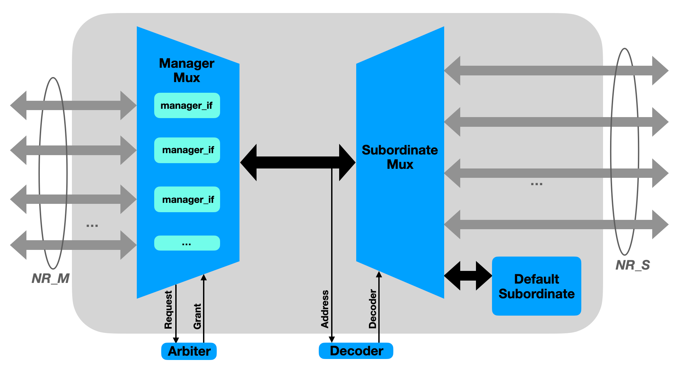

`ahb_interconnect_generic` wires one `ahb_manager_mux`, one
`ahb_subordinate_mux` with `NR_S + 1` slots (the extra slot is the
default subordinate) and one `ahb_default_subordinate`.

Arbitration and address decoding are the integrator's: the fabric
drives `m_request_o` to an external arbiter and consumes `m_grant_i`;
it drives the system address `s_decoder_addr_o` to an external decoder
and consumes the one-hot `s_decoder_1hot_i`.

The fabric adds no pipeline stage: an address phase reaches the
selected subordinate in the cycle the manager presents it, and
`hrdata` / `hreadyout` / `hresp` reach the manager in the cycle the
subordinate drives them. Its state is the address-phase caches and the
phase-tracking flops of `ahb_manager_if`, the data-phase select of
`ahb_subordinate_mux` and the default subordinate's two-cycle ERROR;
hiperf adds the executable-side arbiters' priority bits, fused the
controllers' state machines.

### High-performance fabric

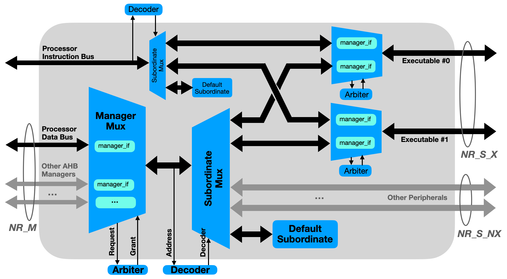

`ahb_interconnect_hiperf` splits the subordinate space into `NR_S_X`
**executable** subordinates (ROM, code RAM) and `NR_S_NX`
**non-executable** ones (peripherals, data RAM, debug), and exposes two
kinds of manager port:

- `m_x_*` — one executable-side manager, intended for instruction fetch.
- `m_nx_*[NR_M-1:0]` — `NR_M` non-executable managers (CPU data bus,
  DMAs, …), arbitrated by an external arbiter exactly as in the generic
  fabric.

A non-executable manager may also target an executable subordinate (a
CPU data access to ROM, for instance). To keep that from sharing the
fetch path, each executable subordinate sits behind its own **level-2
channel**: a pair of `ahb_manager_if` instances — one fed by `m_x`, one
by the non-executable bus — and an `ahb_arbiter_2m`. These are
internal; the integrator sees a plain AHB subordinate port. The arbiter
resets to `m_x`-first and afterwards gives priority to the channel that was
NOT granted last. Every grant moves it, contested or not: a lone `m_x`
fetch hands priority to the non-executable side, so the next collision is
won by that side.

An `m_x` access outside the executable decoder is answered ERROR by the
executable-side default subordinate; this is the only mechanism that
keeps the fetch port inside the executable space. An `m_x` write inside
it is forwarded to the subordinate unchanged (see the note under
[Hiperf](#hiperf) ports).

When the executable manager fetches from an executable subordinate
while a non-executable manager accesses a non-executable one — the
common case — the two transfers proceed in parallel and the fabric
sustains two transfers per cycle.

### Fused fabric

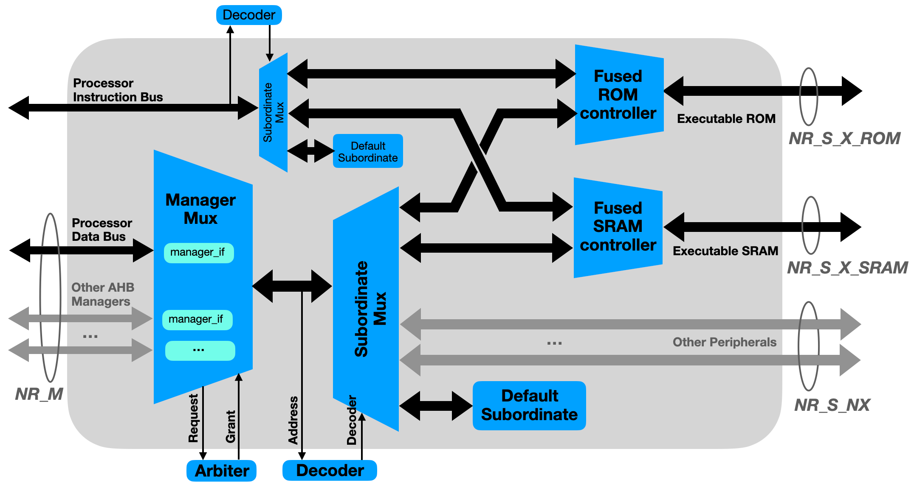

`ahb_interconnect_fused` keeps the X / NX split of the hiperf variant
but replaces each executable AHB subordinate with an internal dual-port
memory controller: `NR_S_X_ROM` × `ahb_fused_rom_ctrl` driving ROM
macros and `NR_S_X_SRAM` × `ahb_fused_sram_ctrl` driving SRAM macros.
`NR_S_X_ROM = 0` gives a ROM-less executable space; `NR_S_X_SRAM` is at
least 1.

Each controller has two AHB ports:

- **Port A** is fed by the executable manager `m_x`. It is read-only
  and 32-bit on both controllers. A write presented by `m_x` never
  reaches a controller: the fabric routes it to the executable-side
  default subordinate, which answers ERROR, and the memory is untouched.
- **Port B** is fed by the non-executable side, i.e. any
  non-executable manager whose access decodes into the executable
  region. It supports reads and byte-enabled writes on the SRAM
  controller; on the ROM controller a write is answered with the
  two-cycle ERROR.

The two ports share the macro's single chip-enable and address bus.
When both present an address phase to the same controller in the same
cycle, the controller's arbiter serves one and holds the other for one
wait state. `FIXED_B_PRIO` selects the policy: `0` (default) serves
Port A first after reset and then gives each contest to the port that
lost the previous one (the SRAM controller's priority bit also advances
on uncontested grants, so the winner is not a strict alternation); `1`
always serves Port B, which removes `a_hsel_i` from the Port-B leg of
the memory-address mux at the cost of letting heavy non-executable
traffic starve instruction fetch.

A Port-B write whose data phase collides with a read **on either port**
— the pause is port-agnostic, so a pipelined Port-B write→read triggers it
too — is held in a one-word buffer and written to the macro in the very next
cycle, during which neither port is granted. So a write reaches the macro at
most one cycle after its data phase whatever the traffic pattern. The port
that loses a contest in a write's data phase takes **two** wait states, not
one: arbitration is masked during the write cycle, so the loser is not
re-granted until the cycle after. That hold is what makes the one-cycle write
bound above true. An address phase first presented during the write cycle is
held and granted the next cycle: one wait state. A Port-B read of the buffered word in the collision cycle is
served from the buffer; Port A has no such forwarding, so ordering
between a data write and a subsequent instruction fetch of the same
word remains the CPU's job (FENCE.I).

The non-executable managers' `hmaster` / `hprot` / `hauser` /
`hmastlock` are not delivered to the fused controllers. Any per-master
or privilege policy on executable memory — for example keeping a DMA or
the debug system-bus access from writing code RAM — must be enforced
upstream. The hiperf variant, by contrast, forwards these signals to
its executable subordinates.

The controllers carry no memory-size parameter: `rom_addr_o` /
`sram_addr_o` are full 30-bit word addresses and the integrator slices
the bits the macro needs. Both complete a read one cycle after the
command and expect the macro to do the same (see the memory-macro
contract under [Integration requirements](#integration-requirements)).

### `hready` wiring

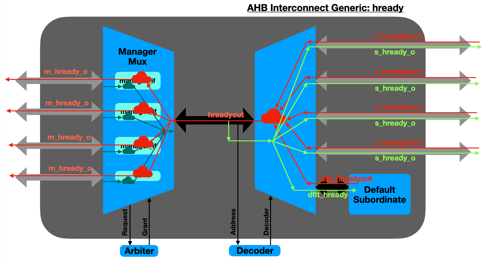

AHB-Lite requires the `hreadyout` of the subordinate that owns the data
phase to be combined into one bus `hready` seen by every subordinate.
`ahb_subordinate_mux` selects that `hreadyout` with the same one-hot
that selects `hrdata` and feeds it back to all subordinates on
`s_hready_o`.

**`m_hready_o` is per-manager, not a broadcast.** Each manager sees
`m_hready_o[k] = dph_ongoing ? hreadyout : aph_pending ? 0 : 1`, so a
manager that does not own the data phase reads `hready = 1` while the
bus is stalled, and one with an address phase waiting for a grant reads
`0`. That is what lets a manager be held off without stalling the
others; the combining requirement above is a subordinate-side one.

The hiperf and fused variants run two independent `hready` networks,
one per sub-fabric, so a wait state on one side does not stall the
other. On the hiperf executable ports each subordinate is alone on its
bus, so its `hready` is simply its own `hreadyout` fed back
(`s_x_hready_o[i] = s_x_hreadyout_i[i]`) — which is why a registered
`hreadyout` is mandatory for executable subordinates (Constraint #3).

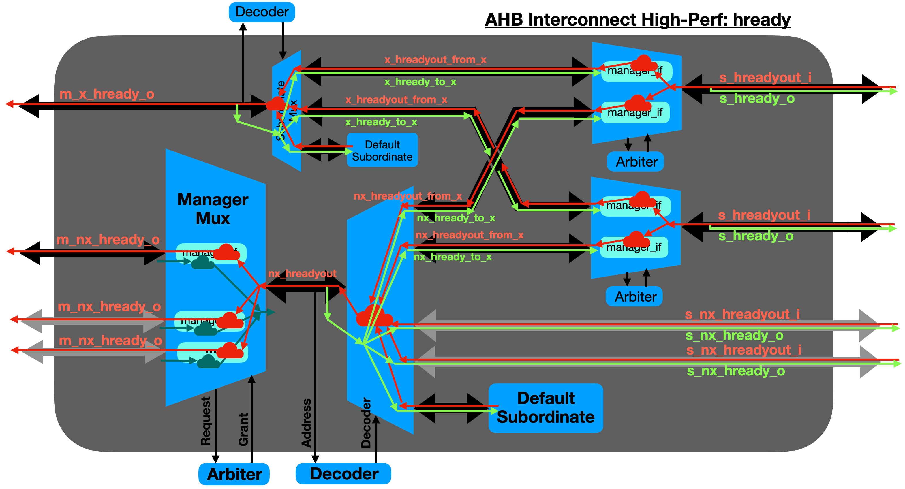

### Address map

The address map is the integrator's decoder; the fabric imposes none,
but two variants constrain how the decoders relate to each other.

**Hiperf**: bit *i* of `s_x_decoder_1hot_i` and bit *i* of
`s_decoder_1hot_i` both select `s_x_*[i]`, each through one side of its
level-2 channel, so the two decoders must cover the same ranges for the
executable subordinates — see the note in the hiperf ports section.
A mismatch routes a fetch and a data access at the same address to
different memories, with nothing to report it.

**Fused**: the executable one-hot
`s_x_decoder_1hot_i` is laid out as `{ NR_S_X_SRAM SRAM bits,
NR_S_X_ROM ROM bits }` — ROM controllers on the low bits, SRAM
controllers on the high bits — and the low `NR_S_X` bits of the
system-wide `s_decoder_1hot_i` must follow the same order, since they
route non-executable accesses to the same controllers. Getting it wrong
sends SRAM accesses to a ROM controller (writes then return ERROR) and
vice versa. Every variant otherwise wires each subordinate slot
symmetrically to its `s_*[i]` port group.

---

## Parameters

| Variant | Parameter      | Default | Purpose |
|---------|----------------|---------|---------|
| all     | `HAUSER_W`     | `1`     | Width of the HAUSER sideband. Minimum 1. |
| all     | `ASYNC_RST_EN` | `1`     | `1`: asynchronous active-low reset; `0`: synchronous reset (the clock must run while reset is asserted). See the repository README, *Reset architecture*. |
| generic | `NR_M`         | `3`     | Number of managers. Maximum 16. |
| generic | `NR_S`         | `5`     | Number of subordinates, not counting the default subordinate. |
| generic | `M_HMASTER_ID` | all-zero | HMASTER ID of each manager, 4 bits per manager. All-zero selects the default numbering: manager *i* is `i`. |
| generic | `M_HMASTER_TAG` | all-zero | Per manager, the bits of `m_hmaster_i` ORed into its ID. All-zero: `m_hmaster_i` is ignored. See [Manager-supplied HMASTER bits](#manager-supplied-hmaster-bits). |
| hiperf  | `NR_M`         | `2`     | Number of non-executable managers (there is always one executable manager). Maximum 15. |
| hiperf  | `NR_S_X`       | `2`     | Number of executable subordinates. |
| hiperf  | `NR_S_NX`      | `3`     | Number of non-executable subordinates. |
| hiperf  | `M_NX_HMASTER_ID` | all-zero | HMASTER ID of each non-executable manager, 4 bits per manager; `4'h0` belongs to the executable manager and is refused. All-zero selects the default numbering: manager *i* is `i+1`. |
| hiperf  | `M_NX_HMASTER_TAG` | all-zero | Per non-executable manager, the bits of `m_nx_hmaster_i` ORed into its ID. All-zero: `m_nx_hmaster_i` is ignored. |
| fused   | `NR_M`         | `2`     | As hiperf. |
| fused   | `NR_S_X_ROM`   | `1`     | Number of fused ROM controllers (low decoder bits). May be 0. |
| fused   | `NR_S_X_SRAM`  | `1`     | Number of fused SRAM controllers (high decoder bits). Minimum 1 — the `sram_*` ports are sized by it directly, so a ROM-only executable space cannot be expressed. |
| fused   | `NR_S_NX`      | `3`     | Number of non-executable subordinates. |
| fused   | `M_NX_HMASTER_ID`, `M_NX_HMASTER_TAG` | all-zero | As hiperf. |
| fused   | `FIXED_B_PRIO` | `0`     | Arbitration inside the fused controllers: `0` the port that lost the previous contest wins the next (Port A first after reset), `1` Port B (data) always wins. |

---

## Ports

Multi-instance buses are packed slot 0 first: `m_haddr_i[31:0]` belongs
to manager 0, `[63:32]` to manager 1, and so on.

### Generic

| Direction | Port                | Width           | Description |
|-----------|---------------------|-----------------|-------------|
| in        | `hclk_i`            | 1               | Bus clock |
| in        | `hresetn_i`         | 1               | Active-low reset; asynchronous when `ASYNC_RST_EN = 1`, synchronous otherwise |
| out       | `hclk_en_o`         | 1               | Clock-gate enable for the integrator's ICG cell (see [Integration requirements](#integration-requirements)) |
| in        | `m_haddr_i`         | `32*NR_M`       | Manager address |
| in        | `m_hauser_i`        | `HAUSER_W*NR_M` | Manager HAUSER sideband |
| in        | `m_hburst_i`        | `3*NR_M`        | Manager burst type |
| in        | `m_hmaster_i`       | `4*NR_M`        | Manager-supplied HMASTER bits; only the bits set in `M_HMASTER_TAG` are used. Address-phase timing, like `m_haddr_i`. Tie to 0 when unused |
| in        | `m_hmastlock_i`     | `NR_M`          | Manager locked-transfer indicator |
| in        | `m_hprot_i`         | `4*NR_M`        | Manager protection control |
| in        | `m_hsize_i`         | `3*NR_M`        | Manager transfer size |
| in        | `m_htrans_i`        | `2*NR_M`        | Manager transfer type |
| in        | `m_hwdata_i`        | `32*NR_M`       | Manager write data |
| in        | `m_hwrite_i`        | `NR_M`          | Manager write enable |
| out       | `m_hrdata_o`        | `32*NR_M`       | Manager read data, valid for the manager that owns the data phase |
| out       | `m_hready_o`        | `NR_M`          | Manager `hready`; low while the manager's address phase waits for the bus or its data phase is extended |
| out       | `m_hresp_o`         | `NR_M`          | Manager response |
| out       | `m_request_o`       | `NR_M`          | Request to the external arbiter |
| in        | `m_grant_i`         | `NR_M`          | One-hot grant from the external arbiter |
| out       | `s_decoder_addr_o`  | 32              | System address for the external decoder |
| in        | `s_decoder_1hot_i`  | `NR_S`          | One-hot subordinate select from the external decoder |
| in        | `s_hrdata_i`        | `32*NR_S`       | Subordinate read data |
| in        | `s_hreadyout_i`     | `NR_S`          | Subordinate ready-out |
| in        | `s_hresp_i`         | `NR_S`          | Subordinate response |
| out       | `s_haddr_o`         | `32*NR_S`       | Address, broadcast to all subordinates; qualified by `s_hsel_o[i]` |
| out       | `s_hauser_o`        | `HAUSER_W*NR_S` | HAUSER sideband of the granted manager |
| out       | `s_hburst_o`        | `3*NR_S`        | Burst type |
| out       | `s_hmaster_o`       | `4*NR_S`        | HMASTER of the granted manager: its ID ORed with its tagged `m_hmaster_i` bits. By default the ID is the manager index on **generic**; **hiperf and fused** reserve `4'h0` for the executable manager and number non-executable manager *i* **`i+1`** |
| out       | `s_hmastlock_o`     | `NR_S`          | Locked-transfer indicator |
| out       | `s_hprot_o`         | `4*NR_S`        | Protection control |
| out       | `s_hready_o`        | `NR_S`          | Bus `hready`, to be connected to every subordinate's `hready` input |
| out       | `s_hsel_o`          | `NR_S`          | Subordinate select (one-hot, straight from the decoder). May be asserted with `s_htrans_o = IDLE` while a grant is parked on an idle manager |
| out       | `s_hsize_o`         | `3*NR_S`        | Transfer size |
| out       | `s_htrans_o`        | `2*NR_S`        | Transfer type of the granted manager; forced to IDLE while no granted address phase is on the bus |
| out       | `s_hwdata_o`        | `32*NR_S`       | Write data |
| out       | `s_hwrite_o`        | `NR_S`          | Write enable |

### Hiperf

Clock, reset and `hclk_en_o` are as in the generic fabric. The manager
side has two groups:

- **`m_x_*`** — the single executable manager: `m_x_haddr_i`,
  `m_x_hauser_i`, `m_x_hburst_i`, `m_x_hmastlock_i`, `m_x_hprot_i`,
  `m_x_hsize_i`, `m_x_htrans_i`, `m_x_hwdata_i`, `m_x_hwrite_i` in,
  `m_x_hrdata_o`, `m_x_hready_o`, `m_x_hresp_o` out; single-instance
  widths (32, `HAUSER_W`, 3, 1, 4, 3, 2, 32, 1 / 32, 1, 1). No
  request/grant: the executable side is arbitrated internally.
- **`m_nx_*`** — `NR_M` non-executable managers, the generic `m_*`
  group renamed, including `m_nx_hmaster_i` (qualified by
  `M_NX_HMASTER_TAG`) and `m_nx_request_o` / `m_nx_grant_i` for the
  external arbiter. The executable manager has no HMASTER input.

> **The executable manager's writes are NOT filtered on hiperf.** `m_x_hwrite_i`
> is forwarded to the executable subordinates unchanged, so a write presented by
> `m_x` reaches whichever subordinate decodes — it is the subordinate's job to
> refuse it. Only the **fused** variant diverts an `m_x` write to a default
> subordinate and answers ERROR; do not carry that expectation across.

> **HMASTER IDs are not manager indices here.** `4'h0` is reserved for the
> executable manager, so by default non-executable manager *i* is reported as
> **`i+1`** on `s_nx_hmaster_o`. A subordinate implementing the per-master policy
> this document delegates to it (see *Architectural constraints*) must decode the
> ID the fabric was built with (`i+1`, or `M_NX_HMASTER_ID`), not the manager
> index; comparing against the index would apply the policy to the wrong
> master. This also caps `NR_M` at 15 rather than 16. The fused fabric inherits
> the same scheme.

Two decoders are needed, one over the whole address space and one over
the executable subset. **Both must decode the same address ranges for the
executable subordinates**: `s_decoder_1hot_i[i]` and `s_x_decoder_1hot_i[i]`
select the same subordinate through different paths, so a range mismatch sends
a fetch and a data access at the same address to different memories, silently.
The executable bits of `s_decoder_1hot_i` are the low `NR_S_X` bits, in the
same order as `s_x_decoder_1hot_i`.

The decoder ports:

| Direction | Port                  | Width    | Description |
|-----------|-----------------------|----------|-------------|
| out       | `s_decoder_addr_o`    | 32       | Address for the system decoder |
| in        | `s_decoder_1hot_i`    | `NR_S_X + NR_S_NX` | One-hot select over all subordinates, executable ones on the low bits |
| out       | `s_x_decoder_addr_o`  | 32       | Address for the executable-side decoder |
| in        | `s_x_decoder_1hot_i`  | `NR_S_X` | One-hot select over the executable subordinates |

The subordinate side is the generic `s_*` group split in two bundles,
`s_x_*` sized by `NR_S_X` and `s_nx_*` sized by `NR_S_NX`.

### Fused

Same manager and decoder ports as hiperf. The `s_nx_*` bundle is
unchanged; the `s_x_*` bundle is replaced by memory-macro pins:

| Direction | Port          | Width              | Description |
|-----------|---------------|--------------------|-------------|
| in        | `rom_dout_i`  | `32*NR_S_X_ROM`    | ROM read data |
| out       | `rom_addr_o`  | `30*NR_S_X_ROM`    | ROM word address; slice to the macro depth |
| out       | `rom_cen_o`   | `NR_S_X_ROM`       | ROM chip enable, active low |
| out       | `rom_clk_o`   | `NR_S_X_ROM`       | ROM clock (`hclk_i`, not gated) |
| in        | `sram_dout_i` | `32*NR_S_X_SRAM`   | SRAM read data |
| out       | `sram_addr_o` | `30*NR_S_X_SRAM`   | SRAM word address; slice to the macro depth |
| out       | `sram_cen_o`  | `NR_S_X_SRAM`      | SRAM chip enable, active low |
| out       | `sram_clk_o`  | `NR_S_X_SRAM`      | SRAM clock (`hclk_i`, not gated) |
| out       | `sram_din_o`  | `32*NR_S_X_SRAM`   | SRAM write data |
| out       | `sram_wen_o`  | `4*NR_S_X_SRAM`    | SRAM byte write enables, active low |

With `NR_S_X_ROM = 0` the `rom_*` ports keep a width of one slot:
`rom_cen_o` is parked high, `rom_clk_o` and `rom_addr_o` are driven
low, and `rom_dout_i` must be tied off.

---

## Integration requirements

- **Reset.** `hresetn_i` is active low and asserted asynchronously or
  synchronously according to `ASYNC_RST_EN`. Its de-assertion must be
  synchronised to `hclk_i` by the integrator: the fabric has no reset
  synchroniser.

- **Clock gating.** `hclk_en_o` is a combinational enable that is high
  whenever the fabric has work in flight (a pending or ongoing transfer,
  a buffered write, an ERROR response). It is meant to drive a
  latch-based ICG cell at the clock root; the fabric is equally correct
  on a free-running clock.

- **External arbiter** (generic, and the non-executable side of hiperf
  and fused). Supply a request/grant arbiter over `m_request_o` /
  `m_grant_i`. The grant is used combinationally, so it must settle in
  the same cycle as the request — a registered grant is not supported —
  and it must be one-hot. The arbiter may park its grant on a default
  manager while nobody requests: the fabric only acts on a grant while
  the bus can accept an address phase, so a parked grant never starts
  a transfer on top of another manager's stalled data phase, and
  `s_htrans_o` is forced to IDLE whenever no granted address phase is
  on the bus, so a manager whose grant is parked cannot expose a NONSEQ
  to a subordinate during another manager's wait state (`s_hsel_o` may
  still be asserted with IDLE). A simple round-robin or priority arbiter
  is sufficient; `bench/verilog/ahb_arbiter.v` is a reference.

- **External decoder** (same variants). Supply a combinational one-hot
  decoder from `s_decoder_addr_o` to `s_decoder_1hot_i`. An all-zero
  output selects the default subordinate of that bus. Hiperf and fused
  need a second decoder over the executable range, from
  `s_x_decoder_addr_o` to `s_x_decoder_1hot_i`; bit *i* of it and bit
  *i* of `s_decoder_1hot_i` must cover the same address range, and on
  fused the ROM-low / SRAM-high order applies to both (see
  [Address map](#address-map)).

- **Bursts and locks.** The fabric arbitrates transfer by transfer. A
  BUSY beat releases the bus, so another manager can be granted between
  the beats of a burst, and a SEQ beat can follow an unrelated transfer
  at the subordinate. `hmastlock` is forwarded but not honoured by the
  bundled arbiters. A manager that needs atomic bursts or locks must not
  share its bus with other managers, unless the external arbiter
  implements the hold. No aRVern manager bursts: the core drives
  `hburst` SINGLE and `hmastlock` deasserted on both of its buses, so
  this limitation costs an aRVern platform nothing and matters only to
  a third-party bursting manager.

- **Subordinate `hready`.** Connect every subordinate's `hready` input
  to its bit of `s_hready_o` (or `s_x_hready_o` / `s_nx_hready_o`).
  Never tie it independently: pipelined transfers would desynchronise.

- **Manager select.** There is no `m_hsel` port; every manager always
  selects the fabric. A manager that must not be seen by the fabric
  drives `htrans = IDLE`.

- **Manager-supplied HMASTER bits.** See
  [Manager-supplied HMASTER bits](#manager-supplied-hmaster-bits): tie
  `m_hmaster_i` / `m_nx_hmaster_i` to 0 unless a manager's tag bits are
  enabled.

- **Fused memory macros.** ROM and SRAM macros must behave like the
  reference models `bench/verilog/rom.v` and `sram.v`: single-port,
  address (and write data) sampled on the rising edge of
  `rom_clk_o` / `sram_clk_o` while `*_cen_o` is low, read data valid
  during the following cycle, no wait states.

- **Misaligned accesses** are not checked; the fabric expects managers
  and subordinates to handle them (CPUs raise the alignment exception
  themselves). Transfer sizes above a word are not checked either: the
  fused SRAM controller ignores `hsize[2]`, and `hsize[1:0] = 2'b11`
  produces no byte strobe — the write is accepted with OKAY and dropped,
  a read returns the word; the fused ROM controller ignores `hsize`
  altogether on both ports and returns the full word. Inside the fabric,
  `hresp = 1` comes only from the default subordinates and from the
  fused ROM controller on a write.

### Manager-supplied HMASTER bits

Each manager's HMASTER is an ID the fabric assigns, ORed with the bits of
that manager's `m_hmaster_i` enabled by its `M_HMASTER_TAG` nibble
(`m_nx_hmaster_i` / `M_NX_HMASTER_TAG` on hiperf and fused). This is the
AMBA model of a manager-generated HMASTER combined with an interconnect
value: a manager with several sources of traffic tags each transfer, and
the fabric keeps the result unique across managers. The tag is an
address-phase signal and follows the transfer through the fabric's
address-phase caching like `haddr`.

Every value a manager can present, its ID ORed with any subset of its
tag bits, must be unique. Tag bits must be zero in the manager's own ID,
two managers must differ in at least one bit that neither of them tags,
and on hiperf and fused no non-executable manager may use `4'h0`. The
simulation build stops at elaboration with `$fatal` on a configuration
that breaks one of these rules; synthesis does not check them.

Both parameters pack one nibble per manager, manager 0 in bits `[3:0]`,
like the port buses. A worked example on a generic fabric with three
managers, where manager 1 carries a one-bit tag:

| Configuration | `M_HMASTER_ID` | `M_HMASTER_TAG` | Manager 0 | Manager 1 | Manager 2 |
|---------------|----------------|-----------------|-----------|-----------|-----------|
| Default IDs, tag on bit 3 | `12'h000` (IDs 0, 1, 2) | `12'h080` | `4'h0` | `4'h1` or `4'h9` | `4'h2` |
| Explicit IDs, tag on bit 0 | `12'h420` (IDs 0, 2, 4) | `12'h010` | `4'h0` | `4'h2` or `4'h3` | `4'h4` |
| Rejected: tag overlaps ID | `12'h000` (IDs 0, 1, 2) | `12'h010` | — | — | — |
| Rejected: collision | `12'h000` (IDs 0, 1, 2) | `12'h002` | — | — | — |

In the first row, manager 1 presents `4'h9` while its `m_hmaster_i[7]`
(bit 3 of its nibble) is high, and `4'h1` otherwise. Every other
`m_hmaster_i` bit is ignored, whatever the managers drive on it. The third
row enables bit 0 on manager 1, whose ID `4'h1` already has that bit set.
In the fourth row, manager 0 could present `4'h2`, which is manager 2's
ID. On hiperf and fused, `M_NX_HMASTER_ID` / `M_NX_HMASTER_TAG` work the
same way over the non-executable managers, with default IDs `1, 2, …`.

The aRVern core tags Debug Module system-bus (SBA) transfers on its data
port with `data_hmaster_o`. With the data port on non-executable manager
0 of a hiperf or fused fabric, one parameter and one connection carry it
to every subordinate, keeping the default IDs:

```verilog
ahb_interconnect_hiperf #(.NR_M(1), .M_NX_HMASTER_TAG(4'h8), ...) u_fabric (
    ...
    .m_nx_hmaster_i ({data_hmaster_o, 3'b000}),
    ...
);
```

Hart data accesses then arrive as HMASTER `4'h1` and SBA transfers as
`4'h9`; instruction fetches stay `4'h0`. On the generic fabric with the
instruction port on manager 0 and the data port on manager 1, the
equivalent is `M_HMASTER_TAG(8'h80)` with
`m_hmaster_i({data_hmaster_o, 3'b000, 4'h0})`. The fused controllers
do not receive HMASTER, so a policy on executable memory still has to be
enforced upstream (see [Fused fabric](#fused-fabric)).

---

## Architectural constraints

The fabric's correctness rests on a few properties that are established
in one place and relied upon in another. They are numbered so that RTL
comments and this document can refer to them; #1, #3, #5 and #6 are
part of the integrator's contract, the others are internal invariants
of interest when extending the IP.

| #     | Constraint | Established by | Relied upon by | If violated |
|-------|------------|----------------|----------------|-------------|
| **1** | Every grant fed to the fabric is one-hot in every cycle. | `ahb_arbiter_2m` by construction; external arbiters by contract. | The grant-controlled muxes and the `hwdata` OR-combine in `ahb_manager_mux`. | Two managers drive the address phase at once: silent corruption. |
| **2** | At most one manager owns a data phase on a bus at any time. | #1, plus `ahb_manager_if` not requesting during another manager's stalled data phase (`m_request_o` is gated by `hreadyout_i`) and #7. Checked every cycle by the testbench on the non-executable / main bus. | The `hwdata` OR-combine and the `hrdata` / `hresp` return gating. | `hwdata` collision; `hrdata` / `hresp` delivered to the wrong manager. |
| **3** | A subordinate's `hreadyout` and `hresp` are registered: neither depends combinationally on any of its AHB inputs. | Integrator contract; true of every in-tree subordinate. | The `hready` feedback (`s_hready_o`, and `s_x_hready_o = s_x_hreadyout_i` on hiperf) and the request → arbiter → grant → decoder path both close through the subordinate. | Combinational loop. |
| **4** | Each `ahb_manager_if` receives on `m_hready_i` the combined `hready` of the bus it sits on: its own `m_hreadyout_o` for the external manager ports; the originating sub-fabric's `hready` for the level-2 channels in front of a hiperf executable subordinate (not a self-loopback, which would let a channel commit an address phase while its own bus is stalled). | Top-level wiring of the three variants. | `ahb_manager_if` uses `m_hready_i` to recognise a valid address phase; nothing inside it connects `m_hready_i` to `m_hreadyout_o`. | A manager re-issues an address phase it has already cached, or an access is accepted during a wait state. |
| **5** | Fused memory macros return read data one cycle after the command, without wait states. | Memory-macro contract. | The fused controllers complete every read data phase one cycle after the command. | Read data lost. |
| **6** | Reset de-assertion is synchronised to `hclk_i`; with `ASYNC_RST_EN = 0` the clock runs while reset is asserted. | Integrator contract. | Every flop in the fabric. | Asynchronous: reset-removal metastability. Synchronous: flops never reset. |
| **7** | A grant is acted upon only while the bus can accept an address phase (`m_grant_i & hreadyout_i`), and a subordinate never sees a transfer for a bare grant: `s_htrans_o` is IDLE unless a granted address phase is on the bus, so `s_hsel_o[i]` may be asserted with `s_htrans_o = IDLE`, never with NONSEQ/SEQ. | `ahb_manager_if` (the grant); `ahb_subordinate_mux` (`s_htrans_o` qualified by the granted address phase). | #2 under any same-cycle arbiter, including one that parks its grant on a default manager. | A parked grant starts a second data phase on top of a stalled one, or exposes a withdrawn NONSEQ to a subordinate during another manager's wait state. |

---

## Operation

In the waveforms, manager 0 is yellow, manager 1 orange, and cycles
spent waiting for arbitration or in wait states are blue.

### Single read through the generic fabric

Manager 0 reads subordinate 0 (`htrans = NONSEQ`, `haddr = 0x10`). The
arbiter grants it in the address-phase cycle, the subordinate mux
selects subordinate 0, and one cycle later the subordinate's read data
reaches `m_hrdata_o[0]`.

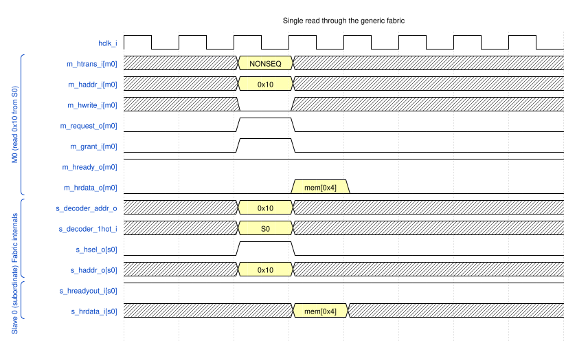

### Arbitrated grant switch

Both managers request in the same cycle. The round-robin arbiter grants
manager 0; manager 1's address phase is cached in its `ahb_manager_if`
and replayed the next cycle. Manager 1 sees one wait state on its own
`hready` while its address phase waits; the bus itself never idles.

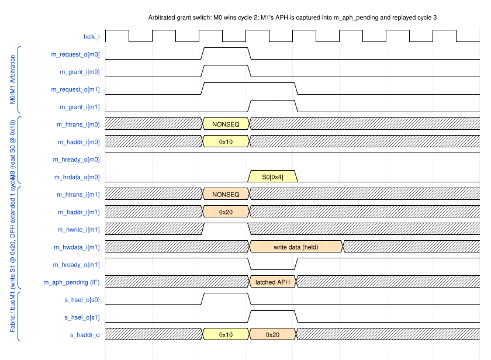

### Default-subordinate ERROR response

An access to an unmapped address: the decoder returns all zeros, the
default subordinate takes the transfer and answers the two-cycle ERROR
— `hreadyout = 0` with `hresp = 1`, then `hreadyout = 1` with
`hresp = 1`. The manager samples the error in the second cycle.

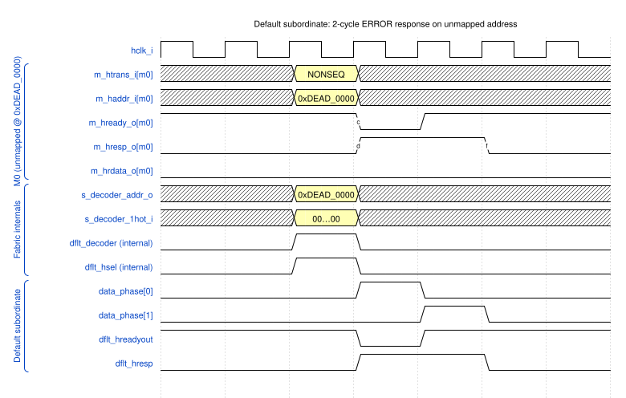

### Hiperf parallel access

The executable manager fetches from executable subordinate 0 (ROM)
while a non-executable manager reads non-executable subordinate 1 (a
peripheral) in the same cycle. The two transfers do not interact: two
transfers per cycle. The level-2 channel in front of the ROM only
arbitrates when a non-executable manager targets the ROM, which is not
the case here.

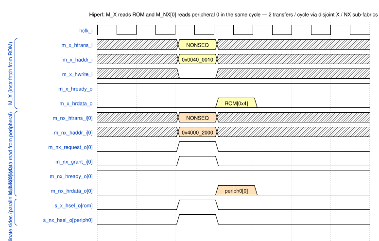

### Fused Port-A vs Port-B contention

Both ports of a fused SRAM controller present an address phase in the
same cycle: Port A from the executable manager, Port B from a
non-executable manager. With `FIXED_B_PRIO = 0` the priority flop
resets to "Port A first", so Port A is served and Port B is held for one
cycle; later contests go to the port that lost the previous one (the
SRAM controller's priority bit also advances on uncontested grants, so
the winner is not a strict alternation).

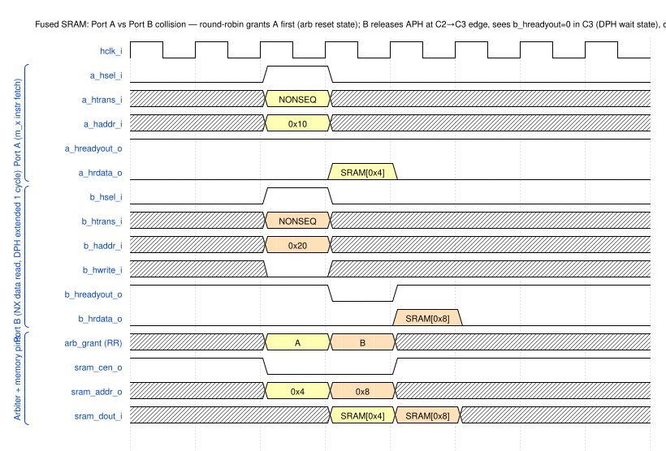

---

## Lint waivers

Signals that are intentionally unused end in `_unused`, as in the rest
of the aRVern IPs — for instance the default subordinate's `hmaster`
output, which nothing consumes. The Verilator
waiver files, one per variant, live next to the run scripts:

```
sim/rtl_sim/run/waivers_generic.vlt
sim/rtl_sim/run/waivers_hiperf.vlt
sim/rtl_sim/run/waivers_fused.vlt
```

`run_lint` applies them automatically; its parameter sweep is the list
inside the script (every top at `NR_M = 1` and at its maximum, plus the
ROM-less fused fabric). VC Static waivers are under `lint/vc_static/`;
that flow (`run_vclint`, see its README) sweeps the seven configurations
of `sim/rtl_sim/bin/rtl_configs.py` — `generic` / `hiperf` / `fused` each
at its defaults and with synchronous reset, plus `fused_norom`
(`NR_S_X_ROM = 0`).

---

## Repository layout

```
ahb_interconnect/
├── ahb_interconnect.core            FuseSoC manifest (one target per variant)
├── rtl/verilog/
│   ├── ahb_interconnect_generic.v   Top level, generic fabric
│   ├── ahb_interconnect_hiperf.v    Top level, high-performance fabric
│   ├── ahb_interconnect_fused.v     Top level, fused fabric
│   ├── ahb_manager_if.v             Per-manager front end
│   ├── ahb_manager_mux.v            Manager-side mux
│   ├── ahb_subordinate_mux.v        Subordinate-side fan-out and return mux
│   ├── ahb_default_subordinate.v    ERROR responder for unmapped addresses
│   ├── ahb_arbiter_2m.v             Two-manager arbiter (hiperf executable side)
│   ├── ahb_fused_rom_ctrl.v         Dual-port ROM controller (fused)
│   ├── ahb_fused_sram_ctrl.v        Dual-port SRAM controller (fused)
│   └── filelist.f                   RTL file list for simulation and synthesis
├── bench/verilog/
│   ├── tb_ahb_interconnect.v        Fabric testbench, all three variants
│   ├── tb_ahb_fused_rom_ctrl.v      Unit testbench, fused ROM controller
│   ├── tb_ahb_fused_sram_ctrl.v     Unit testbench, fused SRAM controller
│   ├── tb_ahb_default_subordinate.v Unit testbench, default subordinate
│   ├── submit*.f                    File lists for the testbenches
│   ├── ahb_arbiter.v, ahb_decoder.v Reference external arbiter and decoder
│   ├── ahb_waitstate_inserter.v     Subordinate-side wait-state injector
│   ├── ahb_protocol_checker.v       Address-phase stability monitor (HADDR/HTRANS/HSIZE/HWRITE/HBURST held across wait states), one per manager port
│   ├── ahb_tasks*.v                 AHB read/write tasks, one file per bench manager
│   ├── rom.v, sram.v                Reference memory macros
│   └── mem_strobes.v, timescale.v
├── sim/rtl_sim/
│   ├── src/                         One stimulus file per test
│   ├── run/                         run, run_all, run_lint, run_fused_*, run_default_subordinate, waivers
│   └── bin/                         runsim, rtl_configs.py (parameter configurations), gen_rtl_params.py,
│                                    flatten_filelist.py, parse_results, parse_summaries, vcd_window.py
├── lint/vc_static/                  VC Static lint flow: run_vclint, rules.tcl, waivers.tcl (see its README)
├── synthesis/synopsys/
│   ├── synthesis.tcl                Design Compiler flow
│   ├── read.tcl, library.tcl        RTL and technology-library setup
│   ├── constraints.tcl              Clock and path-group constraints
│   ├── constraints_ports.*.tcl      Boundary I/O delays, one per variant
│   ├── run_syn, run_syn_generic, run_syn_hiperf
│   ├── extract_worst_path.py        Worst-path summary printed after each run
│   ├── run_check_reset_style, check_reset_style_pt.tcl
│   │                                PrimeTime pass classifying every netlist flop's reset style
│   └── libraries/                   Technology setups: setup_lib_example.tcl is the template
└── doc/
    ├── ahb_interconnect.md          This document
    └── img/                         Block diagrams and waveforms; render.py rebuilds the SVGs from the .json sources
```

---

## Verification

Simulation uses Icarus Verilog; lint uses Verilator (and VC Static,
see `lint/vc_static/README.md`). One testbench,
`bench/verilog/tb_ahb_interconnect.v`, serves all three variants; the
variant, the wait-state injection and the arbiter model are selected by
`runsim` flags. Three unit benches cover the default subordinate and the
two fused controllers on their own.

### Bench structure

**Managers.** The bench drives three managers, M0 to M2, through the
tasks in `ahb_tasks_m{0,1,2}.v`. On the generic fabric they are the
three symmetric `m_*` slots. On hiperf and fused, M0 is the executable
manager `m_x` and M1 / M2 are `m_nx[0]` / `m_nx[1]`; because Port A is
read-only on fused, `simple_rdwr` and `pipelined_rdwr` run M1 and M2
only there, and M0 only ever reads. Each manager carries a distinct `hprot` (`4'h2`,
`4'h3`, `4'hA`) with the same privilege bits, so a mis-routed sideband
is visible without changing the access mode the peripherals see.

**Parameter point.** One per variant: generic `NR_M = 3`, `NR_S = 4`;
hiperf `NR_M = 2`, `NR_S_X = 2`, `NR_S_NX = 2`; fused one ROM and one
SRAM controller, `NR_S_NX = 2`. Other values are elaborated by the lint
sweeps only.

**Address map** (`bench/verilog/ahb_decoder.v`):

| Subordinate | Range | Model |
|-------------|-------|-------|
| s0 | `0x0040_0000`, 2 KB | ROM — `ahb_rom_controller` + `rom.v` (generic, hiperf); the fused ROM controller's macro pins + `rom.v` (fused) |
| s1 | `0x0040_1000`, 2 KB | SRAM — `ahb_sram_controller` + `sram.v` (generic, hiperf); the fused SRAM controller's macro pins + `sram.v` (fused) |
| s2 | `0x0040_2000`, 128 B | `ahb_periph_example` (privilege-filtering, `hsmode` from `hauser[0]`) |
| s3 | `0x0040_3000`, 128 B | `ahb_periph_example` |
| — | anything else | default subordinate |

On hiperf and fused, s0 / s1 are the executable subordinates and s2 / s3
the non-executable ones. The same `ahb_decoder` instance feeds both
hiperf decoders (`s_x_decoder_1hot = s_decoder_1hot[1:0]`), so the
bench cannot express a decoder mismatch.

**Arbiter.** `bench/verilog/ahb_arbiter.v` is a rotating-priority
request/grant arbiter; with `-arb_parked` it parks its grant on M0 while
nobody requests, which is how Constraint #7 is exercised.

**Wait-state injection.**

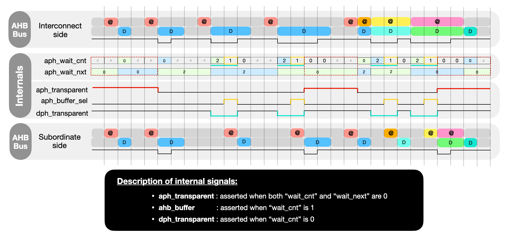

`bench/verilog/ahb_waitstate_inserter.v` sits between the fabric and
each AHB subordinate port and holds `hreadyout` low for a random 0 to 6
cycles after each address phase, so the fabric's data-phase tracking
and `hready` feedback are exercised with a slow subordinate on every
AHB port. On the fused variant that is the two peripherals: the
executable memories hang off the macro pins and cannot wait
(Constraint #5). The inserter is transparent unless `-random_ws` is
given.

The inserter also plays the subordinate's part in the `hready`
handshake: it keeps its address-phase register clocked by `hready` like
the reference AHB-Lite subordinate, so a fabric that mishandles `hready`
corrupts the data it returns and the data checks fail.

### Monitors

Five passive monitors run in every fabric simulation; their violations
count as test errors.

| Monitor | Checks | Where |
|---------|--------|-------|
| Subordinate `hready` (inside `ahb_waitstate_inserter`) | While the subordinate stalls, the fabric hands it `hready = 0`. | Every inserter, i.e. every AHB subordinate port (the two peripherals on fused). |
| Data-phase ownership | At most one `ahb_manager_if` has a data phase in flight on a bus (Constraint #2). | The generic bus, the non-executable bus of hiperf and fused, and on hiperf each executable subordinate's two-channel bus (executable manager vs non-executable sub-fabric). |
| `ahb_protocol_checker` | Address-phase stability: `haddr` / `htrans` / `hsize` / `hwrite` / `hburst` are held while `hready = 0` and the response is not ERROR. | One per bench manager port (M0–M2). The subordinate ports are not monitored. |
| HMASTER | At every address-phase commit (`hsel & hready & htrans[1]`) the `hmaster` a subordinate sees is that of the granted manager, including its tag. The bench tags manager M1 (`M_HMASTER_TAG` / `M_NX_HMASTER_TAG` bit 3, driven from its `haddr[2]`, so the tag toggles between word transfers), and every manager drives ones on its untagged bits. | Strict on every generic subordinate and on the non-executable side of hiperf and fused; range-only (any of 0, 1, 2, 9) on hiperf's executable ports; not observable on fused's executable side. |
| HAUSER / HPROT | At the same instant, the sideband pair a subordinate sees is that of the granted manager. | Strict where the HMASTER check is strict; on hiperf's executable ports the pair must belong to some manager; not observable on fused's executable side. |

Each `ahb_waitstate_inserter` also carries an ERROR-injection hook, off by
default: a test raises its `err_req` and the next NONSEQ / SEQ reaching
that port is answered with the two-cycle ERROR without reaching the
subordinate (`subordinate_error`).

### What is not covered

- **Atomic bursts and locks.** `burst_lock_forwarding` drives every
  `hburst` value, `hmastlock` and SEQ / BUSY beats, and checks they are
  forwarded and answered as documented. Nothing checks an atomic burst or
  a locked sequence, because the bundled arbiters do not provide one (see
  *Bursts and locks* under
  [Integration requirements](#integration-requirements)).
- **`NR_S_X_ROM = 0` and `NR_S_X_SRAM = 2`.** The bench hard-codes one
  ROM and one SRAM controller. The ROM-less build is elaborated by the
  lint sweeps only; two SRAM controllers are never built. Accepted: the
  bench's memory models are single, named instances and the failure
  mode of a mis-sliced pin vector would be tests passing against the
  wrong memory, so the cost of covering it is out of proportion to the
  branch.
- **Two managers writing the same SRAM word.** `arbiter_stress` gives
  each manager its own SRAM window, so every read has one writer and an
  exact expected value; a cross-manager race on one word is never
  checked. AHB defines no ordering between managers, so there is
  nothing for the fabric to get right there.
- **Hiperf executable-side HMASTER / sideband** is range-only: the value
  must belong to some manager, not necessarily the granted one. The
  same `ahb_manager_if` path is checked strictly on the non-executable
  side. On fused the executable-side controllers do not receive these
  signals at all, so there is nothing to observe (see
  [Fused fabric](#fused-fabric)).
- **The parking arbiter** is run on the generic fabric only; the
  hiperf / fused non-executable side shares the same `ahb_manager_if`
  code path.

### Lint

```bash
cd sim/rtl_sim/run
./run_lint        # Verilator on the three variants, then a parameter sweep:
                  # every top at NR_M = 1 and at its maximum, and the ROM-less fused fabric
```

### Simulation

```bash
cd sim/rtl_sim/run
../bin/runsim simple_rdwr                       # generic fabric
../bin/runsim pipelined_advanced -hiperf        # hiperf fabric
../bin/runsim fused_arbiter -fused              # fused fabric, round-robin arbitration
../bin/runsim fused_arbiter -fused -fixed_b_prio
../bin/runsim arbiter_stress -random_ws         # with wait states
../bin/runsim arbiter_stress -arb_parked        # bench arbiter parks its grant on manager 0
../bin/runsim simple_rdwr -seed 12345           # replay a seed

./run_all                                       # full regression, 113 runs
./run_all 5                                     # five iterations, different seeds
./run_default_subordinate                       # unit bench, default subordinate
./run_fused_rom [rr|fixb]                       # unit bench, fused ROM controller
./run_fused_sram [rr|fixb] [-seed N]            # unit bench, fused SRAM controller
```

A run passes when its log ends with `SIMULATION PASSED`; `run_all`
collects the results and a replay command per test under `log/`.

`run_all` performs 113 runs: 108 fabric runs and the five unit-bench
passes. The fabric runs cover most tests with and without wait states
(`addr_walk`, `addr_walk_contended`, `default_subordinate_stress`,
`fused_write_commit`, `fused_x_write`, `hprot_sweep` and `subordinate_error`
without), the generic arbitration tests also with the parking arbiter,
the fused tests (`fused_x_write` excepted) also with `FIXED_B_PRIO = 1`,
and a subset of each variant with synchronous reset (`ASYNC_RST_EN = 0`).
`./run_all -cov` runs the same list under Verilator for line / branch /
toggle coverage (`sim/rtl_sim/run/cov/`, waivers in `waivers_cov.md`).

### Test suite

| Test                          | Covers |
|-------------------------------|--------|
| `simple_rdwr`                 | Non-pipelined byte / halfword / word reads and writes; byte enables. All variants. |
| `pipelined_rdwr`              | Back-to-back reads and writes at one transfer per cycle. All variants. |
| `pipelined_advanced`          | Pipelined single-manager reads and writes across every subordinate, including a same-word read-after-write on the SRAM (fused: through the SRAM controller's forwarding path). One manager at a time, so no contention. All variants; also run under the parking arbiter and random wait states. |
| `simple_arbiter`              | Three managers contending through the external arbiter, first spaced, then pipelined. Generic. |
| `hiperf_arbiter`              | Executable and non-executable managers contending for an executable subordinate through its level-2 channel. Hiperf. |
| `fused_arbiter`               | Port A versus Port B contention on the fused controllers under the arbitration scheme of the build (`run_all` runs it with and without `-fixed_b_prio`), including a back-to-back phase where Port A streams SRAM reads against two managers streaming SRAM writes, with Port-A data checked, and a directed first-contest check of the winner. Fused. |
| `fused_write_commit`          | A data write to executable SRAM under a continuous fetch stream reaches the macro within a bounded number of cycles and later fetches read it. Fused, both arbitration schemes. |
| `fused_x_write`               | A write from the executable manager is answered with ERROR and leaves the memory untouched. Fused. |
| `arbiter_stress`              | Randomised traffic from all managers, 60 transfers each with random gaps. Every ROM and SRAM read is checked inline: the SRAM is split into per-manager windows (M1, M2 read back their own writes, half the time the word just written; M0 reads a preloaded window), all contending for the same controller. All variants. |
| `default_subordinate_stress`  | Unmapped addresses, back-to-back and interleaved with mapped ones, from one and from all managers. All variants. |
| `sideband_hsmode`             | `hauser` (hsmode) toggling per transfer under contention, matched to each committed transfer; a real subordinate refusing a Supervisor access with a two-cycle ERROR while another manager's transfer lands in the second ERROR cycle; odd `hsize` / `hprot` to an unmapped address. All variants. |
| `size_align_contest`          | Byte / halfword / word accesses at every offset while managers contend, so transfers are replayed after a delayed grant; lane-by-lane checks and a shadow model. Fused: Port-B sub-word writes losing to Port-A reads (buffered writes). All variants; also with the parking arbiter. |
| `hiperf_arb_contests`         | Directed contests on an executable subordinate: first collision after reset, lone grants moving the priority, repeated collisions. Hiperf. |
| `fused_rom_contest`           | ROM Port-A / Port-B contention at fabric level, both arbitration schemes, and ROM writes answered ERROR while Port-A reads continue. Fused. |
| `midrun_reset`                | Reset asserted during a stalled data phase, with a cached address phase, a buffered fused write and the first ERROR cycle; the bus comes out idle and every manager recovers. All variants, both reset styles. |
| `xdflt_pipeline`              | A pipelined `m_x` sequence through the executable side: writes, reads, unmapped and out-of-decoder accesses, while the other managers stream traffic. Hiperf, fused. |
| `addr_walk`                   | Walking-ones and walking-zeros unmapped addresses (bits 2..31) and write data, read and write, from every manager; each access must get exactly one ERROR response. All three variants. |
| `addr_walk_contended`         | The `addr_walk` addresses from the three managers at once, pipelined, so walking address phases are cached and replayed; interleaved in-window walks of bits 2..10 (SRAM write / read back, ROM reads) prove the replayed addresses by their data. Per manager: completions in issue order, exactly one ERROR per unmapped access. All three variants. |
| `burst_lock_forwarding`       | Every `hburst` value, `hmastlock` high and low, NONSEQ + SEQ beats with BUSY beats between them (and an INCR ending on BUSY), from all managers at once, to ROM, SRAM, the peripherals, the default subordinate of every bus and, on fused, both ports of the ROM / SRAM controllers (M0 writes diverted, ROM writes ERROR per beat). Every committed beat carries the issuing manager's `haddr` / `htrans` / `hburst` / `hmastlock` / `hprot` / `hauser` / `hsize` / `hwrite`; BUSY and IDLE get a zero-wait OKAY; beats of different managers interleave; data checked per beat. All variants, with and without wait states. |
| `hprot_sweep`                 | All 16 `hprot` values × `hsmode` 0 / 1 from every manager, concurrently: forwarded unchanged to every observable subordinate port (checked per commit), data correct; then against Machine-only peripherals, whose ERROR / OKAY shows the privilege pair they received. All three variants. |
| `subordinate_error`           | A two-cycle ERROR from every subordinate port (bench error-injection hook in the wait-state inserter) to every manager that reaches it, on reads and writes, plus ROM-controller write ERRORs; the manager's next transfers held through the ERROR and taken afterwards in order; another manager's transfer committed in the second ERROR cycle (generic, non-executable side). All three variants. |

### Unit benches

The three unit benches build their own top and are invoked directly.
`run_fused_rom` and `run_fused_sram` run two passes, round-robin and
`FIXED_B_PRIO = 1`, and take an optional `rr` / `fixb` selector to run
one; `run_default_subordinate` has a single pass (that block has no
arbiter). The same `FUSED_FIXED_B_PRIO` macro drives the fabric bench
and both controller benches, so one flag selects the fixed-B build
everywhere. `run_fused_sram -seed N` pins the random seed.

| Bench | Pins |
|-------|------|
| `tb_ahb_default_subordinate` | The IHI0033C Table 3-1 response per `htrans` (IDLE / BUSY: zero-wait OKAY; NONSEQ / SEQ: two-cycle ERROR), the deselected case, an address phase presented with `hready = 0`, and back-to-back transfers. |
| `tb_ahb_fused_rom_ctrl` | T1–T15: each port alone, both ports concurrently (sequential and random addresses), pipelined Port-A reads, a Port-B write answered ERROR, back-to-back Port-B writes, `hclk_en_o` / `hresp_o`, a Port-A request held pending across back-to-back Port-B reads, and walking-one / walking-zero addresses on both ports at once (T15). |
| `tb_ahb_fused_sram_ctrl` | T1–T45: byte / halfword / word writes and read-back, write-buffer timing, write-to-read forwarding (same word, multi-write chain, mixed sizes), pipelined write→read and read→write on Port B, SEQ / BUSY on Port B, external wait states, sustained write streams under continuous Port-A fetch, a constrained-random stress phase, the bounded write-commit latency, and walking-one / walking-zero addresses with Port-A / Port-B contention and forwarding (T45). |

Under `FIXED_B_PRIO = 1`, the tests that need both ports served fairly
are compiled out (`ifndef FUSED_FIXED_B_PRIO`) and the Port-A wait bound
is not checked: starving Port A is that mode's documented behaviour.

---

## Synthesis

The Design Compiler flow lives in `synthesis/synopsys/` and uses the
`LIB_FLAVOR` mechanism shared by the aRVern IPs: `library.tcl` sources
`libraries/setup_<flavor>.tcl`, and `run_syn` picks the flavor
`lib_default` when given no `-lib`. The tree ships
`libraries/setup_lib_example.tcl` as the template, not
`setup_lib_default.tcl`, because that file names your technology.
Create it first:

```bash
cd synthesis/synopsys
cp libraries/setup_lib_example.tcl libraries/setup_lib_default.tcl
$EDITOR libraries/setup_lib_default.tcl   # library files, operating conditions, clock period
```

Then:

```bash
./run_syn                                    # ahb_interconnect_fused with the default flavor lib_default
./run_syn_generic                            # ahb_interconnect_generic
./run_syn_hiperf -lib <flavor>               # ahb_interconnect_hiperf, given library
./run_syn -design ahb_interconnect_hiperf -i # keep dc_shell open afterwards
```

`<flavor>` is any `setup_<flavor>.tcl` under `synthesis/synopsys/libraries/`;
an unknown flavor prints the list. Each variant has its own boundary
timing file, `constraints_ports.<variant>.tcl`. After each run
`extract_worst_path.py` prints the worst paths of the report, and
`run_check_reset_style -design <variant>` runs a PrimeTime pass over the
netlist that classifies every flop's reset as asynchronous or
synchronous against the RTL's `ASYNC_RST_EN`.

The fabric's longest paths leave and re-enter the IP within one cycle
through blocks the integrator supplies: a subordinate's `hreadyout` →
`m_request_o` → external arbiter → `m_grant_i` → `s_decoder_addr_o` →
external decoder → `s_decoder_1hot_i` → subordinate select (and, on
hiperf, once more through the level-2 channel's arbiter), plus the same
cone into `hclk_en_o` and the clock gate. The `constraints_ports` files
state the input and output delays the IP-level synthesis assumes for
those ports; an SoC whose arbiter or decoder is slower must adjust them.
The `chip_example` SoC in
[`arvern-soc`](https://github.com/Arvern-Silicon/arvern-soc) closes the
complete loop and is the reference for chip-level timing.

The fused variant should be re-synthesised inside the SoC with the real
memory macros in `link_library`, and `rom_clk_o` / `sram_clk_o` given a
`create_generated_clock`.

Results land in `synthesis/synopsys/results/`: the gate-level netlist
and DDC database (`<variant>.gate.v`, `<variant>.ddc`), the scan test
protocol (`<variant>.spf`), area, timing, constraint and DFT reports,
and the full `synthesis.log`.

---

## License

BSD 3-Clause — see [`LICENSE`](../../LICENSE) at the repository root.
