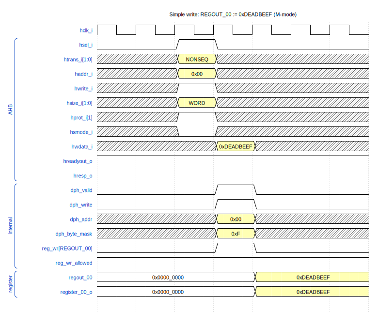
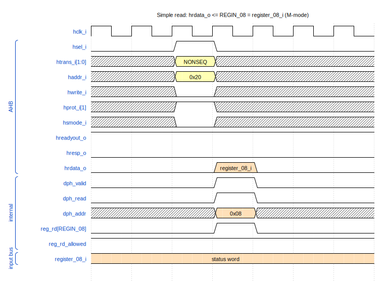
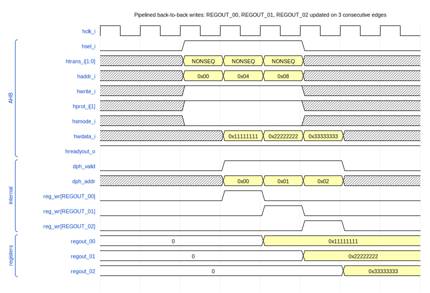
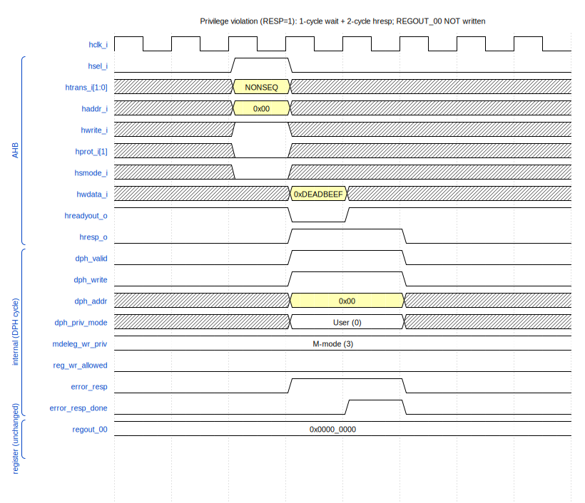

<p align="center">
  
</p>

# AHB Peripheral Example

*Reference AHB-Lite slave wiring 8 read-write + 8 read-only 32-bit
registers, with an `MDELEG` privilege-delegation register that gates
access by the master's privilege level (User / Supervisor / Machine).
Intended as a starting template for new peripherals.*

---

## Contents

- [Overview](#overview)
  - [Design parameters](#design-parameters)
  - [Register map](#register-map)
  - [`MDELEG` register layout](#mdeleg-register-layout)
  - [Privilege model](#privilege-model)
- [Architecture](#architecture)
- [Port summary](#port-summary)
- [Integration requirements](#integration-requirements)
- [Lint waivers](#lint-waivers)
- [Operation](#operation)
  - [Simple write to a RW register](#simple-write-to-a-rw-register)
  - [Simple read from a RO register](#simple-read-from-a-ro-register)
  - [Pipelined back-to-back writes](#pipelined-back-to-back-writes)
  - [Privilege violation: ERROR response](#privilege-violation-error-response)
- [Repository layout](#repository-layout)
- [Verification](#verification)
- [Synthesis](#synthesis)
- [License](#license)

---

## Overview

The **`ahb_periph_example`** module is a minimalist AHB-Lite slave used
as a reference / template for new aRVern peripherals. It exposes:

- **8 read-write 32-bit registers** (`REGOUT_00` … `REGOUT_07`) whose
  contents are driven out of the IP as `register_00_o` … `register_07_o`
  (typical use: peripheral configuration / control bits).
- **8 read-only 32-bit registers** (`REGIN_08` … `REGIN_15`) whose
  contents are sampled from `register_08_i` … `register_15_i` and
  returned over the AHB read path (typical use: status / event flags
  driven by peripheral hardware).
- **1 privilege-delegation register** (`MDELEG`) that gates RW/RO access
  by the master's current privilege level and optionally generates an
  AHB ERROR response on unauthorized accesses.

Reads complete in one cycle (DPH samples `register_XX_*` /
`regout_XX` on the cycle after the APH). Writes commit on the same DPH
cycle with byte enables derived from `hsize_i` and `haddr_i[1:0]`. The
IP never inserts wait states except for the **2-cycle ERROR response**
required by AHB-Lite when an unauthorized access is detected.

### Register map

The peripheral exposes 17 word-aligned registers in a 128-byte window
(`ADDRW = 7`, so 5-bit decoder on `haddr_i[6:2]`).

| Offset | Name        | Access | Reset      | Description                                            |
|-------:|-------------|--------|-----------:|--------------------------------------------------------|
| `0x00` | `REGOUT_00` | RW     | `0x0000_0000` | Drives `register_00_o[31:0]`                        |
| `0x04` | `REGOUT_01` | RW     | `0x0000_0000` | Drives `register_01_o[31:0]`                        |
| `0x08` | `REGOUT_02` | RW     | `0x0000_0000` | Drives `register_02_o[31:0]`                        |
| `0x0C` | `REGOUT_03` | RW     | `0x0000_0000` | Drives `register_03_o[31:0]`                        |
| `0x10` | `REGOUT_04` | RW     | `0x0000_0000` | Drives `register_04_o[31:0]`                        |
| `0x14` | `REGOUT_05` | RW     | `0x0000_0000` | Drives `register_05_o[31:0]`                        |
| `0x18` | `REGOUT_06` | RW     | `0x0000_0000` | Drives `register_06_o[31:0]`                        |
| `0x1C` | `REGOUT_07` | RW     | `0x0000_0000` | Drives `register_07_o[31:0]`                        |
| `0x20` | `REGIN_08`  | RO     | —          | Reads `register_08_i[31:0]`                          |
| `0x24` | `REGIN_09`  | RO     | —          | Reads `register_09_i[31:0]`                          |
| `0x28` | `REGIN_10`  | RO     | —          | Reads `register_10_i[31:0]`                          |
| `0x2C` | `REGIN_11`  | RO     | —          | Reads `register_11_i[31:0]`                          |
| `0x30` | `REGIN_12`  | RO     | —          | Reads `register_12_i[31:0]`                          |
| `0x34` | `REGIN_13`  | RO     | —          | Reads `register_13_i[31:0]`                          |
| `0x38` | `REGIN_14`  | RO     | —          | Reads `register_14_i[31:0]`                          |
| `0x3C` | `REGIN_15`  | RO     | —          | Reads `register_15_i[31:0]`                          |
| `0x40` | `MDELEG`    | RW (M-mode only) | `0x0000_010F` | Privilege-delegation register (see below) |

Accesses to any other offset within the 128-byte window decode to no
register: writes are silently dropped, reads return `0x0000_0000`. No
ERROR response is raised — out-of-window decoding is the integrator's
job (handled by the interconnect's address decoder + default
subordinate).

### `MDELEG` register layout

```
 31                 9    8    7              4    3       2    1       0
+--------------------+------+----------------+------------+------------+
|     reserved (0)   | RESP |  reserved (0)  |  RD_PRIV   |  WR_PRIV   |
+--------------------+------+----------------+------------+------------+
```

| Field      | Bits   | Reset | Access     | Description                                                                                                                                |
|------------|--------|-------|------------|--------------------------------------------------------------------------------------------------------------------------------------------|
| `WR_PRIV`  | `[1:0]` | `2'b11` | RW (M-mode) | Minimum privilege level allowed to write `REGOUT_*` / `REGIN_*`. `00` = User, `01` = Supervisor, `10` = *reserved*, `11` = Machine.       |
| `RD_PRIV`  | `[3:2]` | `2'b11` | RW (M-mode) | Minimum privilege level allowed to read `REGOUT_*` / `REGIN_*`. Same encoding as `WR_PRIV`.                                                |
| `RESP`     | `[8]`   | `1'b1`  | RW (M-mode) | If `1`, an unauthorized access produces a 2-cycle AHB ERROR response. If `0`, the access is silently dropped (writes ignored, reads return `0`). |
| reserved   | `[7:4]`, `[31:9]` | `0` | RO | Reads as zero; writes ignored.                                                                                                  |

**Reset defaults** (`MDELEG = 0x0000_0103`):

- `WR_PRIV = 0b11` — only **Machine mode** can write to `REGOUT_*`.
- `RD_PRIV = 0b11` — only **Machine mode** can read from `REGOUT_*` /
  `REGIN_*`.
- `RESP = 1` — generate ERROR on unauthorized accesses.

After reset, the peripheral is therefore **fully Machine-mode locked**.
M-mode firmware can relax this by writing a smaller `RD_PRIV` /
`WR_PRIV` and/or clearing `RESP`.

**`MDELEG` itself** is always RW-only-in-Machine-mode regardless of its
`WR_PRIV` / `RD_PRIV` content — there is no way for a less-privileged
master to lock M-mode out. Unauthorized accesses to `MDELEG` obey the
same `RESP` bit as other registers (ERROR when `RESP = 1`, silent drop
when `RESP = 0`).

### Privilege model

The master's privilege level for any one transfer is decoded from two
AHB control signals:

| `hprot_i[1]` (priv) | `hsmode_i` (smode) | Decoded privilege   | Internal Encoding |
|:-------------------:|:------------------:|---------------------|:--------:|
| `0`                 | `0`                | **User** mode       | `2'b00`  |
| `0`                 | `1`                | *(treated as User)* | `2'b00`  |
| `1`                 | `0`                | **Machine** mode    | `2'b11`  |
| `1`                 | `1`                | **Supervisor** mode | `2'b01`  |

({`hprot_i[1]`, `hsmode_i`}==`2'b01` is reserved and cannot be produced by the hardware.)

A transfer is authorised when its decoded privilege is **numerically
greater than or equal to** the relevant gate (`WR_PRIV` for writes,
`RD_PRIV` for reads), so the privilege ordering is
`User (0) < Supervisor (1) < Machine (3)`.

> **`hsmode_i` wiring.** The expected SoC connection is the
> `HAUSER` sideband bit of the AHB fabric (see
> [`ahb_interconnect.md`](../../ahb_interconnect/doc/ahb_interconnect.md#integration-requirements)).
> `HAUSER` is sized by `HAUSER_W`; the peripheral consumes only one
> bit. Integrators wiring this IP to a fabric without a sideband for
> the secure/supervisor mode should tie `hsmode_i = 1'b0`.

---

### Design parameters

| Parameter      | Default | Range      | Purpose                                                                                                                                                                                                                                                              |
|----------------|---------|------------|----------------------------------------------------------------------------------------------------------------------------------------------------------------------------------------------------------------------------------------------------------------------|
| `ADDRW`        | `7`     | `>= 1` (a power-of-two byte window of `1<<ADDRW`) | AHB address width; the decoded register window is `1<<ADDRW` bytes.                                                                                                                                            |
| `ASYNC_RST_EN` | `1`     | `0` or `1` | Reset architecture: `1` = asynchronous active-low reset (default); `0` = synchronous reset. Threaded to every flop via the shared `arv_ipdff` primitive. Synchronous mode requires the clock to be running during reset assertion. See the repo README's *Reset architecture* section. |

---

## Architecture

The IP is purely combinational below a handful of DPH bookkeeping
flops plus the register bank itself:

- **Address-phase detect (combinational)**
  ```
  aph_valid     = hsel_i & hready_i & htrans_i[1]
  aph_write     = aph_valid & hwrite_i
  aph_byte_mask = byte-enable decode of (hsize_i[1:0], haddr_i[1:0])
  ```
- **Data-phase bookkeeping** — `dph_valid`, `dph_write`, `dph_addr`,
  `dph_priv`, `dph_smode`, `dph_byte_mask` are registered on
  `posedge hclk_i` from the APH signals when `aph_valid`, cleared when
  the next APH is `IDLE`. These hold the access context for the cycle
  in which the read or write actually commits.
- **Privilege decode (combinational, in DPH cycle)**
  ```
  dph_machine_mode    =  dph_priv & ~dph_smode
  dph_supervisor_mode =  dph_priv &  dph_smode
  dph_privilege_mode  =  M ? 2'b11 : S ? 2'b01 : 2'b00
  reg_wr_allowed      =  dph_privilege_mode >= mdeleg_wr_priv
  reg_rd_allowed      =  dph_privilege_mode >= mdeleg_rd_priv
  ```
- **One-hot register decoder** — `reg_dec` is a `(1 << (ADDRW-2))`-bit
  one-hot mask over `dph_addr`; `reg_wr` / `reg_rd` mask it with
  `dph_write` / `dph_read`. Out-of-window accesses decode to all-zero
  (no write, no read).
- **Register bank** — each `REGOUT_*` is a 32-bit register with per-byte
  write enables (`reg_wr[REGOUT_XX] & reg_wr_allowed` ANDed with
  `dph_byte_mask`). `REGIN_*` reads come straight from
  `register_XX_i`.
- **Read mux** — a wide OR-of-ANDs gating each register output by its
  decode + `reg_rd_allowed` (or `dph_machine_mode` for `MDELEG`).
- **Clock-gate enable**
  ```
  hclk_en_o = aph_valid | dph_valid
  ```
  Combinational — drives an integrator-supplied ICG cell.
- **Error response** — a 1-bit `error_resp` is asserted combinationally
  when an unauthorized access is detected with `mdeleg_resp = 1`. A
  helper flop `error_resp_done` extends it for the second cycle of the
  AHB ERROR protocol.

---

## Port summary

| Direction | Port            | Width | Description                                                                       |
|-----------|-----------------|-------|-----------------------------------------------------------------------------------|
| in        | `hclk_i`        | 1     | Module clock (AHB clock domain)                                                   |
| in        | `hresetn_i`     | 1     | Active-low reset — **asynchronous** assertion when `ASYNC_RST_EN=1` (default), **synchronous** when `ASYNC_RST_EN=0` (sync-deassert required at IP boundary) |
| out       | `hclk_en_o`     | 1     | Clock-gate enable; drives an integrator-supplied ICG cell                         |
| in        | `haddr_i`       | 7     | AHB byte address (within the IP's 128-byte window)                                |
| in        | `hprot_i`       | 4     | Protection control. Only bit `[1]` (privileged) is consumed.                      |
| in        | `hready_i`      | 1     | Bus ready in (from the interconnect)                                              |
| in        | `hsize_i`       | 3     | Transfer size. Only bits `[1:0]` are consumed (`0` = byte, `1` = half, `2` = word). |
| in        | `hsmode_i`      | 1     | Secure / supervisor-mode bit — wire to `HAUSER` of the fabric                     |
| in        | `htrans_i`      | 2     | Transfer type. Only bit `[1]` is consumed (NONSEQ / SEQ).                         |
| in        | `hwdata_i`      | 32    | Write data (DPH-aligned)                                                          |
| in        | `hwrite_i`      | 1     | Write enable                                                                      |
| in        | `hsel_i`        | 1     | Slave select                                                                      |
| out       | `hrdata_o`      | 32    | Read data (one cycle after APH; gated by `reg_rd_allowed`)                        |
| out       | `hreadyout_o`   | 1     | Bus ready out (held low for one cycle during an ERROR response)                   |
| out       | `hresp_o`       | 1     | Transfer response — asserted (2 cycles) on MDELEG access-control violation        |
| out       | `register_00_o` … `register_07_o` | 32 each | RW register outputs (drive peripheral hardware)            |
| in        | `register_08_i` … `register_15_i` | 32 each | RO register inputs (sample peripheral hardware)             |

The `htrans[0]`, `hsize[2]`, `hprot[0]`, and `hprot[3:2]` bits are
tied off internally to `*_unused` sink wires (see
[Lint waivers](#lint-waivers)).

**Parameters / localparams.** `ADDRW = 7` (sets the 128-byte AHB
window), `DEC_WD = ADDRW - 2 = 5` (32-word decoder). These are
local — re-targeting the IP at a different window size requires
adjusting both.

---

## Integration requirements

- **Reset (`hresetn_i`)** — active-low, async-asserted. The assertion
  style follows `ASYNC_RST_EN` (`1` = asynchronous, default; `0` =
  synchronous). De-assertion **must be synchronised to `hclk_i`** by the
  integrator. The IP contains no internal reset synchroniser.

- **Clock gating (`hclk_en_o` → `hclk_i`)** — `hclk_en_o` is a
  **combinational** enable; it must drive a latch-based ICG cell at
  the SoC integration boundary. It asserts whenever there is an APH or
  a pending DPH.

- **`hsmode_i` wiring** — connect to one bit of the fabric's `HAUSER`
  sideband (the bit conventionally carrying the secure / supervisor
  mode flag). Tie to `1'b0` if the fabric has no equivalent sideband
  — the peripheral will then only see User / Machine modes.

- **Address window** — the peripheral assumes the integrator's address
  decoder presents accesses with `haddr_i[ADDRW-1:0]` aligned to the
  start of its 128-byte window. Upper address bits are not consumed.
  Accesses to undefined offsets within the window are dropped silently
  (no ERROR).

- **Reset defaults are M-mode-locked** — after reset, only Machine-mode
  masters can access any register. M-mode firmware must reprogram
  `MDELEG` before lower-privilege code can use the peripheral. This is
  the safe default; if your integration wants the peripheral
  pre-opened, change the `mdeleg_wr_priv` / `mdeleg_rd_priv` /
  `mdeleg_resp` reset values in the RTL.

- **Misaligned accesses** — the byte-mask decoder assumes the master
  presented an aligned transfer (i.e. `haddr[1:0]` consistent with
  `hsize`). Misaligned accesses are not checked here; they are
  expected to be caught upstream (CPU alignment exception).

---

## Lint waivers

Same `_unused` postfix convention as the rest of the aRVern IP family.
This IP ties off the following inputs whose bits are not consumed by
the access logic:

| Tie-off              | Reason                                                           |
|----------------------|------------------------------------------------------------------|
| `htrans0_unused`     | Only `htrans[1]` distinguishes NONSEQ/SEQ from IDLE/BUSY for APH gating; `htrans[0]` would only distinguish NONSEQ vs SEQ, which is irrelevant for a register file. |
| `hsize2_unused`      | `hsize[2]` would extend transfers to 64 bits or wider — out of scope for a 32-bit register file. |
| `hprot3_2_unused`    | Cacheable / bufferable bits — irrelevant for a strongly-ordered peripheral. |
| `hprot0_unused`      | Data/opcode bit — register access is never an instruction fetch. |

See
[`arv_custom_csr.md`](../../arv_custom_csr/doc/arv_custom_csr.md#lint-waivers)
for the per-tool waiver recipes (Verilator, SpyGlass, HAL).

---

## Operation

All transfers use the standard AHB 2-phase pipeline: address-phase
(APH) on cycle N, data-phase (DPH) on cycle N+1. In the waveforms
below, write transfers use yellow, read transfers use orange, and the
ERROR response uses blue.

### Simple write to a RW register

A non-pipelined word write to `REGOUT_00` (offset `0x00`) from a
Machine-mode master. The APH in cycle 2 latches the address and
byte-enables into `dph_*`; on cycle 3 the byte mask is all-ones (word
write) and `regout_00_nxt` is driven from `hwdata_i = 0xDEADBEEF`. The
new value reaches `register_00_o` on the cycle 3 → 4 edge.



### Simple read from a RO register

A non-pipelined word read from `REGIN_08` (offset `0x20`). The APH in
cycle 2 captures `dph_addr = 0x08`; on cycle 3 the one-hot decoder
asserts `reg_rd[REGIN_08]`, and the OR-mux returns `register_08_i`
directly on `hrdata_o`.



### Pipelined back-to-back writes

Three consecutive NONSEQ writes — `REGOUT_00 = 0x11111111`,
`REGOUT_01 = 0x22222222`, `REGOUT_02 = 0x33333333` — issued in
back-to-back APH cycles. Each cycle is simultaneously the APH of one
transfer and the DPH of the previous one. `hreadyout_o` stays high
throughout (no wait states); the three RW registers update on three
consecutive `hclk_i` edges.



### Privilege violation: ERROR response

A User-mode master (`hprot_i[1] = 0`) attempts to write `REGOUT_00`
while `MDELEG.WR_PRIV = 0b11` (Machine-only) and `MDELEG.RESP = 1`.
The DPH cycle detects `~reg_wr_allowed`; the IP drops `hreadyout_o`
and asserts `hresp_o` for one cycle, then re-asserts `hreadyout_o`
with `hresp_o` still high on the next cycle. The master samples
`hresp` on the second cycle and aborts its burst; `regout_00` is
**not** updated.



When `MDELEG.RESP = 0`, the same unauthorized access is **silently
dropped** instead: `hreadyout_o` stays high, `hresp_o` stays low, the
write is masked off (`regout_XX_wr` is gated by `reg_wr_allowed`), and
reads return `0` (the read mux's per-register AND with
`reg_rd_allowed` zeroes the contribution before the OR).

---

## Repository layout

```
ahb_periph_example/
├── rtl/verilog/
│   ├── ahb_periph_example.v  Peripheral RTL (register bank + MDELEG + access control)
│   └── filelist.f            RTL source list (consumed by both sim & synth)
├── bench/verilog/
│   ├── tb_ahb_periph_example.v Top-level testbench
│   ├── ahb_tasks.v             Reusable AHB read / write tasks
│   └── timescale.v
├── sim/rtl_sim/
│   ├── src/                  Per-test stimulus files (.v) + submit.f
│   ├── run/                  Run wrappers (run, run_all, run_lint)
│   └── bin/                  Sim runner + log parsers
├── synthesis/synopsys/
│   ├── synthesis.tcl         Top-level Design Compiler flow
│   ├── library.tcl           Tech-library selection via LIB_FLAVOR
│   ├── read.tcl
│   ├── constraints.tcl
│   ├── run_syn, run_syn_d    Synthesis launchers (host / dockerised)
│   └── libraries/            setup_*.tcl per technology + .db symlinks
└── doc/
    ├── ahb_periph_example.md This document
    └── img/                  WaveDrom JSON sources + rendered SVG + render.py
```

---

## Verification

The verification flow uses **Verilator** for linting and **Icarus
Verilog** (default) for simulation.

### Lint

```bash
cd sim/rtl_sim/run
./run_lint
```

### Run a single test

```bash
cd sim/rtl_sim/run
./run                       # default test: simple_rdwr
./run mdeleg_w_error        # any test under sim/rtl_sim/src/<name>.v
```

### Run the full regression

```bash
cd sim/rtl_sim/run
./run_all                   # all tests, one iteration
./run_all 5                 # all tests, 5 iterations (different random seeds)
```

### Test suite

| Test               | Coverage |
|--------------------|----------|
| `simple_rdwr`      | Non-pipelined word / half-word / byte reads and writes to `REGOUT_*` and `REGIN_*`. Verifies basic 1-cycle latency, byte-enable generation from `hsize_i` + `haddr_i[1:0]`, and that read-back of just-written `REGOUT` values matches. Runs in Machine mode (no privilege gating). |
| `pipelined_rdwr`   | Back-to-back NONSEQ reads (peak throughput) and back-to-back writes. Verifies that the AHB pipeline correctly hands data one cycle after each APH and that `hreadyout_o` stays high across pipelined transfers. |
| `mdeleg_w_error`   | Privilege-delegation under `MDELEG.RESP = 1`. Drives accesses from User, Supervisor and Machine modes at each setting of `WR_PRIV` / `RD_PRIV`; checks that unauthorized accesses produce the 2-cycle ERROR sequence and that authorized accesses succeed. Also covers attempts to write `MDELEG` itself from non-Machine modes. |
| `mdeleg_wo_error`  | Same privilege matrix as `mdeleg_w_error` but with `MDELEG.RESP = 0`. Checks that unauthorized writes are silently dropped (RW registers unchanged) and unauthorized reads return `0x0000_0000`, with `hreadyout_o = 1` and `hresp_o = 0` throughout. |

A test passes when its log contains `SIMULATION PASSED`. `run_all`
aggregates results into `log/<iter>/summary.<iter>.log`; the detailed
report includes a replay command (`runsim -seed <N>`) per test.

---

## Synthesis

The Design Compiler flow lives under `synthesis/synopsys/` and uses
the standard `LIB_FLAVOR` env-var mechanism shared by the rest of the
aRVern IP family.

```bash
cd synthesis/synopsys
./run_syn                          # default flavor (lib_default)
./run_syn -lib <flavor>            # synthesise with a specific library flavor
./run_syn -lib <flavor> -i         # interactive (keep dc_shell open after run)
./run_syn_d -lib <flavor>          # same, inside the dockerised DC image
```

Available `<flavor>` values are derived from `setup_*.tcl` files
under `synthesis/synopsys/libraries/` — running `./run_syn` with an
unknown flavor prints the full list.

Outputs land in `synthesis/synopsys/results/`:

| File                                | Description                                  |
|-------------------------------------|----------------------------------------------|
| `ahb_periph_example.gate.v`         | Gate-level netlist                           |
| `ahb_periph_example.ddc`            | Synopsys DDC database                        |
| `ahb_periph_example.spf`            | DFT scan test protocol (when DFT enabled)    |
| `report.area`, `report.full_area`   | Area summary (incl. NAND2-equivalent)        |
| `report.timing`, `report.paths.*`   | Timing and worst-path reports                |
| `report.constraints`                | Constraint compliance                        |
| `report.dft_*`                      | DFT DRC, coverage, scan-chain configuration  |
| `synthesis.log`                     | Full dc_shell transcript                     |

---

## License

BSD 3-Clause — see [`LICENSE`](../../LICENSE) at the repo root.
