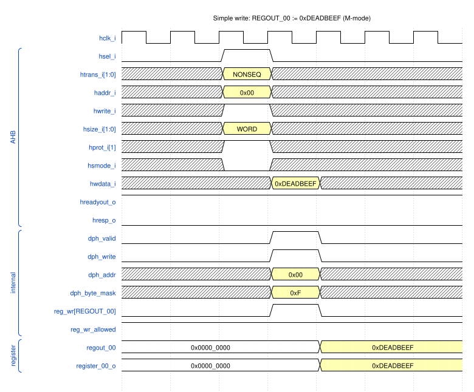
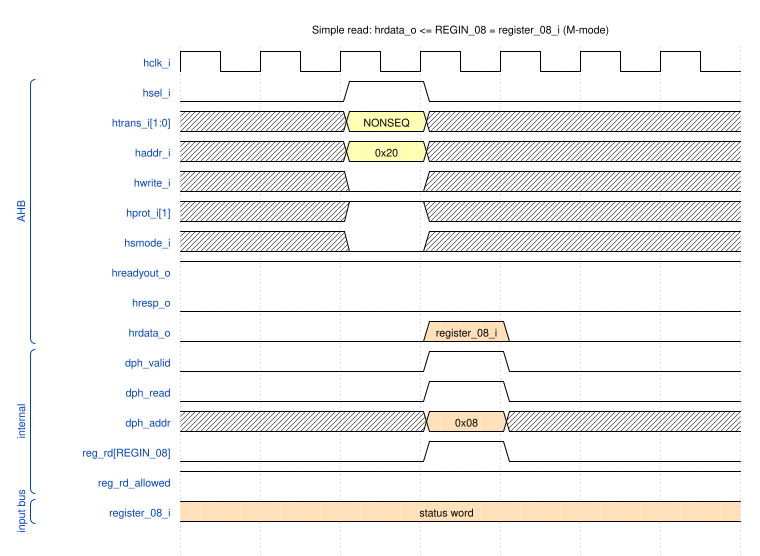
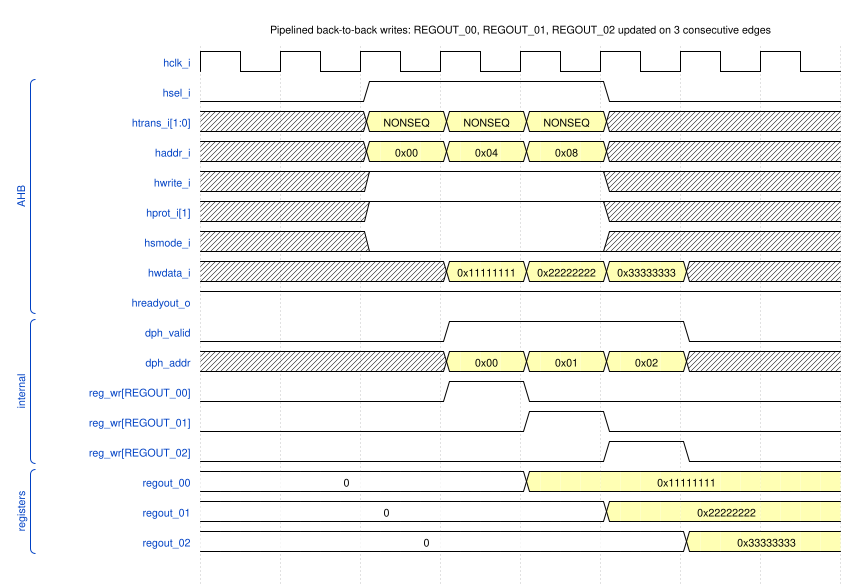
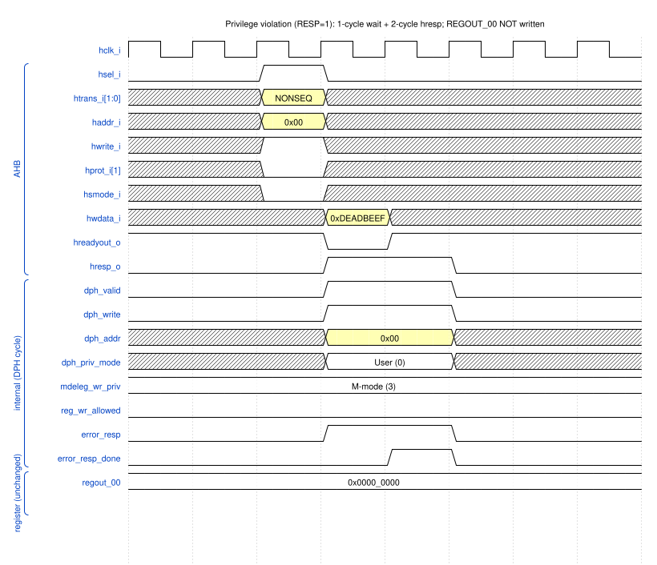

<p align="center">
  
</p>

# AHB Peripheral Example

*Reference AHB-Lite subordinate wiring 8 read-write + 8 read-only 32-bit
registers, with an `MDELEG` privilege-delegation register that gates
access by the manager's privilege level (User / Supervisor / Machine).
Intended as a starting template for new peripherals.*

---

## Contents

- [Overview](#overview)
  - [Design parameters](#design-parameters)
  - [Register map](#register-map)
  - [`MDELEG` register layout](#mdeleg-register-layout)
  - [Privilege model](#privilege-model)
  - [Access outcomes](#access-outcomes)
- [Architecture](#architecture)
  - [Family rules and this example's choices](#family-rules-and-this-examples-choices)
  - [Datapath](#datapath)
  - [Extending the register map](#extending-the-register-map)
- [Port summary](#port-summary)
- [Integration requirements](#integration-requirements)
- [Lint waivers](#lint-waivers)
- [Operation](#operation)
  - [Simple write to a RW register](#simple-write-to-a-rw-register)
  - [Simple read from a RO register](#simple-read-from-a-ro-register)
  - [Pipelined back-to-back writes](#pipelined-back-to-back-writes)
  - [Privilege violation: ERROR response](#privilege-violation-error-response)
- [Repository layout](#repository-layout)
- [Verification](#verification)
- [Synthesis](#synthesis)
- [License](#license)

---

## Overview

The **`ahb_periph_example`** module is a minimalist AHB-Lite subordinate
(the AHB-Lite term for a slave; the CPU side is the manager) used as a
reference / template for new aRVern peripherals. It exposes:

- **8 read-write 32-bit registers** (`REGOUT_00` … `REGOUT_07`) whose
  contents are driven out of the IP as `register_00_o` … `register_07_o`
  (typical use: peripheral configuration / control bits).
- **8 read-only 32-bit registers** (`REGIN_08` … `REGIN_15`) whose
  contents are read combinationally from `register_08_i` …
  `register_15_i` onto the AHB read path — there is no sampling flop, see
  [Integration requirements](#integration-requirements) (typical use:
  status / event flags driven by peripheral hardware).
- **1 privilege-delegation register** (`MDELEG`) that gates RW/RO access
  by the manager's current privilege level and optionally generates an
  AHB ERROR response on unauthorized accesses.

All transfers use the AHB two-phase pipeline: address phase (APH) on
cycle N, data phase (DPH) on cycle N+1. Reads complete in one cycle:
`hrdata_o` is driven combinationally in the data phase from `regout_XX`
or `register_XX_i`. Writes commit at the end of the same data-phase cycle
with byte enables derived from `hsize_i` and `haddr_i[1:0]`. The IP never
inserts wait states except for the **2-cycle ERROR response** required by
AHB-Lite when an unauthorized access is detected.

### Design parameters

| Parameter      | Default | Range      | Purpose |
|----------------|---------|------------|---------|
| `ADDRW`        | `7`     | `>= 7`     | AHB address width; the decoded register window is `1<<ADDRW` bytes. Below 7 the `MDELEG` offset (`0x40`) would truncate onto `REGOUT_00`. A simulation build with `ADDRW < 7` stops at elaboration (`$fatal` in the `CHECK_ADDRW` generate block, which sits under `translate_off`), and Verilator lint reports the truncated `MDELEG` offset (WIDTHTRUNC); synthesis does not check it. |
| `ASYNC_RST_EN` | `1`     | `0` or `1` | Reset style: `1` = asynchronous active-low reset (default); `0` = synchronous reset. Threaded to every flop through the shared `arv_ipdff` primitive (see the repository README's [Reset architecture](../../README.md#reset-architecture)). The reset contract is in [Integration requirements](#integration-requirements). |

### Register map

The peripheral exposes 17 word-aligned registers in a window of `1<<ADDRW`
bytes: 128 bytes at the default `ADDRW = 7`, which is also the minimum,
since `MDELEG` sits at offset `0x40`.

| Offset | Name        | Access | Reset      | Description                                            |
|-------:|-------------|--------|-----------:|--------------------------------------------------------|
| `0x00` | `REGOUT_00` | RW     | `0x0000_0000` | Drives `register_00_o[31:0]`                        |
| `0x04` | `REGOUT_01` | RW     | `0x0000_0000` | Drives `register_01_o[31:0]`                        |
| `0x08` | `REGOUT_02` | RW     | `0x0000_0000` | Drives `register_02_o[31:0]`                        |
| `0x0C` | `REGOUT_03` | RW     | `0x0000_0000` | Drives `register_03_o[31:0]`                        |
| `0x10` | `REGOUT_04` | RW     | `0x0000_0000` | Drives `register_04_o[31:0]`                        |
| `0x14` | `REGOUT_05` | RW     | `0x0000_0000` | Drives `register_05_o[31:0]`                        |
| `0x18` | `REGOUT_06` | RW     | `0x0000_0000` | Drives `register_06_o[31:0]`                        |
| `0x1C` | `REGOUT_07` | RW     | `0x0000_0000` | Drives `register_07_o[31:0]`                        |
| `0x20` | `REGIN_08`  | RO     | —          | Reads `register_08_i[31:0]`                          |
| `0x24` | `REGIN_09`  | RO     | —          | Reads `register_09_i[31:0]`                          |
| `0x28` | `REGIN_10`  | RO     | —          | Reads `register_10_i[31:0]`                          |
| `0x2C` | `REGIN_11`  | RO     | —          | Reads `register_11_i[31:0]`                          |
| `0x30` | `REGIN_12`  | RO     | —          | Reads `register_12_i[31:0]`                          |
| `0x34` | `REGIN_13`  | RO     | —          | Reads `register_13_i[31:0]`                          |
| `0x38` | `REGIN_14`  | RO     | —          | Reads `register_14_i[31:0]`                          |
| `0x3C` | `REGIN_15`  | RO     | —          | Reads `register_15_i[31:0]`                          |
| `0x40` | `MDELEG`    | RW (M-mode only) | `0x0000_010F` | Privilege-delegation register (see below) |

Offsets above `MDELEG` are unmapped. What every class of access returns —
admitted or denied, mapped or not — is the table in
[Access outcomes](#access-outcomes). Decoding addresses outside the window
is the integrator's job (the interconnect's address decoder and default
subordinate).

### `MDELEG` register layout

```
 31                 9    8    7              4    3       2    1       0
+--------------------+------+----------------+------------+------------+
|     reserved (0)   | RESP |  reserved (0)  |  RD_PRIV   |  WR_PRIV   |
+--------------------+------+----------------+------------+------------+
```

| Field      | Bits   | Reset | Access     | Description |
|------------|--------|-------|------------|-------------|
| `WR_PRIV`  | `[1:0]` | `2'b11` | RW (M-mode) | Minimum privilege level for a write to be admitted (at any offset but `MDELEG`). `00` = User, `01` = Supervisor, `10` = *reserved*, `11` = Machine. |
| `RD_PRIV`  | `[3:2]` | `2'b11` | RW (M-mode) | Minimum privilege level for a read to be admitted (at any offset but `MDELEG`). Same encoding as `WR_PRIV`. |
| `RESP`     | `[8]`   | `1'b1`  | RW (M-mode) | If `1`, a denied access produces a 2-cycle AHB ERROR response, at any offset in the window. If `0`, it is silently dropped (writes ignored, reads return `0`). |
| reserved   | `[7:4]`, `[31:9]` | `0` | RO | Reads as zero; writes ignored. |

**Reset defaults** (`MDELEG = 0x0000_010F`):

- `WR_PRIV = 0b11` — only **Machine mode** can write to `REGOUT_*`.
- `RD_PRIV = 0b11` — only **Machine mode** can read from `REGOUT_*` /
  `REGIN_*`.
- `RESP = 1` — generate ERROR on unauthorized accesses.

After reset, the peripheral is therefore **fully Machine-mode locked**.
M-mode firmware can relax this by writing a smaller `RD_PRIV` /
`WR_PRIV` and/or clearing `RESP`.

**Writing `MDELEG`.** A field written with the reserved code `2'b10`
stores `2'b11` and reads back `2'b11`. Sub-word writes are byte-lane
qualified: a byte write to offset `0x40` updates `WR_PRIV` and `RD_PRIV`
together, a byte write to `0x41` updates only `RESP`. A write is in force
for the very next transfer.

**`MDELEG` itself** is always RW-only-in-Machine-mode regardless of its
`WR_PRIV` / `RD_PRIV` content — there is no way for a less-privileged
manager to lock M-mode out. Unauthorized accesses to `MDELEG` obey the
same `RESP` bit as other registers (ERROR when `RESP = 1`, silent drop
when `RESP = 0`).

**What the ERROR does to the manager.** On an aRVern hart a data-bus
ERROR is delivered as a resumable NMI (`mncause = 0x80000003`, faulting
address in `marv_eaddr`), never as a load/store access fault (`mcause`
5/7) — those come from the core's PMP only (core
[`memory_and_ahb.md`](https://github.com/Arvern-Silicon/arvern/blob/main/doc/memory_and_ahb.md),
section 7).

### Privilege model

The manager's privilege level for any one transfer is decoded from two
AHB control signals:

| `hprot_i[1]` (priv) | `hsmode_i` (smode) | Decoded privilege   | Internal Encoding |
|:-------------------:|:------------------:|---------------------|:--------:|
| `0`                 | `0`                | **User** mode       | `2'b00`  |
| `0`                 | `1`                | **User** mode (`hsmode_i` is ignored when `hprot_i[1] = 0`) | `2'b00`  |
| `1`                 | `0`                | **Machine** mode    | `2'b11`  |
| `1`                 | `1`                | **Supervisor** mode | `2'b01`  |

The internal encoding `2'b10` is reserved: no bus encoding produces it,
and a gate written with it is stored as Machine-only.

A transfer is admitted when its decoded privilege is **numerically
greater than or equal to** the relevant gate (`WR_PRIV` for writes,
`RD_PRIV` for reads), so the privilege ordering is
`User (0) < Supervisor (1) < Machine (3)`. `MDELEG` itself is admitted in
Machine mode only. `hsmode_i` comes from the fabric's `HAUSER` sideband;
the wiring is in [Integration requirements](#integration-requirements).

### Access outcomes

A **denied** access is one whose privilege is below the gate (`WR_PRIV`
for a write, `RD_PRIV` for a read) or, at `MDELEG`, one from any mode but
Machine. Denial is decided before the address is decoded, so a manager
below the gate gets the same answer at every offset in the window —
unmapped and read-only included — and cannot probe the register map.
Every response is OKAY with no wait state except the ERROR, which is the
AHB-Lite two-cycle sequence.

| Offset | Admitted write | Admitted read | Denied, `RESP = 1` | Denied, `RESP = 0` |
|---|---|---|---|---|
| `REGOUT_*` | Stored, on the byte lanes selected by `hsize_i` / `haddr_i[1:0]` | Register value | Two-cycle ERROR; nothing stored; `hrdata_o = 0` | OKAY; nothing stored; `hrdata_o = 0` |
| `REGIN_*` | No-op (read-only) | `register_XX_i` | Two-cycle ERROR; `hrdata_o = 0` | OKAY; `hrdata_o = 0` |
| `MDELEG` (Machine mode only) | Fields updated as described above | `MDELEG` value | Two-cycle ERROR; nothing stored; `hrdata_o = 0` | OKAY; nothing stored; `hrdata_o = 0` |
| Unmapped (above `0x40`) | No-op | `0x0000_0000` | Two-cycle ERROR; `hrdata_o = 0` | OKAY; `hrdata_o = 0` |

---

## Architecture

### Family rules and this example's choices

A new peripheral copied from this IP keeps the structures in the left
column; they are what every aRVern IP shares and what the family's lint
flows and waivers assume. The right column is this example's content.

| Family rule (keep when copying) | This example's choice |
|---|---|
| Every flop is an `arv_ipdff` instance with `.ARST_EN(ASYNC_RST_EN)`; no module writes its own reset block. Next-state is a `_nxt` wire into `.d_i`, the load condition into `.en_i`. | 8 RW (`REGOUT_*`) + 8 RO (`REGIN_*`) 32-bit registers. |
| The address phase is taken only with `hsel_i & hready_i & htrans_i[1]`; data-phase state holds while `hready_i = 0`. | `MDELEG` at offset `0x40`, hence the 128-byte minimum window. |
| `hclk_en_o = aph_valid \| dph_valid`, combinational, for an external ICG cell. | The `MDELEG` bit layout (`WR_PRIV`, `RD_PRIV`, `RESP`). |
| The ERROR shape: a combinational error term over the held data-phase state plus one `done` flop; `hreadyout_o = ~(error & ~done)`, `hresp_o = error`. | Word-offset localparams and a one-hot decoder sized to the window. |
| Privilege is `{hprot_i[1], hsmode_i}` decoded to `11 / 01 / 00` and compared `>=` against the gate; the control register is M-only; denial applies at every offset; a denied read returns 0. | |
| Every unconsumed input bit and dead strobe is sunk into a `_unused` wire; the file is bracketed by `` `default_nettype none `` … `` `default_nettype wire ``. | |

### Datapath

The IP is purely combinational below a handful of data-phase bookkeeping
flops plus the register bank itself:

- **Address-phase detect (combinational)**
  ```
  aph_valid     = hsel_i & hready_i & htrans_i[1]
  aph_write     = aph_valid & hwrite_i
  aph_byte_mask = byte-enable decode of (hsize_i[1:0], haddr_i[1:0])
  ```
- **Data-phase bookkeeping** — `dph_valid`, `dph_write`, `dph_addr`,
  `dph_priv`, `dph_smode`, `dph_byte_mask` are loaded on `posedge hclk_i`
  from the address-phase signals when `aph_valid`, cleared on any cycle
  with `hready_i = 1` and no valid address phase (IDLE, BUSY or
  `hsel_i = 0`), and held while `hready_i = 0` — the first ERROR cycle, so
  the second cycle re-evaluates the same access. They hold the access
  context for the cycle in which the read or write commits.
- **Privilege decode (combinational, in the data-phase cycle)**
  ```
  dph_machine_mode    =  dph_priv & ~dph_smode
  dph_supervisor_mode =  dph_priv &  dph_smode
  dph_privilege_mode  =  M ? 2'b11 : S ? 2'b01 : 2'b00
  reg_wr_allowed      =  dph_privilege_mode >= mdeleg_wr_priv
  reg_rd_allowed      =  dph_privilege_mode >= mdeleg_rd_priv
  ```
- **One-hot register decoder** — `reg_dec` is a `(1 << (ADDRW-2))`-bit
  one-hot mask over `dph_addr`; `reg_wr` / `reg_rd` mask it with
  `dph_write` / `dph_read`. Unmapped offsets within the window (the slots
  above `MDELEG`) decode to all-zero: no write strobe, no read term.
- **Register bank** — each `REGOUT_*` is a 32-bit register with per-byte
  write enables (`reg_wr[REGOUT_XX] & reg_wr_allowed` ANDed with
  `dph_byte_mask`). `REGIN_*` reads come straight from
  `register_XX_i`.
- **Read mux** — a wide OR-of-ANDs gating each register output by its
  decode + `reg_rd_allowed` (or `dph_machine_mode` for `MDELEG`).
- **Clock-gate enable**
  ```
  hclk_en_o = aph_valid | dph_valid
  ```
  Combinational — drives an integrator-supplied integrated clock-gating
  (ICG) cell.
- **Error response** — `error_resp` is combinational from the held
  data-phase state (a denied access with `mdeleg_resp = 1`) and stays
  high for both cycles; the flop `error_resp_done` marks the second
  cycle, in which `hreadyout_o` returns high while `hresp_o` stays high.
  This is the ERROR shape a peripheral author copies.

### Extending the register map

To add a register: add its word-offset localparam and `_D` one-hot mask,
its term in the `reg_dec` decoder, its write enable (RW) or read term
(RO), and keep the `reg_dec_unused` slice starting at the first unused
slot. A register placed above `MDELEG` raises the minimum `ADDRW` and the
bound in the `CHECK_ADDRW` guard.

---

## Port summary

| Direction | Port            | Width | Description |
|-----------|-----------------|-------|-------------|
| in        | `hclk_i`        | 1     | Module clock (AHB clock domain) |
| in        | `hresetn_i`     | 1     | Active-low reset; assertion style per `ASYNC_RST_EN`, contract in [Integration requirements](#integration-requirements) |
| out       | `hclk_en_o`     | 1     | Clock-gate enable; drives an integrator-supplied ICG cell |
| in        | `haddr_i`       | `ADDRW` | Byte offset within the IP's `1<<ADDRW`-byte window (128 bytes at the default) |
| in        | `hprot_i`       | 4     | Protection control. Only bit `[1]` (privileged) is consumed. |
| in        | `hready_i`      | 1     | Bus ready in (from the interconnect) |
| in        | `hsize_i`       | 3     | Transfer size. Only bits `[1:0]` are consumed (`0` = byte, `1` = half, `2` = word); larger encodings in [Integration requirements](#integration-requirements). |
| in        | `hsmode_i`      | 1     | Secure / supervisor-mode bit — wire to `HAUSER` of the fabric |
| in        | `htrans_i`      | 2     | Transfer type. Only bit `[1]` is consumed (NONSEQ / SEQ). |
| in        | `hwdata_i`      | 32    | Write data (data-phase aligned) |
| in        | `hwrite_i`      | 1     | Write enable |
| in        | `hsel_i`        | 1     | Subordinate select |
| out       | `hrdata_o`      | 32    | Read data (data phase, one cycle after the address phase; gated by `reg_rd_allowed`) |
| out       | `hreadyout_o`   | 1     | Bus ready out (held low for one cycle during an ERROR response) |
| out       | `hresp_o`       | 1     | Transfer response — asserted (2 cycles) on an `MDELEG` access-control violation |
| out       | `register_00_o` … `register_07_o` | 32 each | RW register outputs (drive peripheral hardware) |
| in        | `register_08_i` … `register_15_i` | 32 each | RO register inputs, read combinationally in the data phase; must be `hclk_i`-synchronous |

The `htrans[0]`, `hsize[2]`, `hprot[0]`, and `hprot[3:2]` bits are
tied off internally to `*_unused` sink wires (see
[Lint waivers](#lint-waivers)).

---

## Integration requirements

- **Reset (`hresetn_i`)** — active-low. With `ASYNC_RST_EN = 1`
  (default) assertion takes effect immediately, no clock needed. With
  `ASYNC_RST_EN = 0` it is sampled on a rising `hclk_i` edge, so the
  minimum assertion is one rising edge with the clock passing (see clock
  gating below). From that point `hreadyout_o` is high and `hresp_o` low,
  whatever transfer the reset interrupted, and every register holds its
  reset value. De-assertion **must be synchronised to `hclk_i`** by the
  integrator; the IP contains no reset synchroniser.

- **Clock gating (`hclk_en_o` → `hclk_i`)** — `hclk_en_o` is a
  **combinational** enable, high in the address phase of a transfer
  selecting this IP and while a data phase (ERROR cycles included) is in
  flight. It must reach a latch-based ICG cell at the SoC integration
  boundary un-registered: a flopped enable would deliver the first clock
  edge one cycle late and lose the transfer. It does not request the
  clock during reset: the integrator keeps every clock enabled while
  reset is asserted (in the ICG enable, e.g. `hclk_en_o | ~hresetn_i`,
  as the bench does). With `ASYNC_RST_EN = 0` this is what lets the flops
  reach their reset values. The IP is equally correct on a free-running
  clock.

- **`hready_i`** — connect to the bus `hready`, which during this IP's own
  data phase equals its `hreadyout_o` (the AHB-Lite rule). Never tie it
  high: a transfer issued while another subordinate stalls the bus would
  be taken as accepted, and the first ERROR cycle would not hold the
  data-phase state.

- **`register_08_i` … `register_15_i`** — combinational into `hrdata_o`,
  so they must be synchronous to `hclk_i`. Synchronise any other source
  before it reaches these inputs; the IP cannot do it, its clock is
  gated while idle.

- **`hsmode_i` wiring** — connect to one bit of the fabric's `HAUSER`
  sideband, the bit conventionally carrying the secure / supervisor
  mode flag (see
  [`ahb_interconnect.md`](../../ahb_interconnect/doc/ahb_interconnect.md#integration-requirements);
  `HAUSER` is `HAUSER_W` bits wide, the peripheral consumes one). Tie to
  `1'b0` if the fabric has no equivalent sideband — the peripheral will
  then only see User / Machine modes.

- **Address window** — the peripheral assumes the integrator's address
  decoder presents accesses with `haddr_i[ADDRW-1:0]` aligned to the
  start of its `1<<ADDRW`-byte window. Upper address bits are not
  consumed. What an access to an unmapped offset returns is in
  [Access outcomes](#access-outcomes).

- **Reset defaults are M-mode-locked** — after reset, only Machine-mode
  managers can access any register. M-mode firmware must reprogram
  `MDELEG` before lower-privilege code can use the peripheral. This is
  the safe default; if your integration wants the peripheral
  pre-opened, change the `MDELEG_WR_PRIV_RST` / `MDELEG_RD_PRIV_RST` /
  `MDELEG_RESP_RST` localparams in the RTL.

- **Misaligned accesses** — the byte-mask decoder assumes the manager
  presented an aligned transfer (i.e. `haddr[1:0]` consistent with
  `hsize`). Misaligned accesses are not checked here; they are
  expected to be caught upstream (CPU alignment exception).

- **Transfer sizes above a word** — a 32-bit subordinate may not be sent
  one (AHB-Lite). Only `hsize_i[1:0]` is decoded: `3'b011` selects no byte
  lane, so a write stores nothing and a read returns the word, both with
  an OKAY response; `3'b100`–`3'b110` behave as byte, half-word and word.

---

## Lint waivers

Same `_unused` postfix convention as the rest of the aRVern IP family:
every deliberately unconsumed signal is sunk into a wire whose name ends
in `_unused`, and the lint flows exempt those by name.

| Sink wire            | What it absorbs and why |
|----------------------|-------------------------|
| `htrans0_unused`     | `htrans_i[0]`: only `htrans[1]` distinguishes NONSEQ/SEQ from IDLE/BUSY for address-phase gating; NONSEQ vs SEQ is irrelevant for a register file. |
| `hsize2_unused`      | `hsize_i[2]`: would extend transfers to 64 bits or wider — out of scope for a 32-bit register file. |
| `hprot3_2_unused`    | `hprot_i[3:2]`: cacheable / bufferable bits — irrelevant for a strongly-ordered peripheral. |
| `hprot0_unused`      | `hprot_i[0]`: data/opcode bit — register access is never an instruction fetch. |
| `reg_dec_unused`     | The decoder's dead strobes: the slots above `MDELEG` (the decoder is sized to the window, not to the register count) and the write strobes of the read-only `REGIN_*` bank. |

Verilator exempts signals matching its `--unused-regexp` (default
`*unused*`) on its own, so `sim/rtl_sim/run/waivers.vlt` carries no
entry for this IP; the VC Static flow waives them by name in
`lint/vc_static/waivers.tcl` (`waive_hdl … -filter {Signal=~*_unused*}`).
See
[`arv_custom_csr.md`](../../arv_custom_csr/doc/arv_custom_csr.md#lint-waivers)
for the per-tool waiver recipes (Verilator, SpyGlass, HAL).

---

## Operation

In the waveforms below, write transfers use yellow and read transfers
orange; the ERROR response is read on `hreadyout_o` / `hresp_o`.

### Simple write to a RW register

A non-pipelined word write to `REGOUT_00` (offset `0x00`) from a
Machine-mode manager. The address phase in cycle 2 latches the address
and byte-enables into `dph_*`; on cycle 3 the byte mask is all-ones (word
write) and `regout_00_nxt` is driven from `hwdata_i = 0xDEADBEEF`. The
new value reaches `register_00_o` on the cycle 3 → 4 edge.



### Simple read from a RO register

A non-pipelined word read from `REGIN_08` (offset `0x20`). The address
phase in cycle 2 captures `dph_addr = 0x08`; on cycle 3 the one-hot
decoder asserts `reg_rd[REGIN_08]`, and the OR-mux returns
`register_08_i` directly on `hrdata_o`.



### Pipelined back-to-back writes

Three consecutive NONSEQ writes — `REGOUT_00 = 0x11111111`,
`REGOUT_01 = 0x22222222`, `REGOUT_02 = 0x33333333` — issued in
back-to-back address-phase cycles. Each cycle is simultaneously the
address phase of one transfer and the data phase of the previous one.
`hreadyout_o` stays high throughout (no wait states); the three RW
registers update on three consecutive `hclk_i` edges.



### Privilege violation: ERROR response

A User-mode manager (`hprot_i[1] = 0`) attempts to write `REGOUT_00`
while `MDELEG.WR_PRIV = 0b11` (Machine-only) and `MDELEG.RESP = 1`.
The data-phase cycle detects `~reg_wr_allowed`; the IP drops
`hreadyout_o` and asserts `hresp_o` for one cycle, then re-asserts
`hreadyout_o` with `hresp_o` still high on the next cycle. The manager
sees `hresp_o` high with `hreadyout_o` low in the first cycle and high in
the second; it may cancel or continue its transfers — an address phase
held through the response is taken in the second cycle. `regout_00` is
**not** updated.



When `MDELEG.RESP = 0`, the same unauthorized access is **silently
dropped** instead: `hreadyout_o` stays high, `hresp_o` stays low, the
write is masked off (`regout_XX_wr` is gated by `reg_wr_allowed`), and
reads return `0` (the read mux's per-register AND with
`reg_rd_allowed` zeroes the contribution before the OR).

---

## Repository layout

```
ahb_periph_example/
├── ahb_periph_example.core   FuseSoC manifest (RTL fileset + lint target)
├── rtl/verilog/
│   ├── ahb_periph_example.v  Peripheral RTL (register bank + MDELEG + access control)
│   └── filelist.f            RTL source list (consumed by sim, lint and synthesis)
├── bench/verilog/
│   ├── tb_ahb_periph_example.v  Top-level testbench
│   ├── ahb_tasks.v              AHB read / write tasks
│   ├── submit.f                 Simulation submit file (bench + RTL)
│   └── timescale.v
├── sim/rtl_sim/
│   ├── src/                  Per-test stimulus files (.v)
│   ├── run/                  run, run_all, run_lint, waivers.vlt, cov_view, waivers_cov.md
│   └── bin/                  runsim, result parsers, rtl_configs.py (configuration table), runcov + cov_* coverage tools
├── lint/vc_static/           VC Static signoff lint: run_vclint, rules.tcl, waivers.tcl, README.md
├── synthesis/synopsys/
│   ├── synthesis.tcl         Top-level Design Compiler flow
│   ├── library.tcl           Library selection via LIB_FLAVOR
│   ├── read.tcl
│   ├── constraints.tcl
│   ├── run_syn               Synthesis launcher
│   └── libraries/            setup_<flavor>.tcl library setups (setup_lib_example.tcl shipped as the template)
└── doc/
    ├── ahb_periph_example.md This document
    └── img/                  WaveDrom JSON sources + rendered SVG + render.py
```

---

## Verification

The verification flow uses **Verilator** for linting and **Icarus
Verilog** (default) for simulation.

The bench (`bench/verilog/tb_ahb_periph_example.v`) maps the IP at
`0x0040_0000` on a free-running clock behind a latch ICG model
(`hclk_en_o | ~hresetn`), with `hready = hreadyout & ~tb_bus_stall` so a
test can stall the bus as another subordinate would. A stimulus file
drives it through the `ahb_write` / `ahb_read` tasks of `ahb_tasks.v`
(blocking or pipelined, privilege mode `USER` / `SUPERVISOR` / `MACHINE`,
access size, expected response `OK` / `ERROR`, optional read-data check),
counts mismatches in `error` and ends by raising `stimulus_done`; the
bench then prints `SIMULATION PASSED` when `error == 0`.

### Lint

```bash
cd sim/rtl_sim/run
./run_lint                  # Verilator --lint-only, RTL defaults
```

`lint/vc_static/run_vclint [-rtl_config <N|name> | -rtl_sweep]` runs the
VC Static signoff lint over the same configuration table
(`sim/rtl_sim/bin/rtl_configs.py`), from a shell with `vc_static_shell`
on PATH; `lint/vc_static/README.md` has the option list.

### Run a single test

```bash
cd sim/rtl_sim/run
./run                       # default test: simple_rdwr
./run mdeleg_w_error        # any test under sim/rtl_sim/src/<name>.v
```

### Run the full regression

```bash
cd sim/rtl_sim/run
./run_all                   # all tests, one iteration
./run_all 5                 # all tests, 5 iterations (different random seeds)
./run_all -cov              # the same runs under Verilator, line/branch/toggle coverage
./cov_view                  # open the coverage report
```

`run_all` runs every test in three builds: the RTL defaults, synchronous
reset (`-D ASYNC_RST_EN=0`, logs `<test>-sync.log`) and a wider window
(`-D ADDRW=8`, logs `<test>-addrw8.log`). A single test takes the same
defines through `SIM_EXTRA_DEFINES`, e.g.
`SIM_EXTRA_DEFINES="-D ASYNC_RST_EN=0" ../bin/runsim error_hold`.

`./run <name>` runs any `sim/rtl_sim/src/<name>.v`, but `run_all` runs
the list in its `TESTS` variable — a new test is added there. The three
builds are the `for build in` list of `run_all`; the same three
configurations form the table `sim/rtl_sim/bin/rtl_configs.py` that the
VC Static lint and the synthesis sweeps iterate — a new build goes in
both.

### Test suite

| Test               | Coverage |
|--------------------|----------|
| `simple_rdwr`      | Non-pipelined word / half-word / byte reads and writes to `REGOUT_*` and `REGIN_*`. Verifies basic 1-cycle latency, byte-enable generation from `hsize_i` + `haddr_i[1:0]`, and that read-back of just-written `REGOUT` values matches. Runs in Machine mode (no privilege gating). |
| `pipelined_rdwr`   | Back-to-back NONSEQ reads (peak throughput) and back-to-back writes. Verifies that the AHB pipeline correctly hands data one cycle after each address phase and that `hreadyout_o` stays high across pipelined transfers. |
| `mdeleg_w_error`   | Privilege-delegation under `MDELEG.RESP = 1`. Drives accesses from User, Supervisor and Machine modes at each setting of `WR_PRIV` / `RD_PRIV`; checks that unauthorized accesses produce the 2-cycle ERROR sequence and that authorized accesses succeed. Also covers attempts to read or write `MDELEG` itself from non-Machine modes, the reserved-code coercion and the reserved bits. |
| `mdeleg_wo_error`  | Same privilege matrix as `mdeleg_w_error` but with `MDELEG.RESP = 0`. Checks that unauthorized writes are silently dropped (RW registers unchanged) and unauthorized reads return `0x0000_0000`, with `hreadyout_o = 1` and `hresp_o = 0` throughout. |
| `mdeleg_no_alias`  | An M-mode write of zero to `REGOUT_00` leaves `MDELEG` untouched and User access still refused: no data register shares the `MDELEG` decode. |
| `denied_unmapped_ro` | Unmapped offsets and the `REGIN_*` bank from both sides of the gates: denied accesses are refused at every offset, admitted ones are OKAY no-ops, and `RESP = 0` drops denied ones silently. |
| `denied_narrow`    | Denied byte and half-word accesses behave like word ones; sub-word `MDELEG` writes from below Machine mode change nothing, with `RESP = 1` and `0`. |
| `hsize_oversize`   | Transfer sizes above a word: `3'b011` writes no byte and reads the word, `3'b100`–`3'b110` act as byte, half-word and word; all zero-wait OKAY. |
| `bus_stall_hsel`   | Another subordinate stalls `hready`: an address phase presented meanwhile is not taken; withdrawn, it writes nothing and raises no ERROR; held, it is taken exactly once when the stall ends. |
| `burst_busy_seq`   | Pipelined NONSEQ / SEQ / BUSY / SEQ beats: SEQ beats are transfers, the BUSY beat gets a zero-wait OKAY and writes nothing. |
| `error_hold`       | The next transfer held through a two-cycle ERROR is taken in the second cycle and completes normally; two denied transfers back to back give two full ERROR responses. |
| `reset_mid_transfer` | Reset in an ERROR response and in a write data phase, in both reset styles: `hreadyout_o` high and `hresp_o` low during reset, the cut write commits nothing, registers come out at reset values. |
| `rw_data_walk`     | Every data bit of every `REGOUT_*` rises and falls on `register_XX_o` and `hrdata_o`: all-ones / all-zeros read back as word, half-words and bytes, a walking one written with byte writes and a walking zero with word writes. |
| `ro_input_walk`    | Every bit of every `register_XX_i` reaches `hrdata_o` rising and falling (all-ones / all-zeros, walking one and zero); an input that changes early in the data phase is returned with its new value in that data phase. |
| `addrw8_upper_window` | With `ADDRW = 8` (skipped below): the upper half of the window (0x80, 0xA0, 0xC0, 0xFC) is unmapped — Machine-mode accesses are OKAY no-ops reading 0 that reach neither `REGOUT_00`, `REGIN_08` nor `MDELEG`; denied User accesses get ERROR with `RESP = 1` and are dropped with `RESP = 0`. |
| `ro_writes_hprot`  | Writes to every `REGIN_*` offset are OKAY no-ops in Machine mode and ERROR in User mode under the reset gates. `hprot_i[0]` and `hprot_i[3:2]` take every value on admitted and denied Machine, Supervisor and User accesses without changing the outcome. |
| `mdeleg_lanes`     | `MDELEG` byte-lane matrix: half-word at `0x40`, bytes at `0x40`–`0x43`, reserved code `2'b10` in each field, reserved bits dropped. A pipelined `MDELEG` write is in force for the next transfer: an `MDELEG` read returns the new value and an access the new gates admit or deny gets OKAY or ERROR. |

A test passes when its log contains `SIMULATION PASSED`; `addrw8_upper_window`
reports `SIMULATION SKIPPED` in the two `ADDRW = 7` builds. `run_all`
aggregates results into `log/summary.<iter>.log` (per-test logs in
`log/<iter>/`; several iterations add `log/regressions_summary.log`); the
detailed report includes a replay command (`../bin/runsim -seed <N>
<test>`) per test.

---

## Synthesis

The Design Compiler flow lives under `synthesis/synopsys/` and uses
the standard `LIB_FLAVOR` mechanism shared by the rest of the aRVern IP
family. `libraries/setup_lib_default.tcl` is intentionally absent,
because it names your technology; create it for your environment from
the tracked `setup_lib_example.tcl` before the first run.

```bash
cd synthesis/synopsys
cp libraries/setup_lib_example.tcl libraries/setup_lib_default.tcl   # once, then edit
./run_syn                          # default flavor (lib_default)
./run_syn -lib <flavor>            # a specific libraries/setup_<flavor>.tcl
./run_syn -lib <flavor> -i         # interactive (keep dc_shell open after run)
./run_syn -rtl_config <N|name>     # one entry of sim/rtl_sim/bin/rtl_configs.py
./run_syn -rtl_sweep               # every entry: results_sweep/<label>/ + results_sweep/sweep_summary.log
./run_syn -list_configs            # print the configuration table
```

Any `setup_<flavor>.tcl` under `synthesis/synopsys/libraries/` is a
flavor; with an unknown one `./run_syn` stops and prints the list it
found.

Outputs land in `synthesis/synopsys/results/`:

| File                                | Description                                  |
|-------------------------------------|----------------------------------------------|
| `ahb_periph_example.gate.v`         | Gate-level netlist                           |
| `ahb_periph_example.ddc`            | Synopsys DDC database                        |
| `ahb_periph_example.spf`            | DFT scan test protocol (when DFT enabled)    |
| `report.area`, `report.full_area`   | Area summary (incl. NAND2-equivalent)        |
| `report.timing`, `report.paths.*`   | Timing and worst-path reports                |
| `report.constraints`                | Constraint compliance                        |
| `report.dft_*`                      | DFT DRC, coverage, scan-chain configuration  |
| `synthesis.log`                     | Full dc_shell transcript                     |

---

## License

BSD 3-Clause — see [`LICENSE`](../../LICENSE) at the repo root.
