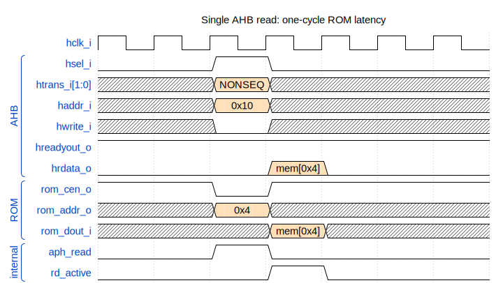
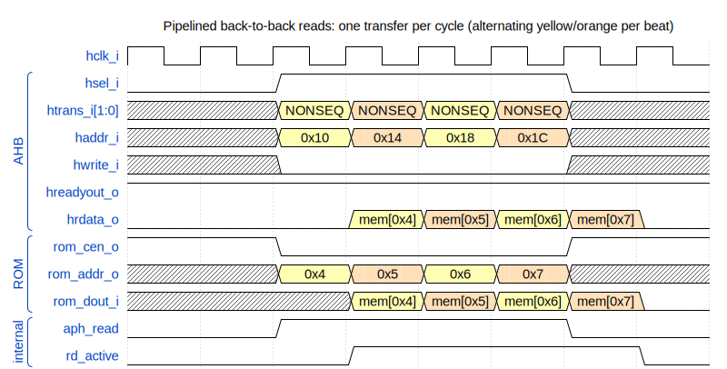
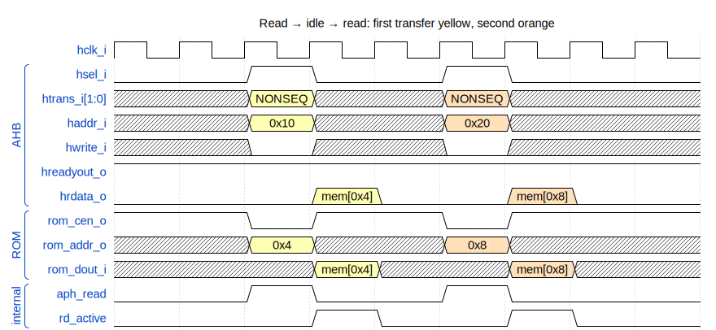

<p align="center">
  
</p>

# AHB ROM Controller

*Parameterizable AHB ROM controller with single-cycle read latency.*

---

## Contents

- [Overview](#overview)
  - [Design parameters](#design-parameters)
  - [Architecture](#architecture)
  - [Port summary](#port-summary)
  - [Integration requirements](#integration-requirements)
  - [Lint waivers](#lint-waivers)
- [Operation](#operation)
  - [Single read](#single-read)
  - [Pipelined back-to-back reads](#pipelined-back-to-back-reads)
  - [Read → idle → read](#read--idle--read)
- [Repository layout](#repository-layout)
- [Verification](#verification)
- [Synthesis](#synthesis)
- [License](#license)

---

## Overview

The **`ahb_rom_controller`** module is a parametrisable AHB slave that
bridges an AHB-Lite-style read master (e.g. the aRVern core's instruction
bus) to an external synchronous ROM macro. Reads complete in a single
cycle of ROM latency, matching the classic AHB 2-phase pipeline. Writes
are silently ignored with `hresp = 0` (no error response).

### Design parameters

| Parameter      | Purpose                                  | Default | Constraint        |
|----------------|------------------------------------------|---------|-------------------|
| `MEM_SIZE`     | ROM size in bytes                        | `256`   | Power of 2, ≥ 8   |
| `ASYNC_RST_EN` | Reset architecture: `1` = asynchronous active-low reset (default); `0` = synchronous reset. Threaded to every flop via the shared `arv_ipdff` primitive. Synchronous mode requires the clock to be running during reset assertion. See the repo README's *Reset architecture* section. | `1` | `0` or `1` |

The local parameter `MEM_ADDRW = $clog2(MEM_SIZE) - 2` derives the
word-address width handed to the ROM macro (the controller addresses the
ROM as 32-bit words).

> **Reset behaviour:** the single internal flop (`rd_active`) clears to
> `0` on assertion of `hresetn_i`. The assertion style follows
> `ASYNC_RST_EN` — async-clear when `1` (default), synchronous when `0`
> (which requires a running clock during reset assertion). The ROM macro
> itself is external; its reset behaviour is the integrator's concern.

> **Read / write timing:** reads complete in **1 cycle** of ROM latency
> (APH on cycle N drives the ROM address, DPH on cycle N+1 returns the
> data via `hrdata_o`). Writes are accepted by AHB protocol but produce
> no ROM access and no error response.

### Architecture

The controller is intentionally minimal — one registered flop plus a
handful of combinational assignments:

- **Address-phase decode (combinational)**
  ```
  aph_valid = hsel_i & hready_i & htrans_i[1]   // NONSEQ or SEQ start an access
  aph_read  = aph_valid & ~hwrite_i             // read variant
  ```
- **State (one flop)**
  ```
  rd_active <= aph_read       // posedge hclk_i, reset on ~hresetn_i (async-clear when ASYNC_RST_EN=1, synchronous when 0)
  ```
- **AHB outputs**
  ```
  hrdata_o    = rom_dout_i & {32{rd_active}}    // read data, gated by DPH
  hreadyout_o = 1'b1                            // always ready (no wait states)
  hresp_o     = 1'b0                            // never errors
  hclk_en_o   = aph_valid | rd_active           // clock-gate enable (APH + DPH)
  ```
- **ROM interface**
  ```
  rom_cen_o   = ~aph_read                       // active-low, asserted in read APH
  rom_addr_o  = haddr_i[MEM_ADDRW+1:2]          // combinational word address
  rom_clk_o   = hclk_i                          // direct pass-through
  ```

### Port summary

| Direction | Port              | Width            | Description                                                |
|-----------|-------------------|------------------|------------------------------------------------------------|
| in        | `hclk_i`          | 1                | Module clock (from the AHB clock domain)                   |
| in        | `hresetn_i`       | 1                | Active-low reset — **asynchronous** assertion when `ASYNC_RST_EN=1` (default), **synchronous** when `ASYNC_RST_EN=0` (sync-deassert required) |
| out       | `hclk_en_o`       | 1                | Clock-gate enable; drives an external ICG cell             |
| in        | `haddr_i`         | `MEM_ADDRW+2`    | AHB byte address                                           |
| in        | `hready_i`        | 1                | Bus ready in (from the interconnect)                       |
| in        | `hsize_i`         | 3                | Transfer size (unused — ROM returns the full 32-bit word)  |
| in        | `htrans_i`        | 2                | Transfer type (NONSEQ/SEQ start an access; IDLE/BUSY skip) |
| in        | `hwdata_i`        | 32               | Write data (silently ignored — ROM is read-only)           |
| in        | `hwrite_i`        | 1                | Write enable (writes are silently dropped)                 |
| in        | `hsel_i`          | 1                | Slave select                                               |
| out       | `hrdata_o`        | 32               | Read data (combinational, gated by `rd_active`)            |
| out       | `hreadyout_o`     | 1                | Bus ready out (constant `1`)                               |
| out       | `hresp_o`         | 1                | Transfer response (constant `0`)                           |
| in        | `rom_dout_i`      | 32               | ROM data (returned one cycle after `rom_cen` / `rom_addr`) |
| out       | `rom_addr_o`      | `MEM_ADDRW`      | ROM word address (combinational from `haddr_i`)            |
| out       | `rom_cen_o`       | 1                | ROM chip-enable (active-low, asserted during read APH)     |
| out       | `rom_clk_o`       | 1                | ROM clock (direct pass-through of `hclk_i`)                |

### Integration requirements

- **Reset (`hresetn_i`)** — active-low, async-asserted. De-assertion **must
  be synchronised to `hclk_i`** by the integrator. The IP contains no
  internal reset synchroniser.

- **Clock gating (`hclk_en_o` → `hclk_i`)** — `hclk_en_o` is a
  **combinational** enable; it **must drive a latch-based ICG cell** at the
  SoC integration boundary. It asserts during both APH (current access) and
  DPH (registered prior access), so the controller's flop receives a clock
  edge whenever it needs to update.

- **ROM macro contract** — the attached ROM must register `rom_addr_o` on
  the rising edge of `rom_clk_o` (which is `hclk_i`) when `rom_cen_o` is
  asserted (low), and present the corresponding word on `rom_dout_i`
  **combinationally** from the registered address. The bundled
  `bench/verilog/rom.v` testbench model implements exactly this contract;
  any production ROM macro with registered-input / combinational-output
  behaviour drops in unchanged.

- **Writes** — the controller acknowledges writes with `hreadyout_o = 1`
  and `hresp_o = 0` but does not propagate them to the ROM. If your fabric
  needs write attempts to be reported as errors, wrap this IP with a
  decoder that returns a fault response for writes to the ROM region.

### Lint waivers

Same `_unused` postfix convention as the rest of the aRVern IP family —
the upper bits of unused inputs are tied to sink wires whose names end in
`_unused`, allowing a single tool-agnostic waiver rule. Signals tied off in
this IP: `hwdata_unused`, `hsize_unused`, `hwrite_unused`,
`htrans0_unused`, `haddr10_unused`. See
[`arv_custom_csr.md`](../../arv_custom_csr/doc/arv_custom_csr.md#lint-waivers)
for the per-tool waiver recipes.

---

## Operation

All transfers use the standard AHB 2-phase pipeline: address-phase (APH)
on cycle N drives `rom_cen_o` and `rom_addr_o`; the data-phase (DPH) on
cycle N+1 returns the word on `hrdata_o`. Colours in the waveforms link
each APH to its matching DPH so the pipeline beats are visually traceable.

### Single read

A single non-pipelined read. The master drives `hsel`, `htrans=NONSEQ`,
`hwrite=0`, and `haddr` in cycle 2; the controller drops `rom_cen_o` to
`0` and forwards the word address to the ROM in the same cycle. One cycle
later the ROM returns the word on `rom_dout_i`; `rd_active` registered the
read, so `hrdata_o = rom_dout_i`.



### Pipelined back-to-back reads

Four reads streamed in consecutive cycles. Each cycle is simultaneously
the APH of a new transfer and the DPH of the previous one — peak
throughput is one 32-bit word per cycle. `rom_cen_o` stays asserted across
all read cycles; alternating colours mark consecutive pipeline beats.



### Read → idle → read

Two reads separated by an idle cycle. `rom_cen_o` deasserts (returns to
`1`) during the idle cycle so the ROM macro can power down its sense
amps; `hrdata_o` returns `0` (combinational AND with `rd_active = 0`) when
no DPH is active. Useful as the typical pattern for sporadic instruction
fetches mixed with branches/loads.



---

## Repository layout

```
ahb_rom_controller/
├── rtl/verilog/
│   ├── ahb_rom_controller.v   Controller RTL
│   └── filelist.f             RTL source list (consumed by both sim & synth)
├── bench/verilog/
│   ├── tb_ahb_rom_controller.v Top-level testbench
│   ├── ahb_tasks.v            Reusable AHB read / write tasks
│   ├── rom.v                  Synchronous ROM model (for sim only)
│   └── timescale.v
├── sim/rtl_sim/
│   ├── src/                   Per-test stimulus files (.v)
│   ├── run/                   Run wrappers (run, run_all, run_lint)
│   └── bin/                   Sim runner + log parsers
├── synthesis/synopsys/
│   ├── synthesis.tcl          Top-level Design Compiler flow
│   ├── library.tcl            Tech-library selection via LIB_FLAVOR
│   ├── read.tcl
│   ├── constraints.tcl
│   ├── run_syn, run_syn_d     Synthesis launchers (host / dockerised)
│   └── libraries/             setup_*.tcl per technology + .db symlinks
└── doc/
    ├── ahb_rom_controller.md  This document
    └── img/                   Diagrams (WaveDrom JSON / Graphviz dot source +
                               rendered SVG) and render.py helper script
```

---

## Verification

The verification flow uses **Verilator** for linting and **Icarus Verilog**
(default) for simulation.

### Lint

```bash
cd sim/rtl_sim/run
./run_lint
```

### Run a single test

```bash
cd sim/rtl_sim/run
./run                    # default test: simple_rdwr
./run pipelined_rdwr     # any test under sim/rtl_sim/src/<name>.v
```

### Run the full regression

```bash
cd sim/rtl_sim/run
./run_all                # all tests, one iteration
./run_all 5              # all tests, 5 iterations (different random seeds)
```

### Test suite

| Test              | Coverage |
|-------------------|----------|
| `simple_rdwr`     | Single-transfer reads at various addresses; verifies one-cycle latency, `hrdata` correctness, and that write attempts are silently ignored. |
| `pipelined_rdwr`  | Back-to-back NONSEQ reads (peak throughput); verifies the AHB pipeline correctly hands `hrdata` one cycle after each APH. |

A test passes when its log contains `SIMULATION PASSED`. `run_all`
aggregates results into `log/<iter>/summary.<iter>.log`; the detailed
report includes a replay command (`runsim -seed <N>`) per test.

---

## Synthesis

The Design Compiler flow lives under `synthesis/synopsys/` and uses a
`LIB_FLAVOR` env-var mechanism for selecting the target technology — the
same mechanism as the rest of the aRVern IP family.

```bash
cd synthesis/synopsys
./run_syn                          # default flavor (lib_default)
./run_syn -lib <flavor>            # synthesise with a specific library flavor
./run_syn -lib <flavor> -i         # interactive (keep dc_shell open after run)
./run_syn_d -lib <flavor>          # same, inside the dockerised DC image
```

Available `<flavor>` values are derived from `setup_*.tcl` files under
`synthesis/synopsys/libraries/` — running `./run_syn` with an unknown
flavor prints the full list.

Outputs land in `synthesis/synopsys/results/`:

| File                           | Description                                  |
|--------------------------------|----------------------------------------------|
| `ahb_rom_controller.gate.v`    | Gate-level netlist                           |
| `ahb_rom_controller.ddc`       | Synopsys DDC database                        |
| `ahb_rom_controller.spf`       | DFT scan test protocol (when DFT enabled)    |
| `report.area`, `report.full_area` | Area summary (incl. NAND2-equivalent)     |
| `report.timing`, `report.paths.*` | Timing and worst-path reports             |
| `report.constraints`           | Constraint compliance                        |
| `report.dft_*`                 | DFT DRC, coverage, scan-chain configuration  |
| `synthesis.log`                | Full dc_shell transcript                     |

---

## License

BSD 3-Clause — see [`LICENSE`](../../LICENSE) at the repo root.
