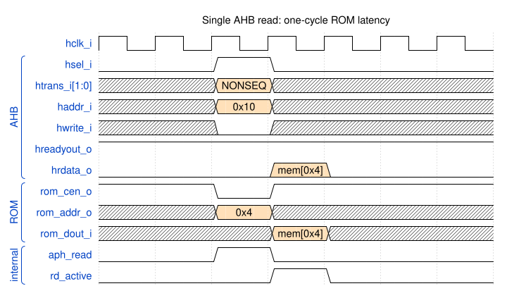
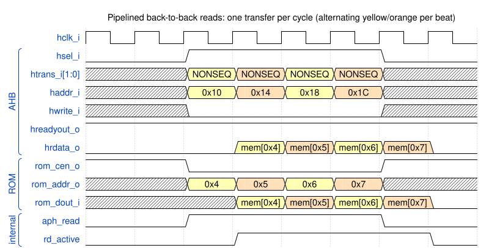
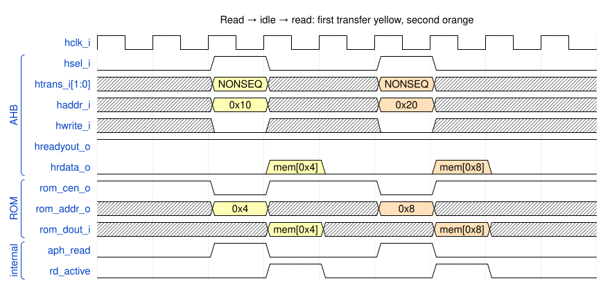
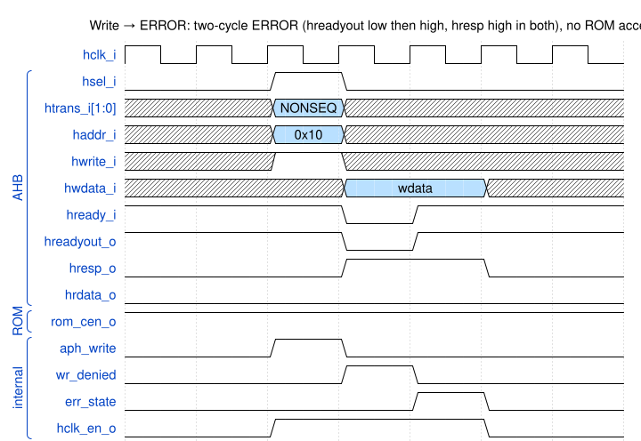

<p align="center">
  
</p>

# AHB ROM Controller

*Parameterizable AHB ROM controller with single-cycle read latency.*

---

## Contents

- [Overview](#overview)
  - [Behaviour at a glance](#behaviour-at-a-glance)
  - [Design parameters](#design-parameters)
  - [Architecture](#architecture)
  - [Port summary](#port-summary)
  - [Integration requirements](#integration-requirements)
  - [Lint waivers](#lint-waivers)
- [Operation](#operation)
  - [Single read](#single-read)
  - [Pipelined back-to-back reads](#pipelined-back-to-back-reads)
  - [Read → idle → read](#read--idle--read)
  - [Write → ERROR](#write--error)
  - [Stalled address phase](#stalled-address-phase)
- [Repository layout](#repository-layout)
- [Verification](#verification)
  - [Bench](#bench)
  - [Builds](#builds)
  - [Test suite](#test-suite)
  - [Lint](#lint)
  - [Running](#running)
- [Synthesis](#synthesis)
- [License](#license)

---

## Overview

The **`ahb_rom_controller`** module is an AHB-Lite subordinate that
bridges a manager (for example the aRVern core's instruction bus) to an
external synchronous ROM macro. A read completes in one cycle of ROM
latency, matching the AHB two-phase pipeline; pipelined reads return one
32-bit word per cycle. The ROM is read-only from the bus: every write is
answered with the AHB-Lite two-cycle ERROR and reaches no state.

### Behaviour at a glance

| Transfer presented | Response |
|---|---|
| Read (NONSEQ or SEQ, any `hsize_i`) | One ROM read. The aligned 32-bit word containing `haddr_i` is on `hrdata_o` in the next cycle with a zero-wait OKAY. `hsize_i` and `haddr_i[1:0]` are ignored: a narrower manager takes its byte lanes, a word read at an unaligned address returns the aligned word, an oversized `hsize_i` is not checked. |
| Write (any size) | No ROM access. Two-cycle ERROR: `hreadyout_o` low then high, `hresp_o` high in both cycles, `hrdata_o = 0`. The ROM is never written. On an aRVern hart the ERROR arrives as a resumable NMI (`mncause = 0x80000003`), never as an `mcause` 5/7 access fault. |
| IDLE or BUSY | Ignored: zero-wait OKAY, no ROM command, clock enable low. |
| Address phase while `hready_i` is low (another subordinate's wait state) | Not sampled: no ROM command, no ERROR, clock enable low. Taken once when `hready_i` returns high, if still presented. |
| Any address in the selected window | Not checked. The decoder above the IP selects the window; every selected transfer maps into the ROM. |
| During reset | `hreadyout_o = 1`, `hresp_o = 0`, `hrdata_o = 0`, `rom_cen_o = 1`; `hclk_en_o = 0` while the manager drives IDLE. |

### Design parameters

| Parameter      | Purpose | Default | Constraint |
|----------------|---------|---------|------------|
| `MEM_SIZE`     | ROM size in bytes | `256` | Power of 2, ≥ 8 |
| `ASYNC_RST_EN` | Reset style: `1` = asynchronous assertion, `0` = synchronous (needs a clock edge during reset). See the repository README's [Reset architecture](../../README.md#reset-architecture). | `1` | `0` or `1` |

The local parameter `MEM_ADDRW = $clog2(MEM_SIZE) - 2` is the word-address
width handed to the ROM macro (the controller addresses the ROM as 32-bit
words); it sizes `haddr_i` and `rom_addr_o`.

`MEM_SIZE` must be a power of 2 of at least 8. The check is a simulation
`$fatal` at elaboration (and lint); synthesis does not check it. Below 8
the port slices are illegal and elaboration fails in every tool. A
non-power-of-2 value sizes the ports for the next power of 2 and forwards
the address unchanged: reads between `MEM_SIZE` and that bound reach the
macro out of range, as the IP checks no address. `ASYNC_RST_EN` outside
`{0, 1}` is rejected the same way.

### Architecture

The controller is three flops plus a handful of combinational
assignments:

- **Address-phase decode (combinational)**
  ```
  aph_valid = hsel_i & hready_i & htrans_i[1]   // NONSEQ or SEQ, sampled only while hready_i is high
  aph_read  = aph_valid & ~hwrite_i
  aph_write = aph_valid &  hwrite_i
  ```
- **State (three flops: posedge `hclk_i`, reset style per `ASYNC_RST_EN`, enabled every cycle)**
  ```
  rd_active <= aph_read                 // read data phase next cycle
  wr_denied <= aph_write                // first ERROR cycle next cycle
  err_state <= wr_denied & ~err_state   // second ERROR cycle
  in_err_p1  = wr_denied & ~err_state
  in_err_p2  = err_state
  ```
- **AHB outputs**
  ```
  hrdata_o    = rom_dout_i & {32{rd_active}}                    // read data, zero outside a read data phase
  hreadyout_o = ~in_err_p1                                      // low only in the first ERROR cycle
  hresp_o     =  in_err_p1 | in_err_p2                          // high in both ERROR cycles
  hclk_en_o   = aph_valid | rd_active | wr_denied | err_state   // APH, read DPH, both ERROR cycles
  ```
- **ROM interface**
  ```
  rom_cen_o   = ~aph_read                       // active-low, asserted in the read APH
  rom_addr_o  = haddr_i[MEM_ADDRW+1:2]          // combinational word address
  rom_clk_o   = hclk_i                          // direct pass-through
  ```

`hreadyout_o` and `hresp_o` are functions of the flops only, so the
response is glitch-free and independent of when the fabric's HREADY
arrives.

### Port summary

| Direction | Port          | Width         | Reset value | Description |
|-----------|---------------|---------------|-------------|-------------|
| in        | `hclk_i`      | 1             | —   | Module clock (AHB clock domain) |
| in        | `hresetn_i`   | 1             | —   | Active-low reset; assertion asynchronous with `ASYNC_RST_EN = 1`, synchronous with `0`; de-assertion synchronised by the integrator |
| out       | `hclk_en_o`   | 1             | `0` | Clock-gate enable; drives an external ICG cell |
| in        | `haddr_i`     | `MEM_ADDRW+2` | —   | AHB byte address inside the window; not range-checked, `[1:0]` ignored |
| in        | `hready_i`    | 1             | —   | Bus ready in (from the interconnect); gates address-phase sampling |
| in        | `hsize_i`     | 3             | —   | Transfer size; ignored, the full word is returned |
| in        | `htrans_i`    | 2             | —   | Transfer type; NONSEQ/SEQ start an access, IDLE/BUSY are ignored |
| in        | `hwdata_i`    | 32            | —   | Write data; ignored, the ROM is read-only |
| in        | `hwrite_i`    | 1             | —   | Write enable; a write is answered with the two-cycle ERROR |
| in        | `hsel_i`      | 1             | —   | Subordinate select (HSELx) |
| out       | `hrdata_o`    | 32            | `0` | Read data; combinational from `rom_dout_i`, zero outside a read data phase |
| out       | `hreadyout_o` | 1             | `1` | Bus ready out; low in the first of the two ERROR cycles, high otherwise |
| out       | `hresp_o`     | 1             | `0` | Transfer response; high in both ERROR cycles, low otherwise |
| in        | `rom_dout_i`  | 32            | —   | ROM data; consumed in the cycle after the edge that sampled `rom_cen_o = 0` |
| out       | `rom_addr_o`  | `MEM_ADDRW`   | —   | ROM word address; combinational from `haddr_i`, unqualified |
| out       | `rom_cen_o`   | 1             | `1` | ROM chip enable, active-low; low for exactly the read address-phase cycle |
| out       | `rom_clk_o`   | 1             | —   | ROM clock; `hclk_i` passed through |

Reset values are the outputs while `hresetn_i` is asserted and in the
first cycle after it is released, with the manager driving IDLE as the
protocol requires during reset.

### Integration requirements

- **Reset (`hresetn_i`)** — active-low. Assertion is asynchronous with
  `ASYNC_RST_EN = 1` (default) and synchronous with `0`; de-assertion
  **must be synchronised to `hclk_i`** by the integrator — the IP contains
  no reset synchroniser. The three flops clear to `0`, giving the reset
  values of the port table. Minimum assertion: none in asynchronous mode;
  one delivered `hclk_i` edge in synchronous mode. Keeping the clock
  running while reset is asserted is the integrator's job: the ICG enable
  is `hclk_en_o | ~hresetn_i` (the bench does exactly this), which also
  covers a reset that lands in a read data phase or an ERROR cycle. The
  ROM macro's own reset, if any, is the integrator's concern.

- **Clock gating (`hclk_en_o` → `hclk_i`)** — `hclk_en_o` is a
  **combinational** enable and **must drive a latch-based ICG cell** at
  the SoC integration boundary (an enable-latch ICG delivers edge *k* when
  the enable is high in cycle *k−1*). It is high in every cycle in which
  any of the three flops must change: the address phase (`aph_valid`),
  the read data phase (`rd_active`) and both ERROR cycles (`wr_denied`,
  `err_state`). When the clock is gated all three flops are `0`, so the
  enable then depends on the bus inputs alone. `rom_cen_o = 0` implies
  `aph_valid`, so the macro on `rom_clk_o` always receives the edge that
  latches its address, whether `hclk_i` is the gated or the free-running
  clock.

- **ROM macro contract** — the edge *N* at which `rom_cen_o = 0` is
  sampled latches `rom_addr_o`; `rom_cen_o` is low for exactly the
  completing read address-phase cycle. The macro must drive that word on
  `rom_dout_i` throughout cycle *N+1*, whatever `rom_cen_o` is in *N+1*
  (it is already high again after an isolated read), with no further
  register stage and no wait state or ready handshake. `rom_dout_i` is
  looked at in no other cycle and need not hold. `rom_addr_o` is
  `haddr_i[MEM_ADDRW+1:2]` unqualified: it changes freely while
  `rom_cen_o` is high, including during transfers to other subordinates;
  a macro that requires a stable address while disabled needs an external
  hold. The boundary budgets are in `synthesis/synopsys/constraints.tcl`:
  `rom_dout_i` is budgeted to arrive 20 % of the clock period after the
  edge and `hrdata_o` to be valid by 30 % (a single AND between them);
  `rom_addr_o` and `rom_cen_o` are due by 30 %, leaving the macro 70 % of
  the period for its address and enable setup. The bench model
  `bench/verilog/rom.v` presents the word for exactly that one cycle and a
  poison word in every other cycle, so a controller that consumed
  `rom_dout_i` outside its read data phase fails the regression.

- **Bus behaviour** — every transfer is answered as in
  [Behaviour at a glance](#behaviour-at-a-glance):
  - *Writes.* A write is answered with the AHB-Lite **two-cycle ERROR**
    (`hreadyout_o = 0` then `1`, `hresp_o = 1` in both cycles) and reaches
    no state; the ROM is untouched. Acknowledging a write with OKAY would
    tell firmware its store succeeded. On an aRVern hart the ERROR arrives
    as a **resumable NMI** (`mncause = 0x80000003`), which is the only
    notice a store to read-only memory ever gets. The fused ROM controller
    inside `ahb_interconnect` answers identically, so the same firmware
    bug behaves the same way whichever controller a platform builds.
    `hreadyout_o` and `hresp_o` must therefore be part of the fabric's
    HREADY and HRESP muxes: a fabric that ties this subordinate's HREADY
    contribution high, or leaves `hresp_o` out, loses the first ERROR
    cycle and the manager samples its next address phase a cycle early.
  - *`hready_i`.* During this controller's data phase `hready_i` is its
    own `hreadyout_o` (AHB-Lite: the interconnect combines every HREADYOUT
    into HREADY). A stall from another subordinate reaches the controller
    only during an address phase, which is then not sampled (`aph_valid`
    requires `hready_i`): no ROM command, clock enable low, and a write
    presented during the stall raises no ERROR unless it is still on the
    bus when the stall ends. The controller does not extend a read data
    phase across a foreign stall.
  - *Addressing.* `haddr_i` is `MEM_ADDRW+2` bits: the window (base and
    size) is decoded above the IP, which forwards `haddr_i[MEM_ADDRW+1:2]`
    unchecked, so every selected transfer maps into the ROM. Every read
    returns the aligned 32-bit word containing `haddr_i`; `hsize_i` and
    `haddr_i[1:0]` are ignored, so a narrower manager takes its byte lanes
    (a subordinate need only provide the active lanes), a word read at an
    unaligned address returns the aligned word (alignment is the manager's
    rule) and an oversized `hsize_i` is not checked. IDLE and BUSY
    transfers are ignored with a zero-wait OKAY; SEQ is a transfer like
    NONSEQ, each beat carrying its own address — there is no `hburst_i`.

### Lint waivers

Same `_unused` postfix convention as the rest of the aRVern IP family —
unused inputs, or the unused bits of an input, are tied to sink wires
whose names end in `_unused`, allowing a single tool-agnostic waiver rule.
Signals tied off in this IP: `hwdata_unused`, `hsize_unused`,
`htrans0_unused`, `haddr10_unused`. See
[`arv_custom_csr.md`](../../arv_custom_csr/doc/arv_custom_csr.md#lint-waivers)
for the per-tool waiver recipes.

---

## Operation

All transfers use the AHB two-phase pipeline: the address phase (APH) on
cycle N drives `rom_cen_o` and `rom_addr_o`; the data phase (DPH) on
cycle N+1 returns the word on `hrdata_o`. Colours in the waveforms link
each APH to its matching DPH so the pipeline beats are visually traceable.

### Single read

A single non-pipelined read. The manager drives `hsel`, `htrans=NONSEQ`,
`hwrite=0`, and `haddr` in cycle 2; the controller drops `rom_cen_o` to
`0` and forwards the word address to the ROM in the same cycle. One cycle
later the ROM returns the word on `rom_dout_i`; `rd_active` registered the
read, so `hrdata_o = rom_dout_i`.



### Pipelined back-to-back reads

Four reads streamed in consecutive cycles. Each cycle is simultaneously
the APH of a new transfer and the DPH of the previous one — peak
throughput is one 32-bit word per cycle. `rom_cen_o` stays asserted across
all read cycles; alternating colours mark consecutive pipeline beats.



### Read → idle → read

Two reads separated by an idle cycle. `rom_cen_o` returns to `1` during
the idle cycle (no macro access); `hrdata_o` returns `0` (combinational
AND with `rd_active = 0`) when no DPH is active.



### Write → ERROR

A write address phase sampled in cycle N produces no ROM command and the
two-cycle ERROR in N+1 and N+2. For an isolated write (manager IDLE
afterwards):

| Cycle | Bus | `hreadyout_o` | `hresp_o` | `hrdata_o` | `rom_cen_o` | `hclk_en_o` |
|---|---|---|---|---|---|---|
| N   | Write APH sampled (`hsel_i`, NONSEQ/SEQ, `hwrite_i = 1`, `hready_i = 1`) | 1 | 0 | 0 | 1 | 1 |
| N+1 | First ERROR cycle: the data phase is extended | 0 | 1 | 0 | 1 | 1 |
| N+2 | Second ERROR cycle: the transfer ends | 1 | 1 | 0 | 1 | 1 |
| N+3 | Idle | 1 | 0 | 0 | 1 | 0 |



Under pipelined traffic: an address phase presented in N+1 is not sampled
(`hready_i` is low); one presented in N+2 is. A write sampled in N+2
starts a fresh first ERROR cycle in N+3 — two ERRORs never merge. A read
sampled in N+2 drops `rom_cen_o` in N+2 and returns its word in N+3 with
OKAY. A read whose data phase is N (read followed by write) delivers its
data in N as usual. `hrdata_o` is `0` in both ERROR cycles.

### Stalled address phase

Another subordinate's wait state reaches the controller as `hready_i = 0`
while an address phase is presented to it. That address phase is not
sampled: `rom_cen_o` stays high, `hclk_en_o` stays low (bus otherwise
idle), no flop changes. If the manager withdraws the transfer before
`hready_i` returns high, nothing happens — a withdrawn write raises no
ERROR. If it holds the transfer, it is taken exactly once, in the first
cycle with `hready_i = 1`: a read drops `rom_cen_o` in that cycle and
returns its word in the next; a write starts its ERROR in the next.

---

## Repository layout

```
ahb_rom_controller/
├── ahb_rom_controller.core     FuseSoC manifest (RTL fileset + lint target)
├── rtl/verilog/
│   ├── ahb_rom_controller.v    Controller RTL
│   └── filelist.f              RTL source list (sim, lint and synthesis; pulls in arv_primitives)
├── bench/verilog/
│   ├── tb_ahb_rom_controller.v Testbench: parameters, ICG model, bus monitor, DUT
│   ├── ahb_tasks.v             AHB-Lite BFM (ahb_write / ahb_read, blocking or pipelined)
│   ├── rom.v                   Synchronous ROM model (poison word outside a read data phase)
│   ├── submit.f                Simulation file list
│   └── timescale.v
├── sim/rtl_sim/
│   ├── src/                    One <test>.v per test
│   ├── run/                    run, run_all, run_lint, waivers.vlt
│   └── bin/                    runsim, parse_results, parse_summaries, rtl_configs.py,
│                               gen_rtl_params.py, flatten_filelist.py
├── lint/vc_static/             VC Static flow: run_vclint, rules.tcl, waivers.tcl, README.md
├── synthesis/synopsys/
│   ├── synthesis.tcl           Top-level Design Compiler flow
│   ├── library.tcl             Library selection via LIB_FLAVOR
│   ├── read.tcl                Analyze / elaborate (applies the -rtl_config parameters)
│   ├── constraints.tcl         Clocks, path groups, boundary delays
│   ├── run_syn                 Synthesis launcher (-lib, -rtl_config, -rtl_sweep)
│   ├── run_check_reset_style   Gate-level reset-style check (PrimeTime, check_reset_style_pt.tcl)
│   ├── extract_worst_path.py   Worst-path summary printed after a run
│   └── libraries/              setup_lib_example.tcl template; add your setup_<flavor>.tcl here
└── doc/
    ├── ahb_rom_controller.md   This document
    └── img/                    WaveDrom JSON sources, rendered SVG, render.py
```

---

## Verification

The verification flow uses **Verilator** for linting and **Icarus Verilog**
(default) for simulation; **VC Static** provides the signoff lint.

### Bench

`bench/verilog/tb_ahb_rom_controller.v` maps the ROM at `0x0040_0000` for
`MEM_SIZE` bytes (`hsel` is decoded in the bench), on a free-running clock
behind a latch ICG model whose enable is `hclk_en | ~hresetn` — the clock
runs during reset, as the synchronous-reset build needs. `MEM_SIZE` (bench
default 2048) and `ASYNC_RST_EN` are `-D` defines. `hready = hreadyout &
~tb_hready_stall`: a test raises `tb_hready_stall` to model another
subordinate's wait states while this controller has no data phase in
flight.

The ROM model `rom.v` latches `rom_addr` on an edge with `rom_cen = 0` and
presents that word during the next cycle only; every other cycle returns
the poison word `0xBAD0_BAD0`, so read data consumed outside the read
data phase, or forwarded unmasked, fails. Contents are preloaded through
`rom_inst.mem[]`.

A bus monitor checks every data phase against the protocol this IP
implements: a read data phase is a zero-wait OKAY; a write data phase is
the two-cycle ERROR (`hreadyout` 0 then 1, `hresp` high in both); `hresp`
is never high otherwise; `hrdata` is 0 outside a read data phase;
`hclk_en` is low on an idle cycle. Tests drive the bus through
`ahb_write(blocking, addr, data, size)` and `ahb_read(blocking, addr,
expected, size, check)` of `ahb_tasks.v` (blocking or pipelined; the read
check compares the addressed byte lanes only) or directly for cycle-exact
checks; the BFM samples `hready` only, so response-shape checks are the
monitor's. `check_mem_value` reads the ROM array back. A test counts
mismatches in `error` and ends by raising `stimulus_done`; the bench then
prints `SIMULATION PASSED` when `error == 0`.

### Builds

`run_all` runs every test in four builds: the RTL defaults (bench
`MEM_SIZE = 2048`, asynchronous reset), synchronous reset
(`-D ASYNC_RST_EN=0`, logs `<test>-sync.log`), a large ROM
(`-D MEM_SIZE=65536`, `<test>-mem64k.log`) and the minimum ROM
(`-D MEM_SIZE=8`, `<test>-mem8.log`), which runs only the tests that stay
inside two words. A single test takes the same defines through
`SIM_EXTRA_DEFINES`, e.g. `SIM_EXTRA_DEFINES="-D MEM_SIZE=8" ../bin/runsim
busy_seq`. The test lists are the `TESTS` and `SMALL_TESTS` variables of
`run_all`; a new test is added there. The same parameter sets form the
table `sim/rtl_sim/bin/rtl_configs.py` (`default`, `sync_rst`, `mem8`,
`mem64k`) that the VC Static lint and synthesis sweeps iterate — a new
configuration goes in both.

### Test suite

| Test | What it pins | Builds |
|---|---|---|
| `simple_rdwr`       | Isolated byte/halfword/word writes (each a two-cycle ERROR, ROM unchanged) and byte/halfword/word reads at every lane offset; one-cycle latency. | default, sync, mem64k |
| `pipelined_rdwr`    | Back-to-back writes and reads at every size, read→write and write→read sequences through the ERROR; one word per cycle. | default, sync, mem64k |
| `address_sweep`     | Every word of the ROM read in one pipelined burst (2 words at `MEM_SIZE = 8`, 16 384 at 65536). | all four |
| `reset_check`       | Post-reset values `hreadyout_o = 1`, `hresp_o = 0`, `hrdata_o = 0`, `rom_cen_o = 1`; first reads after reset. | default, sync, mem64k |
| `write_error`       | The isolated write, cycle-exact: first cycle `hresp = 1` / `hreadyout = 0`, second `hresp = 1` / `hreadyout = 1`, then `hresp = 0`; ROM untouched; reads resume. | default, sync, mem64k |
| `hready_stall`      | A foreign bus stall (`tb_hready_stall`) during a ROM address phase: not taken, no ROM command, clock enable low; a withdrawn write raises no ERROR; a held read is taken once when the stall ends. | all four |
| `error_pipelined`   | Write→write, read→write and write→read with the next address phase held through the first ERROR cycle; both ERROR cycles of every write checked by the monitor. | all four |
| `busy_seq`          | NONSEQ + SEQ are two transfers; a BUSY beat between them is not (no ROM command, zero-wait OKAY). | all four |
| `reset_midtransfer` | Reset asserted in the first ERROR cycle and in a read data phase, both reset styles: `hreadyout_o = 1`, `hresp_o = 0` during reset (at once with an asynchronous reset, by the first clock edge with a synchronous one), no ROM command, bus usable afterwards. | all four |
| `hsize_oversize`    | Reads with an oversized `hsize_i` (`3'b011`–`3'b111`) interleaved with word reads: each returns the aligned word with a zero-wait OKAY (`hsize_i` is not checked on reads). | all four |

### Lint

```bash
cd sim/rtl_sim/run
./run_lint                  # Verilator --lint-only, RTL defaults
```

`lint/vc_static/run_vclint [-rtl_config <N|name> | -rtl_sweep]` runs the
VC Static signoff lint, from a shell with `vc_static_shell` on PATH, over
the configuration table `sim/rtl_sim/bin/rtl_configs.py` (`default`,
`sync_rst`, `mem8`, `mem64k`) — the same table `run_syn -rtl_config`
builds; `-list_configs` numbers the entries and `lint/vc_static/README.md`
has the option list. Reports land in `lint/vc_static/results/`; a
`-rtl_config` run also snapshots them to `results_sweep/<label>/`, and
`-rtl_sweep` writes one line per configuration to
`results_sweep/sweep_summary.log`.

### Running

```bash
cd sim/rtl_sim/run
./run                       # default test: simple_rdwr (dumps tb_ahb_rom_controller.vcd)
./run write_error           # any test under sim/rtl_sim/src/<name>.v
./run_all                   # every test in the four builds, one iteration
./run_all 5                 # same, 5 iterations (different random seeds)
```

A test passes when its log contains `SIMULATION PASSED`. `run_all` writes
one log per test and build to `log/<iter>/<test><suffix>.log` (`<suffix>`
empty, `-sync`, `-mem64k` or `-mem8`) and the summary to
`log/summary.<iter>.log` (several iterations add
`log/regressions_summary.log`); the summary carries a replay command
`../bin/runsim -seed <N> <test>` per test — prefix it with the build's
`SIM_EXTRA_DEFINES` to replay a non-default build.

---

## Synthesis

The Design Compiler flow lives under `synthesis/synopsys/` and uses the
`LIB_FLAVOR` mechanism shared by the rest of the aRVern IP family.
`libraries/setup_lib_default.tcl` is intentionally absent, because it
names your technology; create it from the tracked `setup_lib_example.tcl`
before the first run (see the repository README,
[Synthesis](../../README.md#synthesis)).

```bash
cd synthesis/synopsys
cp libraries/setup_lib_example.tcl libraries/setup_lib_default.tcl   # once, then edit
./run_syn                          # default flavor (lib_default), RTL defaults
./run_syn -lib <flavor>            # a specific libraries/setup_<flavor>.tcl
./run_syn -lib <flavor> -i         # interactive (keep dc_shell open after the run)
./run_syn -rtl_config <N|name>     # one entry of sim/rtl_sim/bin/rtl_configs.py
./run_syn -rtl_sweep               # every entry; one summary line each
./run_syn -list_configs            # number the entries
./run_check_reset_style            # PrimeTime reset-style check of results/<top>.gate.v
```

Any `setup_<flavor>.tcl` under `libraries/` is a flavor; with an unknown
one `./run_syn` stops and prints the list it found.

The configurations are `default` (RTL defaults), `sync_rst`
(`ASYNC_RST_EN = 0`: the synchronous-reset branch of `arv_ipdff` and the
matching DFT reset declaration), `mem8` (`MEM_SIZE = 8`, a one-bit word
address) and `mem64k` (`MEM_SIZE = 65536`). A `-rtl_config` build also
snapshots its reports to `results_sweep/<label>/`; `-rtl_sweep` builds
every entry and writes `results_sweep/sweep_summary.log`, one line per
configuration with its timing violations, unconstrained endpoints and DFT
DRC violations — a build is `PASS` only when all three are zero.

`rom_clk_o` is `hclk_i` passed through: `constraints.tcl` declares it a
generated clock of `hclk_i`, so it is a clock net, not a timed output, and
clock gating and scan control of the macro clock are applied above the
IP. `check_timing` still lists the port as an unconstrained endpoint,
which the sweep summary expects for `*_clk_o` ports and does not count.

The boundary delays are 20 % of the clock period on every input
(`rom_dout_i` included), 70 % on the AHB and ROM outputs and 75 % on
`hclk_en_o` (it drives the SoC's ICG); `hresetn_i` is a false path.
Input-to-output feed-throughs (`hsel_i` / `hready_i` / `htrans_i` →
`hclk_en_o` and `rom_cen_o`, `haddr_i` → `rom_addr_o`, `rom_dout_i` →
`hrdata_o`) form their own path group. DFT inserts one multiplexed
flip-flop scan chain clocked by `hclk_i`; `hresetn_i` is declared a reset
in the asynchronous build and held constant in the synchronous one.

`run_check_reset_style` runs PrimeTime (`check_reset_style_pt.tcl`) on
`results/ahb_rom_controller.gate.v` and confirms every flop carries the
expected reset style. The expected style is detected from the
configuration the netlist was built with (`rtl_params.tcl` after a
`-rtl_config` run, otherwise the RTL default of `ASYNC_RST_EN`);
`EXPECT=async|sync` overrides it.

Outputs land in `synthesis/synopsys/results/`:

| File                                         | Description                                          |
|----------------------------------------------|------------------------------------------------------|
| `ahb_rom_controller.gate.v`, `ahb_rom_controller.ddc` | Gate-level netlist and DDC database         |
| `ahb_rom_controller.spf`, `ahb_rom_controller.svf`    | DFT scan test protocol; Formality setup file |
| `report.area`, `report.full_area`            | Area summary (incl. NAND2-equivalent) and hierarchy  |
| `report.timing`, `report.check_timing_pre`   | Timing check; unconstrained endpoints                |
| `report.paths.*`, `report.full_paths.*`      | Worst-path end-point and full-path reports (max / min) |
| `report.constraints`                         | Constraint compliance                                |
| `report.dft_*`                               | DFT DRC, coverage estimate, scan-chain configuration |
| `report.check`, `report.refs`                | `check_design` output; cell references               |
| `synthesis.log`                              | Full dc_shell transcript                             |

---

## License

BSD 3-Clause — see [`LICENSE`](../../LICENSE) at the repo root.
