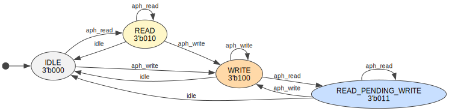
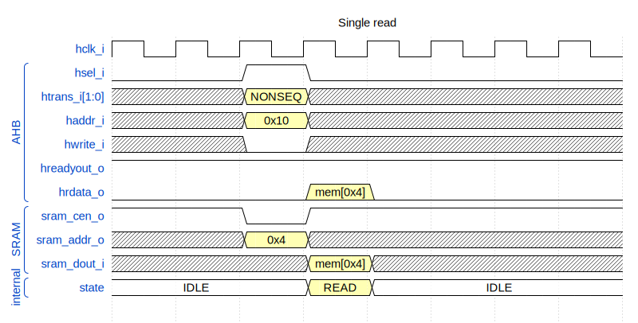
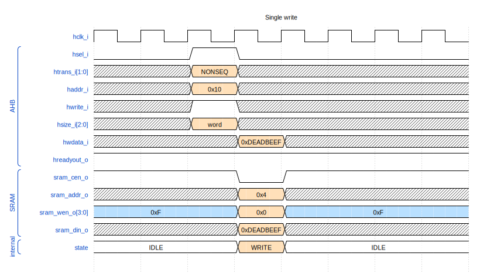
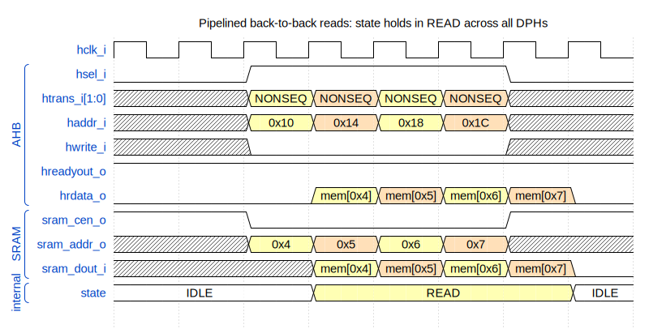
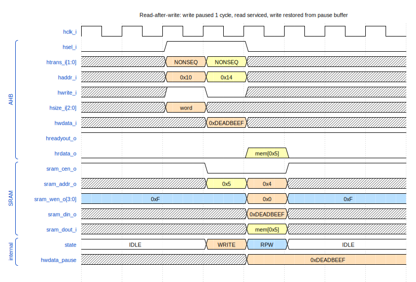

<p align="center">
  
</p>

# AHB SRAM Controller

*Parameterizable AHB SRAM controller with single-cycle latency and read-after-write hazard handling.*

---

## Contents

- [Overview](#overview)
  - [Design parameters](#design-parameters)
  - [Architecture](#architecture)
  - [FSM](#fsm)
  - [Port summary](#port-summary)
  - [Integration requirements](#integration-requirements)
  - [Lint waivers](#lint-waivers)
- [Operation](#operation)
  - [Single read](#single-read)
  - [Single write](#single-write)
  - [Pipelined back-to-back reads](#pipelined-back-to-back-reads)
  - [Read after write (RPW)](#read-after-write-rpw)
- [Repository layout](#repository-layout)
- [Verification](#verification)
- [Synthesis](#synthesis)
- [License](#license)

---

## Overview

The **`ahb_sram_controller`** module is a parametrisable AHB slave that
bridges an AHB-Lite-style master to an external synchronous single-port
SRAM macro. Reads complete in **one cycle** of SRAM latency; writes
commit on the cycle after the address phase, with byte enables derived
from `hsize_i` and `haddr_i[1:0]`. A small FSM defers conflicting writes
into a one-deep pause buffer so that a read APH presented one cycle after
a write APH can be served immediately while the write commits one cycle
later.

### Design parameters

| Parameter   | Purpose                                  | Default | Constraint        |
|-------------|------------------------------------------|---------|-------------------|
| `MEM_SIZE`  | SRAM size in bytes                       | `256`   | Power of 2, ≥ 8   |
| `ASYNC_RST_EN` | Reset architecture: `1` = asynchronous active-low reset (default); `0` = synchronous reset. Threaded to every flop via the shared `arv_ipdff` primitive. Synchronous mode requires the clock to be running during reset assertion. See the repo README's *Reset architecture* section. | `1` | `0` or `1` |

The local parameter `MEM_ADDRW = $clog2(MEM_SIZE) - 2` derives the
word-address width handed to the SRAM macro (the controller addresses
the SRAM as 32-bit words; byte selection is done via `sram_wen_o`).

> **Reset behaviour:** the FSM clears to `IDLE`. Internal buffers
> (`sram_wr_addr_buf`, `sram_wr_en_buf`, `hwdata_pause`,
> `sram_rd_cmd_post`, `sram_read_from_pause_post`) reset to defined
> values; the external SRAM macro's reset behaviour is the integrator's
> concern.

> **Read / write timing:** reads return data on the DPH cycle (1 cycle
> after the APH). Writes commit on the same DPH cycle when there is no
> conflicting read; the FSM defers the write by one cycle when a read
> follows in the very next APH (see [RPW](#read-after-write-rpw)).

### Architecture

The controller is a small FSM plus combinational glue:

- **Address-phase decode (combinational)**
  ```
  aph_valid = hsel_i & hready_i & htrans_i[1]
  aph_write = aph_valid &  hwrite_i
  aph_read  = aph_valid & ~hwrite_i
  ```
- **State register** — 3-bit `state` updated on `posedge hclk_i` with
  async clear to `IDLE`.
- **Write pause buffer** — `sram_wr_addr_buf`, `sram_wr_en_buf` and
  `hwdata_pause` capture a deferred write when a read takes priority on
  the shared SRAM port.
- **Read-from-pause forwarding** — when a read targets the same word
  address as a queued (paused) write, `hrdata_o` is sourced from
  `hwdata_pause` instead of `sram_dout_i` so the master always sees the
  freshest value.
- **AHB outputs**
  ```
  hreadyout_o = 1'b1               // always ready (no wait states)
  hresp_o     = 1'b0               // never errors
  hclk_en_o   = aph_valid | (state != IDLE)   // clock-gate enable
  ```
- **SRAM interface**
  ```
  sram_cen_o   = ~(sram_rd_cmd | sram_wr_active)   // active-low
  sram_addr_o  = read-haddr OR pause-buffer-addr
  sram_din_o   = hwdata_i  OR  hwdata_pause
  sram_wen_o   = ~(sram_wr_en_buf & {4{sram_wr_active}})  // active-low byte enables
  sram_clk_o   = hclk_i
  ```

### FSM



| State                 | Meaning                                                                                  |
|-----------------------|------------------------------------------------------------------------------------------|
| `IDLE` (`3'b000`)     | No active access; SRAM disabled.                                                         |
| `READ` (`3'b010`)     | A read APH was seen last cycle — this cycle returns `hrdata_o` from the SRAM macro.      |
| `WRITE` (`3'b100`)    | A write APH was seen last cycle — this cycle drives `hwdata_i` into the SRAM macro.     |
| `READ_PENDING_WRITE` (`3'b011`) | A read followed a write — the SRAM is busy reading; the prior write is held in the pause buffer and committed on the next non-read cycle. |

The state encoding is **chosen so single bits identify behaviour**:
`state[2]` = "writing this cycle", `state[1]` = "next cycle returns
read data", `state[0]` = "pending write is in the pause buffer".

### Port summary

| Direction | Port              | Width            | Description                                                |
|-----------|-------------------|------------------|------------------------------------------------------------|
| in        | `hclk_i`          | 1                | Module clock (from the AHB clock domain)                   |
| in        | `hresetn_i`       | 1                | Active-low reset — **asynchronous** assertion when `ASYNC_RST_EN=1` (default), **synchronous** when `ASYNC_RST_EN=0` (sync-deassert required) |
| out       | `hclk_en_o`       | 1                | Clock-gate enable; drives an external ICG cell             |
| in        | `haddr_i`         | `MEM_ADDRW+2`    | AHB byte address                                           |
| in        | `hready_i`        | 1                | Bus ready in (from the interconnect)                       |
| in        | `hsize_i`         | 3                | Transfer size (0=byte, 1=half-word, 2=word) — drives `sram_wen_o` |
| in        | `htrans_i`        | 2                | Transfer type (NONSEQ/SEQ start an access; IDLE/BUSY skip) |
| in        | `hwdata_i`        | 32               | Write data (DPH-aligned)                                   |
| in        | `hwrite_i`        | 1                | Write enable                                               |
| in        | `hsel_i`          | 1                | Slave select                                               |
| out       | `hrdata_o`        | 32               | Read data (combinational, gated by per-byte read-cmd post-flop) |
| out       | `hreadyout_o`     | 1                | Bus ready out (constant `1`)                               |
| out       | `hresp_o`         | 1                | Transfer response (constant `0`)                           |
| in        | `sram_dout_i`     | 32               | SRAM data out (one cycle after `sram_cen_o` + `sram_addr_o`) |
| out       | `sram_addr_o`     | `MEM_ADDRW`      | SRAM word address                                          |
| out       | `sram_cen_o`      | 1                | SRAM chip-enable (active-low)                              |
| out       | `sram_clk_o`      | 1                | SRAM clock (direct pass-through of `hclk_i`)               |
| out       | `sram_din_o`      | 32               | SRAM write data                                            |
| out       | `sram_wen_o`      | 4                | SRAM per-byte write enables (active-low)                   |

### Integration requirements

- **Reset (`hresetn_i`)** — active-low. The assertion style follows
  `ASYNC_RST_EN`: **asynchronous** when `1` (default), **synchronous**
  when `0` (synchronous mode needs a running clock during reset
  assertion). De-assertion **must be synchronised to `hclk_i`** by the
  integrator. The IP contains no internal reset synchroniser.

- **Clock gating (`hclk_en_o` → `hclk_i`)** — `hclk_en_o` is a
  **combinational** enable; it **must drive a latch-based ICG cell** at
  the SoC integration boundary. It asserts whenever there is any AHB
  activity or the FSM is non-IDLE.

- **SRAM macro contract** — the attached SRAM must register
  `sram_addr_o` + `sram_wen_o` + `sram_din_o` on the rising edge of
  `sram_clk_o` (which is `hclk_i`) when `sram_cen_o` is asserted (low).
  For reads it must present the addressed word on `sram_dout_i`
  **combinationally** from the registered address one cycle later. The
  bundled `bench/verilog/sram.v` model implements exactly this contract.

- **Single-port arbitration** — the controller assumes the SRAM has a
  single shared read/write port. The internal FSM (READ_PENDING_WRITE
  state plus the pause buffer) is what guarantees the port is never
  asked to do a read and a write in the same cycle.

- **Misaligned accesses** — the controller does **not** check for
  misaligned transfers; it assumes the master has already filtered them
  out (raising an alignment exception at the CPU level). `hresp_o` is
  hard-wired to `0`.

### Lint waivers

Same `_unused` postfix convention as the rest of the aRVern IP family —
signals tied off in this IP: `htrans0_unused`, `hsize2_unused`. See
[`arv_custom_csr.md`](../../arv_custom_csr/doc/arv_custom_csr.md#lint-waivers)
for the per-tool waiver recipes.

---

## Operation

All transfers use the standard AHB 2-phase pipeline: address-phase (APH)
on cycle N, data-phase (DPH) on cycle N+1. In the waveforms below, read
transfers use yellow, write transfers use orange, and the
`READ_PENDING_WRITE` state uses blue.

### Single read

A single non-pipelined read. `hsel`/`htrans=NONSEQ`/`hwrite=0`/`haddr=0x10`
mark the APH in cycle 2; the controller drops `sram_cen_o` to `0` and
forwards the word address `0x4` to the SRAM in the same cycle. The
state register transitions to `READ` on the next edge; in cycle 3 the
SRAM macro returns `mem[0x4]` on `sram_dout_i`, which is muxed onto
`hrdata_o` (gated by the registered `sram_rd_cmd_post`).



### Single write

A single non-pipelined word write. The APH in cycle 2 captures the
write address and byte-enables into the pause buffer registers on the
edge into cycle 3; the FSM transitions to `WRITE`. On cycle 3 the master
drives `hwdata_i = 0xDEADBEEF` on the DPH — the controller drives this
through to `sram_din_o`, asserts `sram_wen_o = 4'h0` (all bytes
active-low), and asserts `sram_cen_o = 0` so the SRAM commits the write
on the cycle-3 → cycle-4 edge.



### Pipelined back-to-back reads

Four reads streamed in consecutive cycles. Each cycle is simultaneously
the APH of a new transfer and the DPH of the previous one — peak
throughput is one 32-bit word per cycle. `sram_cen_o` stays asserted
across all read cycles and the FSM holds in the `READ` state until the
last DPH completes; alternating colours mark consecutive pipeline beats.



### Read after write (RPW)

This is the interesting case — and the reason the FSM has a fourth
state. In cycle 2 the master starts a **write** to `0x10`; in cycle 3
it starts a **read** to `0x14`. The write's DPH (`hwdata_i = 0xDEADBEEF`
on cycle 3) and the read's APH coincide on the same cycle. The
controller can't drive both the SRAM read and write in cycle 3 — there
is only one shared SRAM port.

The resolution: the FSM enters `READ_PENDING_WRITE`. The write is
**paused** — `hwdata_pause` captures `hwdata_i` and the SRAM is used to
serve the read (`sram_cen_o = 0`, `sram_addr_o = 0x5`). On cycle 4 the
FSM exits to `IDLE`; the paused write is **restored** —
`sram_din_o = hwdata_pause = 0xDEADBEEF`, `sram_addr_o = 0x4`,
`sram_wen_o = 4'h0` — and the SRAM commits it. From the master's point
of view the read returns `mem[0x5]` on cycle 4 with no wait state; from
the SRAM's point of view the write is delivered one cycle later than it
would have been without the read intervening.



If the read had targeted the same address as the paused write
(`haddr_i[MEM_ADDRW+1:2] == sram_wr_addr_buf`), the `sram_read_from_pause`
logic would have routed `hwdata_pause` onto `hrdata_o` instead of
`sram_dout_i` — guaranteeing the master always sees the freshest value
even before the pending write has reached the SRAM.

---

## Repository layout

```
ahb_sram_controller/
├── rtl/verilog/
│   ├── ahb_sram_controller.v  Controller RTL (FSM + pause buffer)
│   └── filelist.f             RTL source list (consumed by both sim & synth)
├── bench/verilog/
│   ├── tb_ahb_sram_controller.v Top-level testbench
│   ├── ahb_tasks.v            Reusable AHB read / write tasks
│   ├── sram.v                 Synchronous SRAM model (for sim only)
│   └── timescale.v
├── sim/rtl_sim/
│   ├── src/                   Per-test stimulus files (.v)
│   ├── run/                   Run wrappers (run, run_all, run_lint)
│   └── bin/                   Sim runner + log parsers
├── synthesis/synopsys/
│   ├── synthesis.tcl          Top-level Design Compiler flow
│   ├── library.tcl            Tech-library selection via LIB_FLAVOR
│   ├── read.tcl
│   ├── constraints.tcl
│   ├── run_syn, run_syn_d     Synthesis launchers (host / dockerised)
│   └── libraries/             setup_*.tcl per technology + .db symlinks
└── doc/
    ├── ahb_sram_controller.md This document
    └── img/                   Diagrams (WaveDrom JSON / Graphviz dot source +
                               rendered SVG) and render.py helper script
```

---

## Verification

The verification flow uses **Verilator** for linting and **Icarus Verilog**
(default) for simulation.

### Lint

```bash
cd sim/rtl_sim/run
./run_lint
```

### Run a single test

```bash
cd sim/rtl_sim/run
./run                       # default test: simple_rdwr
./run pipelined_advanced    # any test under sim/rtl_sim/src/<name>.v
```

### Run the full regression

```bash
cd sim/rtl_sim/run
./run_all                   # all tests, one iteration
./run_all 5                 # all tests, 5 iterations (different random seeds)
```

### Test suite

| Test                | Coverage |
|---------------------|----------|
| `simple_rdwr`       | Non-pipelined word reads and writes at varying addresses; verifies basic 1-cycle latency, byte-enable generation for sub-word `hsize`, and that read-back of just-written data matches. |
| `pipelined_rdwr`    | Back-to-back NONSEQ reads (peak throughput) and back-to-back writes; verifies the AHB pipeline correctly hands data one cycle after each APH and that the FSM stays in `READ` / `WRITE` across pipelined transfers. |
| `pipelined_advanced`| Stresses the `READ_PENDING_WRITE` state: write→read sequences, multiple reads queued behind a paused write, and same-address read-after-write that exercises the `sram_read_from_pause` forwarding path. |

A test passes when its log contains `SIMULATION PASSED`. `run_all`
aggregates results into `log/<iter>/summary.<iter>.log`; the detailed
report includes a replay command (`runsim -seed <N>`) per test.

---

## Synthesis

The Design Compiler flow lives under `synthesis/synopsys/` and uses a
`LIB_FLAVOR` env-var mechanism for selecting the target technology — the
same mechanism as the rest of the aRVern IP family.

```bash
cd synthesis/synopsys
./run_syn                          # default flavor (lib_default)
./run_syn -lib <flavor>            # synthesise with a specific library flavor
./run_syn -lib <flavor> -i         # interactive (keep dc_shell open after run)
./run_syn_d -lib <flavor>          # same, inside the dockerised DC image
```

Available `<flavor>` values are derived from `setup_*.tcl` files under
`synthesis/synopsys/libraries/` — running `./run_syn` with an unknown
flavor prints the full list.

Outputs land in `synthesis/synopsys/results/`:

| File                            | Description                                  |
|---------------------------------|----------------------------------------------|
| `ahb_sram_controller.gate.v`    | Gate-level netlist                           |
| `ahb_sram_controller.ddc`       | Synopsys DDC database                        |
| `ahb_sram_controller.spf`       | DFT scan test protocol (when DFT enabled)    |
| `report.area`, `report.full_area` | Area summary (incl. NAND2-equivalent)      |
| `report.timing`, `report.paths.*` | Timing and worst-path reports              |
| `report.constraints`            | Constraint compliance                        |
| `report.dft_*`                  | DFT DRC, coverage, scan-chain configuration  |
| `synthesis.log`                 | Full dc_shell transcript                     |

---

## License

BSD 3-Clause — see [`LICENSE`](../../LICENSE) at the repo root.
