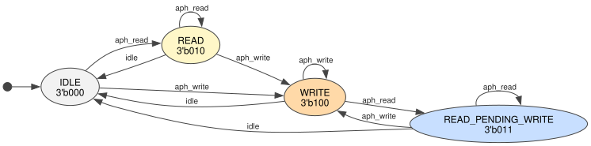
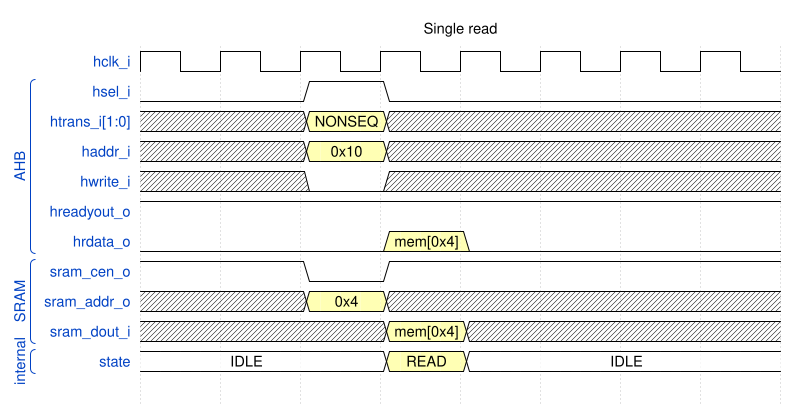
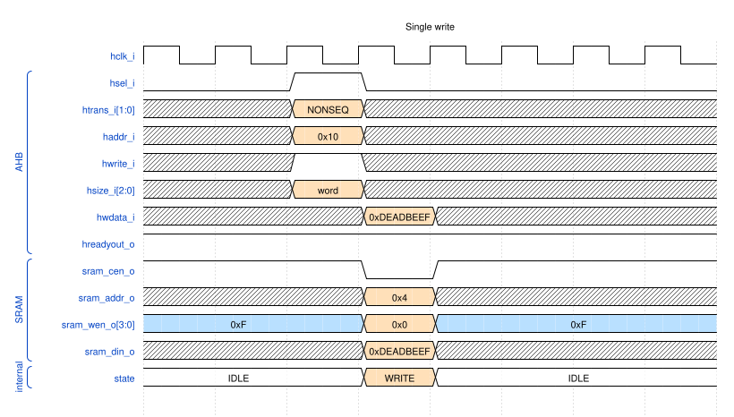
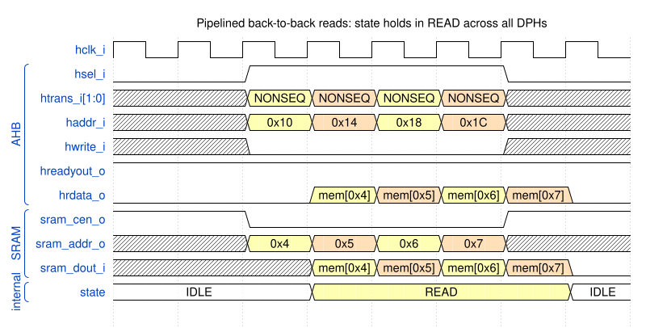
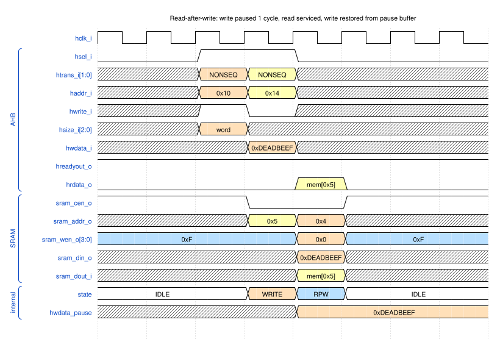

<p align="center">
  
</p>

# AHB SRAM Controller

*Parameterizable AHB SRAM controller with single-cycle latency and read-after-write hazard handling.*

---

## Contents

- [Overview](#overview)
  - [Behaviour at a glance](#behaviour-at-a-glance)
  - [Design parameters](#design-parameters)
  - [Architecture](#architecture)
  - [FSM](#fsm)
  - [Port summary](#port-summary)
  - [Integration requirements](#integration-requirements)
  - [Lint waivers](#lint-waivers)
- [Operation](#operation)
  - [Single read](#single-read)
  - [Single write](#single-write)
  - [Pipelined back-to-back reads](#pipelined-back-to-back-reads)
  - [Read after write (RPW)](#read-after-write-rpw)
  - [Stalled address phase](#stalled-address-phase)
- [Repository layout](#repository-layout)
- [Verification](#verification)
  - [Bench](#bench)
  - [Builds](#builds)
  - [Test suite](#test-suite)
  - [Lint](#lint)
  - [Running](#running)
- [Synthesis](#synthesis)
- [License](#license)

---

## Overview

The **`ahb_sram_controller`** module is an AHB-Lite subordinate that
bridges a manager (for example the aRVern core's data bus) to an
external synchronous single-port SRAM macro. A read completes in one
cycle of SRAM latency, matching the AHB two-phase pipeline; pipelined
reads return one 32-bit word per cycle. Writes are byte, half-word or
word wide through the macro's per-byte write enables. Every transfer
completes with a zero-wait OKAY; the IP never raises ERROR.

The macro has a single port, so the data phase of a write and the
address phase of a read that follows it compete for it. The controller
gives the port to the read: the write is held in a one-deep pause
buffer and restored on the first cycle without a read address phase —
the next cycle for a single read, later under a read stream — and a
read of the pending word is served from the buffer, byte lane by byte
lane. The manager therefore always reads every earlier write in bus
order and is never stalled by the SRAM.

### Behaviour at a glance

| Transfer presented | Response |
|---|---|
| Read (NONSEQ or SEQ, any size, any alignment) | One SRAM read. The aligned 32-bit word containing `haddr_i` is on `hrdata_o` in the next cycle with a zero-wait OKAY; a narrower manager takes its byte lanes. The word reflects every earlier write in bus order, a still-paused write included. |
| Write (byte, half-word, word) | Zero-wait OKAY. The byte lanes selected by `hsize_i[1:0]` and `haddr_i[1:0]` are written at the edge that ends the data phase; an unaligned half-word or word uses the lanes of the aligned half-word or word containing it. `hsize_i[2]` is ignored; `hsize_i[1:0] = 2'b11` writes no lane. |
| Write followed by a read | The read is served at once. The write is held in the pause buffer until the first cycle without a read address phase and committed then; a read of the pending word returns it, lanes merged with the SRAM word. |
| IDLE or BUSY | Ignored: zero-wait OKAY, no SRAM command, clock enable low. |
| Address phase while `hready_i` is low (another subordinate's wait state) | Not sampled: no SRAM command, clock enable low. Taken once when `hready_i` returns high, if still presented. |
| Transfer to another subordinate during this controller's data phase | The write on the port commits, or the paused write is restored, in that cycle. |
| Any address in the selected window | Not checked. The decoder above the IP selects the window; every selected transfer maps into the SRAM. |
| During reset | `hreadyout_o = 1`, `hresp_o = 0`, `hrdata_o = 0`, `sram_cen_o = 1`, `sram_wen_o = 4'b1111`; `hclk_en_o = 0` while the manager drives IDLE. |

### Design parameters

| Parameter      | Purpose | Default | Constraint |
|----------------|---------|---------|------------|
| `MEM_SIZE`     | SRAM size in bytes | `256` | Power of 2, 8 … 2^30 |
| `ASYNC_RST_EN` | Reset style: `1` = asynchronous assertion, `0` = synchronous (needs a clock edge during reset). See the repository README's [Reset architecture](../../README.md#reset-architecture). | `1` | `0` or `1` |

The local parameter `MEM_ADDRW = $clog2(MEM_SIZE) - 2` is the word-address
width handed to the SRAM macro (the controller addresses the SRAM as
32-bit words; byte selection is done through `sram_wen_o`); it sizes
`haddr_i`, `sram_addr_o` and the write-address buffer.

`MEM_SIZE` must be a power of 2 between 8 and 2^30 (the parameter is a
32-bit signed integer). The check is a simulation `$fatal` at elaboration
(and lint); synthesis does not check it. Below 8 the port slices are
illegal and elaboration fails in every tool. A non-power-of-2 value sizes
the ports for the next power of 2 and forwards the address unchanged:
accesses between `MEM_SIZE` and that bound reach the macro out of range,
as the IP checks no address. `ASYNC_RST_EN` outside `{0, 1}` is rejected
the same way.

### Architecture

The controller is a four-state FSM, three write buffers, two read-data
gates and combinational glue:

- **Address-phase decode (combinational)**
  ```
  aph_valid = hsel_i & hready_i & htrans_i[1]   // NONSEQ or SEQ, sampled only while hready_i is high
  aph_write = aph_valid &  hwrite_i
  aph_read  = aph_valid & ~hwrite_i
  ```
- **State register** — 3-bit `state` updated on `posedge hclk_i`;
  `hresetn_i` clears it to `IDLE`, asynchronously with `ASYNC_RST_EN = 1`,
  on the clock edge with `0`. The write command, the pause and the
  restore decode the registered state on full compares, so an illegal
  encoding (an upset; the FSM cannot reach one) issues no SRAM command
  and returns to `IDLE` on the next edge.
- **Write buffers** — `sram_wr_addr_buf` and `sram_wr_en_buf` capture the
  word address and byte strobes of every write address phase (the data
  arrives a cycle later; they drive `sram_addr_o` and `sram_wen_o` during
  the data phase and during a restore). `hwdata_pause` captures the write
  data only when a read address phase pauses the write. All three reset
  to `0`.
- **Read-from-pause forwarding** — when a read address phase targets the
  word of a pending write (`haddr_i[MEM_ADDRW+1:2] == sram_wr_addr_buf`
  in the cycle that pauses the write or while it is paused), the byte
  lanes the paused write enables are taken from `hwdata_pause` and the
  remaining lanes from `sram_dout_i`, so the manager reads the merged
  word — every earlier write in bus order — before the pending write has
  reached the SRAM. Two 4-bit gates registered at the address-phase edge
  (`sram_rd_cmd_post`, `sram_read_from_pause_post`) select the source of
  each lane in the data phase.
- **AHB outputs**
  ```
  hreadyout_o = 1'b1                          // always ready: zero-wait
  hresp_o     = 1'b0                          // never ERROR
  hclk_en_o   = aph_valid | (state != IDLE)   // clock-gate enable
  hrdata_o    = sram_dout_i per lane of sram_rd_cmd_post
              | hwdata_pause per lane of sram_read_from_pause_post   // zero outside a read data phase
  ```
- **SRAM interface**
  ```
  sram_rd_cmd    = state_nxt[1]                                    // a read address phase is being sampled
  sram_wr_active = ((state == WRITE) | (state == READ_PENDING_WRITE)) & ~aph_read
  sram_cen_o     = ~(sram_rd_cmd | sram_wr_active)                 // active-low
  sram_addr_o    = haddr_i[MEM_ADDRW+1:2] (read)  |  sram_wr_addr_buf (write, restore)
  sram_din_o     = hwdata_i (write)               |  hwdata_pause (restore)
  sram_wen_o     = ~(sram_wr_en_buf & {4{sram_wr_active}})         // active-low byte enables
  sram_clk_o     = hclk_i
  ```

`sram_rd_cmd` and `sram_wr_active` are exclusive by construction — a read
address phase sets the first and clears the second — so the single port
is never asked to read and write in one cycle, and the `sram_addr_o` and
`sram_din_o` selects are one-hot.

### FSM



| State | Meaning | SRAM port this cycle |
|---|---|---|
| `IDLE` (`3'b000`) | No data phase in progress. | Read command if a read address phase is being sampled, else idle. |
| `READ` (`3'b010`) | The data phase of a read: `hrdata_o` returns the word. | Read command if a read address phase is being sampled, else idle. |
| `WRITE` (`3'b100`) | The data phase of a write. | Write of `hwdata_i` to the buffered address and lanes, committed at the end of the cycle — unless a read address phase is presented: the port then carries that read command and the data is captured into `hwdata_pause`. |
| `READ_PENDING_WRITE` (`3'b011`) | The data phase of a read that paused a write: `hrdata_o` returns the word, merged with the buffer if it is the pending word. | The restored write from the buffers if no read address phase is presented (the write commits at the end of the cycle), else the next read command with the write still paused. |

The encoding is chosen so single bits identify behaviour: `state[2]` = a
write data phase is in progress (the word is written this cycle unless a
read address phase pauses it); `state[1]` = this cycle is a read data
phase; `state[0]` = a paused write is waiting in the buffer.

### Port summary

| Direction | Port          | Width         | Reset value | Description |
|-----------|---------------|---------------|-------------|-------------|
| in        | `hclk_i`      | 1             | —   | Module clock (AHB clock domain) |
| in        | `hresetn_i`   | 1             | —   | Active-low reset; assertion asynchronous with `ASYNC_RST_EN = 1`, synchronous with `0`; de-assertion synchronised by the integrator |
| out       | `hclk_en_o`   | 1             | `0` | Clock-gate enable; drives an external ICG cell |
| in        | `haddr_i`     | `MEM_ADDRW+2` | —   | AHB byte address inside the window; not range-checked; `[1:0]` selects byte lanes with `hsize_i` |
| in        | `hready_i`    | 1             | —   | Bus ready in (from the interconnect); gates address-phase sampling |
| in        | `hsize_i`     | 3             | —   | Transfer size (`0` byte, `1` half-word, `2` word) — drives `sram_wen_o`. Bit `[2]` is ignored; `[1:0] = 2'b11` writes no lane and still answers OKAY |
| in        | `htrans_i`    | 2             | —   | Transfer type; NONSEQ/SEQ start an access, IDLE/BUSY are ignored |
| in        | `hwdata_i`    | 32            | —   | Write data, consumed in the data phase |
| in        | `hwrite_i`    | 1             | —   | Write enable |
| in        | `hsel_i`      | 1             | —   | Subordinate select (HSELx) |
| out       | `hrdata_o`    | 32            | `0` | Read data; combinational from `sram_dout_i` and `hwdata_pause`, zero outside a read data phase |
| out       | `hreadyout_o` | 1             | `1` | Bus ready out; constant `1` |
| out       | `hresp_o`     | 1             | `0` | Transfer response; constant `0` (OKAY) |
| in        | `sram_dout_i` | 32            | —   | SRAM data; consumed only in the cycle after the edge that sampled a read command, need not hold otherwise |
| out       | `sram_addr_o` | `MEM_ADDRW`   | `0` | SRAM word address; the read address in a read address phase, the buffered write address in a write data phase or restore, zero otherwise |
| out       | `sram_cen_o`  | 1             | `1` | SRAM chip enable, active-low; low for every read command, write and restore |
| out       | `sram_clk_o`  | 1             | —   | SRAM clock; `hclk_i` passed through |
| out       | `sram_din_o`  | 32            | `0` | SRAM write data; `hwdata_i` in a write data phase, `hwdata_pause` in a restore, zero otherwise |
| out       | `sram_wen_o`  | 4             | `4'b1111` | SRAM per-byte write enables, active-low; the buffered strobes during a write or restore |

Reset values are the outputs while `hresetn_i` is asserted and in the
first cycle after it is released, with the manager driving IDLE as the
protocol requires during reset.

### Integration requirements

- **Reset (`hresetn_i`)** — active-low. Assertion is asynchronous with
  `ASYNC_RST_EN = 1` (default) and synchronous with `0`; de-assertion
  **must be synchronised to `hclk_i`** by the integrator — the IP contains
  no reset synchroniser. Every flop clears (`state` to `IDLE`, the write
  buffers and the read-data gates to `0`), giving the reset values of the
  port table. Minimum assertion: none in asynchronous mode; one delivered
  `hclk_i` edge in synchronous mode. Keeping the clock running while reset
  is asserted is the integrator's job: the ICG enable is
  `hclk_en_o | ~hresetn_i` (the bench does exactly this). A reset during
  a write data phase or while a write is paused drops or completes that
  write, never half of it: with an asynchronous reset the write command
  is withdrawn as soon as reset asserts, so the word is written only if a
  clock edge came first; with a synchronous reset the command on the port
  at the reset edge is sampled by the macro and the write completes. A
  write paused at the reset is lost unless its restore is on the port at
  a synchronous reset edge. With an asynchronous reset the SRAM inputs
  are combinational from flops that clear at once, so a reset asserted
  inside the macro's setup window of a clock edge while a write is on the
  port can corrupt the word being written: the integrator's reset
  assertion should avoid that window, or the content of that word is
  undefined after reset. The SRAM macro's own reset, if any, is the
  integrator's concern.

- **Clock gating (`hclk_en_o` → `hclk_i`)** — `hclk_en_o` is a
  **combinational** enable and **must drive a latch-based ICG cell** at
  the SoC integration boundary (an enable-latch ICG delivers edge *k* when
  the enable is high in cycle *k−1*). It is high in every cycle in which
  this controller samples an address phase (`hsel_i`, NONSEQ/SEQ,
  `hready_i` high) and in every cycle a data phase or a paused write is
  in progress (`state != IDLE`); it stays low during transfers to other
  subordinates, IDLE and BUSY beats, and address phases stalled by
  `hready_i`. When the clock is gated every flop holds its reset value,
  so the enable then depends on the bus inputs alone. `sram_cen_o = 0`
  implies `aph_valid` or `state != IDLE`, so the macro on `sram_clk_o`
  always receives the edge that latches its command, whether `hclk_i` is
  the gated or the free-running clock; the bench runs the macro on the
  gated clock. `hready_i → hclk_en_o` is a full-cycle path into the latch
  ICG, budgeted at 75 % of the clock period.

- **SRAM macro contract** — a single synchronous port with no wait state
  or ready handshake, never asked to read and write in one cycle. The
  edge at which `sram_cen_o = 0` is sampled latches `sram_addr_o`: with
  `sram_wen_o = 4'b1111` it is a read, otherwise the lanes whose
  `sram_wen_o` bit is low are written from `sram_din_o`. The data path
  relies on three properties. (1) After a read edge the macro must drive
  the read word on `sram_dout_i` throughout the *next* cycle **whatever
  the port carries in that cycle**: after a paused write it carries the
  restore (`sram_cen_o = 0`, `sram_wen_o ≠ 4'b1111`, `sram_addr_o` = the
  write address), and a macro whose Q follows DIN or is gated by CEN or
  WEN during a write cycle corrupts every read that precedes a restore.
  (2) A word written at edge *k* must read back new at edge *k+1*:
  back-to-back writes followed by a read, and every restore followed by
  a read of the restored word, rely on it, since forwarding covers only
  the paused word. (3) `sram_dout_i` is looked at only in the cycle after
  a read edge and need not hold otherwise — no hold register is needed,
  and an X on Q after a write cycle is masked. While `sram_cen_o` is high
  `sram_addr_o` and `sram_din_o` are zero and `sram_wen_o` is `4'b1111`.
  The boundary budgets are in `synthesis/synopsys/constraints.tcl`:
  `sram_dout_i` is budgeted to arrive 20 % of the clock period after the
  edge and `hrdata_o` to be valid by 30 %; `sram_addr_o`, `sram_cen_o`,
  `sram_din_o` and `sram_wen_o` are due by 30 %, leaving the macro 70 %
  of the period for its setup. The bench model `bench/verilog/sram.v`
  holds the read word through the following cycle whatever command the
  port then carries, returns the new data on a read of a word written at
  the previous edge, and drives a poison word (`0xBAD0_BAD0`) in every
  other cycle, so a controller that consumed `sram_dout_i` outside a read
  data phase fails the regression.

- **Bus behaviour** — every transfer is answered as in
  [Behaviour at a glance](#behaviour-at-a-glance):
  - *Response.* Every transfer completes zero-wait with OKAY
    (`hreadyout_o = 1`, `hresp_o = 0`); the IP never raises ERROR, so
    nothing it does reaches a hart as an exception or an NMI.
  - *Writes.* The write command is on the port during the data-phase
    cycle and the macro samples it at the edge that ends it — the edge
    at which the transfer completes on the bus. A read address phase
    presented in that cycle takes the port instead: the data is captured
    into the pause buffer, the write is restored on the first cycle
    without a read address phase, and a read of the pending word
    meanwhile returns the merged word. The bus is never stalled by the
    SRAM, and a read returns every earlier write in bus order whatever
    the controller is doing with the SRAM port at that moment (the bench
    monitor's invariant), so firmware needs no fence or dummy read
    between a store and a load of the same word.
  - *Byte lanes.* `hsize_i[1:0]` and `haddr_i[1:0]` select the lanes of a
    write: `2'b00` one byte, `2'b01` the aligned half-word containing the
    address (`haddr_i[1]` alone selects it), `2'b10` the whole word.
    Alignment is not checked: a half-word at an odd address and a word
    at any offset use the lanes of their containing half-word or word and
    complete with OKAY — alignment is the manager's rule. Transfer sizes
    above a word are not supported and not reported: `hsize_i[2]` is
    ignored and `hsize_i[1:0] = 2'b11` matches no strobe, so such a write
    enables no lane and leaves the SRAM unchanged while the transfer
    still completes with OKAY; a platform that wants an oversized size
    caught must do so in the fabric. Reads return the full aligned word
    in every case: a narrower manager takes its byte lanes (a subordinate
    need only provide the active lanes). The fused SRAM controller inside
    `ahb_interconnect` decodes the lanes identically on its Port B.
  - *`hready_i`.* During this controller's data phase `hready_i` is its
    own `hreadyout_o = 1` (AHB-Lite: the interconnect combines every
    HREADYOUT into HREADY). A stall from another subordinate reaches the
    controller only during an address phase, which is then not sampled
    (`aph_valid` requires `hready_i`): no SRAM command, clock enable low;
    a withdrawn transfer leaves nothing behind and a held one is taken
    exactly once when the stall ends.
  - *Other subordinates.* A transfer to another subordinate (`hsel_i = 0`)
    presented during this controller's write data phase lets the write
    commit in that cycle; presented in the cycle after a paused write it
    triggers the restore, like any cycle without a read address phase.
  - *IDLE, BUSY, SEQ.* IDLE and BUSY transfers are ignored with a
    zero-wait OKAY; SEQ is a transfer like NONSEQ, each beat carrying its
    own address — there is no `hburst_i`.
  - *Addressing.* `haddr_i` is `MEM_ADDRW+2` bits: the window (base and
    size) is decoded above the IP, which forwards `haddr_i[MEM_ADDRW+1:2]`
    unchecked, so every selected transfer maps into the SRAM.

- **`sram_clk_o` and DFT** — `sram_clk_o` is `hclk_i` passed through;
  `constraints.tcl` declares it a generated clock of `hclk_i`, so it is a
  clock net, not a timed output. Clock gating and scan control of the
  macro clock, the macro's bypass or BIST and the ICG test enable are
  applied above the IP: the IP has no scan bypass around the macro, and
  `hrdata_o` is combinational from `sram_dout_i`.

### Lint waivers

Same `_unused` postfix convention as the rest of the aRVern IP family —
unused inputs, or the unused bits of an input, are tied to sink wires
whose names end in `_unused`, allowing a single tool-agnostic waiver rule.
Signals tied off in this IP: `htrans0_unused`, `hsize2_unused`. See
[`arv_custom_csr.md`](../../arv_custom_csr/doc/arv_custom_csr.md#lint-waivers)
for the per-tool waiver recipes.

---

## Operation

All transfers use the AHB two-phase pipeline: the address phase (APH) on
cycle N, the data phase (DPH) on cycle N+1. In the single-transfer and
read-after-write waveforms reads are yellow, writes orange and the
`READ_PENDING_WRITE` state blue; in the pipelined-reads waveform
alternating colours link each address phase to its data phase.

### Single read

A single non-pipelined read. The manager drives `hsel`, `htrans=NONSEQ`,
`hwrite=0` and `haddr=0x10` in cycle 2; the controller drops `sram_cen_o`
to `0` and forwards the word address `0x4` to the SRAM in the same cycle.
The state register moves to `READ` on the next edge; in cycle 3 the SRAM
macro returns `mem[0x4]` on `sram_dout_i`, which is passed to `hrdata_o`
through the registered `sram_rd_cmd_post` gate.



### Single write

A single non-pipelined word write. The address phase in cycle 2 loads the
write address and byte strobes into the write buffers at the edge into
cycle 3; the FSM enters `WRITE`. In cycle 3 the manager drives
`hwdata_i = 0xDEADBEEF` on the data phase; the controller passes it to
`sram_din_o`, drives `sram_wen_o = 4'h0` (all lanes, active-low) and
`sram_cen_o = 0`, and the SRAM commits the word at the edge that ends
cycle 3 — the edge at which the transfer completes on the bus.



### Pipelined back-to-back reads

Four reads streamed in consecutive cycles. Each cycle is simultaneously
the APH of a new transfer and the DPH of the previous one — peak
throughput is one 32-bit word per cycle. `sram_cen_o` stays asserted
across all read cycles and the FSM holds in `READ` until the last DPH
completes.



### Read after write (RPW)

The reason the FSM has a fourth state. In cycle 2 the manager starts a
**write** to `0x10`; in cycle 3 it starts a **read** to `0x14`. The
write's DPH (`hwdata_i = 0xDEADBEEF` in cycle 3) and the read's APH
coincide, and there is only one SRAM port.

The FSM enters `READ_PENDING_WRITE`. The write is **paused** —
`hwdata_pause` captures `hwdata_i` at the end of cycle 3 — and the port
serves the read (`sram_cen_o = 0`, `sram_addr_o = 0x5`). In cycle 4 the
FSM is in `READ_PENDING_WRITE`: the read's data phase returns `mem[0x5]`
on `hrdata_o` while the paused write is **restored** on the port —
`sram_din_o = hwdata_pause = 0xDEADBEEF`, `sram_addr_o = 0x4`,
`sram_wen_o = 4'h0` — and the SRAM commits it at the edge that ends
cycle 4; the FSM returns to `IDLE`. From the manager's point of view the
read completed with no wait state; from the SRAM's point of view the
write landed one edge later than it would have without the read. Had
further read address phases followed in cycle 4, the FSM would have
stayed in `READ_PENDING_WRITE` and the restore waited for the first
cycle without one.



Had the read targeted the word of the paused write
(`haddr_i[MEM_ADDRW+1:2] == sram_wr_addr_buf`), the byte lanes the write
enables would have come from `hwdata_pause` and the remaining lanes from
`sram_dout_i`, so the manager would have read the merged word before the
pending write reached the SRAM.

### Stalled address phase

Another subordinate's wait state reaches the controller as `hready_i = 0`
while an address phase is presented to it; this can only happen while the
controller has no data phase in flight, since during its own data phase
`hready_i` is its own `hreadyout_o = 1`. That address phase is not
sampled: `sram_cen_o` stays high, `hclk_en_o` stays low, no flop
changes. If the manager withdraws the transfer before `hready_i` returns
high, nothing happens. If it holds the transfer, it is taken exactly
once, in the first cycle with `hready_i = 1`: a read drops `sram_cen_o`
in that cycle and returns its word in the next; a write loads the write
buffers at the end of that cycle and writes the SRAM in the next.

---

## Repository layout

```
ahb_sram_controller/
├── ahb_sram_controller.core    FuseSoC manifest (RTL fileset + lint target)
├── rtl/verilog/
│   ├── ahb_sram_controller.v   Controller RTL (FSM, write buffers, forwarding)
│   └── filelist.f              RTL source list (sim, lint and synthesis; pulls in arv_primitives)
├── bench/verilog/
│   ├── tb_ahb_sram_controller.v Testbench: parameters, ICG model, bus monitor and shadow memory, DUT
│   ├── ahb_tasks.v             AHB-Lite BFM (ahb_write / ahb_read, blocking or pipelined)
│   ├── sram.v                  Synchronous SRAM model (poison word outside a read data phase)
│   ├── submit.f                Simulation file list
│   └── timescale.v
├── sim/rtl_sim/
│   ├── src/                    One <test>.v per test
│   ├── run/                    run, run_all, run_lint, waivers.vlt
│   └── bin/                    runsim, parse_results, parse_summaries, rtl_configs.py,
│                               gen_rtl_params.py, flatten_filelist.py
├── lint/vc_static/             VC Static flow: run_vclint, rules.tcl, waivers.tcl, README.md
├── synthesis/synopsys/
│   ├── synthesis.tcl           Top-level Design Compiler flow
│   ├── library.tcl             Library selection via LIB_FLAVOR
│   ├── read.tcl                Analyze / elaborate (applies the -rtl_config parameters)
│   ├── constraints.tcl         Clocks (hclk_i, generated sram_clk_o), path groups, boundary delays
│   ├── run_syn                 Synthesis launcher (-lib, -rtl_config, -rtl_sweep)
│   ├── run_check_reset_style   Gate-level reset-style check (PrimeTime, check_reset_style_pt.tcl)
│   ├── extract_worst_path.py   Worst-path summary printed after a run
│   └── libraries/              setup_lib_example.tcl template; add your setup_<flavor>.tcl here
└── doc/
    ├── ahb_sram_controller.md  This document
    └── img/                    WaveDrom JSON and Graphviz dot sources, rendered SVG, render.py
```

---

## Verification

The verification flow uses **Verilator** for linting and **Icarus Verilog**
(default) for simulation; **VC Static** provides the signoff lint.

### Bench

`bench/verilog/tb_ahb_sram_controller.v` maps the SRAM at `0x0040_0000`
for `MEM_SIZE` bytes (`hsel` is decoded in the bench), on a free-running
clock behind a latch ICG model whose enable is `hclk_en | ~hresetn` — the
clock runs during reset, as the synchronous-reset build needs. The SRAM
model is clocked by `sram_clk_o`, that is by the gated clock. `MEM_SIZE`
(bench default 2048) and `ASYNC_RST_EN` are `-D` defines.
`hready = hreadyout & ~tb_hready_stall`: a test raises `tb_hready_stall`
to model another subordinate's wait states while this controller has no
data phase in flight.

The SRAM model `sram.v` latches `sram_addr` on an edge with
`sram_cen = 0`, writes the lanes whose `sram_wen` bit is low, and presents
the read word during the next cycle only; every other cycle returns the
poison word `0xBAD0_BAD0`, so read data consumed outside the read data
phase, or forwarded unmasked, fails. The array `sram_inst.mem[]` starts
cleared and is readable by tests.

A bus monitor samples every cycle at the falling clock edge and keeps a
shadow memory: every cycle is a zero-wait OKAY; a read data phase returns
the full word the shadow holds — every earlier write applied in bus order
on the lanes `hsize[1:0]` and `haddr[1:0]` select, whatever the
controller does with the SRAM port meanwhile; `hrdata` is `0` outside a
read data phase; `hclk_en` is low on a cycle with neither an address nor
a data phase. The shadow takes a word's initial value from the SRAM model
on its first bus access and forgets everything on a reset. Tests drive
the bus through `ahb_write(blocking, addr, data, size)` and
`ahb_read(blocking, addr, expected, size, check)` of `ahb_tasks.v`
(blocking or pipelined, 2-bit size; the read check compares the addressed
byte lanes only), directly for cycle-exact checks, or through a pipelined
sequencer — `q_add(kind, addr, hsize, data)` with kinds `RD`, `WR`,
`FOREIGN` (a NONSEQ to another subordinate) and `GAP` (an IDLE cycle),
then `q_run` — that overlaps each address phase with the previous data
phase and drives junk `hwdata` outside write data phases.
`check_mem_value(word, expected)` reads the model array; `chk(cond, msg)`
counts a failed condition. A test counts mismatches in `error` and ends
by raising `stimulus_done`; the bench then prints `SIMULATION PASSED`
when `error == 0`.

### Builds

`run_all` runs every test in four builds: the RTL defaults (bench
`MEM_SIZE = 2048`, asynchronous reset), synchronous reset
(`-D ASYNC_RST_EN=0`, logs `<test>-sync.log`), a large SRAM
(`-D MEM_SIZE=65536`, `<test>-mem64k.log`) and the minimum SRAM
(`-D MEM_SIZE=8`, `<test>-mem8.log`), which runs only the tests that stay
inside words 0 and 1. A single test takes the same defines through
`SIM_EXTRA_DEFINES`, e.g. `SIM_EXTRA_DEFINES="-D MEM_SIZE=8" ../bin/runsim
busy_seq`. The test lists are the `TESTS` and `SMALL_TESTS` variables of
`run_all`; a new test is added there. The same parameter sets form the
table `sim/rtl_sim/bin/rtl_configs.py` (`default`, `sync_rst`, `mem8`,
`mem64k`) that the VC Static lint and synthesis sweeps iterate — a new
configuration goes in both.

### Test suite

| Test | What it pins | Builds |
|---|---|---|
| `simple_rdwr`        | Isolated byte/half-word/word writes and reads at every lane offset; one-cycle latency, lane generation, read-back of the written data. | default, sync, mem64k |
| `pipelined_rdwr`     | Back-to-back writes and reads at every size, read→write and write→read sequences; one word per cycle; the FSM held in `READ` / `WRITE` across pipelined transfers. | default, sync, mem64k |
| `pipelined_advanced` | Paused writes with reads queued behind them; reads of the paused word narrower and wider than the write, served from the merged buffer. | default, sync, mem64k |
| `rpw_sequences`      | Orderings around a paused write: the restore coinciding with the next write's address phase (`W(A);R(B);W(A,half);R(A)`), a re-pause right after a restore (`W(A);R(B);R(C);W(D);R(D)`), back-to-back writes after a pause (`W(A);R(B);W(C);W(E)`), byte-by-byte reads of the paused word. | all four |
| `foreign_aph`        | A transfer to another subordinate during the write data phase (the write commits) and in the cycle after a paused write (the restore); the paused word reaches the SRAM. | all four |
| `hready_stall`       | A foreign bus stall (`tb_hready_stall`) during an address phase: not taken, no SRAM command, clock enable low; a withdrawn write reaches nothing; a held write then a held read are taken exactly once when the stall ends. | all four |
| `busy_seq`           | A NONSEQ+SEQ write burst and a read burst with a BUSY beat carrying a write address: SEQ beats are transfers, BUSY is not. | all four |
| `hsize_oversize`     | `hsize = 3'b011` writes no lane; `3'b100` / `3'b101` / `3'b110` write as byte, half-word and word; a read with `3'b011` returns the word. | all four |
| `reset_midtransfer`  | Reset in a write data phase and while a write is paused, both reset styles: never half-committed; `hreadyout = 1`, `hresp = 0`, `sram_cen = 1` in reset; an asynchronous reset withdraws the write command before the next edge; bus usable afterwards. | all four |
| `illegal_state`      | Each illegal state encoding (`3'b001`, `3'b101`, `3'b110`, `3'b111`) deposited into the state register right after reset and after a paused write: no SRAM command, `IDLE` on the next edge, memory unchanged, normal traffic afterwards. | all four |
| `address_walk`      | Walking-one and walking-zero word addresses over the whole array (every build): each written with a second write pipelined behind it and both read back through the bus and in the memory model, so every word-address bit rises and falls on `haddr_i`, `sram_addr_o` and `sram_wr_addr_buf`. | all four |

### Lint

```bash
cd sim/rtl_sim/run
./run_lint                  # Verilator --lint-only -Wall -Wpedantic, RTL defaults
```

`lint/vc_static/run_vclint [-rtl_config <N|name> | -rtl_sweep]` runs the
VC Static signoff lint, from a shell with `vc_static_shell` on PATH, over
the configuration table `sim/rtl_sim/bin/rtl_configs.py` (`default`,
`sync_rst`, `mem8`, `mem64k`) — the same table `run_syn -rtl_config`
builds; `-list_configs` numbers the entries and `lint/vc_static/README.md`
has the option list. Reports land in `lint/vc_static/results/`; a
`-rtl_config` run also snapshots them to `results_sweep/<label>/`, and
`-rtl_sweep` writes one line per configuration to
`results_sweep/sweep_summary.log`.

### Running

```bash
cd sim/rtl_sim/run
./run                       # default test: simple_rdwr (dumps tb_ahb_sram_controller.vcd)
./run rpw_sequences         # any test under sim/rtl_sim/src/<name>.v
./run_all                   # every test in the four builds, one iteration
./run_all 5                 # same, 5 iterations (different random seeds)
```

A test passes when its log contains `SIMULATION PASSED`. `run_all` writes
one log per test and build to `log/<iter>/<test><suffix>.log` (`<suffix>`
empty, `-sync`, `-mem64k` or `-mem8`) and the summary to
`log/summary.<iter>.log` (several iterations add
`log/regressions_summary.log`); the summary carries a replay command
`../bin/runsim -seed <N> <test>` per test — prefix it with the build's
`SIM_EXTRA_DEFINES` to replay a non-default build.

---

## Synthesis

The Design Compiler flow lives under `synthesis/synopsys/` and uses the
`LIB_FLAVOR` mechanism shared by the rest of the aRVern IP family.
`libraries/setup_lib_default.tcl` is intentionally absent, because it
names your technology; create it from the tracked `setup_lib_example.tcl`
before the first run (see the repository README,
[Synthesis](../../README.md#synthesis)).

```bash
cd synthesis/synopsys
cp libraries/setup_lib_example.tcl libraries/setup_lib_default.tcl   # once, then edit
./run_syn                          # default flavor (lib_default), RTL defaults
./run_syn -lib <flavor>            # a specific libraries/setup_<flavor>.tcl
./run_syn -lib <flavor> -i         # interactive (keep dc_shell open after the run)
./run_syn -rtl_config <N|name>     # one entry of sim/rtl_sim/bin/rtl_configs.py
./run_syn -rtl_sweep               # every entry; one summary line each
./run_syn -list_configs            # number the entries
./run_check_reset_style            # PrimeTime reset-style check of results/<top>.gate.v
```

Any `setup_<flavor>.tcl` under `libraries/` is a flavor; with an unknown
one `./run_syn` stops and prints the list it found.

The configurations are `default` (RTL defaults), `sync_rst`
(`ASYNC_RST_EN = 0`: the synchronous-reset branch of `arv_ipdff` and the
matching DFT reset declaration), `mem8` (`MEM_SIZE = 8`, a one-bit word
address) and `mem64k` (`MEM_SIZE = 65536`). A `-rtl_config` build also
snapshots its reports to `results_sweep/<label>/`; `-rtl_sweep` builds
every entry and writes `results_sweep/sweep_summary.log`, one line per
configuration with its timing violations, unconstrained endpoints and DFT
DRC violations — a build is `PASS` only when all three are zero.

`sram_clk_o` is `hclk_i` passed through: `constraints.tcl` declares it a
generated clock of `hclk_i`, so it is a clock net, not a timed output, and
clock gating and scan control of the macro clock are applied above the
IP. `check_timing` still lists the port as an unconstrained endpoint,
which the sweep summary expects for `*_clk_o` ports and does not count.

The boundary delays are 20 % of the clock period on every input
(`sram_dout_i` included), 70 % on the AHB and SRAM outputs and 75 % on
`hclk_en_o` (it drives the SoC's ICG); `hresetn_i` is a false path.
Input-to-output feed-throughs (the address-phase inputs → `hclk_en_o`
and the SRAM command outputs, `haddr_i` → `sram_addr_o`, `hwdata_i` →
`sram_din_o`, `sram_dout_i` → `hrdata_o`) form their own path group. DFT
inserts multiplexed flip-flop scan chains clocked by `hclk_i`;
`hresetn_i` is declared a reset in the asynchronous build and held
constant in the synchronous one.

`run_check_reset_style` runs PrimeTime (`check_reset_style_pt.tcl`) on
`results/ahb_sram_controller.gate.v` and confirms every flop carries the
expected reset style. The expected style is detected from the
configuration the netlist was built with (`rtl_params.tcl` after a
`-rtl_config` run, otherwise the RTL default of `ASYNC_RST_EN`);
`EXPECT=async|sync` overrides it.

Outputs land in `synthesis/synopsys/results/`:

| File                                         | Description                                          |
|----------------------------------------------|------------------------------------------------------|
| `ahb_sram_controller.gate.v`, `ahb_sram_controller.ddc` | Gate-level netlist and DDC database       |
| `ahb_sram_controller.spf`, `ahb_sram_controller.svf`    | DFT scan test protocol; Formality setup file |
| `report.area`, `report.full_area`            | Area summary (incl. NAND2-equivalent) and hierarchy  |
| `report.timing`, `report.check_timing_pre`   | Timing check; unconstrained endpoints                |
| `report.paths.*`, `report.full_paths.*`      | Worst-path end-point and full-path reports (max / min) |
| `report.constraints`                         | Constraint compliance                                |
| `report.dft_*`                               | DFT DRC, coverage estimate, scan-chain configuration |
| `report.check`, `report.refs`                | `check_design` output; cell references               |
| `synthesis.log`                              | Full dc_shell transcript                             |

---

## License

BSD 3-Clause — see [`LICENSE`](../../LICENSE) at the repo root.
