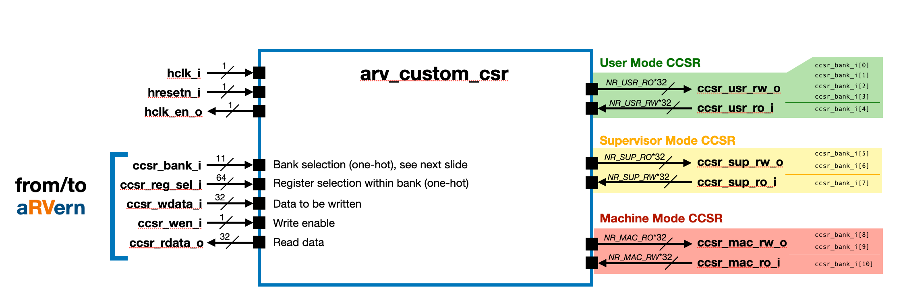
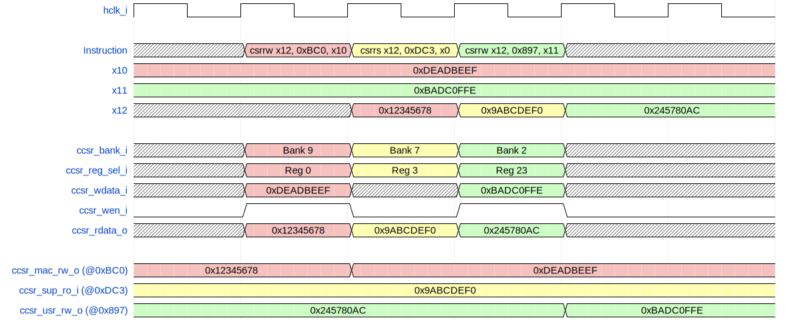

<p align="center">
  
</p>

# Custom CSR Peripheral

*Parameterizable IP interfacing with the aRVern core.*

---

## Contents

- [Overview](#overview)
  - [Design parameters](#design-parameters)
  - [Block diagram](#block-diagram)
  - [Module hierarchy](#module-hierarchy)
  - [Port summary](#port-summary)
  - [Integration requirements](#integration-requirements)
  - [Lint waivers](#lint-waivers)
- [Custom Control and Status Banks](#custom-control-and-status-banks)
- [Custom CSR Transfer Example](#custom-csr-transfer-example)
- [Repository layout](#repository-layout)
- [Verification](#verification)
- [Synthesis](#synthesis)
- [License](#license)

---

## Overview

The **`arv_custom_csr`** module is a parametrisable IP that implements a
configurable amount of custom CSR registers for **User**, **Supervisor** and
**Machine** mode (both Read-Only and Read-Write sections).

### Design parameters

| Parameter   | Purpose                                  | Min | Max (RO) | Max (RW) |
|-------------|------------------------------------------|-----|----------|----------|
| `NR_USR_RO` / `NR_USR_RW` | User-mode CSR registers       | 0   | 64       | 256      |
| `NR_SUP_RO` / `NR_SUP_RW` | Supervisor-mode CSR registers | 0   | 64       | 128      |
| `NR_MAC_RO` / `NR_MAC_RW` | Machine-mode CSR registers    | 0   | 64       | 128      |

> **Note:** when a parameter is set to `0`, the associated input (for RO) or
> output (for RW) port is 1 bit wide and that bit must be left unconnected
> (RW) or tied low (RO) during integration.

The top also takes **`ASYNC_RST_EN`** (default `1`, range `0` or `1`):
`1` = asynchronous active-low reset; `0` = synchronous reset (requires a
running clock during reset assertion). It is threaded to every flop via the
shared `arv_ipdff` primitive. See the repo README's *Reset architecture*
section.

**Reset behaviour:** all RW registers reset to `0x00000000` on the
assertion of `hresetn_i`. The assertion style follows `ASYNC_RST_EN`:
asynchronous when `1` (default); synchronous when `0`, which requires a
running clock during reset assertion. RO ports are pure combinational
pass-through of the external source.

**Read / write timing:** reads are combinational — `ccsr_rdata_o` is valid
in the same cycle the matching one-hot `ccsr_bank_i` and `ccsr_reg_sel_i`
bits are asserted. Writes commit on the next rising edge of `hclk_i` when
`ccsr_wen_i = 1` together with a valid one-hot bank/reg_sel selection.

### Block diagram



### Module hierarchy

The IP is a thin top-level decoder plus six parameterised sub-instances —
one RW bank and one RO bank per privilege level:

```
arv_custom_csr
├── arv_ccsr_rdwr   #(NR_USR_RW)   User-mode RW       (banks 0..3)
├── arv_ccsr_rdonly #(NR_USR_RO)   User-mode RO       (bank 4)
├── arv_ccsr_rdwr   #(NR_SUP_RW)   Supervisor-mode RW (banks 5..6)
├── arv_ccsr_rdonly #(NR_SUP_RO)   Supervisor-mode RO (bank 7)
├── arv_ccsr_rdwr   #(NR_MAC_RW)   Machine-mode RW    (banks 8..9)
└── arv_ccsr_rdonly #(NR_MAC_RO)   Machine-mode RO    (bank 10)
```

Each sub-instance is wrapped in a `generate if (NR_*>0)` so that setting a
parameter to `0` elides the corresponding sub-instance entirely.

### Port summary

| Direction | Port              | Width                | Description                                                |
|-----------|-------------------|----------------------|------------------------------------------------------------|
| in        | `hclk_i`          | 1                    | Module clock (from the AHB clock domain)                   |
| in        | `hresetn_i`       | 1                    | Active-low reset — **asynchronous** assertion when `ASYNC_RST_EN=1` (default), **synchronous** when `ASYNC_RST_EN=0` (see Integration requirements) |
| out       | `hclk_en_o`       | 1                    | Clock-gate enable; drives an external ICG cell             |
| in        | `ccsr_bank_i`     | 11                   | Bank selection — one-hot (see Bank → CSR address map)      |
| in        | `ccsr_reg_sel_i`  | 64                   | Register selection within bank — one-hot                   |
| in        | `ccsr_wdata_i`    | 32                   | Write data                                                 |
| in        | `ccsr_wen_i`      | 1                    | Write enable                                               |
| out       | `ccsr_rdata_o`    | 32                   | Read data (combinational)                                  |
| out       | `ccsr_usr_rw_o`   | `NR_USR_RW` × 32     | User-mode RW register values (concatenated, reg 0 in LSBs) |
| in        | `ccsr_usr_ro_i`   | `NR_USR_RO` × 32     | User-mode RO register sources (concatenated, reg 0 in LSBs)|
| out       | `ccsr_sup_rw_o`   | `NR_SUP_RW` × 32     | Supervisor-mode RW register values                         |
| in        | `ccsr_sup_ro_i`   | `NR_SUP_RO` × 32     | Supervisor-mode RO register sources                        |
| out       | `ccsr_mac_rw_o`   | `NR_MAC_RW` × 32     | Machine-mode RW register values                            |
| in        | `ccsr_mac_ro_i`   | `NR_MAC_RO` × 32     | Machine-mode RO register sources                           |

`ccsr_bank_i` and `ccsr_reg_sel_i` are decoded one-hot by the aRVern core
prior to reaching this IP boundary. The IP does **not** perform binary →
one-hot conversion internally.

### Integration requirements

The IP intentionally delegates a small number of integration-level concerns
to the surrounding SoC. Implement these at the boundary or the design will
malfunction in silicon even if it simulates cleanly.

- **Reset (`hresetn_i`)** — active-low. The assertion style follows
  `ASYNC_RST_EN`: asynchronously asserted when `ASYNC_RST_EN=1` (default);
  synchronously asserted when `ASYNC_RST_EN=0`, which requires a running
  clock during reset assertion. In the default asynchronous mode the
  de-assertion **must be synchronised to `hclk_i`** by the integrator. The
  IP contains no internal reset synchroniser; passing an asynchronous
  de-assert directly produces metastability on the first capture edge.

- **Clock gating (`hclk_en_o` → `hclk_i`)** — `hclk_en_o` is a
  **combinational** enable, derived from `ccsr_reg_en & ccsr_wen_i` and
  ORed across the three RW privilege levels. It **must drive a latch-based
  ICG cell** (CKLNQD / LSCKDP-style, with a negative-level enable latch) at
  the SoC integration boundary. Do **not** AND the enable with `hclk_i`
  combinationally and feed the result to a flop clock pin — decode glitches
  will pass through and corrupt captured data. The testbench models a
  proper ICG via a level-sensitive latch on `~free_clk`.

- **One-hot interface (`ccsr_bank_i`, `ccsr_reg_sel_i`)** — both vectors
  must be one-hot or all-zero, as documented in the
  [Bank → CSR address map](#bank--csr-address-map). A multi-hot input
  bit-wise ORs the data of every selected register/bank into `ccsr_rdata_o`
  and asserts `hclk_en_o` for every selected RW bank simultaneously; the IP
  does **not** detect or recover from that state.

### Lint waivers

The RTL sizes its bank-decode vectors for the architectural maximum, but each
sub-instance only consumes the lower `[NR_*-1:0]` bits. The upper bits are
intentionally unused and are explicitly tied to sink wires whose names end in
`_unused`. This naming convention is **tool-agnostic**: a single rule on the
`_unused` postfix waives the warning for any lint tool, with no need for
tool-specific pragmas in the RTL.

Recipes (apply to all `arv_*` modules):

- **Verilator**: pass `-Wno-UNUSEDSIGNAL` on signals ending in `_unused`,
  or add to `waivers.vlt`:
  ```
  lint_off -rule UNUSEDSIGNAL -match "*_unused*"
  ```
- **Synopsys SpyGlass**: in the SDC/waiver file, waive `W123`/`W528` on the
  regex `.*_unused$`.
- **Cadence HAL / Jasper**: similar — match the `_unused` suffix in the
  waiver rule.

Keep the `_unused` postfix when adding new RTL so the recipe stays valid.

---

## Custom Control and Status Banks

The custom CSR sections of the RISC-V specification have been organised into
**11 banks of 64 registers each**. When the aRVern core accesses a custom CSR
register, the corresponding bit of `ccsr_bank_i` is set to select the bank,
and the corresponding bit of `ccsr_reg_sel_i` is set to select the register
inside that bank.

Both `ccsr_bank_i` and `ccsr_reg_sel_i` are **one-hot** vectors that read `0`
when no access is being performed.

### Bank → CSR address map

| Bank      | CSR address range | Privilege  | Access | Selector            |
|-----------|-------------------|------------|--------|---------------------|
| Bank 0    | `0x800 – 0x83F`   | User       | RW     | `ccsr_bank_i[0]`    |
| Bank 1    | `0x840 – 0x87F`   | User       | RW     | `ccsr_bank_i[1]`    |
| Bank 2    | `0x880 – 0x8BF`   | User       | RW     | `ccsr_bank_i[2]`    |
| Bank 3    | `0x8C0 – 0x8FF`   | User       | RW     | `ccsr_bank_i[3]`    |
| Bank 4    | `0xCC0 – 0xCFF`   | User       | RO     | `ccsr_bank_i[4]`    |
| Bank 5    | `0x5C0 – 0x5FF`   | Supervisor | RW     | `ccsr_bank_i[5]`    |
| Bank 6    | `0x9C0 – 0x9FF`   | Supervisor | RW     | `ccsr_bank_i[6]`    |
| Bank 7    | `0xDC0 – 0xDFF`   | Supervisor | RO     | `ccsr_bank_i[7]`    |
| Bank 8    | `0x7C0 – 0x7FF`   | Machine    | RW     | `ccsr_bank_i[8]`    |
| Bank 9    | `0xBC0 – 0xBFF`   | Machine    | RW     | `ccsr_bank_i[9]`    |
| Bank 10   | `0xFC0 – 0xFFF`   | Machine    | RO     | `ccsr_bank_i[10]`   |

> The RISC-V custom CSR address ranges allocated to the **Hypervisor / VS**
> level (`0x6C0–0x6FF`, `0xAC0–0xAFF`, `0xEC0–0xEFF`) are **not supported** by
> this IP.

---

## Custom CSR Transfer Example

The waveform below illustrates three successive instructions targeting
different banks: a `csrrw` to a machine-mode RW register at `0xBC0`, a
`csrrs` reading a supervisor-mode RO register at `0xDC3`, and a `csrrw` to a
user-mode RW register at `0x897`.



For each access, the core asserts the matching one-hot bit on `ccsr_bank_i`
and `ccsr_reg_sel_i`, drives `ccsr_wdata_i` and `ccsr_wen_i` as appropriate,
and samples `ccsr_rdata_o` to obtain the previous register value (used by
read-modify-write CSR instructions).

---

## Repository layout

```
arv_custom_csr/
├── rtl/verilog/
│   ├── arv_custom_csr.v       Top-level bank decoder + sub-instances
│   ├── arv_ccsr_rdwr.v        Parametric RW register bank (instantiated 3x)
│   ├── arv_ccsr_rdonly.v      Parametric RO read mux     (instantiated 3x)
│   └── filelist.f             RTL source list (consumed by both sim & synth)
├── bench/verilog/
│   ├── tb_arv_custom_csr.v    Top-level testbench
│   ├── csr_tasks.v            Reusable CSR read / write / no-write tasks
│   └── timescale.v
├── sim/rtl_sim/
│   ├── src/                   Per-test stimulus files (.v)
│   ├── run/                   Run wrappers (run, run_all, run_lint)
│   └── bin/                   Sim runner + log parsers
├── synthesis/synopsys/
│   ├── synthesis.tcl          Top-level Design Compiler flow
│   ├── library.tcl            Tech-library selection via LIB_FLAVOR
│   ├── read.tcl
│   ├── constraints.tcl
│   ├── run_syn, run_syn_d     Synthesis launchers (host / dockerised)
│   └── libraries/             setup_*.tcl per technology + .db symlinks
└── doc/
    ├── arv_custom_csr.md      This document
    ├── img/                   Block diagram PNG, logo, diagrams (WaveDrom
    │                          JSON / Graphviz dot source + rendered SVG),
    │                          and render.py helper script
    └── private/               Editable source (Keynote + exported PDF)
```

---

## Verification

The verification flow uses **Verilator** for linting and **Icarus Verilog**
(default) for simulation. See `sim/rtl_sim/bin/rtlsim.sh` for the list of
alternative simulators supported by the runner.

### Lint

```bash
cd sim/rtl_sim/run
./run_lint
```

### Run a single test

```bash
cd sim/rtl_sim/run
./run                    # default test: simple_rdwr
./run simple_rdonly      # any test under sim/rtl_sim/src/<name>.v
```

### Run the full regression

```bash
cd sim/rtl_sim/run
./run_all                # all tests, one iteration
./run_all 5              # all tests, 5 iterations (different random seeds)
```

`run_all` aggregates results into `log/<iter>/summary.<iter>.log`; the
detailed report includes a replay command (`runsim -seed <N>`) per test.

### Test suite

| Test               | Coverage |
|--------------------|----------|
| `simple_rdwr`      | User-Mode Bank 0 RW + Machine-Mode Bank 8 RW: read-back of writes, reset value, repeated overwrites. |
| `simple_rdonly`    | All three RO banks (User-4, Sup-7, Mac-10): RO inputs tracked through the mux; `wen=1` on RO addresses verified as a no-op. |
| `supervisor_rdwr`  | Supervisor-Mode Bank 5 RW + bank-isolation check (writes to Sup Bank 5 must not corrupt User Bank 0 or Mac Bank 8). |
| `wen_zero`         | Negative case: drives non-zero `wdata` on a valid bank/reg_sel with `wen=0` and confirms the register kept its previous value. |

A test passes when its log contains `SIMULATION PASSED`. The 4 tests above
exercise the addressable banks at the testbench's default parameter values
(`NR_USR_RW=4`, `NR_USR_RO=2`, `NR_SUP_RW=4`, `NR_SUP_RO=2`, `NR_MAC_RW=4`,
`NR_MAC_RO=2`). Banks 1/2/3, 6 and 9 are not exercised because the
parameter values don't allocate registers in those bank slots.

---

## Synthesis

The Design Compiler flow lives under `synthesis/synopsys/` and uses a
`LIB_FLAVOR` env-var mechanism for selecting the target technology.

```bash
cd synthesis/synopsys
./run_syn                          # default flavor (lib_default)
./run_syn -lib <flavor>            # synthesise with a specific library flavor
./run_syn -lib <flavor> -i         # interactive (keep dc_shell open after run)
./run_syn_d -lib <flavor>          # same, inside the dockerised DC image
```

Available `<flavor>` values are derived from the files present in
`synthesis/synopsys/libraries/setup_*.tcl` — running `./run_syn` with an
unknown flavor prints the full list. Out of the box the flow ships with
a `lib_default` flavor and a `lib_example` template; users add their own
technology by dropping a new `setup_<flavor>.tcl` next to the others.
Foundry `.db` files are referenced through symlinks under
`synthesis/synopsys/libraries/` so that the same setup files can be
shared across multiple IPs (see `arvern-ips/README.md`).

Outputs land in `synthesis/synopsys/results/`:

| File                          | Description                                  |
|-------------------------------|----------------------------------------------|
| `arv_custom_csr.gate.v`       | Gate-level netlist                           |
| `arv_custom_csr.ddc`          | Synopsys DDC database                        |
| `arv_custom_csr.spf`          | DFT scan test protocol (when DFT enabled)    |
| `report.area`, `report.full_area` | Area summary (incl. NAND2-equivalent)    |
| `report.timing`, `report.paths.*` | Timing and worst-path reports            |
| `report.constraints`          | Constraint compliance                        |
| `report.dft_*`                | DFT DRC, coverage, scan-chain configuration  |
| `synthesis.log`               | Full dc_shell transcript                     |

---

## License

BSD 3-Clause — see [`LICENSE`](../../LICENSE) at the repo root.
