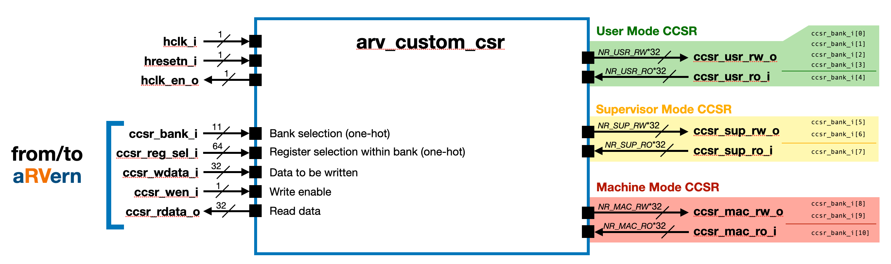
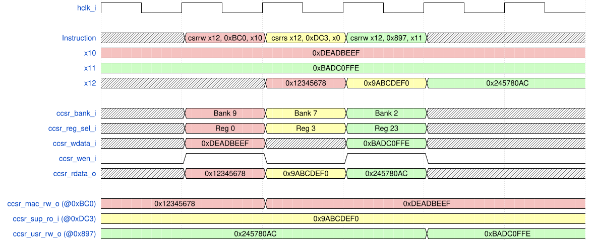

<p align="center">
  
</p>

# Custom CSR Peripheral

*Parameterizable custom CSR register file for the aRVern core's custom CSR interface.*

---

## Contents

- [Overview](#overview)
  - [Behaviour at a glance](#behaviour-at-a-glance)
  - [Design parameters](#design-parameters)
  - [Block diagram](#block-diagram)
  - [Module hierarchy](#module-hierarchy)
  - [Port summary](#port-summary)
  - [Integration requirements](#integration-requirements)
  - [Lint waivers](#lint-waivers)
- [Custom Control and Status Banks](#custom-control-and-status-banks)
  - [Bank → CSR address map](#bank--csr-address-map)
  - [Register index → CSR address](#register-index--csr-address)
- [Custom CSR Transfer Example](#custom-csr-transfer-example)
- [Repository layout](#repository-layout)
- [Verification](#verification)
  - [Bench](#bench)
  - [Builds](#builds)
  - [Test suite](#test-suite)
  - [Lint](#lint)
  - [Running](#running)
- [Synthesis](#synthesis)
- [License](#license)

---

## Overview

The **`arv_custom_csr`** module implements a configurable number of custom
CSR registers for **User**, **Supervisor** and **Machine** mode, each level
with a read-write (RW) group of flops and a read-only (RO) group that
muxes externally sourced values. It sits on the custom CSR interface of an
aRVern core built with `CCSR_EN = 1`: the core decodes the CSR address into
a one-hot bank and a one-hot register select, the IP returns the selected
value combinationally in the same cycle and, on a write, captures the write
data at the next clock edge. RW register values are exported on
`ccsr_*_rw_o` for the SoC; RO values enter on `ccsr_*_ro_i`. The core's
side of the contract (port group, tie-offs at `CCSR_EN = 0`, protocol) is
§7 of the aRVern integration guide
(<https://github.com/Arvern-Silicon/arvern/blob/main/doc/integration_guide.md#7-custom-csr-interface>).

The IP performs no privilege, access-type or existence check. Driven by
aRVern, privilege (`csr[9:8]`), the read-only windows (`csr[11:10] = 11`)
and legality are checked in the core's CSR unit before any select is
asserted: a failing access raises an illegal-instruction exception and
asserts no bank, select or write enable. The IP trusts its inputs.

### Behaviour at a glance

| Access presented | Response |
|---|---|
| Read of an implemented RW register | Its value on `ccsr_rdata_o` in the same cycle; `hclk_en_o = 0`. |
| Read of an implemented RO register | The `ccsr_*_ro_i` slice on `ccsr_rdata_o` in the same cycle, unregistered; `hclk_en_o = 0`. |
| Write (`ccsr_wen_i = 1`) to an implemented RW register | The old value on `ccsr_rdata_o` in the same cycle; `ccsr_wdata_i` captured at the edge that ends the cycle; `hclk_en_o = 1` for that cycle. |
| Write with a RO bank selected | Ignored: RO groups have no storage and take no write; `hclk_en_o = 0`. Behind aRVern such a write never arrives — the core traps it as an illegal instruction. |
| Offset at or above `NR_*` inside an allocated bank, or any offset of a disabled group (`NR_* = 0`) | Reads `0`; a write is ignored; `hclk_en_o = 0`. |
| Core-owned addresses `0x7FD–0x7FF`, `0xFFC–0xFFF` | Never presented: the core keeps `ccsr_reg_sel_i` all-zero there and serves the access itself (see [Bank → CSR address map](#bank--csr-address-map)). |
| No selection (`ccsr_bank_i = 0` or `ccsr_reg_sel_i = 0`) | `ccsr_rdata_o = 0`, `hclk_en_o = 0`, whatever `ccsr_wen_i` and `ccsr_wdata_i` carry. |
| Multi-hot bank or select | Bitwise OR of every selected value on `ccsr_rdata_o`; a write lands in every selected RW register. Not detected. |
| During reset | Every RW register and every `ccsr_*_rw_o` slice is `0`; `ccsr_rdata_o = 0` and `hclk_en_o = 0` while the core presents no access, as it does in reset. |

### Design parameters

| Parameter      | Purpose | Default | Range |
|----------------|---------|---------|-------|
| `NR_USR_RW`    | User-mode RW registers (banks 0–3) | `6` | 0 … 256 |
| `NR_USR_RO`    | User-mode RO registers (bank 4) | `2` | 0 … 64 |
| `NR_SUP_RW`    | Supervisor-mode RW registers (banks 5–6) | `4` | 0 … 128 |
| `NR_SUP_RO`    | Supervisor-mode RO registers (bank 7) | `2` | 0 … 64 |
| `NR_MAC_RW`    | Machine-mode RW registers (banks 8–9) | `2` | 0 … 128; registers 61–63 are unreachable behind aRVern (see the address map) |
| `NR_MAC_RO`    | Machine-mode RO registers (bank 10) | `1` | 0 … 60 |
| `ASYNC_RST_EN` | Reset style: `1` = asynchronous assertion, `0` = synchronous (needs a clock edge during reset). See the repository README's [Reset architecture](../../README.md#reset-architecture). | `1` | `0` or `1` |

`0` disables a group: its sub-instance is not built, its port is 1 bit
wide (a RW output tied to `0`, to be left unconnected; a RO input that is
unused, to be tied low), and every address of its banks reads `0` and
ignores writes.

The ranges are checked by a simulation `$fatal` at elaboration (and by
lint); synthesis does not check them. A value above the maximum makes a
select slice reversed or out of range and fails elaboration in every tool;
`ASYNC_RST_EN` outside `{0, 1}` is rejected the same way. The reset style
is threaded to every flop through the shared `arv_ipdff` primitive.

### Block diagram



The left-hand ports are the core's custom CSR port group, connected
one-to-one (`ccsr_bank_o → ccsr_bank_i`, and so on); the right-hand ports
carry the register values, one group per privilege level, with the banks
each group answers to listed beside it. Port directions and widths are
those of the [Port summary](#port-summary): every `ccsr_*_rw_o` is an
output of `NR_*_RW × 32` bits and every `ccsr_*_ro_i` an input of
`NR_*_RO × 32` bits.

### Module hierarchy

The IP is a thin top-level decoder plus six parameterised sub-instances —
one RW register group and one RO register group per privilege level:

```
arv_custom_csr
├── arv_ccsr_rdwr   #(NR_USR_RW)   User-mode RW       (banks 0..3)
├── arv_ccsr_rdonly #(NR_USR_RO)   User-mode RO       (bank 4)
├── arv_ccsr_rdwr   #(NR_SUP_RW)   Supervisor-mode RW (banks 5..6)
├── arv_ccsr_rdonly #(NR_SUP_RO)   Supervisor-mode RO (bank 7)
├── arv_ccsr_rdwr   #(NR_MAC_RW)   Machine-mode RW    (banks 8..9)
└── arv_ccsr_rdonly #(NR_MAC_RO)   Machine-mode RO    (bank 10)
```

A RW group spans several banks: register *i* of the group is at bank
*i* / 64 of the group's banks, offset *i* mod 64 (see
[Register index → CSR address](#register-index--csr-address)). A RO group
is one bank. The top ANDs `ccsr_reg_sel_i` with each bank bit into a
per-register select vector, hands each group its `[NR_*-1:0]` slice, and
ORs the six group read outputs onto `ccsr_rdata_o` and the three RW group
write strobes onto `hclk_en_o`. Each sub-instance is wrapped in a
`generate if (NR_* > 0)`; an `arv_ccsr_rdwr` holds one `arv_ipdff` per
register, written when its select and `ccsr_wen_i` are both high, and a
flat AND-OR read mux; an `arv_ccsr_rdonly` is the read mux alone.

### Port summary

**Clock and reset**

| Direction | Port        | Width | Reset value | Description |
|-----------|-------------|-------|-------------|-------------|
| in        | `hclk_i`    | 1     | —   | Module clock (the core's clock domain), gated by the SoC's ICG |
| in        | `hresetn_i` | 1     | —   | Active-low; assertion per `ASYNC_RST_EN`; de-assertion synchronised by the integrator |
| out       | `hclk_en_o` | 1     | `0` | Clock-gate enable; high exactly on a write to an implemented RW register; drives an external ICG cell |

**Core interface** (connected one-to-one to the core's `ccsr_*` port group)

| Direction | Port             | Width | Reset value | Description |
|-----------|------------------|-------|-------------|-------------|
| in        | `ccsr_bank_i`    | 11    | —   | Bank select, one-hot or all-zero (see [Bank → CSR address map](#bank--csr-address-map)) |
| in        | `ccsr_reg_sel_i` | 64    | —   | Register select within the bank, one-hot or all-zero; bit *k* is offset *k* |
| in        | `ccsr_wdata_i`   | 32    | —   | Write data; sampled at the edge that ends a write cycle |
| in        | `ccsr_wen_i`     | 1     | —   | Write enable; one cycle per write |
| out       | `ccsr_rdata_o`   | 32    | `0` | Read data; combinational from the selected register, `0` with nothing selected |

Both select vectors are all-zero outside a custom-CSR access. The IP ANDs
bank and select, so a select without a bank, or a bank with the select
masked (the core-owned addresses), reaches no register. The IP does no
binary → one-hot conversion: the core decodes the address.

**Register values**

| Direction | Port            | Width | Reset value | Description |
|-----------|-----------------|-------|-------------|-------------|
| out       | `ccsr_usr_rw_o` | `NR_USR_RW × 32` (1 when `NR_USR_RW = 0`) | `0` | User-mode RW register values; register *i* in bits `[32i+31:32i]` |
| in        | `ccsr_usr_ro_i` | `NR_USR_RO × 32` (1 when `NR_USR_RO = 0`) | —   | User-mode RO register sources, same packing; consumed combinationally in the access cycle |
| out       | `ccsr_sup_rw_o` | `NR_SUP_RW × 32` (1 when `NR_SUP_RW = 0`) | `0` | Supervisor-mode RW register values |
| in        | `ccsr_sup_ro_i` | `NR_SUP_RO × 32` (1 when `NR_SUP_RO = 0`) | —   | Supervisor-mode RO register sources |
| out       | `ccsr_mac_rw_o` | `NR_MAC_RW × 32` (1 when `NR_MAC_RW = 0`) | `0` | Machine-mode RW register values |
| in        | `ccsr_mac_ro_i` | `NR_MAC_RO × 32` (1 when `NR_MAC_RO = 0`) | —   | Machine-mode RO register sources |

### Integration requirements

In order:

1. Choose the six register counts against the
   [address map](#bank--csr-address-map) — Machine RW registers 61–63 and
   Machine RO registers 60 and up are the core's.
2. Connect the core's `ccsr_*` port group one-to-one (the core is built
   with `CCSR_EN = 1`).
3. Source every `ccsr_*_ro_i` from `hclk_i` flops or constants; tie a
   disabled group's 1-bit input low and leave a disabled group's 1-bit
   output unconnected.
4. Drive the ICG on `hclk_i` from `hclk_en_o | ~hresetn_i`.
5. Synchronise the reset de-assertion to `hclk_i`.
6. Take the boundary budgets from `synthesis/synopsys/constraints.tcl`.

- **Reset (`hresetn_i`)** — active-low. Assertion is asynchronous with
  `ASYNC_RST_EN = 1` (default) and synchronous with `0`; de-assertion
  **must be synchronised to `hclk_i`** by the integrator — the IP contains
  no reset synchroniser, and an asynchronous de-assert on the first
  capture edge is a metastability hazard. Every RW register clears to
  `0x00000000`. Minimum assertion: none in asynchronous mode; one delivered
  `hclk_i` edge in synchronous mode. A write on the interface when reset
  asserts is dropped.

- **Clock gating (`hclk_en_o` → `hclk_i`)** — `hclk_en_o` is a
  **combinational** enable, `|(select & ccsr_wen_i)` over the implemented
  RW registers of the three groups: high exactly in a cycle where
  `ccsr_wen_i` selects an implemented RW register, low for reads, RO
  banks, unimplemented offsets and the core-owned addresses. It carries no
  reset term: keeping the clock running while reset is asserted is the
  integrator's job — the ICG enable is `hclk_en_o | ~hresetn_i` (the bench
  does exactly this). With `ASYNC_RST_EN = 0` the registers take their
  reset value only on a delivered clock edge, so without the keep-alive
  they come out of reset unreset. The enable **must drive a latch-based
  ICG cell**, its enable latched while the clock is low; an AND of the
  enable with `hclk_i` on a flop clock pin passes decode glitches. The
  enable is combinational from the core's EX-stage flops through the
  core's bank decode and this IP's select decode and must reach the ICG
  before the rising edge that captures the write; `constraints.tcl`
  budgets it at 75 % of the clock period.

- **Read-only inputs and the read path** — `ccsr_*_ro_i` must be driven
  by flops clocked on `hclk_i` or be static; a value from another clock
  domain must be synchronised or handshaken before the IP. The IP muxes
  them combinationally onto `ccsr_rdata_o`, and the core writes that value
  into its register file and, for `csrrs`/`csrrc`, folds it into
  `ccsr_wdata_i` in the same cycle: the path `ccsr_bank_i`/`ccsr_reg_sel_i`
  → `ccsr_rdata_o` → core → `ccsr_wdata_i` → register D input is one clock
  period across both modules. Insert no logic, retiming or isolation
  between the core and the IP. The boundary budgets are in
  `synthesis/synopsys/constraints.tcl`: every input (the RO values
  included) is budgeted to arrive 20 % of the clock period after the
  edge, `ccsr_rdata_o` is due by 70 %, `ccsr_*_rw_o` and `hclk_en_o` by
  75 %.

- **Trust boundary** — privilege, read-only-ness and existence are the
  core's checks (see [Overview](#overview)). `ccsr_wen_i` on a RO bank is
  a no-op only because RO groups have no storage. The external debugger of
  a core built with `DEBUG_EN` reaches every custom register through
  abstract commands regardless of privilege. Any other master driving this
  interface must replicate the core's checks.

- **One-hot interface (`ccsr_bank_i`, `ccsr_reg_sel_i`)** — both vectors
  must be one-hot or all-zero. A multi-hot input bitwise-ORs the data of
  every selected register onto `ccsr_rdata_o` and writes every selected RW
  register; the IP does not detect or recover from that state.

### Lint waivers

The RTL sizes its select vectors for the architectural maximum, but each
sub-instance consumes only the lower `[NR_*-1:0]` bits. The upper bits, a
disabled RO group's input, and — without any RW group — the clock, reset
and write inputs are tied to sink wires whose names end in `_unused`
(`ccsr_reg_en_*_unused`, `ccsr_*_ro_unused`, `hclk_unused`,
`hresetn_unused`, `ccsr_wdata_unused`, `ccsr_wen_unused`). The postfix is
the aRVern IP family's convention: one name-based rule waives the
unloaded-net finding in any lint tool, with no pragma in the RTL.

- **Verilator** (`sim/rtl_sim/run/run_lint`, `--lint-only -Wall
  -Wpedantic`): nothing to add — a signal whose name contains `unused` is
  exempt from `UNUSEDSIGNAL`. `sim/rtl_sim/run/waivers.vlt` holds only the
  `` `verilator_config `` header and is the place for any further rule.
- **VC Static** (`lint/vc_static/waivers.tcl`): one waiver,
  `waive_hdl -add unused_sink_wires -filter {Signal=~*_unused*}`, which
  matches by signal name only and so covers every connectivity tag that
  can fire on such a net (`CONN_NET_UNLOADED`,
  `CONN_INTERNAL_NET_UNLOADED`, `CONN_PORT_UNLOADED`); nothing without the
  postfix is waived. `run_vclint` reports a waiver that matched nothing as
  `stale`.

Keep the `_unused` postfix when adding RTL so the rule stays valid.

---

## Custom Control and Status Banks

The custom CSR address ranges of the RISC-V privileged specification are
organised into **11 banks of 64 addresses each**. For a custom CSR access
the core sets the bank's bit of `ccsr_bank_i` and the offset's bit of
`ccsr_reg_sel_i`; both are all-zero otherwise.

### Bank → CSR address map

| Bank    | CSR address range | Privilege  | Access | Registers | Selector |
|---------|-------------------|------------|--------|-----------|----------|
| Bank 0  | `0x800 – 0x83F`   | User       | RW     | User RW 0–63 | `ccsr_bank_i[0]` |
| Bank 1  | `0x840 – 0x87F`   | User       | RW     | User RW 64–127 | `ccsr_bank_i[1]` |
| Bank 2  | `0x880 – 0x8BF`   | User       | RW     | User RW 128–191 | `ccsr_bank_i[2]` |
| Bank 3  | `0x8C0 – 0x8FF`   | User       | RW     | User RW 192–255 | `ccsr_bank_i[3]` |
| Bank 4  | `0xCC0 – 0xCFF`   | User       | RO     | User RO 0–63 | `ccsr_bank_i[4]` |
| Bank 5  | `0x5C0 – 0x5FF`   | Supervisor | RW     | Supervisor RW 0–63 | `ccsr_bank_i[5]` |
| Bank 6  | `0x9C0 – 0x9FF`   | Supervisor | RW     | Supervisor RW 64–127 | `ccsr_bank_i[6]` |
| Bank 7  | `0xDC0 – 0xDFF`   | Supervisor | RO     | Supervisor RO 0–63 | `ccsr_bank_i[7]` |
| Bank 8  | `0x7C0 – 0x7FC` usable (`0x7FD – 0x7FF` core) | Machine | RW | Machine RW 0–60 (61–63 core) | `ccsr_bank_i[8]` |
| Bank 9  | `0xBC0 – 0xBFF`   | Machine    | RW     | Machine RW 64–127 | `ccsr_bank_i[9]` |
| Bank 10 | `0xFC0 – 0xFFB` usable (`0xFFC – 0xFFF` core) | Machine | RO | Machine RO 0–59 (60–63 core) | `ccsr_bank_i[10]` |

> **Core-owned addresses.** The aRVern core keeps seven addresses inside
> the Machine banks for its own CSRs: `0x7FD`–`0x7FF` (`marv_nmvec`,
> `marv_estat`, `marv_ctl`; bank 8) and `0xFFC`–`0xFFF` (`marv_epc`,
> `marv_eaddr`, `reset_vector`, `marv_cfg`; bank 10). The core never
> selects them on this interface (`ccsr_reg_sel_i` is all-zero there) and
> ignores `ccsr_rdata_o`. Machine RW registers 61–63 are therefore
> unreachable when `NR_MAC_RW >= 62` — they are built, hold their reset
> value and their `ccsr_mac_rw_o` slices stay `0`; registers 64 and up, in
> bank 9 (`0xBC0`), are reachable. `NR_MAC_RO` is limited to 60 for the
> same reason.

> **Supervisor banks without S-mode.** On a core built without S-mode
> (`SU_MODE_EN = 0`) the Supervisor banks 5, 6 and 7 remain accessible
> from M-mode, unlike the standard S-mode CSRs; an integrator who does not
> want them sets `NR_SUP_RW = NR_SUP_RO = 0` (the `no_sup` configuration).

> **Hypervisor.** The custom CSR ranges of the Hypervisor / VS level
> (`0x6C0–0x6FF`, `0xAC0–0xAFF`, `0xEC0–0xEFF`) are not supported by this
> IP.

### Register index → CSR address

Register *i* of a RW group sits at bank *i* / 64 of the group's banks,
offset *i* mod 64, and occupies `ccsr_*_rw_o[32i+31:32i]`; register *i*
of a RO group sits at offset *i* of its bank and is read from
`ccsr_*_ro_i[32i+31:32i]`. User RW is contiguous: register *i* is at
`0x800 + i`. Supervisor and Machine RW jump banks at 64: Supervisor
register 63 is `0x5FF` and register 64 is `0x9C0`; Machine register 60 is
`0x7FC` (61–63 core-owned) and register 64 is `0xBC0`. A register exists
only when its index is below the group's `NR_*`: `0x897` is User RW
register 151 (bank 2, offset 23) and exists only when
`NR_USR_RW >= 152`; any offset at or above `NR_*` reads `0` and ignores
writes.

---

## Custom CSR Transfer Example

The waveform shows three successive instructions targeting different
banks: a `csrrw` to Machine RW register 64 at `0xBC0` (bank 9, offset 0;
needs `NR_MAC_RW >= 65`), a `csrrs` reading Supervisor RO register 3 at
`0xDC3` (bank 7; needs `NR_SUP_RO >= 4`), and a `csrrw` to User RW
register 151 at `0x897` (bank 2, offset 23; needs `NR_USR_RW >= 152`).



For each access the core asserts the matching one-hot bits of
`ccsr_bank_i` and `ccsr_reg_sel_i` for one cycle and samples
`ccsr_rdata_o` in that cycle; the value read is written to the
instruction's destination register at the following edge. `ccsr_wen_i` is
high for `csrrw`/`csrrwi` always and for `csrrs`/`csrrc` (`csrrsi`/`csrrci`)
only with `rs1 != x0` (`uimm != 0`) — the second access is a pure read.
On a write the core drives `ccsr_wdata_i` in the same cycle (for
`csrrs`/`csrrc` computed from the value read), the IP captures it at the
edge that ends the cycle, and the `ccsr_*_rw_o` slice shows the new value
from the next cycle.

---

## Repository layout

```
arv_custom_csr/
├── arv_custom_csr.core        FuseSoC manifest (RTL fileset + lint target)
├── rtl/verilog/
│   ├── arv_custom_csr.v       Top: bank decode, six generate-guarded groups, read OR, hclk_en_o
│   ├── arv_ccsr_rdwr.v        RW register group (flops + one-hot read mux), instantiated 3x
│   ├── arv_ccsr_rdonly.v      RO register group (read mux only), instantiated 3x
│   └── filelist.f             RTL source list (sim, lint and synthesis; pulls in arv_primitives)
├── bench/verilog/
│   ├── tb_arv_custom_csr.v    Testbench: -D parameters, ICG model, reference model and monitor, DUT
│   ├── csr_tasks.v            csr_read / csr_read_write / csr_no_write_attempt, address → bank decode
│   ├── submit.f               Simulation file list
│   └── timescale.v
├── sim/rtl_sim/
│   ├── src/                   One <test>.v per test
│   ├── run/                   run, run_all, run_lint, waivers.vlt
│   └── bin/                   runsim, rtlsim.sh, parse_results, parse_summaries, rtl_configs.py,
│                              rtl_configs_defines.py, gen_rtl_params.py, flatten_filelist.py
├── lint/vc_static/            VC Static flow: run_vclint, rules.tcl, waivers.tcl, vc_lint.tcl, README.md
├── synthesis/synopsys/
│   ├── synthesis.tcl          Top-level Design Compiler flow (DFT insertion, reports, netlist)
│   ├── library.tcl            Library selection via LIB_FLAVOR
│   ├── read.tcl               Analyze / elaborate (applies the -rtl_config parameters)
│   ├── constraints.tcl        Clock, path groups, boundary delays, false path on hresetn_i
│   ├── run_syn                Synthesis launcher (-lib, -rtl_config, -rtl_sweep, -list_configs)
│   ├── run_check_reset_style  Gate-level reset-style check (PrimeTime, check_reset_style_pt.tcl)
│   ├── extract_worst_path.py  Worst-path summary printed after a run
│   └── libraries/             setup_lib_example.tcl template; add your setup_<flavor>.tcl here
└── doc/
    ├── arv_custom_csr.md      This document
    └── img/                   Block diagram, WaveDrom JSON source + rendered SVG, render.py
```

---

## Verification

The verification flow uses **Verilator** for linting and **Icarus Verilog**
(default) for simulation; **VC Static** provides the signoff lint.
`VERILOG_SIMULATOR` (set in `run` / `run_all`) selects the simulator;
Icarus Verilog is the one the regression uses.

### Bench

`bench/verilog/tb_arv_custom_csr.v` takes the six `NR_*` counts and
`ASYNC_RST_EN` as `-D` defines (fallback 4/2/4/2/4/2, asynchronous reset),
drives the DUT on a free-running clock behind a latch ICG model whose
enable is `hclk_en | ~hresetn` — the clock runs during reset, as the
synchronous-reset build needs — and pads every register port to its
architectural maximum (`usr_rw_pad`, `usr_ro_pad`, …) so a test indexes
register *i* as `<group>_pad[32*i+:32]` at any configuration.

A reference model holds the RW registers and decodes the interface as the
address map states. Sampled at the falling edge, it checks every cycle,
whatever the test does: `ccsr_rdata_o` equals the selected register (`0`
for an offset ≥ `NR_*`, a disabled group, or no selection); `hclk_en_o` is
high exactly on a write to an implemented RW register; every
`ccsr_*_rw_o` slice equals the model. Tests drive the interface through
`csr_read_write(addr, wdata, expected, check)`, `csr_read(addr, expected,
check)` and `csr_no_write_attempt(addr, wdata)` of `csr_tasks.v`
(`csr_addr_to_bank` decodes the address into the bank bit; the stimulus is
set 1 ns after the rising edge, held one cycle, and the read value
compared at the next edge); `check_value(actual, expected)` compares a
port slice. A test counts mismatches in `error` and ends by raising
`stimulus_done`; the bench then prints `SIMULATION PASSED` when
`error == 0`.

### Builds

`run_all` runs the four fixed-address tests (`simple_rdwr`,
`simple_rdonly`, `supervisor_rdwr`, `wen_zero`, written for 4/2/4/2/4/2)
in the asynchronous and the synchronous (`-D ASYNC_RST_EN=0`, logs
`<test>-sync.log`) build, and the four configuration-independent tests
(`bank_map_sweep`, `random_access`, `reset_values`, `register_walk`) on every entry of
`sim/rtl_sim/bin/rtl_configs.py` — `default` (RTL defaults), `min_banks`
(every count 1), `wide_banks` (every count 8), `sync_rst`
(`ASYNC_RST_EN = 0`), `ro_only` (no RW group), `rw_only` (no RO group),
`no_sup` (no Supervisor group), `two_banks` (65 RW registers per group)
and `max_banks` (256/64/128/64/128/60) — logs `<test>-<config>.log`. The
same table drives the VC Static lint and synthesis sweeps; a new
configuration goes there once. A single test takes the defines through
`SIM_EXTRA_DEFINES`, e.g.
`SIM_EXTRA_DEFINES="-D NR_USR_RW=65 -D NR_SUP_RW=65 -D NR_MAC_RW=65" ../bin/runsim bank_map_sweep`;
`python3 ../bin/rtl_configs_defines.py` prints the full define string of
every configuration. The test lists are the `FIXED_TESTS` and
`SWEEP_TESTS` variables of `run_all`; a new test is added there.

### Test suite

| Test | What it pins | Builds |
|---|---|---|
| `simple_rdwr`      | User bank 0 and Machine bank 8: reset value, read-back of writes, repeated overwrites, reads with `wen = 0`. | default, sync |
| `simple_rdonly`    | The three RO banks (4, 7, 10): reads track the driven RO inputs; `wen = 1` on a RO address is a no-op. | default, sync |
| `supervisor_rdwr`  | Supervisor bank 5: writes, read-back, the `ccsr_sup_rw_o` slices; bank isolation — User bank 0 and Machine bank 8 stay at reset. | default, sync |
| `wen_zero`         | A valid bank and select with non-zero `wdata` and `wen = 0`: the register and its output slice keep their value; a normal write still works afterwards. | default, sync |
| `bank_map_sweep`   | Every offset of every bank: a write with a value unique to (bank, offset), then a read of every offset, RO inputs unique per (group, index). Pins the index → bank/offset mapping including the bank crossing at 64, RAZ/WI above `NR_*`, writes to RO banks ignored, `hclk_en_o`, the RW ports, and the write count `NR_USR_RW + NR_SUP_RW + NR_MAC_RW`. | all nine configurations |
| `random_access`    | 4000 cycles of random traffic: back-to-back and idle cycles, any bank and offset, reads, writes, write enable without a selection, RO inputs changing under the reads; every register read back at the end. | all nine configurations |
| `reset_values`     | Every implemented RW register written non-zero, then reset asserted while a write is on the interface: the asynchronous build clears the ports before the next edge; both builds hold zero through reset, drop the in-flight write and read zero afterwards. | all nine configurations |
| `register_walk`    | Every bit of every implemented register: each RW register written `0xFFFFFFFF`, `0xAAAAAAAA`, `0x55555555`, `0x00000000`, each value read back and checked on its `ccsr_*_rw_o` slice; each `ccsr_*_ro_i` slice driven all-ones then all-zeros and read; with a RO group disabled (its input tied low), or a RW group disabled, every address of its banks reads `0` and a write there changes nothing. Ends with everything at `0`. | all nine configurations |

### Lint

```bash
cd sim/rtl_sim/run
./run_lint                  # Verilator --lint-only -Wall -Wpedantic, RTL defaults
```

`lint/vc_static/run_vclint [-rtl_config <N|name> | -rtl_sweep]` runs the
VC Static signoff lint, from a shell with `vc_static_shell` on PATH, over
the configuration table `sim/rtl_sim/bin/rtl_configs.py` — the same table
`run_all` and `run_syn -rtl_config` iterate; `-list_configs` numbers the
entries and `lint/vc_static/README.md` has the option list. Reports land
in `lint/vc_static/results/`; a `-rtl_config` run also snapshots them to
`results_sweep/<label>/`, and `-rtl_sweep` writes one line per
configuration to `results_sweep/sweep_summary.log`.

### Running

```bash
cd sim/rtl_sim/run
./run                       # default test: simple_rdwr (dumps tb_arv_custom_csr.vcd)
./run bank_map_sweep        # any test under sim/rtl_sim/src/<name>.v, bench defaults
./run_all                   # every test in its builds, one iteration
./run_all 5                 # same, 5 iterations (different random seeds)
```

A test passes when its log contains `SIMULATION PASSED`. `run_all` writes
one log per test and build to `log/<iter>/<test><suffix>.log` (`<suffix>`
empty, `-sync`, or `-<config>` for the configuration-independent tests)
and the summary to `log/summary.<iter>.log` (several iterations add
`log/regressions_summary.log`); the summary carries a replay command
`../bin/runsim -seed <N> <test>` per test — prefix it with the build's
`SIM_EXTRA_DEFINES` to replay a non-default build.

---

## Synthesis

The Design Compiler flow lives under `synthesis/synopsys/` and uses the
`LIB_FLAVOR` mechanism shared by the rest of the aRVern IP family.
`libraries/setup_lib_default.tcl` is intentionally absent, because it
names your technology; create it from the tracked `setup_lib_example.tcl`
before the first run (see the repository README,
[Synthesis](../../README.md#synthesis)).

```bash
cd synthesis/synopsys
cp libraries/setup_lib_example.tcl libraries/setup_lib_default.tcl   # once, then edit
./run_syn                          # default flavor (lib_default), RTL defaults
./run_syn -lib <flavor>            # a specific libraries/setup_<flavor>.tcl
./run_syn -lib <flavor> -i         # interactive (keep dc_shell open after the run)
./run_syn -rtl_config <N|name>     # one entry of sim/rtl_sim/bin/rtl_configs.py
./run_syn -rtl_sweep               # every entry; one summary line each
./run_syn -list_configs            # number the entries
./run_check_reset_style            # PrimeTime reset-style check of results/<top>.gate.v
```

Any `setup_<flavor>.tcl` under `libraries/` is a flavor; with an unknown
one `./run_syn` stops and prints the list it found.

The configurations are the nine of [Builds](#builds): `default`,
`min_banks`, `wide_banks`, `sync_rst` (`ASYNC_RST_EN = 0`: the
synchronous-reset branch of `arv_ipdff` and the matching DFT reset
declaration), `ro_only` (no flop at all), `rw_only`, `no_sup`, `two_banks`
and `max_banks`. A `-rtl_config` build also snapshots its reports to
`results_sweep/<label>/`; `-rtl_sweep` builds every entry and writes
`results_sweep/sweep_summary.log`, one line per configuration with its
timing violations, unconstrained endpoints and DFT DRC violations — a
build is `PASS` only when all three are zero.

`constraints.tcl` defines one clock, `hclk_i`. The boundary delays are
20 % of the clock period on every input (the RO values included), 70 % on
`ccsr_rdata_o` and 75 % on `ccsr_*_rw_o` and `hclk_en_o` (it drives the
SoC's ICG); `hresetn_i` is a false path. Input-to-output feed-throughs
(`ccsr_bank_i`/`ccsr_reg_sel_i` → `ccsr_rdata_o` and `hclk_en_o`,
`ccsr_*_ro_i` → `ccsr_rdata_o`) form their own path group. The read path
is a flat AND-OR tree over every implemented register; at the largest
configurations it is the deepest logic on the core's single-cycle CSR path
(see [Integration requirements](#integration-requirements)) and cannot be
pipelined without breaking the read-modify-write contract. DFT is
inserted in every configuration with registers: multiplexed flip-flop scan
chains clocked by `hclk_i`; `hresetn_i` is declared a reset in the
asynchronous build and held constant in the synchronous one. A
configuration without RW registers (`ro_only`) has nothing to scan; the
flow skips DFT and reports zero violations.

`run_check_reset_style` runs PrimeTime (`check_reset_style_pt.tcl`) on
`results/arv_custom_csr.gate.v` and confirms every flop carries the
expected reset style. The expected style is detected from the
configuration the netlist was built with (`rtl_params.tcl` after a
`-rtl_config` run, otherwise the RTL default of `ASYNC_RST_EN`);
`EXPECT=async|sync` overrides it.

Outputs land in `synthesis/synopsys/results/`:

| File                                         | Description                                          |
|----------------------------------------------|------------------------------------------------------|
| `arv_custom_csr.gate.v`, `arv_custom_csr.ddc` | Gate-level netlist and DDC database                 |
| `arv_custom_csr.spf`, `arv_custom_csr.svf`   | DFT scan test protocol; Formality setup file         |
| `report.area`, `report.full_area`            | Area summary (incl. NAND2-equivalent) and hierarchy  |
| `report.timing`, `report.check_timing_pre`   | Timing check; unconstrained endpoints                |
| `report.paths.*`, `report.full_paths.*`      | Worst-path end-point and full-path reports (max / min) |
| `report.constraints`                         | Constraint compliance                                |
| `report.dft_*`                               | DFT DRC, coverage estimate, scan-chain configuration |
| `report.check`, `report.refs`                | `check_design` output; cell references               |
| `synthesis.log`                              | Full dc_shell transcript                             |

---

## License

BSD 3-Clause — see [`LICENSE`](../../LICENSE) at the repo root.
