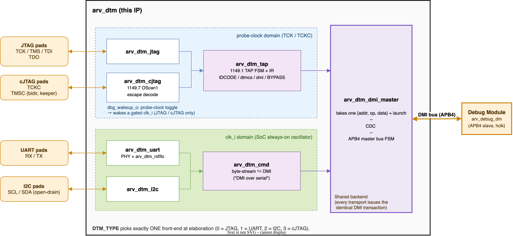

<p align="center">
  
</p>

# arv_dtm — Debug Transport Modules for the aRVern core

*Four Debug Transport Modules (JTAG, cJTAG, UART, I2C) over one shared APB4 DMI master,
selected at elaboration by a single wrapper.*

---

## Contents

- [Overview](#overview)
  - [Transports](#transports)
  - [Block structure](#block-structure)
- [Integrating this IP — the short version](#integrating-this-ip--the-short-version)
- [Integration requirements](#integration-requirements)
  - [Clock-ratio bounds](#clock-ratio-bounds)
  - [Build-time transport selection (`arv_dtm` wrapper)](#build-time-transport-selection-arv_dtm-wrapper)
- [Shared DMI master (`arv_dtm_dmi_master`)](#shared-dmi-master-arv_dtm_dmi_master)
  - [Clock-domain crossing](#clock-domain-crossing)
  - [Where DMI errors surface](#where-dmi-errors-surface)
- [DMI over serial (wire format)](#dmi-over-serial-wire-format)
- [Cold attach — `dbg_wakeup_o`](#cold-attach--dbg_wakeup_o)
- [DFT / scan — what the integrator owes, and what the IP owes](#dft--scan--what-the-integrator-owes-and-what-the-ip-owes)
- [Part-number catalog](#part-number-catalog)
- [Verification](#verification)
  - [Bench](#bench)
  - [Builds](#builds)
  - [Test suite](#test-suite)
  - [Lint](#lint)
  - [Running](#running)
- [Synthesis](#synthesis)
- [Repository layout](#repository-layout)
- [License](#license)

---

## Overview

The `arv_dtm` IP provides the Debug Transport Modules (DTMs) that drive the aRVern
core's Debug Module Interface (DMI). The core exposes a transport-agnostic DMI bus
(an **APB4 slave** in the `hclk` domain); this IP is the master side, and offers
four transports over **one shared backend** — only the physical layer differs.

This hub documents what is **shared by every transport**: the block structure, the
`arv_dtm_dmi_master` APB4 master and its clock-domain crossing, the byte-level
"DMI over serial" wire format (UART + I2C), the integration rules, and the
verification, lint and synthesis flows. Read this first, then the per-transport page.

### Transports

| Transport | Module | Pins | Tooling | Documentation |
|-----------|--------|------|---------|---------------|
| **JTAG**  | `arv_dtm_jtag`  | 4 (+TRST) | OpenOCD + GDB **out of the box**, with any adapter OpenOCD supports; a J-Link; or [`arvern-tools`][tools] with an FT232H | **[arv_dtm_jtag.md](arv_dtm_jtag.md)** |
| **cJTAG** | `arv_dtm_cjtag` | 2 | A J-Link in its cJTAG mode — SEGGER Ozone or the J-Link GDB Server (validated on hardware with Ozone). OpenOCD over cJTAG is not validated; `arvern-tools` cJTAG support is planned | **[arv_dtm_cjtag.md](arv_dtm_cjtag.md)** |
| **I2C**   | `arv_dtm_i2c`   | 2, *shareable* | [`arvern-tools`][tools] — loader, GDB server, CLI and GUI | **[arv_dtm_i2c.md](arv_dtm_i2c.md)** |
| **UART**  | `arv_dtm_uart`  | 2 | [`arvern-tools`][tools] — loader, GDB server, CLI and GUI | **[arv_dtm_uart.md](arv_dtm_uart.md)** |

[tools]: https://github.com/Arvern-Silicon/arvern-tools

Caveats worth knowing **before** you commit:

- **JTAG — the professional standard.** Dedicated TCK/TMS/TDI/TDO (+ optional TRST);
  GDB/OpenOCD work unmodified, with any adapter OpenOCD supports — an FT232H breakout at
  one end of the price range, a J-Link at the other — and `arvern-tools` drives it
  through an FT232H. The default when a chip can spare the pins.
- **cJTAG — JTAG capability on two pins.** IEEE 1149.7 OScan1. **Point-to-point only** —
  star/multidrop is not implemented — and it implements the OScan1 subset a debug probe
  uses rather than the full TAP.7 class feature set. The probe must itself speak 1149.7:
  the validated host side is a J-Link in its cJTAG mode, so the adapter choice is
  narrower than plain JTAG's.
- **I2C — the low-pin-count option.** Two wires that need not be dedicated: the DTM is an
  I2C *target* at its own address (the wrapper parameter `I2C_ADDR`; a strap-able port
  when `arv_dtm_i2c` is instantiated directly), so it can share an **existing functional
  I2C bus** — the debugger simply addresses the DTM instead of a peripheral.
- **UART — the low-cost option.** Reuses a board's native USB-to-serial bridge, so it
  needs no JTAG pod and no pins beyond the UART already present. Aimed at students and
  FPGA bring-up.

All four are **DMI-native**: the payload *is* the `{address, op, data}` DMI transaction
(JTAG/cJTAG via the spec DRs, UART/I2C via the shared serial format), so the logical
transaction is identical across transports and only the PHY differs.

The serial DTMs are deliberately custom, so they have no out-of-the-box *OpenOCD*
transport — but that does not mean giving up a normal debug session. The
[`arvern-tools`][tools] host stack provides **`arvern-gdbserver`**, a GDB Remote Serial
Protocol gateway, so GDB, CLion or VS Code attach and give source-level stepping,
breakpoints and watchpoints exactly as over JTAG, plus **`arvern-loader`** to load and
run a program, **`arvern-cli`** for scripted run control and **`arvern-minidebug`**, a
GUI. They work over UART, I2C and JTAG (one FT232H covers all three); a cJTAG target is
debugged through a J-Link in its cJTAG mode (SEGGER Ozone or the J-Link GDB Server), and
`arvern-tools` cJTAG support is planned. See [`doc/adapters.md`][adapters] there for
picking a USB dongle.

[adapters]: https://github.com/Arvern-Silicon/arvern-tools/blob/main/doc/adapters.md

### Block structure



| Module | Domain(s) | Role |
|--------|-----------|------|
| `arv_dtm`             | selected transport | **Synthesizable selectable wrapper** — build-time `DTM_TYPE` picks one transport via `generate`. The single-instance integration path. |
| `arv_dtm_dmi_master`  | transport **and** hclk | Transport-agnostic: crosses one DMI transaction into the hclk domain and drives the DMI bus as an **APB4 master**. Shared by every transport. |
| `arv_dtm_tap`         | probe clock | IEEE 1149.1 TAP FSM, IR + decode, and the IDCODE/dtmcs/dmi/BYPASS data registers. Shared by **JTAG and cJTAG** — the two differ only in how bits reach it. |
| `arv_dtm_cmd`         | clk (always-on) | Byte-stream ⇄ DMI interpreter for the **serial** transports, including the DTM-local `DTMSTS` register. Shared by UART/I2C. |
| `arv_dtm_rxfifo`      | clk (always-on) | RX byte FIFO of the serial transports — the host's request-pipelining window (`UART_RX_FIFO_DEPTH` on UART; 8 bytes, one request, on I2C). |
| `arv_dtm_jtag`        | TCK + clk (DMI side) | **JTAG DTM toplevel** — pins + `arv_dtm_tap`. |
| `arv_dtm_cjtag`       | TCKC + clk (escape detector, DMI side) | **cJTAG DTM toplevel** — 1149.7 escape/activation decode + OScan1 de-serialiser, feeding `arv_dtm_tap`. |
| `arv_dtm_uart`        | clk (always-on) | **UART DTM toplevel.** |
| `arv_dtm_i2c`         | clk (always-on) | **I2C DTM toplevel.** |

---

## Integrating this IP — the short version

If you read nothing else, read this. Each step links to the detail.

**1. Pick a transport.** See the table above. JTAG works with stock OpenOCD, a J-Link or
`arvern-tools`, cJTAG with a J-Link; UART and I2C need `arvern-tools` but no pod. `DTM_TYPE` selects one at elaboration — only the
selected front-end is built.

**2. Set your `IDCODE` — JTAG and cJTAG only.** Those two present a 1149.1 TAP, so they
carry an IDCODE; the default is Arvern's and bit 0 must be 1 (checked by a simulation
`$fatal`; synthesis does not check it).
See [Part-number catalog](#part-number-catalog) for the field layout and the revision
rule. UART and I2C have no TAP and ignore the parameter — skip to step 3.

The parameter is `IDCODE_BASE[27:0]` — part-number `[27:12]`, manufacturer `[11:1]`
and the mandatory `1` at `[0]`. The **version field `[31:28]` is not a parameter at
all**: it arrives on the `idcode_version_i[3:0]` port. Bumping a version is the classic
reason to touch an IDCODE, and it is normally a late metal ECO — which a parameter
cannot support, since changing one means re-running synthesis. A 32-bit value is
truncated to the parameter's 28 bits, with no more than a tool width warning; its
version bits are simply lost.

> **Required constraint.** Tie `idcode_version_i` through metal-programmable straps
> and **exclude the net from constant propagation** (`set_dont_touch` / `set_size_only`
> on the driving cells and net) in chip-level synthesis and PD. Without that the tools
> will fold the strap value into the IDCODE register's capture logic and the ECO has
> nothing left to change. This is one of the few places where `arv_dtm` depends on a
> constraint in the *consumer's* flow rather than being correct by construction; it is
> inherent to the requirement, since a net that can be ECO'd must not be optimised away.
> An integrator who misses it gets a version frozen at tapeout, with no warning.

**3. Give it the right clock.** `clk_i` **must be the always-on oscillator**, not the
gated core clock — a debugger has to reach a halted or sleeping hart. See
[Integration requirements](#integration-requirements).

**4. Give it a real reset.** `dbgresetn_i` is a debug-domain reset: it must *not* be
driven by `ndmreset`, or a debugger could reset its own link. `dbgresetn_i` is asserted
asynchronously and must be released synchronously to `clk_i` (a reset synchroniser in
the SoC — the aRVern reset generator does this). At `ARST_EN = 0` hold it low for at
least 3 `clk_i` edges. On JTAG, `trst_n_i` must also be driven — tie it to the debug
reset or pull it up with a POR.

**5. Wire the pads.** Each transport has pad requirements that are easy to miss: a JTAG
build needs pull-ups on TMS, TDI and TRST_N and a clean-edge pad on TCK; cJTAG needs a
**bus keeper** on the bidirectional TMSC; I2C is open-drain with external pull-ups. The
reference FPGA project applies them per `DTM_TYPE`. See the transport page's *Pins*
section.

**6. Respect the clock ratios.** Real constraints, not guidance — one table,
[Clock-ratio bounds](#clock-ratio-bounds), which every transport page refers back to.

**7. Decide about sleep.** If the SoC gates its oscillator, use
[`dbg_wakeup_o`](#cold-attach--dbg_wakeup_o) so a probe can start it. The serial
transports cannot self-wake — `clk_i` must already be running for those.

**8. Handle DFT.** You own scan-fixing everything entering the IP; the IP owns only what
it generates internally. See
[DFT / scan](#dft--scan--what-the-integrator-owes-and-what-the-ip-owes).

**9. Bring up.** Read `IDCODE` first — it proves the link, the pads and the clocking
before any DMI traffic. Then `dtmcs`. Then a DMI read of a known DM register.

---

## Integration requirements

> **`clk_i` MUST be the SoC's always-on (ungated) oscillator — not the gated
> aRVern core clock.**

The aRVern core gates its clock during WFI sleep (`hclk_en_o`). A pending DMI
transaction ungates that clock through the core's `dmi_keepalive` term (a held
`dmi_psel`), so the DMI bus is synchronous whenever a transaction is in flight. But
the DTM's hclk-side logic — in particular the flop that drives `dmi_psel_o` — must
run on the **ungated** oscillator, or it could never issue the transfer that wakes
a WFI-sleeping hart in the first place. Drive `arv_dtm.clk_i` from the same
free-running oscillator that feeds the SoC clock-gate cell, and `arvern.hclk_i` from
the gated output. See the core's
[`debug_interface.md`, §5](https://github.com/Arvern-Silicon/arvern/blob/main/doc/debug_interface.md#5-dmi-bus-protocol-apb4).

Common to every transport:

- The DMI address width is fixed at **7** (`localparam DMI_ABITS` in every DTM module,
  so it cannot be overridden; the core checks its own value with a `$fatal`). The APB
  address port is
  `dmi_paddr_o[8:0]` (byte address, `PADDR = reg << 2`).
- `ARST_EN` selects the reset style of the `clk_i` side (`1` = async active-low,
  default; `0` = sync), matching the core/IP-family convention. The probe-clock side of
  JTAG and cJTAG is asynchronously reset in every build, because the probe clock may not
  be running.
- **Reset contract.** `dbgresetn_i` is asserted asynchronously and must be released
  synchronously to `clk_i` (a reset synchroniser in the SoC — the aRVern reset generator
  does this). At `ARST_EN = 0` hold it low for at least 3 `clk_i` edges. The serial
  transports are single-domain and forward the reset unmodified; the cJTAG front end
  additionally synchronises the release into `clk_i` itself, while its TCKC side releases
  asynchronously by design.
- Parameter checks: an out-of-range `DTM_TYPE` fails elaboration in every tool,
  synthesis included (below). `IDCODE_BASE[0]`, `AB_BREAK_CLKS`, `I2C_WD_BITS` and
  `UART_RX_FIFO_DEPTH` are checked by a simulation `$fatal` only; synthesis builds a bad
  value silently. `I2C_ADDR` is not checked at all.

Transport-specific pins, parameters, and integration notes are in each transport's page.

### Clock-ratio bounds

| Transport | Bound | What it protects | Where it is pinned |
|---|---|---|---|
| **JTAG** | `f_clk ≥ f_TCK`; `IDLE_HINT ≥ 2 + ceil((5 + W) · f_TCK / f_clk)`, W = the DM's wait states (1 for `arv_debug_dm`) | The first keeps a `dmihardreset` and the DMI access issued right after it from reaching the `clk` side in the same cycle; the second is the Run-Test/Idle count after which a `dmi` Capture-DR never returns busy. The default `IDLE_HINT = 3` holds while `f_clk ≥ (5 + W) · f_TCK`. | `jtag_idle_hint` (the advertised idle at one wait state); the bench runs TCK against `clk` at a ratio of 3.1 |
| **cJTAG** | `f_clk ≥ 8 × f_TCKC` | The escape change count runs on `clk_i` and is captured on the escape's terminating TCKC falling edge; the last TMSC change reaches the counter about three `clk_i` later (two synchroniser stages plus the change detector), so it must land before that edge. A probe uses one TCKC period for escapes and scan packets, so this is the link's maximum TCKC frequency. | every cJTAG test except `dmi_fail_behind_busy` and `dmi_sync_reset_width` runs at 8× (`SIM_EXTRA_DEFINES="CJHALF=4"`) as well as the default 16× |
| **I2C** | `f_clk ≥ 40 × f_SCL` (≥ 20 `clk_i` per SCL half-period) | The input path is about 4 `clk_i` deep; below the floor the target's own SDA release lands after SCL has risen and decodes as a spurious STOP. | the bench SCL half-periods are exactly the floor at its oscillator; `i2c_setup_margin`, `i2c_fast_bus_guards` |
| **UART** | `16 · f_clk / AB_BREAK_CLKS` ≤ baud ≤ `f_clk / 16` (at least 16 `clk_i` per bit) | Auto-baud rejects a measured bit period above `AB_DIV_CEIL = AB_BREAK_CLKS / 16` clocks (a lock that slow could never be escaped by the break). The upper figure is the supported ceiling, not the divisor's arithmetic limit: the margin left to a host slightly faster than the locked divisor shrinks with the bit period and is gone at the fast edge of the divisor-8 lock window (the UART page's host baud tolerance). | `uart_slow_baud` (4096 clk/bit), `uart_baud_ceiling`; `uart_baud_phase` (16, 16.5 and 15.63 clk/bit); every default-baud test at 16 clk/bit ±1.25 % |

### Build-time transport selection (`arv_dtm` wrapper)

Most SoCs commit to **one** transport at tape-out. Rather than instantiate a specific
`arv_dtm_<transport>` toplevel and hand-tie the rest, integrate the synthesizable
wrapper **`arv_dtm`** and pick the transport with `DTM_TYPE`:

| `DTM_TYPE` | Transport instantiated |
|-----------|------------------------|
| `0` (default) | `arv_dtm_jtag` |
| `1` | `arv_dtm_uart` |
| `2` | `arv_dtm_i2c`  |
| `3` | `arv_dtm_cjtag` |

An out-of-range `DTM_TYPE` is a **synthesis-visible elaboration error**, not a silent
fallback: the wrapper instantiates a deliberately non-existent module whose name is the
error message.

Parameters, all passed through to the selected transport:

| Parameter | Default | Applies to |
|---|---|---|
| `DTM_TYPE` | `0` | wrapper |
| `IDCODE_BASE` | `28'h000_01F7` | JTAG, cJTAG — IDCODE`[27:0]`; the version `[31:28]` is the `idcode_version_i` **port**, not a parameter |
| `IDLE_HINT` | `3'd3` | JTAG, cJTAG (`dtmcs.idle`) |
| `I2C_ADDR` | `7'h30` | I2C — 7-bit target address, must be in `0x08..0x77`; nothing checks it, and the compare is unfiltered (a reserved address, the general call `0x00` included, is answered) |
| `I2C_WD_BITS` | `16` | I2C — read-side bus watchdog: `2^N` `clk_i` without an SCL edge releases SDA and SCL together. It also bounds a host's inter-byte pause inside a read transaction; size it for the host, see the I2C page. Must be ≥ 1. |
| `AB_BREAK_CLKS` | `32'd1048576` | UART — break re-arm window, and through `AB_DIV_CEIL` the lowest lockable baud (see [Clock-ratio bounds](#clock-ratio-bounds)). Must be ≥ 32. |
| `UART_RX_FIFO_DEPTH` | `64` | UART — RX FIFO depth = the host's request-pipelining window; ≥ 1, reported saturated at 255 in `DTMSTS` |
| `ARST_EN` | `1'b1` | all |

The selection is a `generate` — **only the chosen front-end is elaborated**; the others
contribute no logic (no area, no run-time muxes). The wrapper exposes the full superset
of PHY pins, so every output is driven for any `DTM_TYPE`:

| Group | Pins |
|---|---|
| Shared | `clk_i`, `dbgresetn_i`, `scan_mode_i`, `dbg_wakeup_o` |
| JTAG | `tck_i`, `trst_n_i`, `tms_i`, `tdi_i`, `tdo_o`, `tdo_oe_o` |
| cJTAG | `tckc_i`, `tmsc_i`, `tmsc_o`, `tmsc_oe_o` |
| JTAG and cJTAG | `idcode_version_i[3:0]` — IDCODE`[31:28]`, strapped (see step 2) |
| UART | `uart_rx_i`, `uart_tx_o` |
| I2C | `scl_i`, `sda_i`, `scl_pd_o`, `sda_pd_o` |
| DMI (APB4 master) | `dmi_psel_o`, `dmi_penable_o`, `dmi_paddr_o[8:0]`, `dmi_pwrite_o`, `dmi_pwdata_o[31:0]`, `dmi_pprot_o[2:0]` (driven 0), `dmi_pready_i`, `dmi_prdata_i[31:0]`, `dmi_pslverr_i` |

Unselected transports hold their PHY outputs at idle (TDO/TMSC released, UART TX high,
I2C pull-downs off), and `dbg_wakeup_o` is tied low for UART/I2C. The bench checks
those levels on every cycle of every test.

Wire the DMI master bus straight to the core's DMI slave (`dmi_*_o → dmi_*_i`, and
`dmi_pready`/`prdata`/`pslverr` back), and route the selected transport's PHY pins to the
SoC pads. The aRVern SoC FPGA top
([`arvern_fpga.v`](https://github.com/Arvern-Silicon/arvern-soc/blob/main/fpga/alteral_de0_nano_soc/rtl/verilog/arvern_fpga.v)
of the DE0-Nano-SoC project) integrates the wrapper exactly this way, gated by its own
`DEBUG_EN`/`DTM_TYPE` parameters. This is also the module the testbench instantiates, so
the regression covers the wrapper that goes into silicon — including its transport mux
and idle-state assignments.

---

## Shared DMI master (`arv_dtm_dmi_master`)

Every transport hands one `{address, op, data}` request to `arv_dtm_dmi_master`, which
owns the DMI bus and, for JTAG/cJTAG, the clock-domain crossing on the DMI path (cJTAG's
escape detector adds its own, described on its page).

The DMI bus is an **APB4** interface and this IP is the master: SETUP (`psel`,
`~penable`) then ACCESS (`psel`, `penable`), completing on `pready`. `pwrite`=`1` write /
`0` read; `pslverr`=`1` maps to a failed status, else success; `pprot` is driven 0.
There is no `pstrb` output (the aRVern DM has none); tie `pstrb = 4'hF` when attaching a
slave or bridge that has one, or its writes are byte-masked off. The master waits for
`pready` however many cycles the slave inserts (the aRVern DM uses 1 wait state).

> **One deliberate APB deviation — `dmihardreset` abandons an in-flight transfer.**
> `dtmcs.dmihardreset` is specified as *"forget any outstanding DMI transaction"*, so the
> master drops `psel`/`penable` mid-ACCESS without waiting for `pready`. Strict APB4
> forbids this: a transfer must run to completion. `dmihardreset` does **not** reset the
> DM. Against `arv_debug_dm` the deviation is harmless because the DM accepts a transfer
> in its first ACCESS cycle and returns `pready` exactly one cycle later whether or not
> `psel` is still asserted; the orphan `pready` lands on an idle master. A wait-stating
> slave or a bridge is different: its late `pready` can complete the *next* DMI operation
> with the abandoned one's response. Such a slave must drop a transfer when `psel`
> deasserts, or the integrator must guarantee that an abandoned response completes
> before the next DMI operation can be launched. An APB protocol checker on this bus
> flags the drop; the bench's own monitor exempts the cycle after a `dmihardreset`
> (`dmi_hardreset_abort` pins the behaviour). A TAP-only reset (JTAG `trst_n_i`, cJTAG
> going offline) abandons an in-flight transfer the same way, on an `hclk_i` edge
> (`dmi_probe_reset_access`). Do not make the `psel` drop APB-legal
> without a design decision: that reintroduces the wedge `dmihardreset` exists to clear.

### Clock-domain crossing

`arv_dtm_dmi_master` crosses exactly one DMI transaction at a time using a level-toggle
req/ack handshake built from the shared `arv_synchronizer` (2-FF) and `arv_ipdff`
primitives:

1. **transport → hclk (request):** `launch` latches `{addr,op,data}` into a holding
   register and toggles `req_level`; an `inflight` flag is raised. hclk 2-FF syncs
   `req_level`, edge-detects, and runs the APB master FSM (SETUP → ACCESS → await
   `pready` → capture `{prdata, pslverr→status}`).
2. **hclk → transport (response):** the FSM toggles `ack_level`; the transport 2-FF
   syncs it, edge-detects, captures the result, and clears `inflight`.

The latched request and captured response are quasi-static across each crossing (held
stable by the handshake and captured ≥ 2 destination cycles after the toggle), so only
the 1-bit toggle levels actually cross. The IP's own synthesis constraints bound the two
payload buses (`u_req_latch → u_hreq_*`, `u_rsp_data_h`/`u_rsp_stat_h →
`u_rdata_tck`/`u_cstat_tck`) with `set_max_delay` to one destination-clock period, so
that margin is checked rather than assumed — an SoC flow that cuts the two domains with a
clock group should carry the same budget, see the JTAG page's
[Synthesis constraints](arv_dtm_jtag.md#synthesis-constraints). For the serial DTMs the
transport clock *is* `clk_i` (one domain), so the handshake degenerates but the same
logic is reused unchanged.

### Where DMI errors surface

`pslverr` is the only error the DTM itself can observe, and it drives
`dtmcs.errinfo = 3` (device error). **`arv_debug_dm` never asserts `pslverr`** — it
reports failures *in band* through `abstractcs.cmderr` and `sbcs.sberror`, which is the
Debug-Spec-preferred mechanism and strictly more informative than a bus-level flag.

So against the aRVern DM, `errinfo` reads `4` ("no error to report") permanently, and
that is correct rather than a defect — look at `cmderr`/`sberror` for DM-side failures.
The `errinfo` logic is retained because `arv_dtm` is reusable IP: any DMI slave that
*does* signal `PSLVERR` will surface as `3`.

---

## DMI over serial (wire format)

The serial DTMs reuse `arv_dtm_dmi_master` and a shared command interpreter
`arv_dtm_cmd`; only the byte-level PHY differs per transport. They are inspired by the
openMSP430 `dbg_uart`/`dbg_i2c` *physical* layers, but the command layer is re-cast onto
the RISC-V DMI transaction rather than a bespoke register protocol.

Byte-aligned, MSB-first 32-bit data; the 7-bit DMI address fits one address byte:

```
Request  (host → DTM):  [0x55][addr][d31:24][d23:16][d15:8][d7:0][op]
Response (DTM → host):  [status][d31:24][d23:16][d15:8][d7:0]
```

- `op` (request): `0`=poll, `1`=read, `2`=write, `3`=dmihardreset. Only `addr[6:0]` and
  `op[1:0]` are decoded; the upper bits of both bytes must be 0.
- `status` (response): `0`=success, `2`=failed; bits `7:2` are 0. Busy is never
  returned. Over I2C a host that runs into the bus watchdog reads `0xFF` bytes, status
  included: the released bus, not a status code.
- `0x55` is a per-request SYNC delimiter so the interpreter resynchronises after a lost
  byte (fixed-length frames; a stray byte is flushed within one frame).
- Address `0x7F` is a DTM-local status register, **`DTMSTS`**: `[15:8]` the RX FIFO depth
  (how many request bytes a host may have queued), `[0]` the sticky RX-overrun flag
  (write 1 to clear); it never reaches the DMI bus. The transport pages carry the
  pipelining and recovery rules built on it.

Because the payload carries the real DMI fields and status codes, a host tool builds the
same `{address, op, data}` request and parses the same `{status, data}` response as for
JTAG — write the debug-register logic once, swap only the PHY serializer.

### Busy is hidden (serial)

`arv_dtm_cmd` launches the DMI op and **blocks the response** until
`arv_dtm_dmi_master` deasserts `inflight`, then sends the result. A DMI access is a few
`clk` cycles and the host is at baud rate, so the response simply arrives ready — the
host never polls busy or issues `dmireset`. (A *failed* op still reports `status=2`.)
For UART this is a held TX byte; for I2C it is the natural **clock-stretch**. Because a
request is parsed only after the previous one has completed, `op=3` never finds a
transfer outstanding and just answers status 0, data 0; on a serial link an in-flight
transfer is abandoned only by a UART re-arm (break, or three framing errors) or the I2C
bus watchdog. The one response that is not a status and data is the run of `0xFF` bytes
clocked out of an I2C read the bus watchdog had to abandon (see the I2C page).

---

## Cold attach — `dbg_wakeup_o`

`clk_i` must be running for a DTM to complete a transaction, which creates a
chicken-and-egg problem if the SoC gates its oscillator in sleep: the probe cannot be
seen, so nothing asks for the clock.

`dbg_wakeup_o` breaks that. It is a flop in the **probe-clock** domain (TCK for JTAG,
TCKC for cJTAG) that **toggles on every rising probe-clock edge**, so it keeps moving
with `clk_i` stopped. The SoC's always-on controller should synchronise it into its own
domain, detect transitions, and use them as a clock-enable request; it may re-gate on its
own timeout when transitions stop.

A toggle rather than a level, deliberately: nothing in the probe-clock domain could clear
a sticky level, since clearing it would need the very clock being started.

**Sampling contract.** During normal traffic the output toggles at half the probe-clock
rate (once per TCK or TCKC rising edge); on cJTAG a selection escape produces a single
transition, on the TCKC rising edge that opens it (TCKC then stays high for the whole
escape). A 2-FF synchroniser plus edge detector clocked below twice the probe clock can
alias the toggle to a constant — use an edge-capturing (asynchronously set) detector, or
sample at ≥ 2× the maximum probe clock.

**What is decoded after the wake.** A JTAG debugger opens with ≥ 5 TMS=1 to reach
Test-Logic-Reset, which the TAP performs with `clk_i` stopped; only the DMI transactions
need the oscillator. A cJTAG selection escape is *counted on `clk_i`*, so it is decoded
only if the oscillator is running and the reset synchroniser has released (a few `clk_i`)
before the escape's first TMSC change; an earlier attempt is ignored and the probe's
connect retry succeeds. `cjtag_cold_attach` covers the wake with the oscillator stopped
and the attach after it restarts. A `dmihardreset` issued while the oscillator is stopped
is applied when it restarts, but a DMI access launched after it before the restart is
lost: the link keeps reporting busy until a second `dmihardreset`
(`dmi_hardreset_clkstop`).

**The serial transports tie `dbg_wakeup_o` low and cannot self-wake.** UART and I2C have
no probe clock — their lines are oversampled on `clk_i` — so `clk_i` must already be
running for those, and that is a structural limit rather than an omission.

---

## DFT / scan — what the integrator owes, and what the IP owes

**Rule: anything arriving from outside a module is already scan-fixed by the integrator.
A module owes scan fixing only for clocks and resets it generates *internally*.**

So the SoC is responsible for holding `dbgresetn_i`, `trst_n_i` and the probe clocks in
their inactive/controlled state during scan shift, and for controlling the pads. The IP
is responsible for any reset it combines or synchronises itself; no module of this IP
gates a clock (the cJTAG TAP is clock-enabled off `tckc_i`, not fed a gated clock).

| Module | Generates internally | Fixed by |
|---|---|---|
| `arv_dtm_cjtag` | `clk_rst_n` — `dbgresetn_i` synchronised into `clk_i` | `scan_mode_i` ORed on the synchroniser **output** |
| `arv_dtm_cjtag` | `tap_rst_n = dbgresetn_i & online` (`online` is a scanned flop) | `scan_mode_i` ORed before it enters the TAP's reset synchronisers |
| `arv_dtm_cjtag` | TCKC sampled as data by the escape detector | TCKC ANDed with `~scan_mode_i` before its synchroniser |
| `arv_dtm_tap` | `tap_rst_n` (synchroniser output); `hclk_rst_n` (synchroniser, then the flop that aligns its assertion to `hclk_i`) | `scan_mode_i` ORed on both outputs (`dtm_scan_mode`) |
| `arv_dtm_jtag` | `tap_rst_n = trst_n_i & dbgresetn_i` | An AND of two already-fixed external signals; the TAP additionally fixes the synchronised output |
| `arv_dtm_uart`, `arv_dtm_i2c` | **nothing** | n/a — this is why they have **no `scan_mode_i` port**, and that absence is correct, not an omission |

Three consequences worth stating explicitly, because each looks like a defect otherwise:

- **The serial DTMs have no scan ports and need none.** They forward `dbgresetn_i`
  unmodified and gate no clock, so there is nothing internally generated to fix.
- **`tdo_oe_o` / `tmsc_oe_o` follow scan data during shift.** Those are *outputs*, not
  internally generated clocks or resets, so top-level pad control in test mode is the
  integrator's job. If TDO/TMSC is muxed with an ATE-driven pin, the integrator must
  handle it. (cJTAG additionally forces `tmsc_oe_o` low while `scan_mode_i` is high.)
- **`scan_mode_i` is held high for the whole test (shift and capture).** A reset that
  a scanned flop drives must stay inactive in capture too, or the capture cycle can
  reset flops from scan data; a shift-only mask leaves every flop behind it
  uncontrolled for ATPG. The IP has no scan-enable port: the chains' scan enable
  is the integrator's.

Where the mask sits follows from what is masked. A reset that is *synchronised* inside
the IP is masked on the synchroniser's **output**: the synchroniser flops are scan flops,
so in test mode their outputs are scan data and would otherwise reset every flop
downstream. A reset that is *combined* inside the IP from a scanned flop (`tap_rst_n` in
cJTAG) is masked where it is formed, before it enters a synchroniser.

---

## Part-number catalog

The JTAG/cJTAG `IDCODE`'s bits `[27:12]` (part-number) and `[31:28]` (version) carry no
JEDEC meaning at all. The version field is driven by the `idcode_version_i` port, not the
parameter, so it can be revised by ECO — see step 2 for the constraint that requires.
For the part that *is* standardized, the manufacturer field, see
[the manufacturer-field derivation](arv_dtm_jtag.md#the-default-idcode-and-how-to-compute-your-own).
This IP's own default leaves the part-number at `0x0000` (unassigned) precisely because
`arv_dtm` is a reusable IP, not tied to any one board — the manufacturer field says "made
by Arvern Silicon," the part-number says nothing until an integrator gives it meaning.

Arvern's own boards and chips draw from this range, top bit reserved to keep Arvern's
catalog separate from anything else built on this open-source IP:

| Range | Meaning |
|-------|---------|
| `0x0000` | Unassigned — `arv_dtm`'s own shipped default. |
| `0x0001`–`0x7FFF` | Open. Not part of Arvern's catalog; free for any other integrator of this IP to number their own way. |
| `0x8000`–`0x8FFF` | Arvern Silicon FPGA reference/dev boards. |
| `0x9000`–`0x9FFF` | Reserved for Arvern Silicon ASIC tape-outs — kept separate from `0x8xxx` so a part-number alone tells you "prototype" from "real chip." |

Assigned so far:

| Part-number | Board / chip | Set in |
|-------------|--------------|--------|
| `0x8000` | DE0-Nano-SoC (`alteral_de0_nano_soc`) | [`arvern_fpga.v`](https://github.com/Arvern-Silicon/arvern-soc/blob/main/fpga/alteral_de0_nano_soc/rtl/verilog/arvern_fpga.v) (`IDCODE_BASE` parameter, overriding `arv_dtm`'s default) |

Adding a new board or chip: pick the next unused number in the appropriate range above,
set it as an `IDCODE_BASE` override where that board/chip instantiates `arv_dtm` (don't
change `arv_dtm`'s own default), and add a row to this table so the next integrator
doesn't have to reverse-engineer what's already taken.

### Silicon revisions — the version field `[31:28]`

**A re-spin bumps the version field.** IEEE 1149.1-2001 §12.4.1 defines the field for
exactly this — 4 bits, and (recommendation (b), verbatim):

> "The value of the version code for a component should be assigned to identify the
> variant of a component type."

So the part-number answers *which product this is* and stays fixed across the product's
life; the version answers *which revision of that product* and increments per tape-out,
metal fix, or FPGA build you want to tell apart. A debugger reading `IDCODE` then
distinguishes revisions without any other mechanism — which is what makes an errata
workaround targetable in the field.

Start at `0x0` and increment. Note it wraps at 16 revisions; if a product ever gets
there, that is a good moment to allocate a fresh part-number rather than silently alias
revision 16 onto revision 0.

Why not `mimpid`: `mimpid[31:8]` (`{major, minor, patch}`) is the **aRVern core's** RTL
release version, a core-owned constant identifying which RTL the silicon was built from —
not your chip's
revision. Bumping it to mark a re-spin would make your silicon misreport its core version
and is not supported (see the core's
[`integration_guide.md`](https://github.com/Arvern-Silicon/arvern/blob/main/doc/integration_guide.md#core-identity-registers-mvendorid--marchid--mimpid)).

---

## Verification

The verification flow uses **Verilator** for linting and coverage and **Icarus Verilog**
(default) for simulation; **VC Static** provides the signoff lint.

### Bench

A **single unified testbench** (`bench/verilog/tb_arv_dtm.v`) drives every transport,
purely through its transport pins, with the shared behavioral DMI slave
(`dmi_slave_model.v`) on the far side. It instantiates **the shipping `arv_dtm` wrapper
itself** — not a bench copy — so the regression covers the module that goes into
silicon. `runsim -dtm jtag|cjtag|uart|i2c` sets a `+define+` that resolves to the
wrapper's `DTM_TYPE`, so each build elaborates exactly one front-end (a test named
`uart_*`, `i2c_*` or `cjtag_*` selects its transport by prefix; anything else defaults
to JTAG). A common `dtm_dmi_*` task API (`dtm_init`, `dtm_settle`, `dtm_dmi_write`,
`dtm_dmi_read`, `dtm_dmi_hardreset` in `dtm_tasks.v`) lets one stimulus run over any
DTM; transport-specific stimuli call the JTAG / cJTAG / UART / I2C BFM tasks directly.

Clocks: a 100 MHz always-on oscillator (`clk_i`) that a test can stop (`clk_gate`, for
cold-attach tests); a 31 ns TCK, i.e. a non-integer ratio of 3.1 to `clk_i`, with a
seeded random start phase; TCKC at 16 `clk_i` per period by default (`CJHALF = 8`) or 8
(`CJHALF = 4`); I2C half-periods of 200 ns, exactly the 40× floor at this oscillator;
a UART host bit period of 16 `clk_i` (`HOST_CLKS_PER_BIT`) offset by ±2 ns per seed.
The DUT is elaborated with `AB_BREAK_CLKS = 700` (65536 under `SLOW_BAUD`),
`UART_RX_FIFO_DEPTH = 32` (`UART_FIFO_DEPTH` define), `I2C_ADDR = 0x30`,
`IDLE_HINT = 3`, the default IDCODE (`0xAAAAAAAB` under `IDCODE_ALT`: `IDCODE_BASE =
28'hAAA_AAAB`, version `4'hA` on `idcode_version_i`) and
`ARST_EN` from `-sync_rst`.

The DMI slave model is an APB4 slave over a 128-word memory with knobs a test sets
directly: `slave_latency` (the number of APB wait states; default 1, the aRVern Debug
Module's timing; `0` is a zero-wait-state slave, larger values a slower one), `slave_hold` (hold
`PREADY` low), `slave_abort` (drop the transfer and return to idle) and
`slave_fault_en` / `slave_fault_addr` (drive `PSLVERR` for one address). It drives
`PRDATA` as X outside the `PREADY` cycle, so a late capture fails.

Four monitors run inside every test:

- **APB4 protocol** on the DMI port — SETUP precedes ACCESS, `PENABLE` only with `PSEL`,
  address/control/data stable from SETUP to completion, `PPROT = 0`, `PSEL` held until
  `PREADY` except in the cycle after a `dmihardreset` edge (the documented deviation).
- **`tdo_oe_o`** (JTAG builds) against an independent IEEE 1149.1 TAP model driven by
  TCK/TMS/TRST_N only: high exactly for the Shift-DR / Shift-IR bits.
- **TMSC contention** (cJTAG builds) — any cycle in which the host BFM and the DUT both
  drive TMSC is an error, whatever the values.
- **Unselected-transport pin ties** — the idle levels of the transports the wrapper did
  not select, on every cycle (UART TX high, I2C pull-downs off, TDO/TMSC not driven,
  `dbg_wakeup_o` low for UART/I2C).

Four properties of the bench are deliberate and worth knowing before adding a test:

- **Probe-clock and `clk_i` run at a non-integer period ratio with a randomized, seeded
  start phase**, so a CDC or sampling path that only works at a convenient alignment is
  exposed rather than masked.
- **Both reset styles are regression modes.** `run_all` builds `ARST_EN=1`;
  `run_all -sync_rst` builds `ARST_EN=0`. A fix that only holds for one reset style will
  fail the other.
- **Tests are mutation-checked.** A test earns its place by failing when the RTL fix it
  covers is reverted — passing against correct RTL is not by itself evidence of coverage.
- **Coverage is measurable.** `run_all -cov` re-runs the suite under Verilator and reports
  line, branch and toggle coverage per RTL file, plus the uncovered source locations. The
  regression itself runs on Icarus, which cannot measure coverage, so the two are separate
  commands over the same test list — `runcov` reads that list out of `run_all` so they
  cannot drift apart. Waivers, each with the mechanism that makes the point unreachable,
  live in `sim/rtl_sim/run/waivers_cov.md`.

### Builds

`run_all` runs every registered test once per invocation: the default build is
`ARST_EN = 1`, `run_all -sync_rst` rebuilds everything with `ARST_EN = 0`. Inside one
run, the UART tests `dmi_rdwr`, `uart_pipeline`, `dtmsts_reg` and `uart_dmi_busy` run
again at the reference board's FIFO depth (`SIM_EXTRA_DEFINES="UART_FIFO_DEPTH=128"`),
and every cJTAG test except `dmi_fail_behind_busy` and `dmi_sync_reset_width` runs again
at the 8× clock bound (`SIM_EXTRA_DEFINES="CJHALF=4"`). A single test takes the same defines through
`SIM_EXTRA_DEFINES="NAME[=VALUE] …"` on `runsim`; `-seed N` reproduces a run and
`-sync_rst` selects the reset style. The runner adds `NO_TRST` for `*_no_trst`,
`IDCODE_ALT` for `idcode_alt` and `SLOW_BAUD` for `uart_slow_baud`, `uart_mid_baud` and
`uart_divisor_walk` by test name.

The elaboration table `sim/rtl_sim/bin/rtl_configs.py` (both reset styles per transport
top, the wrapper per `DTM_TYPE`, `wrap_uart_fifo128`, `wrap_i2c_wd20`) is what the
Verilator lint sweep, the VC Static lint and synthesis iterate — a new configuration goes
there.

### Test suite

`dmi_rdwr`, `dmi_walk`, `dmi_sync_reset_width` and `unselected_pins` are
transport-neutral and run over each of the four transports; the rest belong to one
transport (several JTAG tests also run `-dtm cjtag`) and are described on its page.

| Transport | Tests | Detail |
|-----------|-------|--------|
| all | `dmi_rdwr`, `dmi_walk`, `dmi_sync_reset_width`, `unselected_pins` (`-dtm jtag`, `uart`, `i2c`, `cjtag`) | per-transport pages |
| JTAG | `idcode_bypass`, `idcode_alt`, `jtag_ir_unassigned`, `jtag_no_trst`, `dtmcs_fields`, `dtmcs_errinfo`, `dmi_busy_recover`, `dmi_busy_secondary`, `jtag_first_tck`, `jtag_pause_resume`, `jtag_idle_hint`, `dmi_hardreset`, `dmi_hardreset_abort`, `dmi_status_recover`, `dmi_capture_addr`, `dmi_reset_cross`, `dmi_fail_capture_sweep`, `dmi_fail_behind_busy`, `dmi_probe_reset_access`, `dmi_hardreset_clkstop`, `dmi_hardreset_race`, `dmi_hardreset_fail_race`, `jtag_pause_long`, `jtag_capture_exit`, `jtag_reset_first_edge`, `dtm_scan_mode` | [arv_dtm_jtag.md](arv_dtm_jtag.md#verification) |
| cJTAG | `cjtag_escape_park`, `cjtag_escape_boundary`, `cjtag_escape_5edge`, `cjtag_escape_align`, `cjtag_por_act`, `cjtag_act_cp_nop`, `cjtag_act_cp_rso`, `cjtag_act_long`, `cjtag_bad_actcode`, `cjtag_bad_scnfmt`, `cjtag_cold_attach`, `cjtag_reset_assert`, `cjtag_first_packet`, `cjtag_escape_inflight`, `cjtag_escape_reset_high`, `cjtag_scan_mode`, `cjtag_escape_saturate`, `dmi_capture_addr -dtm cjtag`, `dmi_fail_capture_sweep -dtm cjtag`, `dmi_fail_behind_busy -dtm cjtag`, `dmi_hardreset_race -dtm cjtag`, `dmi_hardreset_fail_race -dtm cjtag`, `jtag_capture_exit -dtm cjtag` — each also at 8× (`CJHALF=4`) except `dmi_fail_behind_busy`; the shared tests above run over cJTAG too, all but `dmi_sync_reset_width` also at 8× | [arv_dtm_cjtag.md](arv_dtm_cjtag.md#verification) |
| UART | `uart_dmi_busy`, `uart_dmi_fail`, `uart_autobaud`, `uart_slow_baud`, `uart_autobaud_glitch`, `uart_rx_glitch`, `uart_start_glitch`, `uart_overrun_misframe`, `uart_autobaud_rearm`, `uart_autobaud_holdabort`, `uart_autobaud_break`, `uart_framing`, `uart_drop_misframe`, `uart_pipeline`, `uart_poll_nop`, `uart_abort_inflight`, `dtmsts_reg`, `uart_overrun`, `uart_break_overrun`, `uart_baud_ceiling`, `uart_baud_phase`, `uart_divisor_walk`, `uart_ferr_ahead_queued`, `uart_meas_wrap`, `uart_mid_baud` — plus `dmi_rdwr`, `uart_pipeline`, `dtmsts_reg`, `uart_dmi_busy` at `UART_FIFO_DEPTH=128` | [arv_dtm_uart.md](arv_dtm_uart.md) |
| I2C | `i2c_dmi_busy`, `i2c_stop_race_wait`, `i2c_stop_race_exec`, `i2c_abandon_restart`, `i2c_read_wedge`, `i2c_abandon_read`, `i2c_resync_sr_resp`, `i2c_frame_resync`, `i2c_cold_start`, `i2c_ack_wedge`, `i2c_foreign_addr`, `i2c_setup_margin`, `i2c_fast_bus_guards`, `i2c_dtmsts_reg`, `i2c_poll_after_stop`, `i2c_second_request`, `i2c_stretch_later_byte`, `i2c_read_addr_stop` | [arv_dtm_i2c.md](arv_dtm_i2c.md) |

**End-to-end integration check.** The aRVern core regression runs `debug_dtm_jtag`,
`debug_dtm_uart` and `debug_dtm_i2c` — this wrapper against the real Debug Module,
halting and resuming the hart (see the core's
[`debug_interface.md`](https://github.com/Arvern-Silicon/arvern/blob/main/doc/debug_interface.md)).
cJTAG has no end-to-end simulation test; its DMI path is the JTAG one unchanged, and the
front end is validated on hardware with a SEGGER J-Link (Ozone). OpenOCD over cJTAG has
not been validated. The suites here prove each transport is
internally correct and contract-conformant against the behavioral DMI slave.

### Lint

```bash
cd sim/rtl_sim/run
./run_lint                  # Verilator --lint-only -Wall -Wpedantic, each of the five tops at its defaults
./run_lint -sweep           # every configuration of bin/rtl_configs.py, logs in log_lint/
```

The five tops are the four transport toplevels and the wrapper, each linted with its own
`--top-module` so hierarchy checks are rooted at a real top. Waivers use the family's
`_unused` sink convention (`waivers_lint.vlt`).

`lint/vc_static/run_vclint [-rtl_config <N|name> | -rtl_sweep]` runs the VC Static
signoff lint, from a shell with `vc_static_shell` on PATH, over the same configuration
table; `-list_configs` numbers the entries and `lint/vc_static/README.md` has the option
list. Reports land in `lint/vc_static/results/`; a `-rtl_config` run also snapshots them
to `results_sweep/<label>/`, and `-rtl_sweep` writes one line per configuration to
`results_sweep/sweep_summary.log`.

### Running

```bash
cd sim/rtl_sim/run
./run                            # default test: dmi_rdwr over JTAG (waveform dump)
./run dmi_rdwr -dtm uart         # the generic DMI r/w over UART
./run dmi_busy_recover           # a JTAG-specific test (transport inferred from the name)
./run_all                        # the whole block-level suite (ARST_EN=1)
./run_all -sync_rst              # the same suite built with ARST_EN=0
./run_all 5                      # 5 iterations, different seeds
./run_all -cov                   # coverage over the whole suite (needs Verilator)
./run uart_poll_nop -cov         # coverage for ONE test -- what does it alone reach?
#   sweep  -> run/cov/{dats,coverage.html}
#   single -> run/cov/single/<test>/{dats,coverage.html}   (never clobber each other)
#   waivers: run/waivers_cov.md (coverage)  /  run/waivers_lint.vlt (lint)
../bin/runsim dmi_rdwr -dtm i2c -seed 42                    # reproducible
SIM_EXTRA_DEFINES="CJHALF=4" ../bin/runsim cjtag_act_long -dtm cjtag   # one cJTAG test at 8x
```

A test passes when its log contains `SIMULATION PASSED`. `run_all` writes one log per
test and build to `log/<iter>/<name>.log` (the re-runs carry a `_uart_fifo128` /
`_cjtag8x` suffix) and the summary to `log/summary.<iter>.log`; the summary carries a
replay command per test.

---

## Synthesis

The Design Compiler flow lives under `synthesis/synopsys/` and uses the `LIB_FLAVOR`
mechanism shared by the rest of the aRVern IP family. `libraries/setup_lib_default.tcl`
is intentionally absent from the repository, because it names your technology; create it
from the tracked `setup_lib_example.tcl` before the first run (see the repository README,
[Synthesis](../../README.md#synthesis)).

```bash
cd synthesis/synopsys
cp libraries/setup_lib_example.tcl libraries/setup_lib_default.tcl   # once, then edit
./run_syn                          # config 1 of sim/rtl_sim/bin/rtl_configs.py (arv_dtm_jtag, defaults)
./run_syn -design arv_dtm_cjtag    # a transport top's default config
./run_syn -rtl_config <N|name>     # one entry of rtl_configs.py (a transport top, or the wrapper per DTM_TYPE)
./run_syn -rtl_sweep               # every entry; one summary line each
./run_syn -list_configs            # number the entries
./run_syn -lib <flavor> [-i]       # a specific libraries/setup_<flavor>.tcl; -i keeps dc_shell open
./run_check_reset_style [-design <top>]   # PrimeTime reset-style check of results/<top>.gate.v
```

Every build is a configuration of `sim/rtl_sim/bin/rtl_configs.py` — the table the
simulation and lint sweeps share — so the top module and its parameters (`ARST_EN`,
`DTM_TYPE`, `UART_RX_FIFO_DEPTH`, `I2C_WD_BITS`) come from one place. `-rtl_sweep`
builds each entry and writes `results_sweep/sweep_summary.log`, one line per
configuration with its timing violations, unconstrained endpoints and DFT DRC
violations — a build is `PASS` only when all three are zero. DRC rule D14 (a data
path touched by a clock and captured on its trailing edge) is the expected baseline on
the probe transports — JTAG launches TDO on the falling TCK edge and cJTAG captures the
escape type on the falling TCKC edge — so it is reported separately
(`d14_expected`) and does not count. The wrapper's tied-off
outputs for the unselected transports are excluded from the unconstrained count by
construction.

The constraints are per transport (`constraints_ports.<top>.tcl`; the wrapper's file
sources the selected transport's with the system clock bound to `clk_i`). Each declares
the transport's clocks, its CDC budgets, boundary delays (20 % of the period on inputs,
60 % on outputs), a false path from the reset pins, and the DFT scan-clock and reset
port lists that scan insertion and the DFT DRC consume. What each file assumes — the
modelled probe-clock ratio, which crossings are budgeted with `set_max_delay` rather
than cut — is stated on the transport's page under *Synthesis constraints*.

`run_check_reset_style` runs PrimeTime (`check_reset_style_pt.tcl`) on the last
`run_syn` netlist (or `-design <top>`) and classifies every flop's reset per clock
domain: the probe-clock domain of JTAG/cJTAG is expected asynchronous in every build;
the system-clock domain follows `ARST_EN`, except the TAP's hclk reset synchroniser,
which is asynchronous by design. `EXPECT=async|sync` overrides the expectation.

**SoC timing signoff, JTAG and cJTAG at `ARST_EN = 1`.** A probe-side reset (`trst_n_i`,
or a cJTAG link reset) reaches the DMI master through `u_tap/u_hclk_rst_align`, which
starts it on an `hclk_i` edge and clears the master's flops asynchronously. The Debug
Module only sees a clean transfer if that assertion — align flop clock→Q, the reset tree,
the clear→Q arcs of the master's flops, and the `dmi_*_o` decode — reaches the DM's
input flops within one `hclk_i` period. Static timing does not follow a path through a
clear pin by default (only recovery/removal is checked there), and this IP's
Design Compiler flow cannot time it. Time it at SoC signoff with clear arcs enabled
(PrimeTime `timing_enable_preset_clear_arcs true`), from `u_hclk_rst_align` to the DM's
DMI input flops, and do not declare that internal reset net ideal or false-path it.

---

## Repository layout

```
arv_dtm/
├── arv_dtm.core                       FuseSoC CAPI=2 manifest (lint target per toplevel + wrapper)
├── rtl/verilog/
│   ├── arv_dtm.v                      synthesizable selectable wrapper (DTM_TYPE + generate)
│   ├── arv_dtm_dmi_master.v           transport-agnostic DMI master + transport<->hclk CDC
│   ├── arv_dtm_tap.v                  1149.1 TAP FSM + IR + DRs (shared: JTAG and cJTAG)
│   ├── arv_dtm_jtag.v                 JTAG  DTM toplevel
│   ├── arv_dtm_cjtag.v                cJTAG DTM toplevel (1149.7 OScan1)
│   ├── arv_dtm_cmd.v                  byte-stream <-> DMI interpreter (serial transports)
│   ├── arv_dtm_rxfifo.v               RX byte FIFO (serial transports)
│   ├── arv_dtm_uart.v                 UART DTM toplevel
│   ├── arv_dtm_i2c.v                  I2C  DTM toplevel
│   └── filelist.f                     RTL source list (pulls in arv_primitives)
├── bench/verilog/                     tb_arv_dtm.v (unified TB + monitors), jtag/cjtag/uart/i2c BFMs,
│                                      dtm_tasks.v (transport-neutral API), dmi_slave_model.v
├── sim/rtl_sim/
│   ├── src/                           one <test>.v per test
│   ├── run/                           run, run_all, run_lint, waivers_cov.md, waivers_lint.vlt
│   └── bin/                           runsim, runcov, rtl_configs.py, gen_rtl_params.py,
│                                      run_lint_sweep.py, cov_*.py, parse_results
├── lint/vc_static/                    VC Static flow: run_vclint, vc_lint.tcl, rules.tcl, waivers.tcl, README.md
├── synthesis/synopsys/
│   ├── synthesis.tcl                  top-level Design Compiler flow
│   ├── library.tcl                    library selection via LIB_FLAVOR
│   ├── read.tcl                       analyze / elaborate (applies the -rtl_config parameters)
│   ├── constraints.tcl                dispatcher + shared helpers (CDC budgets, APB4 I/O, path groups)
│   ├── constraints_ports.<top>.tcl    per-transport clocks, CDC, boundaries, DFT lists (+ the wrapper's)
│   ├── run_syn                        synthesis launcher (-lib, -design, -rtl_config, -rtl_sweep)
│   ├── run_syn_{jtag,cjtag,uart,i2c}  shorthands for run_syn -design arv_dtm_<transport>
│   ├── run_check_reset_style          gate-level reset-style check (PrimeTime, check_reset_style_pt.tcl)
│   ├── extract_worst_path.py          worst-path summary printed after a run
│   └── libraries/                     setup_lib_example.tcl template; add your setup_<flavor>.tcl here
└── doc/
    ├── arv_dtm.md                     this hub
    ├── arv_dtm_jtag.md                JTAG  transport (+ img/jtag_*.svg)
    ├── arv_dtm_cjtag.md               cJTAG transport (+ img/cjtag_*.svg)
    ├── arv_dtm_uart.md                UART  transport (+ img/uart_*.svg)
    ├── arv_dtm_i2c.md                 I2C   transport (+ img/i2c_*.svg)
    └── img/                           WaveDrom sources (.json) + rendered .svg; rebuilt with
                                       `make` in doc/img/ (wavedrom-cli via npx)
```

---

## License

BSD 3-Clause — see [`LICENSE`](../../LICENSE) at the repo root.
