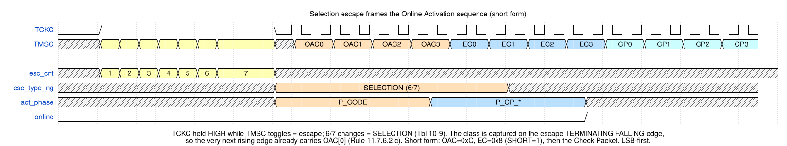
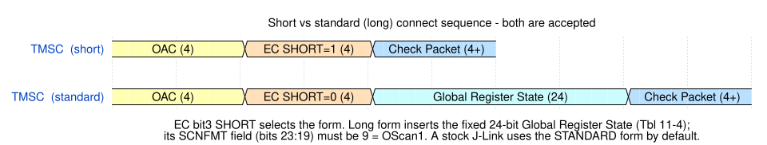
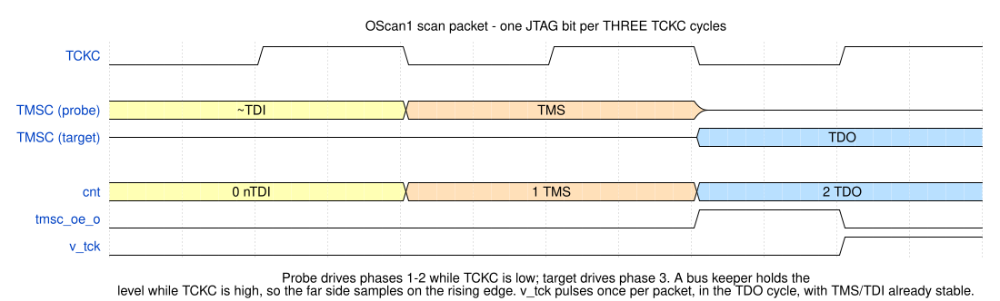
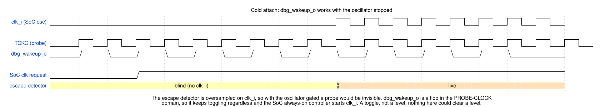

<p align="center">
  
</p>

# arv_dtm_cjtag — Compact JTAG (IEEE 1149.7) Debug Transport Module

A **2-wire** (TCKC/TMSC) link layer for the aRVern core, running the protocol-neutral
`arv_dtm_tap` core underneath. OScan1 only.

It is the **pin-efficient professional** transport of the `arv_dtm` IP: same debug
capability as JTAG on two pins instead of four, driven by a SEGGER J-Link in its cJTAG
mode (see [Bring-up with a J-Link](#bring-up-with-a-j-link)). (For classic 4-wire, see
[JTAG](arv_dtm_jtag.md); for low-cost board-native options, [UART](arv_dtm_uart.md) or
[I2C](arv_dtm_i2c.md).)

> This page documents the **cJTAG-specific** link layer. The parts shared by every
> transport — the `arv_dtm_dmi_master` APB4 master, the TCK/clk ⇄ hclk CDC, the DMI
> wire format, the always-on-clock integration rule, the reset contract and the DFT
> rule — live in the hub doc **[`arv_dtm.md`](arv_dtm.md)**. Read that first. The
> register model (IDCODE, `dtmcs`, `dmi`) and the busy/sticky semantics are the JTAG
> page's; nothing above the link layer differs.

> **Selected with `DTM_TYPE=3`** in the `arv_dtm` wrapper. Extra wrapper ports:
> `tckc_i`, `tmsc_i`, `tmsc_o`, `tmsc_oe_o`. TMSC needs a bidirectional pad with a
> bus-keeper. **Point-to-point only** — multi-drop is not supported, see below.
> Both connect sequences (standard and short) are accepted; the decode is checked against
> IEEE 1149.7-2022, see
> [Appendix — conformance provenance](#appendix--conformance-provenance), which also lists
> the deliberate deviations.

## Contents

- [Parameters](#parameters)
- [Pins](#pins)
- [Architecture — native scan, oversampled escape](#architecture--native-scan-oversampled-escape)
- [Protocol](#protocol)
  - [Escapes](#escapes)
  - [Activation — OAC, EC, Global Register Load](#activation--oac-ec-global-register-load)
  - [Check Packet](#check-packet)
  - [OScan1 scan packet](#oscan1-scan-packet)
- [Probe interoperability (J-Link)](#probe-interoperability-j-link)
  - [Bring-up with a J-Link](#bring-up-with-a-j-link)
- [Reset architecture](#reset-architecture)
- [Cold attach — `dbg_wakeup_o`](#cold-attach--dbg_wakeup_o)
- [Integration requirements](#integration-requirements)
  - [Choosing `IDLE_HINT`](#choosing-idle_hint)
- [Multi-drop / star — not supported](#multi-drop--star--not-supported)
- [Synthesis constraints](#synthesis-constraints)
- [DFT / scan](#dft--scan)
- [Verification](#verification)
- [Appendix — conformance provenance](#appendix--conformance-provenance)
- [License](#license)

## Parameters

| Parameter | Default | Description |
|-----------|---------|-------------|
| `IDCODE_BASE` | `28'h000_01F7` | IDCODE`[27:0]`; the version `[31:28]` is the `idcode_version_i` port. Bit 0 **must** be 1. Override at integration — the manufacturer field defaults to Arvern's JEDEC identity; see the [JTAG page](arv_dtm_jtag.md#the-default-idcode-and-how-to-compute-your-own) and the hub's [Part-number catalog](arv_dtm.md#part-number-catalog). |
| `IDLE_HINT` | `3'd3` | `dtmcs.idle` — Run-Test/Idle cycles the debugger is hinted to insert between DMI accesses. A throughput knob, not a correctness one; see [Choosing `IDLE_HINT`](#choosing-idle_hint). |
| `ARST_EN` | `1` | Reset style for the `clk_i` domain — `1` = async active-low, `0` = synchronous. The TCKC domain is **always** async regardless (the probe clock may not be running). |

## Pins

```
clk_i              in   always-on oscillator (= DMI bus clock; NOT the gated core clock)
dbgresetn_i        in   active-low debug reset

tckc_i             in   compact TAP clock   (probe-driven)
tmsc_i             in   compact bidir data  (level on the shared line)
tmsc_o             out  compact bidir data  (target -> probe, TDO phase)
tmsc_oe_o          out  TMSC output enable  (drive only in the TDO phase while TCKC is low)

idcode_version_i   in   [3:0] IDCODE[31:28], strapped (see arv_dtm.md, step 2)
dbg_wakeup_o       out  cold-attach wake: toggles on every TCKC rising edge, works with clk_i stopped
scan_mode_i        in   1 = test mode (shift and capture): hold internally generated resets inactive, release TMSC

// + the aRVern DMI bus (APB4 master) - see arv_dtm.md
```

`tmsc_o`/`tmsc_oe_o` drive a **bidirectional** pad. TMSC additionally needs a **bus
keeper**: the line is undriven while TCKC is high, and the far side samples it on the
rising edge. The reference FPGA project enables the pad's bus-hold circuitry on TMSC
(and TCKC) for a cJTAG build.

## Architecture — native scan, oversampled escape

The scan engine is clocked by **TCKC**, exactly as a 1149.1 TAP is clocked by TCK —
not oversampled by a system clock. The scan engine itself has no ratio requirement.

The **escape detector** is the one part that is oversampled on `clk_i`, and that is a
deliberate split (see [Escapes](#escapes) for why). It fixes the link's maximum TCKC
frequency at `f_clk / 8`, because a probe uses the same TCKC period for its escapes and
its scan packets — the bound is stated once in the hub's
[Clock-ratio bounds](arv_dtm.md#clock-ratio-bounds) and derived under
[Integration requirements](#integration-requirements).

> **`clk_i` must be running to attach.** Escape detection needs `clk_i`. This costs
> nothing in practice — with `clk_i` stopped the DMI side is dead anyway, so the debugger
> could not halt or read — and the mechanism for cold-attach is
> [`dbg_wakeup_o`](#cold-attach--dbg_wakeup_o), a TCKC-domain toggle the SoC uses to
> start the oscillator on probe activity.

## Protocol

The wire protocol in the order a probe uses it: the escape that opens a session, the
activation frame that brings the link online, the Check Packet that ends it, then the
3-phase scan packet that carries every TAP clock afterwards.

### Escapes

Per IEEE 1149.7, an escape is signalled by toggling **TMSC while TCKC is held high**.
There are no TCKC edges during an escape, so it cannot be counted in the TCKC domain.

**It is oversampled on `clk_i`:** TMSC and TCKC are 2-FF synchronised, an XOR edge
detector counts TMSC **changes** while TCKC is high, and the count is classified per
Table 10-9 when TCKC falls:

| TMSC changes | Escape | What this node does |
|---|---|---|
| 2 or 3 | custom / End of Transfer (T4+) | no-op, as Table 10-9 specifies for this class |
| 4 or 5 | deselection | node goes Offline, TMSC released |
| 6 or 7 | selection | frames a Selection Sequence (OAC/EC/[GRL]/CP), see [Activation](#activation--oac-ec-global-register-load) |
| 8 or more | reset | node goes Offline, TMSC released from the 8th change |

Counting *changes* rather than rising edges is what keeps the 7-change **selection**
escape from tripping the reset threshold. Escapes are grouped in (even, odd) pairs so a
skewed edge cannot change the meaning: *"the TAP.7 Controller interprets an odd number
of edges occurring while TCK(C) is a logic one as the next lowest even number"* (Cl.
4.3.1), and the NOTE under Table 10-9 presumes the first edge of an odd count to be the
one establishing the TMSC value for the bit period. So 7 → 6 and 9 → 8, and the
open-ended `≥ 8` compare is right. A DTS should still send the even count: a 7-change
selection with one edge of skew reads as 8 and resets.
Counting starts on the second `clk_i` sample of TCKC high: a TMSC change landing in
the same sample as the TCKC rise is data skew and is not counted. This also keeps the
first escape after a `dbgresetn_i` release with TCKC and TMSC both parked high exact.

The classification crosses back into the TCKC domain in two ways. The escape's
*framing* — the bit after a selection escape is `OAC[0]` (Rule 11.7.6.2 c) — is taken
from the class captured on the escape's **terminating TCKC falling edge**, the only edge
available, half a bit before the rising edge that carries `OAC[0]`. The *event* also
crosses as a single-bit level toggle through a synchroniser — a handshake, not a bare
async reset — so a DTS that escapes and then parks TMSC cannot wedge the link offline.
Any escape other than a custom one clears `online`, returning the TAP to
Test-Logic-Reset.

**Drive inhibit.** Cl. 10.4.1.3: *"The detection of the Reset Escape immediately
initiates the TMSC signal's Dormant Drive Policy, ensuring the TMSC signal is at a
high-impedance level when the TCK(C) signal returns to a logic 0."* `tmsc_oe_o` is
therefore inhibited by four terms, earliest first: from the 8th TMSC change of a reset
escape (`esc_hit`); for every escape class from the terminating TCKC fall until the front
end has gone Offline on the next rising edge (`esc_type_ng`) — before the DTS drives the
first activation bit; from the escape's end until its toggle has crossed into the TCKC
domain (`esc_pending`); and on the edge the toggle lands (`escape_evt`). The last two
cover the crossing and can only ever *release* the pad early, never create a drive, so
they need no synchroniser to be safe. Rule 14.5.2 b) 2) — *"The TMSC signal shall not be
driven provided … TCKC is a logic 1"* — is the `~tckc_i` term of the enable.

**DTS escape timing** (Rule 10.4.2 c): the first TMSC edge of an escape follows the TCKC
rising edge by at least one minimum TCKC period, each further edge follows the previous
one by at least one, and *"a TCK falling edge follows the last TMS(C) edge associated
with the Escape by a minimum of one TCK(C) period"*. That last separation is what the
`clk_i ≥ 8 × TCKC` bound is measured against.

**Why oversampled rather than TMSC-clocked.** Making TMSC a clock costs a **both-edge,
data-rate clock domain sourced from a bidirectional pad**: expensive to CTS and to scan
on ASIC, and not necessarily routable to a clock network on FPGA. Oversampling also
keeps the logic small: an XOR edge detector sees **both** TMSC edges, so one counter
counts changes directly.

### Activation — OAC, EC, Global Register Load



A selection escape frames the Selection Sequence: Rule 11.7.6.2 c) makes the bit right
after the escape `OAC[0]`, so the frame starts on the first TCKC rising edge after the
escape's terminating fall — it is not free-running, and nothing accumulates outside an
armed frame, so arbitrary traffic cannot activate the node. The frame is OAC (4 bits) +
EC (4 bits), each field LSB-first, then either the Check Packet (short form) or a 24-bit
Global Register Load and then the Check Packet (standard / long form).

**OAC.** `0xC`: `OAC[1:0] = 00` selects the TAP.7 technology, `OAC[3:2] = 11` selects the
Star-2 topology, which forces OScan1. Any other code ends the frame and the node stays
Offline (Rule 11.9.5.2 b).

**EC**, decoded by field (Cl. 11.7.7.2, Table 11-2), not compared as a nibble:

- **STATE (bits 1:0)** — required parking state. Parking in Test-Logic-Reset or
  Run-Test/Idle is **mandatory for T2 and above** (Cl. 8.5.3); Pause-IR/Pause-DR are
  optional additions at T3. On a mismatch the selection test **fails** and the node goes
  Offline (Rule 11.9.5.2 b) — which is the correct outcome for an unsupported state, so
  rejecting STATE ≠ 00 is conformant.
- **PROTECT (bit 2)** — `1` demands Voting Drive (Cl. 13.2.1.3: logic 0 driven low,
  logic 1 driven high-impedance). This design drives both levels actively, so
  `PROTECT = 1` fails the selection test and the node stays Offline; see
  [Multi-drop / star](#multi-drop--star--not-supported).
- **SHORT (bit 3)** — `1` selects the short form; `0` selects the long form, which inserts
  a Global Register Load before the CP.



**Both forms are accepted.** `SHORT = 1` goes straight to the Check Packet; `SHORT = 0`
takes a fixed **24-bit Global Register Load** first (Table 11-4), after which the CP
Preamble follows immediately with no delimiter (Rule 11.7.9.2 b) 2). The GRL is
transmitted in ascending bit order with each field LSB-first, so **SCNFMT (bits 23:19) is
the last field on the wire**; the RTL reverses the trailing five bits to recover it and
requires **SCNFMT = 9 = OScan1** (Cl. 23.4.1.4.5). Any other format is one this design
does not implement, so the frame is abandoned and the node stays Offline
(`cjtag_bad_scnfmt`).

**A `3` vs `9` trap worth recording.** Table 11-11 gives `3` for OScan1, which looks like
it contradicts SEGGER — it does not. That `3` is `OAC[3:2] == 11b`, the **Star-2 branch
selector**, not a register value; selecting that branch is *why* the short form needs no
SCNFMT at all. The SCNFMT register encoding is the separate master table in
Cl. 23.4.1.4.5, where OScan1 is `9`. Compare against 9.

Covered by `cjtag_act_long`, which checks **mid-sequence**: an end-state check is not
discriminating, because a short-form-only decoder reads the GRL's leading zeros as
preamble + `CP_END` + postamble, goes Online early, and a later `tap_reset` hides the
misalignment. `cjtag_bad_actcode` drives each of the three rejections (wrong OAC,
STATE ≠ 00, PROTECT = 1) and checks that the node still activates on the next good code.

### Check Packet

Cl. 11.7.9.1.1: the CP is *"Preamble Element (one bit) — Body (two or more bits) —
Postamble (one bit)"*. The body is read through a sliding two-bit window from its second
bit (Rule 11.9.6.2 e: *"Beginning with the second bit of the CP body, the last two bits
of the body shall be used as a CP Directive"*; the most recent bit is the directive's
MSB, Rule d). Cl. 11.7.9.1.3 defines the directives: `CP_NOP` (`01` / `10`) extends the
body by one bit; `CP_END` (`00`) and `CP_RSO` (`11`) *"terminate the CP after one
additional bit follows these directives"* — the Postamble.

After `CP_END` the node goes Online (a failed selection test has already left it
Offline, Rule 11.7.9.2 c); after `CP_RSO` the node performs a TAP.7 controller reset and
stays Offline, TMSC undriven. The shortest CP is four bits (`0000`); a body of any
length, odd or even, is accepted — a DTS may legally send `CP_NOP`s. Covered by
`cjtag_act_cp_nop` (odd and even bodies; an odd body such as `1,0,0` exposes a decoder
that pairs bits instead of sliding the window — it goes Online one bit late and misframes
every packet) and `cjtag_act_cp_rso`.

The bit following the Postamble is the first bit of a Scan Packet (Rule 11.9.6.2 f);
straight out of activation the TAP is in Test-Logic-Reset and that first packet is
load-bearing (`cjtag_first_packet`).

### OScan1 scan packet

One packet = **3 TCKC cycles**. The probe drives TMSC in phases 1–2 while TCKC is
low; the target drives in phase 3 while TCKC is low. A bus-keeper holds the level
while TCKC is high, so the far side samples on the rising edge.

| Phase | `cnt` | Direction | Action |
|---|---|---|---|
| nTDI | 0 | probe drives | sample `tdi = ~TMSC` |
| TMS  | 1 | probe drives | sample `tms = TMSC` |
| TDO  | 2 | target drives | drive `TMSC = TDO`, and this is the one TCKC edge the TAP advances on |



**TAP clock enable.** The TAP is clocked by `tckc_i` and advances only on edges where
`tck_en = (cnt == 2) & online` — one per packet, with TMS/TDI already stable.

`tckc_i` is therefore the single clock of this front-end. Enabling the TAP rather than
gating a clock into it keeps the reset-release synchroniser supplied with edges even
before the link is up, and leaves nothing generated to constrain or scan-fix.

The TAP still advances **once per 3 TCKC cycles**, so anything counted in TAP clocks
costs 3× that in TCKC periods. Note the corollary for timing: TAP logic must close in
**one** TCKC period, not three — the same requirement it already meets on 4-wire JTAG,
where `tck_i` is a real pin.

## Probe interoperability (J-Link)

[SEGGER's J-Link cJTAG KB][segger] states the following answers.

| Question | Answer |
|---|---|
| Which activation form does J-Link use? | **Standard (long) form by default** — *"By default, J-Link will use the standard connect sequence."* |
| Can it be forced to short form? | **Yes** — command string **`SetcJTAGInitMode = 1`** before connecting |
| Which scan formats? | **OScan1 only** — the standard sequence sets `STFMT[4:0] == 9 => OScan1`, *"OScan1 protocol is active from now on"* |
| Minimum speed | *"J-Link ignores speed settings < 500 kHz for cJTAG and implicitly converts them to 500 kHz"* |
| Bus keeper | Devices with *"buggy KEEPER logic or no KEEPER logic at all"* need a J-Link-side workaround, which is why the 500 kHz floor exists |

**Consequence for this design.** A stock J-Link connects with its default (standard)
sequence; `SetcJTAGInitMode = 1` selects the short form and also works. The fact that
J-Link wants OScan1 exclusively also means the T4 requirement for MScan/OScan0 is
irrelevant to interop here — it matters only for a conformance claim.

[segger]: https://kb.segger.com/J-Link_cJTAG_specifics

### Bring-up with a J-Link

- **Host software.** A J-Link in its cJTAG mode, under SEGGER Ozone (select cJTAG as the
  target interface when connecting) or the J-Link GDB Server. The link is validated on
  hardware with a J-Link under Ozone. OpenOCD over cJTAG is not validated, and
  [`arvern-tools`](https://github.com/Arvern-Silicon/arvern-tools) cJTAG support is
  planned (it drives the JTAG, UART and I2C transports).
- **Wiring.** The J-Link's standard 20-pin connector: VTref (pin 1) to the target's I/O
  supply, TMSC to the TMS pin (7), TCKC to the TCK pin (9), and GND. See SEGGER's J-Link
  cJTAG documentation for the probe side. TMSC needs the bus keeper described under
  [Pins](#pins).
- **TCKC frequency.** From the J-Link's 500 kHz cJTAG floor up to `f_clk / 8` (the
  [integration bound](#integration-requirements); 6.25 MHz with a 50 MHz `clk_i`). The
  DTM sets no lower limit; with a J-Link, whose floor is 500 kHz, `clk_i` must run at
  4 MHz or more.
- **Connect sequence.** The J-Link's default standard (long) form works; the short form
  (`SetcJTAGInitMode = 1`) works too.
- **Expected IDCODE.** `{idcode_version_i, IDCODE_BASE}`, IR length 5: `0x000001F7` at
  the IP's default `IDCODE_BASE` with the version strapped to 0. The DE0-Nano-SoC
  reference project (`IDCODE_BASE = 28'h800_01F7`, version strapped to 0) reports
  `0x080001F7` when built with `DTM_TYPE = 3`; its default build is JTAG
  (`DTM_TYPE = 0`).

## Reset architecture

**The rule:** synchronise reset *deassertion* into a domain only when that domain can
tolerate losing the first N clock edges. Synchronising **costs** edges — release
cannot happen until the clock runs — so it is free only where something absorbs the
loss.

| Domain | Treatment | Why |
|---|---|---|
| `clk_i` (escape detector) | synchronised | always running; no edges lost |
| TCKC (front-end scan flops) | **async release, deliberate** | TCKC is *stopped* at POR, so release would defer to the probe's first edges — and those edges **are** activation/selection data |

The front-end matches **exact-length frames with no resynchronisation path**, so a
swallowed edge corrupts the frame outright. Recovery/removal on those flops is accepted
exactly as IEEE 1149.1 accepts it for `TRST*`.

`arv_dtm_tap` is **not an exception** to this rule — it is the other side of it. The
TAP FSM resynchronises via 5×TMS=1 → TLR, and its reset releases when `online` rises,
i.e. after activation, when TCKC is provably running. It keeps its synchroniser.

`tap_rst_n = dbgresetn_i & online` gates an async reset with an internally-generated
signal, which is normally a smell. It is deliberate: `online` is what defines when TAP
state becomes meaningful, and holding the TAP in reset until then keeps a partially
decoded activation sequence from leaving it in a stale state. `online` is a scanned
flop, so this reset is generated here and `scan_mode_i` is ORed onto it before it
reaches the TAP.

**Boundary contract.** `dbgresetn_i` is asserted asynchronously and must be released
synchronously to `clk_i` (a reset synchroniser in the SoC — the aRVern reset generator
does this). At `ARST_EN = 0` hold it low for at least 3 `clk_i` edges: the `clk_i`-side
synchroniser needs two, the flops one. The TCKC side releases asynchronously by design.

## Cold attach — `dbg_wakeup_o`

`clk_i` must be running for the escape detector to see a probe, which would make
debug-from-sleep impossible if the SoC gates its oscillator. `dbg_wakeup_o` breaks that
circularity: it is a flop in the **TCKC domain** that toggles on every TCKC rising edge,
so it keeps moving with `clk_i` stopped, and the SoC's always-on controller turns those
transitions into a clock request.



A toggle rather than a level, deliberately — nothing in the TCKC domain could clear a
sticky level, since clearing it would need the very clock being started.

`dbg_wakeup_o` toggles on the TCKC rising edge that opens the DTS's selection escape
(TCKC then stays high, so this is a single transition the always-on controller must
catch — the sampling contract is in the hub's
[Cold attach](arv_dtm.md#cold-attach--dbg_wakeup_o)). The escape itself is counted on
`clk_i`, so the selection sequence is decoded only if the oscillator is running and the
reset synchroniser has released (a few `clk_i`) before the escape's first TMSC change; an
earlier attempt is ignored and the probe's connect retry succeeds. `cjtag_cold_attach`
covers the wake with the oscillator stopped and the attach after it restarts.

## Integration requirements

- **`clk_i` ≥ 8× TCKC.** The escape detector is oversampled on `clk_i` and the escape
  class is captured on the terminating TCKC fall, ~3 `clk_i` after the last TMSC change
  has been synchronised (two synchroniser stages plus the change detector); below 8× the
  last change of a six-change selection escape is missed and the escape decodes as a
  deselection. The scan engine is TCKC-clocked and has no ratio requirement of its own,
  but a probe runs escapes and packets at one TCKC rate, so this is the link's maximum
  TCKC frequency. The regression runs the cJTAG suite at 16× and, except
  `dmi_fail_behind_busy` and `dmi_sync_reset_width`, also at 8×
  (`SIM_EXTRA_DEFINES="CJHALF=4"`). The path is also constrained in synthesis —
  see [Synthesis constraints](#synthesis-constraints).
- **No DTS courtesy is required after an escape.** TMSC is released from the 8th TMSC
  change of a reset escape (Cl. 10.4.1.3), and for every escape class from the
  terminating TCKC fall — before the DTS drives the first activation bit — until the
  front end has gone Offline on the next rising edge. `cjtag_escape_align` sweeps a
  reset and a selection escape over all three packet phases against the bench's
  contention monitor.
- **TMSC needs a bus-keeper** (SEGGER requirement); J-Link forces cJTAG speed
  ≥ 500 kHz.
- **DTS escape timing** is Rule 10.4.2 c), quoted under [Escapes](#escapes): one minimum
  TCKC period between the preceding rising edge and the first escape edge, between
  escape edges, and between the last escape edge and the terminating fall. This is what
  distinguishes a control edge from a data edge.
- **Reset and clock** as in [Reset architecture](#reset-architecture): `dbgresetn_i`
  async assert / sync release, ≥ 3 `clk_i` edges at `ARST_EN = 0`; `clk_i` is the
  always-on oscillator.
- **DFT:** [DFT / scan](#dft--scan).

### Choosing `IDLE_HINT`

Same field and the same trade-off as [JTAG](arv_dtm_jtag.md#choosing-idle_hint) — an
under-estimate costs a `dmireset` and a retry, never correctness — with one difference
that works in your favour.

Run-Test/Idle cycles are counted in **TAP clocks**, and on this link the TAP advances
once per 3-TCKC OScan1 packet:

```
f_tap = f_TCKC / 3
```

So each idle cycle buys three TCKC periods of settling time. For the same wire rate a
cJTAG link needs a *smaller* hint than 4-wire JTAG at the same clock, and the JTAG bound
applies with `f_TCK` replaced by `f_TCKC / 3`:

```
idle  ≥  2 + ceil( (5 + W) × f_TCKC / (3 × f_hclk) )
```

W is the DMI slave's wait-state count — 1 for `arv_debug_dm`, more behind a bridge. With
`f_hclk ≥ 8 × f_TCKC` the second term is 1 unless the DM sits behind more than 19 wait
states, so the default of 3 suffices here; as on JTAG the field is 3 bits, so 7 is the
ceiling.

## Multi-drop / star — not supported

This is point-to-point only: there is no node-selection layer and no star bench. The
reasoning, kept so the decision is not re-litigated from scratch:

**In-band node selection is not what the selection escape does.** Cl. 11.7.1: a
Selection Escape *"is used to select all ADTAPCs within a branch and deselect all ADTAPCs
within other branches"* — it selects a **branch**, not a node. One-hot node selection is
a separate layer: *"a function called a 'Scan Selection Directive' (SSD) is used to select
one and only one CLTAPC."* Node identity (CID / TCA) travels in commands and SSDs, never
in OAC/EC/CP, so a marker inside the activation frame would be a mechanism the standard
does not have.

**And it could not be made electrically safe without a pad change.** Star operation is
Class T4 (Table 1-2: T0–T3 are "No" for Star-2), and drive-conflict prevention is
mandatory from T3 (Cl. 20.5.1). With `PROTECT = 1` a controller must use **Voting
Drive** — Cl. 13.2.1.3: logic 0 driven low, logic 1 driven **high-impedance**. This
design drives both levels actively, so it cannot legally share a bus regardless of the
selection logic.

### If multi-drop is wanted later, the cheap option is out-of-band

Selecting nodes by a board-level enable (strap, GPIO, or SoC control) avoids the entire
problem: no SSD layer, no CID/TCA, no command layer, and **no voting drive**, because only
one node is ever driving. It works with any stock probe, since the probe does not
participate in selection. The RTL cost is a single `node_enable_i` gating the front end.
The trade is that switching targets is a board action rather than a debugger command.

In-band multi-drop with a stock probe requires real T4 conformance and should be planned
as its own effort. Note that this design is an **incomplete T4** regardless of multi-drop,
because OScan1 is an Advanced Protocol format — see the
[Appendix](#appendix--conformance-provenance).

## Synthesis constraints

`create_clock` on **TCKC only** — TMSC is a data pin, not a clock, even though the link
is bidirectional. TCKC is the only clock in this front-end — the TAP is clock-enabled off
it rather than fed a gated one — so there is no generated clock to declare. TCKC and
`clk_i` are asynchronous and meet in three places:

1. the escape-detector toggle handshake and the `arv_dtm_dmi_master` handshake, both
   2-FF synchronised — a clock group or a per-destination-period `set_max_delay` covers
   them;
2. the 2-bit `esc_cnt → esc_type_ng` capture on the terminating TCKC fall, which has no
   synchroniser and is timed by the 8× ratio alone. It **must be constrained**, so that
   the class has settled at the capture flop within one `clk_i` period of the last
   counter update: `set_max_delay -datapath_only <T_clk> -from [get_cells u_esc_cnt/*]
   -to [get_cells u_esc_type_ng/*]` (plus `set_bus_skew` where supported). With a bare
   `set_clock_groups -asynchronous` this path is unconstrained and the ratio argument
   is not checked by STA;
3. the `esc_hit` / `esc_pending` terms into `tmsc_oe_o`, which can only release the pad
   early and need no constraint.

**What the IP's own constraints assume** (`synthesis/synopsys/constraints_ports.arv_dtm_cjtag.tcl`,
also used for the wrapper at `DTM_TYPE = 3`):

- `clk` at the flow's clock period and `tckc` modelled at exactly eight times that
  period — the documented bound.
- No clock group: every `tckc ⇄ clk` path is bounded with `set_max_delay
  -datapath_only` to one period of its destination clock, only the hold side is cut, the
  `u_esc_cnt → u_esc_type_ng` path carries a one-`clk`-period budget, and the DMI payload
  buses carry the budget described on the JTAG page.
- Boundary delays relative to `tckc`: `tmsc_i` 20 % of the period after the rising edge;
  `tmsc_o` 60 % relative to the **falling** edge (the TAP's TDO flop launches there);
  `tmsc_oe_o` 20 % relative to the falling edge, because it is combinational from
  `~tckc_i` and the rising-edge phase counter and only has half a period to that
  reference; `dbg_wakeup_o` 60 %; `idcode_version_i` 20 %. `tmsc_i` into the escape
  detector's synchroniser is a false path (that input delay has no meaning to `clk`).
  The APB4 DMI ports are 20 % in / 60 % out of the `clk` period; `dbgresetn_i` is a false
  path.
- DFT: `tckc_i` and `clk_i` are both scan clocks (flops on both edges of `tckc_i`).
  `dbgresetn_i` is a declared reset when `ARST_EN = 1`; at `ARST_EN = 0` it also enters
  the `clk_i` reset synchroniser on the data side, so it is held inactive as a test-mode
  constant instead — which gives up ATPG coverage of the TCKC-side reset tree in that
  build.

Contrast I2C/UART, where the serial line is oversampled and no clock is created at all.

## DFT / scan

cJTAG generates internal resets, so it carries a scan-fixing obligation. Per the house
rule (see the hub's
[DFT / scan](arv_dtm.md#dft--scan--what-the-integrator-owes-and-what-the-ip-owes)):

| Generated internally | Fixed by |
|---|---|
| `clk_rst_n` — `dbgresetn_i` synchronised into `clk_i` | `scan_mode_i` ORed on the synchroniser **output** |
| `tap_rst_n = dbgresetn_i & online` (`online` is a scanned flop) | `scan_mode_i` ORed before it enters the TAP's reset synchronisers |
| TCKC sampled as data by the escape detector | TCKC ANDed with `~scan_mode_i` before its synchroniser |

The TCKC-domain flops are reset by `dbgresetn_i` itself: nothing is combined or
synchronised on that net, so, like JTAG's `trst_n_i`, it is the integrator's to hold
inactive in test mode. Only resets are generated here. The TAP is clock-enabled off `tckc_i`, so scan sees a
single free-running clock with no gate to hold open during shift.

`scan_mode_i` also forces `tmsc_oe_o` low, so the target never drives the shared
bidirectional pad while the tester owns it.

The integrator owes: `scan_mode_i` high for the whole test, `dbgresetn_i` held inactive, TCKC treated as a
pad-driven scan clock needing test-clock muxing (the same situation as `tck_i` in the
JTAG flow), and TMSC pad control in test mode.

## Verification

All cJTAG tests run under both reset styles (`run_all` and `run_all -sync_rst`) at the
bench default of 16 `clk_i` per TCKC period, and all but `dmi_fail_behind_busy` and
`dmi_sync_reset_width` run again at the 8× bound (`SIM_EXTRA_DEFINES="CJHALF=4"`, which
`run_all` adds). The bench's
TMSC contention monitor flags any cycle in which the host BFM and the DUT both drive
TMSC, whatever the values; the bench, its monitors and knobs are described in the hub's
[Verification](arv_dtm.md#verification).

| Test | Property |
|---|---|
| `dmi_rdwr -dtm cjtag` | DMI read/write over the link (shared stimulus) |
| `dmi_walk -dtm cjtag` | walking-ones/zeros DMI address and data over the link, read back and Capture-DR address checked |
| `dmi_capture_addr -dtm cjtag` | the `dmi` Capture-DR address field after a read, through the OScan1 link |
| `jtag_capture_exit -dtm cjtag` | Capture → Exit1 → Update with no shift on `dmi`, `dtmcs` and the IR, through the OScan1 link |
| `dmi_fail_behind_busy -dtm cjtag` | a read that fails after busy was captured is reported failed on the scan repeated after `dmireset`, through the OScan1 link (16× only) |
| `dmi_fail_capture_sweep -dtm cjtag` | a `PSLVERR` read collected at every idle count reads busy or failed, never success, through the OScan1 link |
| `dmi_hardreset_race -dtm cjtag` | `dmihardreset` with the held transfer's `PREADY` swept around the abandon: no stale data or status, no phantom transfer, through the OScan1 link |
| `dmi_hardreset_fail_race -dtm cjtag` | the same sweep with a `PSLVERR` transfer: `op` = 0, `errinfo` = 4, `dmistat` = 0 after the hardreset, through the OScan1 link |
| `dmi_sync_reset_width -dtm cjtag` | a `dbgresetn` pulse of 3 or more `clk_i` edges never fabricates or replays a DMI transfer and the link re-opens, through the OScan1 link (16× only) |
| `unselected_pins -dtm cjtag` | random edges on the JTAG, UART and I2C inputs during DMI traffic leave every transfer and the unselected outputs unchanged, through the OScan1 link |
| `cjtag_act_long` | The **standard (long)** connect sequence activates: OAC, EC with SHORT=0, the 24-bit Global Register Load with `SCNFMT = 9`, then the Check Packet. Probes **mid-GRL** — an end-state check is not discriminating, since a short-form-only decoder reads the GRL's leading zeros as a minimal CP, goes Online early, and a later `tap_reset` hides it |
| `cjtag_act_cp_nop` | Check Packet bodies with `CP_NOP` runs of odd and even length activate; an odd body (`1,0,0`) exposes a decoder that pairs bits instead of sliding the window (it goes Online one bit late and misframes every packet) |
| `cjtag_act_cp_rso` | `CP_RSO` resets the controller: the node stays Offline, TMSC is not driven, a following normal activation works |
| `cjtag_bad_actcode` | wrong OAC, STATE ≠ 00 and PROTECT = 1 each leave the node Offline, and it activates on the next good code |
| `cjtag_bad_scnfmt` | a long-form activation with `SCNFMT = 8` is refused |
| `cjtag_escape_boundary` | All four escape classes (Table 10-9): 2 changes = no-op, 4 = deselect (Offline), 6 = selection (the activation's own escape), 8 = reset — and an odd count rounds **down** (5 behaves as 4) |
| `cjtag_escape_reset_high` | released from `dbgresetn_i` with TCKC and TMSC parked high, a 7-change escape still selects (activation works) and a 5-change escape still deselects (the following code is ignored) |
| `cjtag_escape_5edge` | five changes are a deselection, not a selection: the bits that follow are not taken as an activation |
| `cjtag_escape_inflight` | a deselection escape and a 20-change escape with a DMI read in flight: `PSEL` drops, no phantom transfer after re-activation (slave released before or after it), `dmistat` 0 / `errinfo` 4, and a fresh round trip; the same escape on an idle link |
| `cjtag_escape_saturate` | reset escapes of 40, 34 and 66 changes with a read held by the slave: link Offline, `PSEL` drops, then an immediate selection escape + activation: Online, `dmistat` 0 / `errinfo` 4, no phantom transfer, a fresh round trip |
| `cjtag_scan_mode` | with `scan_mode_i` high the DUT never drives TMSC (host drives through every TDO phase) and a reset escape does not take the link down; back in functional mode an escape + activation restores a working link |
| `cjtag_escape_park` | The escape arms exactly once whatever level the DTS parks TMSC at |
| `cjtag_escape_align` | A reset escape and a selection escape stay contention-free at **all three** packet-phase alignments; the selection sweep pins the drive inhibit between the terminating TCKC fall and the next rise |
| `cjtag_por_act` | Activation on the first attempt straight out of POR, with no TCKC edges beforehand |
| `cjtag_first_packet` | the first packet after activation (TLR → Run-Test/Idle) is not swallowed |
| `cjtag_cold_attach` | `dbg_wakeup_o` moves with `clk_i` **stopped**, then a normal attach completes after the clock restarts |
| `cjtag_reset_assert` | `dbgresetn_i` mid-traffic tears the link down and it recovers |

The `~escape_evt` term of `tmsc_oe_o` is not discriminated by any test: the negedge
framing capture clears `online` on the first rising edge after the escape, so the term is
defence, not a tested requirement.

## Appendix — conformance provenance

Clause and rule numbers in this page are from IEEE Std 1149.7-2022.

| # | Assumption | Status | Normative basis |
|---|---|---|---|
| 1 | Activation is OAC + EC + CP | ✅ **confirmed** | Selection Sequence = OAC → EC → [Global Register Load if SHORT=0] → CP |
| 2 | OAC=`0xC` | ✅ **confirmed** | OAC[1:0]=00 selects TAP.7 technology; OAC[3:2]=11 selects Star-2 topology (forces OScan1) |
| 2b | EC=`0x8` | ✅ **confirmed** | Cl. 11.7.7.2 Table 11-2: bit3 SHORT=1, bit2 PROTECT=0, bits1:0 STATE=00 (Test-Logic-Reset / Run-Test/Idle) |
| 3 | Fields arrive **LSB-first** | ✅ **confirmed** | EC=1000 → wire order `0,0,0,1`; the RTL decodes EC by field rather than matching a constant |
| 4 | "Short form" is a spec concept | ✅ **confirmed** | SHORT bit = 1 → Short-Form Selection Sequence; 0 → Standard (Long) Form with Global Register load |
| 5 | Reset escape = **≥ 8** edges | ✅ **confirmed** | Cl. 10.4.1.1 Table 10-9: "Resets all technologies (generates a Type-3 Reset)" |
| 6 | 6/7 edges = selection, 4/5 = deselection, 2/3 = custom | ✅ **confirmed** | Table 10-9; Rule 10.4.2 j): *"A TAP.7 Controller with an RSU shall detect all Escapes shown in Table 10-9."* |
| 7 | OScan1 = nTDI, TMS, TDO | ✅ **confirmed** | — |
| 8 | Check Packet directive window slides from the second body bit; `CP_RSO` resets | ✅ **confirmed** | Rule 11.9.6.2 d)–e), Cl. 11.7.9.1.3 |
| 9 | Packet framing across an escape | ✅ **confirmed** | An escape coincident with the first SP bit **aborts the SP without advancing TAPC state**; the Selection Sequence's Check Packet realigns by skipping its POST state |
| 10 | Escapes are detected on TCKC/TMSC alone | ⚠️ **deviates, by design** | Rule 10.4.2 k): *"The detection of Escapes shall utilize only the TCK(C) and TMS(C) signals (a functional clock shall not be used in Escape Detection)."* The detector is oversampled on `clk_i` ([Why oversampled](#escapes)), so no escape, a Reset Escape included, is seen while `clk_i` is stopped or in the few `clk_i` after `dbgresetn_i` release; `dbg_wakeup_o` and the probe's connect retry cover this |
| 11 | Selection/Deselection Escapes qualified to the first SP bit | ⚠️ **deviates, by design** | Cl. 11.10.1.1/11.10.1.2 allow them under the Advanced Protocol when *"the … Escape occurs in the first bit of an SP"*, and Cl. 11.4.1.2: *"A Deselection Escape that does not meet the qualifying criteria is simply ignored."* This node acts on either class at any packet phase (`cjtag_escape_align`): more permissive than a conformant TAP.7, harmless since the DTS owns qualification |
| 12 | Value of the bit coincident with an escape | ⚠️ **deviates, by design** | Rule 10.4.2 h): *"The data value of the bit period coincident with an Escape shall be determined by the TMS(C) value prior to the falling edge of TCK(C) following the Escape."* The scan engine latches that bit on the TCKC rising edge, before the escape. Moot for selection, deselection and reset escapes (the node goes Offline and the TAP resets); for a custom escape it matters only if the DTS parks TMSC at a level other than the one it presented at the rise |

**TMSC drive policy.** Rule 14.5.2 b) is the drive policy of a T4+ TAP.7, which an OScan1
(Advanced Protocol) link is: *"The TMSC signal shall not be driven provided any of the
following are true: The ADTAPC is Offline. TCKC is a logic 1. The asynchronous detection
of a Reset Escape is active. …"* — Offline → no drive, the `~tckc_i` term, and the
`esc_hit` term respectively.

**Escape/activation timing.** Rule 10.4.2 c) 3): *"A TCK falling edge follows the last
TMS(C) edge associated with the Escape by a minimum of one TCK(C) period."* That is the
only separation requirement. A Reset Escape additionally requires two TCK(C) falling
edges for `nsys_trst` (Rule 10.2.2 k) and a move to Run-Test/Idle (Rule 11.9.7.2 b); an
Offline-at-Start-up part needs a preamble of 28 or more alternating TMSC values before
the Selection Escape (Cl. 11.6.1.2, detailed in 11.9.7).

## License

SPDX-License-Identifier: BSD-3-Clause
