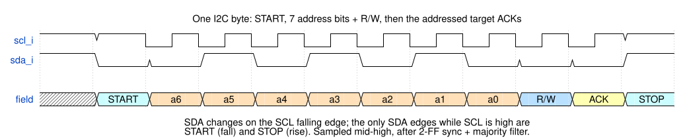
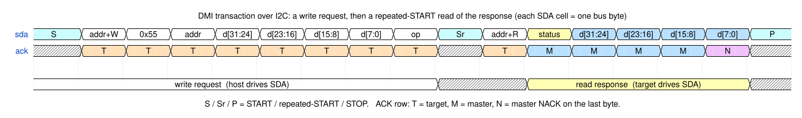
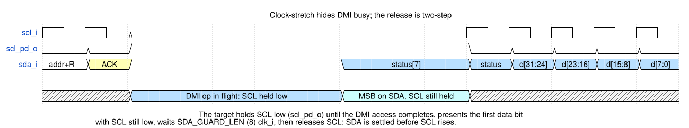
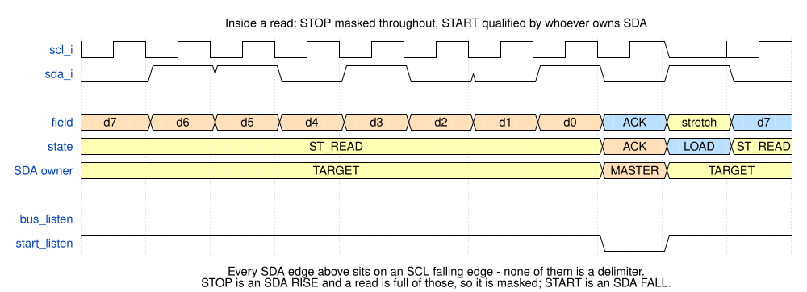

<p align="center">
  
</p>

# arv_dtm_i2c — I2C Debug Transport Module

*An I2C target on two open-drain wires that carries RISC-V DMI transactions to
the aRVern Debug Module, hiding DMI latency by clock stretching.*

---

## Contents

- [Overview](#overview)
  - [Behaviour at a glance](#behaviour-at-a-glance)
  - [Parameters](#parameters)
  - [Pins](#pins)
  - [Integration requirements](#integration-requirements)
- [Wire protocol](#wire-protocol)
  - [Byte frame](#byte-frame)
  - [DMI transaction](#dmi-transaction)
  - [Busy is hidden by clock stretching](#busy-is-hidden-by-clock-stretching)
  - [`DTMSTS`](#dtmsts)
  - [Abandoned and malformed transactions](#abandoned-and-malformed-transactions)
  - [Timing the host must respect](#timing-the-host-must-respect)
  - [Host protocol contract](#host-protocol-contract)
- [Bus robustness](#bus-robustness)
  - [Input conditioning](#input-conditioning)
  - [Delimiter visibility during the read phase](#delimiter-visibility-during-the-read-phase)
  - [START/STOP detection margin](#startstop-detection-margin)
  - [Bus watchdog](#bus-watchdog)
- [Synthesis constraints](#synthesis-constraints)
- [DFT / scan](#dft--scan)
- [Verification](#verification)
  - [Bench](#bench)
  - [Builds](#builds)
  - [Test suite](#test-suite)
  - [Lint](#lint)
  - [Running](#running)
- [License](#license)

---

## Overview

`arv_dtm_i2c` is the **low-pin-count** transport of the `arv_dtm` IP: an I2C
target that carries DMI transactions to the core's Debug Module, driven as an
I2C master by the [`arvern-tools`](https://github.com/Arvern-Silicon/arvern-tools)
host stack (`arvern-loader` to load and run a program, `arvern-gdbserver` for
GDB/IDE sessions, `arvern-cli` for scripting, `arvern-minidebug` as a GUI). Two
wires (SDA/SCL), and because the DTM is an addressed target
they need not be dedicated: it can share an existing functional I2C bus, the
debugger addressing the DTM instead of a peripheral. For the professional
standard see [JTAG](arv_dtm_jtag.md), or [cJTAG](arv_dtm_cjtag.md) for a
J-Link on two pins; for the low-cost option, [UART](arv_dtm_uart.md).

The module chains three blocks: an I2C-target PHY (this file), the shared
`arv_dtm_cmd` byte-stream interpreter, and the shared `arv_dtm_dmi_master`
APB4 master. Only the PHY is I2C-specific; the logical `{address, op, data}`
DMI transaction is identical to the JTAG and UART transports. The parts shared
by every transport — the DMI master and its APB4 contract with the Debug
Module, the always-on-clock rule, the part-number catalog — are in the
overview [`arv_dtm.md`](arv_dtm.md). This page is complete for a host-tool
writer: the whole wire protocol is here.

### Behaviour at a glance

| Bus event | Target response |
|---|---|
| START + address byte for another target | NACK (SDA never driven); the rest of that frame is ignored until the next START or STOP. |
| START + `{addr, W}` + `[0x55][addr][d31:24][d23:16][d15:8][d7:0][op]` | Every byte ACKed, never stretched. The DMI op is launched as the op byte is ACKed. `op`: `0` poll, `1` read, `2` write, `3` dmihardreset. |
| Repeated START + `{addr, R}` | SCL is held low until the response is ready (busy hidden), then `[status][d31:24][d23:16][d15:8][d7:0]` is clocked out; the host ACKs the first four bytes, **NACKs the last**, then STOPs. `status` is 0 (success) or 2 (failed); a read that runs into the watchdog returns `0xFF` bytes. |
| DMI address `0x7F` (`DTMSTS`) | Answered locally, never reaches the DMI bus: RX FIFO depth (8) and the sticky overrun flag; write-1-to-clear, a write with data bit 0 = 0 is a no-op. The result a later `op = 0` returns is unchanged. |
| STOP after the request, before the response is read | The op still executes; its response is discarded. A later START + `{addr, R}` with no new request stretches SCL until the watchdog fires and then reads `0xFF` bytes. The result is retrievable by a new request with `op = 0`. |
| NACK before the 5th byte, or a STOP / repeated START anywhere in the response | Response abandoned, interpreter resynchronised at once; the op has already executed. |
| ACK on the 5th response byte and further clocks | SCL stretched (no 6th byte exists) until the watchdog releases the bus; `0xFF` bytes afterwards. |
| STOP or repeated START inside the 7-byte request | Request discarded, interpreter back to hunting `0x55`. |
| A second request before the first's response has been read, in the same write phase or after a repeated START + `{addr, W}` | Never executed: flushed from the RX FIFO at the next repeated START or STOP; the read returns the first response. |
| No SCL edge for `2^WD_BITS` `clk_i` during a read (from the read address ACK to the final NACK) or while the target holds SDA or SCL low | Bus released (both lines in the same cycle), interpreter reset, any in-flight DMI transfer abandoned; the last completed result is kept for a later `op = 0`. |
| Reset | Both pull-downs released; START/STOP detection is blanked for 7 `clk_i` after release, so a bus that is mid-transaction at that moment is not misread as a START. |

### Parameters

Integrate through the `arv_dtm` wrapper (`DTM_TYPE = 2`, parameters `I2C_ADDR`,
`I2C_WD_BITS`, `ARST_EN`); the table below is the transport module's own
surface.

| Parameter | Default | Description |
|-----------|---------|-------------|
| `ARST_EN` | `1` | Reset style — `1` = asynchronous assertion (default), `0` = synchronous. |
| `WD_BITS` (`I2C_WD_BITS` on the wrapper) | `16` | Read-side bus-watchdog width: `2^WD_BITS` `clk_i` cycles without an SCL edge while the target holds a line releases the bus. Also the longest host pause tolerated mid-read and the longest DMI latency tolerated. Must be ≥ 1. |

The RX FIFO is a fixed 8 bytes (one 7-byte request always fits; I2C does not
pipeline requests), not a parameter. `WD_BITS` is checked by a simulation
`$fatal` at elaboration only; synthesis builds a bad value silently. The target
address (`i2c_addr_i`, `I2C_ADDR` on the wrapper) is not checked at all.
The DMI address width is fixed at **7** internally (not a parameter), the width
the aRVern core's DMI decodes (`dmi_paddr[8:2]`).

### Pins

```
clk_i        in   always-on oscillator (= DMI bus clock; NOT the gated core clock)
dbgresetn_i  in   active-low debug reset
i2c_addr_i   in   7-bit I2C target address (quasi-static)
scl_i, sda_i in   open-drain SCL/SDA levels (sensed)
scl_pd_o     out  active-high pull-down request for SCL (clock stretch)
sda_pd_o     out  active-high pull-down request for SDA
// + the aRVern DMI bus (APB4 master) — see arv_dtm.md
```

The bus is open-drain: the SoC top wires each `*_pd_o` to a tristate /
wired-AND so the DTM only ever drives a line **low**. The target 2-FF
synchronises SCL/SDA, detects START/STOP and SCL edges, matches its 7-bit
address, and ACKs.

On `arv_dtm_i2c` the target address is a quasi-static port (`i2c_addr_i`): set
it before any debug traffic; it only re-points the address compare and is never
latched into a transaction. Through the `arv_dtm` wrapper it is the build-time
parameter `I2C_ADDR` (default `7'h30`); to strap one netlist to different
addresses, instantiate `arv_dtm_i2c` directly and drive the port from straps or
a configuration register. The compare is unfiltered and nothing checks the
value, in simulation or synthesis: it must be in `0x08..0x77`, or the DTM
answers a reserved address (general call `0x00` included).

### Integration requirements

- **Clock.** `clk_i` must be the SoC's always-on (ungated) oscillator, so a
  serial command can wake a WFI clock-gated hart — the same requirement as
  every transport (see [`arv_dtm.md`](arv_dtm.md)). It clocks the PHY,
  `arv_dtm_cmd` and the DMI bus: one domain, no clock-domain crossing inside
  the I2C DTM.
- **Clock floor: `f_clk ≥ 40 × f_SCL`** (≥ 20 `clk_i` per SCL half-period;
  40 MHz at 1 MHz SCL). The input path is ~4 cycles deep; below this the
  target's own SDA release lands after SCL has risen and decodes as a spurious
  STOP. On the read side the target changes SDA about 5 `clk_i` after the SCL
  falling edge at the pin, so the data hold it provides is ≈ `5 / f_clk` and
  shrinks with a faster clock; check it against the bus's SCL fall time on a
  shared bus.
- **Reset.** `dbgresetn_i` is asserted asynchronously and must be released
  synchronously to `clk_i` — a reset synchroniser in the SoC; the aRVern reset
  generator does this. The module is single-domain and contains no synchroniser
  of its own to hide a violation. At `ARST_EN = 0` hold it low for at least 3
  `clk_i` edges, with the clock running.
- **Pads.** Open-drain with pull-ups; `scl_pd_o` / `sda_pd_o` are pull-down
  requests and the DTM never drives a line high.
- **Watchdog.** Size `I2C_WD_BITS` for the host (see
  [Timing the host must respect](#timing-the-host-must-respect)): with the
  default 16, `2^16` cycles is 655 µs at 100 MHz.
- **DFT.** No `scan_mode_i` port: the module generates no clock or reset
  ([DFT / scan](#dft--scan)).

---

## Wire protocol

### Byte frame

I2C bytes are **MSB-first**, each followed by a 9th ACK clock. The first byte
after a START carries the 7-bit target address + R/W bit; the addressed target
pulls SDA low to ACK. START and STOP are SDA transitions while SCL is high.



### DMI transaction

The byte-level frame is the "DMI over serial" format shared with the UART
transport:

```
Request  : [0x55][addr][d31:24][d23:16][d15:8][d7:0][op]
Response :     [status][d31:24][d23:16][d15:8][d7:0]
```

| Field | Encoding |
|---|---|
| `0x55` | SYNC. Required: the interpreter discards bytes until it sees `0x55`, then parses the fixed-length request that follows. |
| `addr` | 7-bit DMI register address in bits `[6:0]`; bit 7 must be 0 (not decoded — `0x80..0xFF` alias onto `0x00..0x7F`). `0x7F` is `DTMSTS`. |
| `d31:24 … d7:0` | 32-bit data, most significant byte first. Write data for `op = 2`; ignored for the other ops. |
| `op` | Bits `[1:0]`: `0` poll (returns the last completed result, no bus access), `1` read, `2` write, `3` dmihardreset (returns status 0, data 0 and changes nothing: a request is parsed only after the previous one has completed, so no transfer is outstanding when it executes; the [watchdog](#bus-watchdog) is what abandons an in-flight transfer). Bits `[7:2]` must be 0 (not decoded). |
| `status` | Bits `[1:0]`: `0` success, `2` failed (the DM raised PSLVERR; the aRVern DM never does). Bits `[7:2]` are 0. A host that reads after the watchdog has released the bus gets `0xFF`: the idle bus, not a status code. |

On I2C the SYNC byte is belt-and-braces: START/STOP already frame a request,
and the watchdog forces a hard abort. It is kept because `arv_dtm_cmd` is
shared with the UART front-end, so one host encoder builds the same request
bytes for either transport. (`0x55` is unrelated to the UART's auto-baud byte
`0x80`, which never exists on I2C.)

The response **must be read in the same bus transaction, by a repeated START**:

1. `{addr, W}` then `[0x55][addr][d31:24..d7:0][op]` — the target ACKs each byte;
2. **repeated START**, then `{addr, R}`;
3. read `[status][d31:24..d7:0]` (5 bytes), ACKing each and **NACKing the
   last**, then STOP.



A STOP after the request abandons the response: the DMI op still executes (a
write takes effect), its result is discarded, and a later START + `{addr, R}`
stretches SCL until the watchdog fires (`2^WD_BITS` `clk_i`) and returns
`0xFF` bytes. The split write / STOP / START / read sequence that
`i2c-dev`-style host APIs produce by default is therefore **not supported**. To
retrieve the result of an abandoned op, send a new request with `op = 0` and
read it by repeated START. The last byte must be NACKed: ACKing it asks for a
6th byte that does not exist, and the target stretches SCL until the watchdog
releases it.

One request per transaction, one response per request. A second request
written before the first's response has been read — in the same write phase,
or after a repeated START + `{addr, W}` — waits in the RX FIFO behind the held
response and is flushed at the next repeated START or STOP, never executed; the
read returns the first response. Writing past the 8-byte FIFO sets
`DTMSTS.rx_overrun`; the op already in execution still completes and its
response is unchanged.
The write phase always ACKs and never stretches; the 8-byte RX FIFO holds one
whole request, so nothing is lost as long as the interpreter has consumed the
previous request — which it has, unless a STOP-abandoned op is still in
flight when the repeated START arrives (impossible against the aRVern DM,
whose DMI access completes within a few `clk_i`; possible against a
wait-stating DMI slave, where the new request is then lost and the read runs
into the watchdog).

### Busy is hidden by clock stretching

While the DMI op is in flight the target holds SCL low (`scl_pd_o`) at the
first byte of the read, so the host's read of the status byte simply returns
**late with correct data** — never a busy code. Of the five response bytes,
only the first can be stretched: the whole response is held in the interpreter before it goes out, so
bytes 2–5 follow without a stretch. The wait is bounded by the
watchdog: the DMI access must complete within about `2^WD_BITS` `clk_i` of the
address byte's ACK, or the bus is released and the host reads `0xFF`.



**Stretch release is two-step.** When the response byte arrives while SCL is
being stretched, the target first presents the MSB on SDA with SCL still held
low, waits `SDA_GUARD_LEN` (8) `clk_i` cycles, then releases SCL — so the
master, and every other device on the bus, sees SDA settle before SCL rises: a
data setup of at least `8 / f_clk` plus the pull-up rise time, independent of
the data value. A byte that is ready before the stretch engages goes out at
once (the target presents SDA about 5 `clk_i` after the address ACK's falling
edge, within the master's low half-period) and the master times the rise.
Against the aRVern DM the response is normally ready before the repeated-START
address byte completes, so the stretch is rare; against a slower DMI it is
every read.

### `DTMSTS`

DMI address `0x7F` is a DTM-local register intercepted by the interpreter and
never forwarded to the DMI bus. It is the same register as on the UART
transport ([`arv_dtm_uart.md`](arv_dtm_uart.md#request-pipelining-and-dtmsts)):
a read (`op = 1`) returns `{16'b0, rx_fifo_depth[7:0], 7'b0, rx_overrun}` with
status 0, where `rx_fifo_depth` reads **8**; a write (`op = 2`) with data bit 0
= 1 clears the sticky `rx_overrun` (write-1-to-clear) and returns the status
word as read before the clear, while bit 0 = 0 is a no-op; `op = 0` / `op = 3`
at `0x7F` are not intercepted. A `DTMSTS` access leaves the last completed DMI
result, which a later `op = 0` returns, unchanged. On I2C the flag can only be
set by a host that writes past the 8-byte FIFO without reading a response — the
second-request case above — and it survives every resync until the host clears
it.

### Abandoned and malformed transactions

| What the host did | What the target does |
|---|---|
| STOP or repeated START inside the request (fewer than 7 bytes) | The partial request is discarded and the RX FIFO flushed; the interpreter hunts the next `0x55`. A repeated START + `{addr, R}` that follows stretches SCL until the watchdog (no response exists). |
| STOP after the complete request, response unread | Op executes; response discarded (also when the STOP lands in the very cycle the DMI op completes). Retrieve the result with `op = 0`. |
| NACK before the 5th byte then STOP, or a repeated START anywhere in the response | Response abandoned; the interpreter resynchronises immediately and the next request is served normally, without waiting for the watchdog (`i2c_abandon_read`, `i2c_resync_sr_resp`, `i2c_abandon_restart`). |
| Stops clocking mid-byte, inside an ACK clock, or with SCL stretched | The watchdog releases the bus after `2^WD_BITS` `clk_i` without an SCL edge; the interpreter is reset and any in-flight DMI transfer abandoned. The last completed result is not cleared: a later `op = 0` returns it. |
| Address byte for another target, or general call `0x00` | Ignored: no ACK, no drive, no DMI op; the interpreter is untouched. (General call is answered only if `i2c_addr_i = 0`, which is outside the allowed range.) |

### Timing the host must respect

- **Repeated START between request and response** — the only supported
  sequence (above).
- **Inter-byte pauses.** The watchdog counts `clk_i` cycles between
  consecutive SCL edges while the target holds a line. From the ACK of the
  read address byte to the NACK of the last response byte the master must
  therefore never leave SCL static (high or low) for longer than
  `2^WD_BITS / f_clk` — 655 µs at 100 MHz with the default; `I2C_WD_BITS = 20`
  gives 10.5 ms — or the target releases both lines mid-read and the remaining
  bytes read `0xFF`. The same bound applies inside the ACK clock of every
  request byte (from its 8th falling edge to its 9th), where the target is
  pulling SDA low; between request bytes there is no bound. Hosts that issue
  the five response reads as separate bus operations (USB-attached bridges
  with a per-byte round trip) must raise `I2C_WD_BITS` or batch the read.
- **Data setup after a stretch.** SDA is valid at least 8 `clk_i` (plus the
  pull-up rise time) before the target releases SCL; when no stretch was
  engaged the master's own low half-period is the setup, and the target has
  its data on SDA about 5 `clk_i` after the SCL falling edge.
- **Data hold.** The target changes SDA about 5 `clk_i` after the SCL falling
  edge at the pin (≈ 50 ns at 100 MHz, less at a faster clock); a master or a
  co-resident device that samples late into the SCL fall must tolerate that.
- **Sampling.** Incoming SDA is sampled about 5 `clk_i` after the SCL rising
  edge at the pin; a master that keeps SDA stable while SCL is high (the
  ordinary rule) is always sampled correctly at or above the clock floor.
- **A repeated START inside the ACK clock** of a response byte (an abnormal
  abandon) is honoured once SCL has been high for ≥ 15 `clk_i` before SDA
  falls; a START after the 9th falling edge needs no such wait.

### Host protocol contract

- One request, then a repeated START and the 5-byte read, then STOP: NACK the
  5th byte; never STOP between request and read; never write a second request
  before reading the first response.
- Target address in `0x08..0x77` (`I2C_ADDR` at integration); `addr[7]` and
  `op[7:2]` zero in the request bytes.
- Never leave SCL static for more than `2^WD_BITS` `clk_i` between the read
  address ACK and the final NACK, nor inside any ACK clock.
- A `0xFF` status byte means the watchdog released the bus: the
  transaction was malformed, too slow, or the DMI access exceeded the
  watchdog; re-issue the request (a `0` poll retrieves a completed result).
- `0x7F` is `DTMSTS`, not a DM register.
- The DTM never drives a line high and never ACKs a foreign address; it is safe
  on a shared functional bus.

---

## Bus robustness

### Input conditioning

Three always-on stages sit between the pins and the START/STOP and bit
sampling:

1. **2-FF metastability synchroniser** (`arv_synchronizer`) — resolves the
   asynchronous open-drain SCL/SDA levels into `clk_i`.
2. **3-tap majority-vote glitch filter** — the filtered level (`scl_lvl` /
   `sda_lvl`) is the majority of the synchroniser output and two cycles of
   history, so a single-cycle glitch on either line cannot flip it or fabricate
   a START/STOP.
3. **Delayed mid-high SDA sample** — the receive states sample SDA on
   `scl_sample`, a strobe delayed two cycles past the filtered SCL rising
   edge, so SDA is read near the middle of the high phase, after it has
   settled — never on the edge. START and STOP still trigger on the filtered
   SCL-high level directly, so a (repeated) START or STOP is recognised
   immediately.

The target changes SDA only while SCL is low, so its own ACK bits never look like a
START or STOP. During the read phase (`ST_READ_LOAD`, `ST_READ`, `ST_READ_ACK`) STOP
detection is masked (`bus_listen` low) and START is qualified, as described below.

The SCL/SDA synchronisers, the majority-vote history and the SDA edge-delay
flop all reset **high** (`RST_VAL(1'b1)`, the idle bus level), so on an idle
bus the filtered lines come up idle with no phantom START/STOP. A 7-cycle
settle mask (`bus_primed`) additionally blanks START/STOP detection while the
input pipeline captures the real bus level, so a DTM released from reset onto
a bus another master holds mid-transaction (SDA low, SCL high) does not decode
a phantom START (`i2c_cold_start`). The sample-strobe delay resets low, so no
spurious sample fires either.

### Delimiter visibility during the read phase

During the read phase the target is *sending*, and it must still watch the bus
for delimiters. The two are treated **asymmetrically**, and the asymmetry is
load-bearing: a STOP seen that isn't there would abandon a live transfer; a
START missed leaves the PHY parked, driving the bus into someone else's frame.



**STOP is masked for the whole read phase.** A STOP is an SDA *rise* while SCL
is high — and the read phase is full of SDA rises that are not STOPs: the
target releasing a `1` bit, and the master releasing its ACK, which it may do
arbitrarily close to the SCL rise. After the synchroniser and majority filter
none of them is distinguishable from a STOP. Masking costs nothing, because a
STOP idles the bus and the next thing on an idle bus is a START — which *is*
seen.

**START is honoured during the read phase.** Without it, a host that abandons a
read leaves the FSM in `ST_READ`/`ST_READ_LOAD`, where the PHY drives SDA and
stretches SCL — into the next frame on a shared bus. The watchdog does not
rescue that case, because the foreign traffic keeps clearing its counter. A
START is an SDA *fall*, so it is decodable only where the **target owns SDA**;
each read state qualifies it differently:

| State | Who drives SDA | How a false START is suppressed |
|---|---|---|
| `ST_READ`, `ST_READ_LOAD` | target (always, while SCL is low) | `sda_guard`: an 8-`clk_i` blank after any own `sda_pd` change — defence in depth, since the two-step stretch release already moves SCL only after SDA has settled; it matters only on a bus faster than the declared floor (`i2c_fast_bus_guards`). |
| `ST_READ_ACK` | **master** (its ACK, low while SCL low) | SCL-high dwell of ≥ 15 `clk_i` — a `sda_pd`-keyed guard cannot see a master-driven fall. A live ACK slot never satisfies it (`scl_sample` leaves the state ~12 `clk_i` before the threshold), so it is reachable only with the FSM parked, which is exactly the abandoned-read case. Below the clock floor it may never assert and the state reverts to plain masking. |

**Known residual.** A host that omits the mandatory 9th clock and builds a STOP
on that slot's rise still parks the PHY in `ST_READ_LOAD`; the watchdog remains
its only escape. A conforming NACK + STOP is unaffected, because the mandatory
9th clock leaves `ST_READ_ACK` before the STOP's rise.

### START/STOP detection margin

`start_cond`/`stop_cond` require SCL observed high for **two consecutive
cycles** (`scl_lvl & scl_dly`), not merely in the same cycle as the SDA edge.
SCL and SDA travel independent 4-deep input pipelines (2-FF synchroniser +
2-cycle majority filter); the nominal delay cancels, but each first stage's
metastability aperture can delay one line and not the other — always late — so
the guaranteed observed separation is one cycle less than the data setup
expressed in `clk_i`. Requiring two consecutive high samples keeps one full
cycle of margin at the clock floor. The extra cycle costs nothing: SCL is high
for ≥ 20 cycles at a real START/STOP. It implies a STOP setup of
`≥ 2 × T_clk`. A START needs `≥ 3 × T_clk` to be decoded: observed one cycle
early (the skew above), it enters address reception in the very cycle the
delayed SDA sample strobes, takes a spurious first address bit, and the
mismatched address is NACKed. Any I2C-conforming `tSU;STA` is far above both;
the bench's 200 ns START setup is 20 `clk_i` at its 100 MHz clock.

### Bus watchdog

The target can hold a line down and stall the bus on a pure host fault:
`ST_READ_LOAD` holds SCL low waiting on `arv_dtm_cmd`, `ST_READ` holds SDA low
driving a 0 bit, and the ADDR/WRITE **ACK** states assert `sda_pd` on one
`scl_fall` and release it on the next one. If the master stops clocking in any
of those, the line stays low — and in the ACK case the PHY then blocks its own
escape, because `start_cond` needs an SDA fall (already low) and `stop_cond`
needs an SDA rise the pull-down prevents.

The watchdog therefore arms **wherever the target is holding a line down**
(`read_phase | sda_pd | scl_pd`), not only in the read phase. Any SCL edge
clears the counter; on expiry (`2^WD_BITS` `clk_i`, saturating) the FSM is
forced to `ST_IDLE`, both pull-downs are released in the same cycle, and the
interpreter is hard-aborted — back to hunting `0x55`, RX FIFO flushed, any
in-flight DMI transfer dropped through `dmihardreset`. Covered by
`i2c_ack_wedge` and `i2c_read_wedge`.

Because an SCL edge from *any* master clears it, the watchdog is defeated by
foreign traffic on a shared bus: it protects against a dead master, not against
a PHY parked while the bus stays busy. That case is handled by honouring START
during the read phase (above). And because it counts host pauses as well as
DMI latency, it is a host-visible bound (see
[Timing the host must respect](#timing-the-host-must-respect)).

---

## Synthesis constraints

**SCL is not a clock to the fabric.** `scl_i`/`sda_i` are asynchronous
open-drain levels that the receive path oversamples on `clk_i` (2-FF
synchroniser → majority filter → delayed mid-high sample), so no clock is
created on the SCL pad — SCL is treated as data. The only clock is `clk_i`.
The port constraints file
(`synthesis/synopsys/constraints_ports.arv_dtm_i2c.tcl`) assumes three
things: boundary delays of 20 % of the `clk_i` period on every input (`scl_i`,
`sda_i`, `i2c_addr_i` when present, the APB4 `dmi_pready_i` / `dmi_prdata_i` /
`dmi_pslverr_i`) and 60 % on every output (`scl_pd_o`, `sda_pd_o`, the APB4
address, control and data); `dbgresetn_i` is a false path; and for DFT, `clk_i`
is the single scan clock with `dbgresetn_i` declared a reset in the
asynchronous build and held inactive as a test-mode constant in the
synchronous one (where it enters the flops on the data side). The same holds
for the UART transport's RX line; contrast JTAG, where TCK clocks fabric
registers directly and must be declared — see
[`arv_dtm_jtag.md`](arv_dtm_jtag.md).

`synthesis/synopsys/run_syn -design arv_dtm_i2c` builds the module at its
defaults; `-rtl_config i2c_default | i2c_syncrst | wrap_i2c | wrap_i2c_wd20`
builds one entry of `sim/rtl_sim/bin/rtl_configs.py`, `-rtl_sweep` every
entry. `run_check_reset_style` confirms the reset style of the resulting
netlist under PrimeTime.

---

## DFT / scan

This module has **no scan ports, and needs none** — it generates no
internal clock or reset, forwarding `dbgresetn_i` unmodified; the house rule
is in [`arv_dtm.md`](arv_dtm.md). The open-drain outputs `scl_pd_o`/`sda_pd_o`
are pull-down *requests*; pad control during test mode is the integrator's.

---

## Verification

The flow uses **Icarus Verilog** (default) for simulation, **Verilator** for
lint and coverage, and **VC Static** for signoff lint. The lint and synthesis
sweeps read one configuration table, `sim/rtl_sim/bin/rtl_configs.py`.

### Bench

`bench/verilog/tb_arv_dtm.v` is the unified bench for every transport; built
with `-dtm i2c` it instantiates the shipping `arv_dtm` wrapper with
`DTM_TYPE = 2` (`I2C_ADDR = 7'h30`) and drives the DUT through its open-drain
SCL/SDA — a wired-AND of the master's and the DUT's pull-downs — with the
bit-banged master BFM in `i2c_tasks.v` and the shared behavioural DMI slave
`dmi_slave_model.v` on the far side. Bench facts a contributor relies on:

- The always-on clock is 100 MHz. The I2C half-periods `T_HIGH` / `T_LOW` are
  200 ns = 20 `clk_i`, exactly the `f_clk ≥ 40 × f_SCL` floor; the data setup
  `T_SU` is 50 ns and the START/STOP setup `T_SU_STA` 200 ns. All four are
  variables a test may retune (`i2c_setup_margin` shrinks `T_SU`,
  `i2c_fast_bus_guards` the bus period).
- The master honours clock stretching: after releasing SCL it waits for the
  line to actually rise. During the read phase it flags an error if the
  target's SDA changes in the same instant SCL rises (the check that pins the
  two-step stretch release).
- `i2c_tasks.v`: `i2c_start`, `i2c_stop`, `i2c_write_byte(b, ack)`,
  `i2c_read_byte(b, ack)` (argument 1 = ACK, 0 = NACK), `dmi_i2c(addr, op,
  data, status, rdata)` — write request, repeated START, five reads, STOP.
  `dtm_tasks.v` layers the transport-neutral `dtm_dmi_write / dtm_dmi_read /
  dtm_dmi_hardreset / dtm_init` on top.
- `dmi_slave_model.v` (128-word memory) has the knobs `slave_latency` (APB wait
  states; default 1 = the aRVern Debug Module's timing, 0 = a zero-wait-state slave),
  `slave_hold` (hold PREADY low — the only way to make the DUT stretch against
  this slave), `slave_abort` (drop back to idle), `slave_fault_en` /
  `slave_fault_addr` (raise PSLVERR for one address). Its `PRDATA` is X
  outside PREADY, so a capture at the wrong cycle fails.
- Monitors in the bench, active for every test: an APB4 protocol monitor on
  the DMI port (PENABLE only after one SETUP cycle, address/control/data
  stable to completion, PSEL held to PREADY except across a dmihardreset,
  PPROT = 0) and a pin-tie monitor that requires the unselected transports'
  outputs at their idle levels (`uart_tx = 1`, `tdo_oe = 0`, `tmsc_oe = 0`,
  `dbg_wakeup = 0`) on every cycle.
- The bench watchdog is 10 ms for I2C builds. A test ends by raising
  `stimulus_done`; the bench prints `SIMULATION PASSED` when `error == 0`.
  Some tests probe the DUT white-box (`u_cmd.state`, `sda_pd`,
  `scl_hi_settled`) where the bus data alone is not discriminating.

### Builds

`run_all` runs every test at the bench's elaboration parameters (see the hub's
[Bench](arv_dtm.md#bench)) with the asynchronous reset;
`run_all -sync_rst` builds the synchronous-reset variant (`ARST_EN = 0`) of
every test. `SIM_EXTRA_DEFINES` passes space-separated `NAME[=VALUE]` defines
into a single build; `-seed N` fixes the random seed. The lint / synthesis
configurations for this transport are `i2c_default`, `i2c_syncrst`, `wrap_i2c`
and `wrap_i2c_wd20` (`I2C_WD_BITS = 20`) in `rtl_configs.py`; a new
configuration goes in that table.

### Test suite

| Test | What it pins | Builds |
|------|--------------|--------|
| `dmi_rdwr` (`-dtm i2c`) | Transport-neutral DMI write/read (write request + repeated-START read) at several addresses (`0x7E` included), overwrite with no stale latch, the aRVern Debug Module's single wait state (`slave_latency = 1`), `op = 3`, and a failed-status read. Same stimulus as JTAG / cJTAG / UART. | default, sync |
| `dmi_walk` (`-dtm i2c`) | Walking-ones/zeros DMI address and data, five rounds, read back (address aliasing). | default, sync |
| `dmi_sync_reset_width` (`-dtm i2c`) | A `dbgresetn` pulse of 3 or more `clk_i` edges never fabricates or replays a DMI transfer, and the link re-opens; 1- and 2-edge pulses are reported only. | default, sync |
| `unselected_pins` (`-dtm i2c`) | Random edges on every JTAG, cJTAG and UART input, `scan_mode_i` and `idcode_version_i` during DMI traffic: every transfer completes as without them, the unselected outputs stay idle, `dbg_wakeup_o` stays low. | default, sync |
| `i2c_dmi_busy` | Busy is hidden by clock stretching: a stalled response (`slave_hold`) holds SCL low and returns the **correct** held-read value, not the master's stale prior data; the master's SDA-at-SCL-rise check pins the two-step release. | default, sync |
| `i2c_stop_race_wait` | The DMI slave is released at a swept offset around a STOP that abandons the request, so one offset makes the completion coincide with the STOP: the response is still dropped and the next transaction gets its own data. | default, sync |
| `i2c_stop_race_exec` | A poll request queued behind a held op is abandoned by a STOP swept around the cycle it executes: its response is dropped and the next transaction gets its own data. | default, sync |
| `i2c_read_addr_stop` | A bare START + `{addr, R}` with no request: ACKed, SCL stretched until the watchdog releases it, no DMI transfer, next transaction normal; a START swept around the watchdog expiry gets at most one NACK, then a normal round trip. | default, sync |
| `i2c_abandon_restart` | A master that abandons a response with a repeated START inside a data byte, or in the ACK slot, and re-addresses the target is served at once, without the watchdog. | default, sync |
| `i2c_read_wedge` | An over-read (ACK on the 5th byte, a 6th clocked) and a read abandoned mid-byte with SDA held low: the watchdog releases the bus within a bounded window and the link recovers. | default, sync |
| `i2c_abandon_read` | NACK after 2 of 5 response bytes + STOP resynchronises the interpreter: the next read is not served the stale tail. | default, sync |
| `i2c_resync_sr_resp` | A repeated START after one NACKed response byte puts `arv_dtm_cmd` back in `S_SYNC` immediately (probed white-box: the data alone is not discriminating, since the watchdog eventually rescues a parked FSM). | default, sync |
| `i2c_frame_resync` | A request truncated by STOP, a request truncated by a repeated START, a read abandoned to the watchdog: the following transaction returns the correct value in every case. | default, sync |
| `i2c_cold_start` | Reset released onto a bus held SDA-low / SCL-high by another master: no phantom START (`ST_IDLE`), normal traffic afterwards. | default, sync |
| `i2c_ack_wedge` | A master that stops clocking inside the ACK bit (SCL left high, SDA held low by the target): the watchdog releases the pull-down and the link recovers. | default, sync |
| `i2c_foreign_addr` | A complete, well-formed write frame to address `0x31` (one bit from the target's): NACK, SDA never driven, DM memory untouched. | default, sync |
| `i2c_setup_margin` | START/STOP detection survives a data change landing in the same `clk_i` cycle as the SCL rise (`T_SU` below one clock period): the two-cycle SCL qualifier; an earlier write is not corrupted. | default, sync |
| `i2c_fast_bus_guards` | Bus periods swept from 42 ns down to 36 ns, below the clock floor, where the target's own SDA movement lands with SCL high: `sda_guard` and the read-phase STOP mask engage (each observed) and the frame stays intact. | default, sync |
| `i2c_dtmsts_reg` | `DTMSTS` reads `0x800` (depth 8) without a DMI access; writes and W1C as documented; `op` = 0 / 3 at `0x7F` are not intercepted. | default, sync |
| `i2c_poll_after_stop` | A read, a write and a failing read each abandoned by a STOP: an `op` = 0 request retrieves the result without a bus access. | default, sync |
| `i2c_second_request` | A second request written while the first op is held, in the same write phase or after a repeated START + `{addr, W}`, never executes and the read returns the first response; 8 queued bytes fit, 9 set `rx_overrun`, which survives abandons until W1C. | default, sync |
| `i2c_stretch_later_byte` | Response bytes 2–5 never stretch; long master pauses below the watchdog leave the data intact; the watchdog releases both lines 2^WD_BITS `clk_i` after the last SCL edge (SCL stretched, or SDA held at the hand-off), drops the in-flight transfer, and a poll then retrieves a completed result. | default, sync |

### Lint

```bash
cd sim/rtl_sim/run
./run_lint                  # Verilator --lint-only -Wall -Wpedantic, every toplevel at its defaults
./run_lint -sweep           # every (top, parameter) point of bin/rtl_configs.py
```

`lint/vc_static/run_vclint [-rtl_config <N|name> | -rtl_sweep | -list_configs]`
runs the VC Static signoff lint over the same table, from a shell with
`vc_static_shell` on PATH; reports land in `lint/vc_static/results/`.

### Running

```bash
cd sim/rtl_sim/run
./run dmi_rdwr -dtm i2c            # generic DMI r/w over I2C (dumps tb_arv_dtm.vcd)
./run i2c_read_wedge               # any i2c_* test (the prefix selects the transport)
./run i2c_stop_race_wait -seed 7   # fixed seed
./run_all                          # whole block-level suite, asynchronous reset
./run_all -sync_rst                # same, ARST_EN = 0
./run_all -cov                     # Verilator coverage sweep (results in run/cov/)
```

A test passes when its log contains `SIMULATION PASSED`. `run_all` writes one
log per run to `log/<iter>/<name>.log` and the summary to
`log/summary.<iter>.log`.

---

## License

BSD-3-Clause. See the repository root `LICENSE`.
