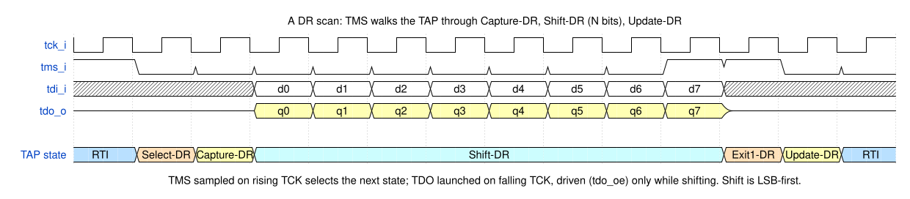
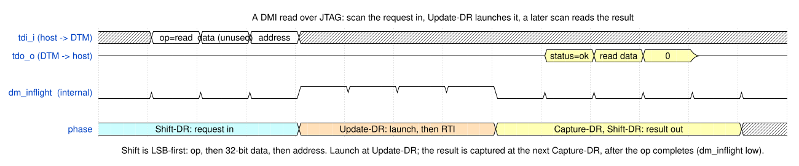
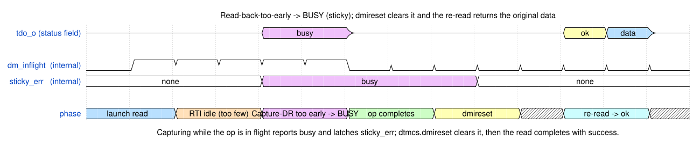

<p align="center">
  
</p>

# arv_dtm_jtag — JTAG Debug Transport Module

The standards-compliant transport of the `arv_dtm` IP: a RISC-V Debug
Specification 1.0 JTAG DTM that bridges a 4-wire JTAG TAP (TCK/TMS/TDI/TDO) to the
aRVern core's DMI bus. Because it presents a stock JTAG DTM, GDB/OpenOCD work out
of the box with any adapter OpenOCD supports, as does a J-Link; the
[`arvern-tools`](https://github.com/Arvern-Silicon/arvern-tools) host stack (loader,
GDB server, CLI and GUI) drives it through an FT232H.

This is the **professional standard** — the default when a chip can spare the pins
and wants stock tooling. (For the same capability on two pins, see
[cJTAG](arv_dtm_cjtag.md); for lower-cost board-native options, the serial
[UART](arv_dtm_uart.md) and [I2C](arv_dtm_i2c.md) transports.)

> This page documents the **JTAG-specific** TAP, register model, and busy/sticky
> semantics. The shared parts — the `arv_dtm_dmi_master` APB4 master, the TCK ⇄
> hclk CDC, the always-on-clock integration rule, the reset contract and the DFT
> rule — live in the hub doc **[`arv_dtm.md`](arv_dtm.md)**. Read that first.

`arv_dtm_jtag` contains the 16-state TAP controller, the IR and its decode, the
IDCODE/dtmcs/dmi/BYPASS data registers, sticky busy/failed tracking, and (via the
shared `arv_dtm_dmi_master`) the TCK→hclk crossing.

## Contents

- [Parameters](#parameters)
  - [The default `IDCODE`, and how to compute your own](#the-default-idcode-and-how-to-compute-your-own)
- [Pins](#pins)
- [Integration requirements](#integration-requirements)
- [Register model](#register-model)
- [Busy / sticky-error semantics](#busy--sticky-error-semantics)
  - [Choosing `IDLE_HINT`](#choosing-idle_hint)
- [Synthesis constraints](#synthesis-constraints)
- [OpenOCD](#openocd)
- [DFT / scan](#dft--scan)
- [Verification](#verification)
- [License](#license)

## Parameters

| Parameter | Default | Description |
|-----------|---------|-------------|
| `IDCODE_BASE` | `28'h000_01F7` | IDCODE`[27:0]` returned after Test-Logic-Reset. Bit 0 **must** be 1 (IEEE 1149.1). Bits `[11:1]` default to Arvern Silicon's JEDEC identity (see below); an integrator ships its own. Part-number `[27:12]` defaults to `0x0000` and is yours to set at integration. The version field `[31:28]` is **not** in this parameter — it is the `idcode_version_i` port, so it can be revised by ECO; see [arv_dtm.md](arv_dtm.md#part-number-catalog). |
| `IDLE_HINT`  | `3'd3`         | `dtmcs.idle`: Run-Test/Idle cycles the debugger is hinted to insert between DMI accesses. A **throughput** knob, not a correctness one — see [Choosing `IDLE_HINT`](#choosing-idle_hint). |
| `ARST_EN`    | `1'b1`         | Reset style of the `hclk` side — `1` = async active-low (default), `0` = synchronous. The TCK side is asynchronously reset in every build. |

The DMI address width is fixed internally at **7** (`localparam DMI_ABITS`), the width
the aRVern core's DMI decodes (`dmi_paddr[8:2]`) — it is not a parameter. The dmi DR is
therefore `7 + 34 = 41` bits. The `IDCODE_BASE` LSB is checked at elaboration (`$fatal`
under `translate_off`); synthesis does not check it.

### The default `IDCODE`, and how to compute your own

The 32-bit IDCODE has one part IEEE 1149.1 actually governs — bit 0 (fixed `1`)
and bits `[11:1]` (the *manufacturer identity*). Bits `[31:12]` (version,
part-number) carry no standard meaning at all; they're free for whoever
integrates this IP to use however they like (see
[Part-number catalog](arv_dtm.md#part-number-catalog) in the hub doc for how
Arvern uses that field for its own boards).

**The manufacturer field**, per **IEEE Std 1149.1-2001 §12.2.1**, rule (a)(2)
(quoted verbatim):

> "Manufacturer identity code bits 7-1. The seven LSBs are derived from the last
> byte of the EIA/JEP106 code by discarding the parity bit. Manufacturer
> identity code bits 11-8. The four MSBs provide a binary count of the number of
> bytes in the EIA/JEP106 code that contain the continuation character (hex
> 7F). **Where the number of continuation characters exceeds 15, these four
> bits contain the modulo-16 count of the number of continuation characters.**"

So: take your JEDEC JEP106 assignment (a bank number and a final byte), and
compute

```
continuation_nibble  = (bank - 1) mod 16                 -- bits [11:8]
code7                = final_byte_with_parity_stripped   -- bits [7:1]
manufacturer_field   = {continuation_nibble, code7}      -- 11 bits, bits [11:1]
```

One pattern is reserved and must never be used: `manufacturer_field ==
11'b000_0111_1111` (rule (b) — this is the EIA/JEP106 continuation character
itself, reserved by the standard for detecting the end of a board-level scan
chain of unknown length).

**Worked example — Arvern Silicon's own assignment.** JEDEC JEP106 bank 18,
final byte `0xFB` (`0x7B` with the odd-parity bit set):

```
bank = 18  ->  continuation count = 17  ->  17 mod 16 = 1  = 4'h1
final byte 0xFB, parity stripped        ->  0x7B           = 7'h7B
manufacturer_field = {4'h1, 7'h7B} = 11'h0FB
IDCODE default (part-number left at 0x0000) = 32'h0000_01F7
```

Because the compressed field is only 11 bits wide (2032 codes) against JEP106's
much larger space, this is a documented, *lossy* compression: bank 18 and bank
34 (and every other bank an exact multiple of 16 apart) alias to the same
`manufacturer_field`. That's how the standard is written, not a shortcut this
IP takes — there is no way to represent a bank above 16 exactly in 11 bits. The
core's `mvendorid` CSR (0xF11) carries the same JEDEC identity with the full,
un-compressed encoding (RISC-V Privileged spec §3.1.1 — bits `[31:7]` = bank −
1 with no modulo, bits `[6:0]` = the final byte, parity stripped) and is the
place to look for the exact, non-aliased vendor identity; see the core's
[`integration_guide.md`](https://github.com/Arvern-Silicon/arvern/blob/main/doc/integration_guide.md#core-identity-registers-mvendorid--marchid--mimpid).

If you integrate this IP under your own company's JEDEC assignment, override
`IDCODE_BASE[11:1]` with your own `manufacturer_field` computed the same
way — do **not** ship Arvern Silicon's identity in a product that isn't Arvern
Silicon's.

## Pins

```
// JTAG TAP (TCK domain)
tck_i, trst_n_i, tms_i, tdi_i        inputs
tdo_o, tdo_oe_o                      outputs   (tdo_oe_o gates the SoC TDO pad: high only while shifting)
idcode_version_i[3:0]                input     IDCODE[31:28], strapped (see arv_dtm.md, step 2)
dbg_wakeup_o                         output    cold-attach wake: toggles on every TCK rising edge
scan_mode_i                          input     1 = test mode (shift and capture): hold internally generated resets inactive

// DMI side (hclk domain; the arv_dtm wrapper binds hclk_i to its clk_i)
hclk_i, dbgresetn_i                  inputs
// + the aRVern DMI bus (APB4 master) — see arv_dtm.md
```

- `tdo_oe_o` gates the bidirectional TDO pad: drive TDO only when `tdo_oe_o` is
  high (Shift-DR / Shift-IR), tristate otherwise. Both `tdo_o` and `tdo_oe_o` change on
  the falling edge of TCK.
- `trst_n_i` is the JTAG TAP reset. It is **always asynchronous**, in both domains and
  independently of `ARST_EN` — IEEE 1149.1 specifies TRST\* as async, and the TCK domain
  cannot use a synchronous reset because TCK may not be running. It **must** be driven to
  a defined level: it feeds the hclk-domain reset directly, so an undriven pin propagates
  indeterminacy onto the SoC's APB bus, not merely into the TAP. Tie it to the SoC debug
  reset, **or** pull it up with a power-on reset — one of the two is required, not
  optional. `jtag_no_trst` covers the pulled-up case.
- **Pad requirements.** IEEE 1149.1 mandates pull-ups on `tms_i` and `tdi_i` so an
  unconnected input reads as logic 1; `trst_n_i` needs one too when it is not driven by
  the SoC (the reference FPGA project applies all three for a JTAG build). `tck_i`
  should use a clean-edge (Schmitt) pad: the TAP deliberately applies no input
  filtering — you cannot debounce a clock, and TMS/TDI are setup/hold-timed to TCK by
  the probe, so they are synchronous inputs. A runt on a long cable causes a protocol
  desync recoverable by 5×TMS=1, which is inherent to every conforming TAP.

## Integration requirements

- **Clock ratio: declare `f_hclk ≥ f_TCK`.** With `hclk` more than ~53× slower than TCK
  a `dmihardreset` and the DMI access issued right after it could reach the hclk side in
  the same cycle; the request would be dropped and `dmistat` would report BUSY until a
  second `dmihardreset`. The declared ratio makes that unreachable. The same happens,
  whatever the ratio, when `hclk_i` is stopped: a `dmihardreset` issued then is applied
  once the clock resumes, but a DMI access launched after it before the clock resumes is
  lost, and a second `dmihardreset` recovers the link (`dmi_hardreset_clkstop`). The one other bound,
  `IDLE_HINT ≥ 2 + ceil((5 + W) × f_TCK / f_hclk)`, costs throughput rather than
  correctness — see [Choosing `IDLE_HINT`](#choosing-idle_hint). Both are in the hub's
  [Clock-ratio bounds](arv_dtm.md#clock-ratio-bounds) table.
- **Reset.** `dbgresetn_i` is asserted asynchronously and must be released synchronously
  to `hclk_i` (a reset synchroniser in the SoC — the aRVern reset generator does this).
  At `ARST_EN = 0` hold it low for at least 3 `hclk_i` edges. `trst_n_i` is a raw probe
  pin with no minimum width: the TAP conditions `trst_n_i & dbgresetn_i` through one
  asynchronous-assert reset synchroniser per domain, so either reset reaches both halves
  of the DMI handshake (`dmi_reset_cross`). On the DMI side a `trst_n_i`-only reset takes
  effect on the next `hclk_i` edge, so a transfer it abandons ends on a clock edge and the
  Debug Module, which stays out of reset, never samples a half-cleared one
  (`dmi_probe_reset_access`), provided the SoC times that assertion path (see
  [SoC timing signoff](arv_dtm.md#synthesis)). The TAP ignores the first two TCK rising edges after
  `trst_n_i` or `dbgresetn_i` releases (the reset synchroniser); open with TMS = 1 for at
  least five TCKs, as every debugger does, rather than a scan straight after the release.
- **Pads.** Pull-ups on TMS, TDI and TRST_N; a clean-edge pad on TCK (above).
- **Clock.** `hclk_i` is the always-on oscillator, never the gated core clock — the hub's
  first rule.
- **DFT.** The integrator drives `scan_mode_i` high for the whole test, holds `trst_n_i`
  and `dbgresetn_i` inactive,
  treats TCK as a pad-driven scan clock and controls the TDO pad in test mode; the IP
  masks the resets it synchronises — [DFT / scan](#dft--scan).
- **Sleep.** `dbg_wakeup_o` toggles on every TCK rising edge with `hclk_i` stopped; the
  sampling contract for the always-on controller is in the hub's
  [Cold attach](arv_dtm.md#cold-attach--dbg_wakeup_o).

## Register model

Every access is a JTAG scan: TMS walks the TAP into Capture-DR (or Capture-IR),
shifts the selected register **LSB-first** through TDI/TDO in Shift-DR, and commits
it at Update-DR.



### Instruction register (IR)

5 bits, reset value `0x01` (IDCODE). Capture-IR loads `0b00001` (LSBs `01` per
IEEE 1149.1).

| IR | Opcode | DR selected |
|----|--------|-------------|
| IDCODE | `0x01` | 32-bit IDCODE (read-only) |
| DTMCS  | `0x10` | 32-bit `dtmcs` |
| DMI    | `0x11` | 41-bit `dmi` |
| BYPASS | `0x1f` (and every other unassigned opcode) | 1-bit bypass |

### dtmcs — DTM Control and Status

32-bit. Read at Capture-DR; the two reset bits are write-1 strobes at Update-DR.

| Bits | Field | Access | Value / meaning |
|------|-------|--------|-----------------|
| `3:0`   | `version`       | R  | `1` (Debug Spec 0.13/1.0 DTM) |
| `9:4`   | `abits`         | R  | `7` (fixed DMI address width) |
| `11:10` | `dmistat`       | R  | combined DMI status: 0 none, 2 failed, 3 busy (alias of the dmi op field) |
| `14:12` | `idle`          | R  | `IDLE_HINT` |
| `15`    | reserved        | R  | 0 |
| `16`    | `dmireset`      | W1 | write 1 → clear the sticky error (does **not** disturb an outstanding transaction) |
| `17`    | `dmihardreset`  | W1 | write 1 → forget the outstanding transaction (reset the hclk-side bus FSM) + clear sticky. It resets the bus FSM, the in-flight flag, the sticky error and `errinfo`; the last captured `data`/`op` and the shift registers keep their values, so a `nop` scan after it returns stale data with `op = success` — the specification leaves that data unspecified (§6.1.5, *"This operation leaves the values in address and data UNSPECIFIED"*) and a debugger repeats the scan. |
| `20:18` | `errinfo`       | R  | Implemented. `4` = unknown (reset / no error), `3` = device error — the DM signalled `PSLVERR`. `0` would mean *not implemented*. Set to `4` by `dmihardreset`, and by `dmireset` unless a failure was held behind busy, which `dmireset` then exposes as `3`. |
| `31:21` | reserved        | R  | 0 |

### dmi — Debug Module Interface access

41 bits (7 address + 32 data + 2 op).

| Bits | Field |
|------|-------|
| `1:0`               | `op`      — request: 1=read, 2=write, 0=nop · response: 0=success, 2=failed, 3=busy |
| `33:2`              | `data`    — write data (request) / read data (response) |
| `40:34`             | `address` (7 bits) |

A DMI op is **launched** at Update-DR when IR=dmi and `op != nop`. The result is
collected on a later scan: the Capture-DR value carries the address of the last launched
op, its `data` (read data) and its `op` status — after a successful read, `address` is
the address that was read from (Debug 1.0 §6.1.5). `dmi_capture_addr` pins it.



### `errinfo` — why it is implemented

`errinfo` (`dtmcs[20:18]`, Debug Spec §6.1.4) is an **optional** field, and reporting `0`
("not implemented") would be conformant but useless: a debugger that sees `op = failed`
then has no way to tell whether the Debug Module rejected the access or something went
wrong in the link itself.

This DTM implements it, because the DMI master already distinguishes the one case the
spec lets us name precisely:

| Value | Meaning | Reported when |
|---|---|---|
| `4` | unknown — no error, or no further detail | reset value; after `dmihardreset`; after a `dmireset` that exposes no held failure |
| `3` | device error — *"the DMI subordinate reported an error"* | the completion carried `PSLVERR` from the DM |

Values `1` (error between DTM and DMI) and `2` (error between DMI and a subordinate)
describe failures this DTM cannot observe separately, so they are never reported — the
spec's `4` explicitly covers *"no further information available"*.

Per §6.1.4 the field is *"updated whenever `op` is updated by the hardware or when 1 is
written to `dmireset`"*, so it tracks the sticky error state and is cleared alongside it.
OpenOCD decodes and prints this field, so it is what a human sees in a failing session.

## Busy / sticky-error semantics

This is the subtle part the `dtmcs.idle` hint exists to manage, and the focus of
`dmi_busy_recover.v`. (These `busy`/`failed` op-response codes are a DTM-level
concept synthesized from the CDC/sticky state; the core's DMI boundary itself never
raises `pslverr`.)

- **Primary busy (read-back-too-early):** if the debugger reads the dmi register
  (Capture-DR) while the previous op is still in flight, the captured `op` reports
  **busy (3)** *and a sticky condition latches*. This is the dominant mechanism —
  it covers the case where the debugger inserted too few idle cycles.
- **Secondary busy (launch-while-busy):** launching a new op while one is in
  flight also latches sticky busy — in practice the Capture-DR of the same scan has
  already latched the primary busy, so this setter is a guard
  (`sim/rtl_sim/run/waivers_cov.md` records it as unreachable). The op is dropped
  either way (`dmi_busy_secondary`).
- **Sticky failed:** a completed op that returns **failed (2)** is *equally
  sticky* — it persists and drops subsequent ops, exactly like busy.
- While any sticky error is set, `dmistat` and the dmi `op` field report it, and
  further DMI ops are **dropped**.
- **Recovery:** `dtmcs.dmireset` (write 1) clears the sticky error without
  disturbing an outstanding transaction; after it, the originally-requested
  read's data is returned with success — or, if that operation failed while busy
  was latched, the failure is reported instead (`op` = 2, `errinfo` = 3) and a
  second `dmireset` clears it (`dmi_fail_behind_busy`). `dtmcs.dmihardreset`
  additionally aborts the outstanding transaction.



`dmihardreset` is itself crossed (TCK pulse → toggle → hclk sync/edge) to force the
bus FSM back to idle; `dmireset` is purely TCK-side (it must not perturb the hclk
FSM), so it never crosses.

### Choosing `IDLE_HINT`

`dtmcs.idle` is what a debugger reads to decide how many Run-Test/Idle cycles to insert
after each DMI scan — Debug 1.0 §6.1.4: *"2: Enter Run-Test/Idle and stay there for 1
cycle before leaving"*, and so on. Getting it wrong is **never a correctness problem** —
an under-estimate just produces primary busy, which costs a `dmireset` and a retry. It is
a throughput knob.

The value has to cover the round trip through `arv_dtm_dmi_master`:

| Leg | Cost |
|---|---|
| `req_level` → hclk (2-FF sync + edge flop) | 3 `hclk` |
| APB `S_SETUP` → `S_ACCESS` | 2 `hclk` |
| DM wait states (`pready` low) | *W* `hclk` |
| `ack_level` → TCK (2-FF sync + edge flop) | 3 `tck` |

and the Capture-DR that reads the result is two TAP clocks after the last idle cycle, so

```
idle  ≥  2 + ceil( (5 + W) × f_TCK / f_hclk )
```

*W* is the DMI slave's wait-state count — 1 for `arv_debug_dm`, more behind a bridge.
The default of 3 holds while `f_hclk ≥ (5 + W) · f_TCK` (6·f_TCK with the aRVern DM).

Two of those terms are the **integrator's**, not the IP's: `f_hclk`, and *W* — a DM
behind a bridge costs more than one directly attached. That is why this is a parameter
rather than a constant.

- **`f_hclk` ≫ `f_TCK`** (the usual case): the second term rounds to 1 and the default
  of 3 covers it. In practice there is extra slack, because the debugger still has to
  navigate Update-DR → Select-DR → Capture-DR before it reads back.
- **`f_TCK` approaching `f_hclk`**, or a DM with wait states: raise it.
- `f_TCK` is chosen at *runtime* (`adapter speed`), so no build-time value is right for
  every session — set it for the fastest probe clock you expect to be used.

**The field is 3 bits, so 7 is the ceiling.** An integration that would need more must
rely on the busy/`dmireset` path instead, which still works — just more slowly.

`jtag_idle_hint` reads the advertised value back and uses exactly that many idle cycles
at one wait state; the bench's TCK-to-hclk ratio of 3.1 never returns busy.

## Synthesis constraints

`tck_i` is a **real clock**: it directly clocks the TAP FSM, the IR/DR shift
registers, and the TCK side of the `arv_dtm_dmi_master` CDC. Synthesis must (1)
**declare TCK as a clock** and (2) treat it as **asynchronous** to the functional
`hclk` domain — the two meet through the toggle handshake in `arv_dtm_dmi_master`
(2-FF synchronised levels) and the two payload buses that handshake qualifies.

**What the IP's own constraints assume** (`synthesis/synopsys/constraints_ports.arv_dtm_jtag.tcl`,
also used for the wrapper at `DTM_TYPE = 0` with the system clock on `clk_i`):

- `hclk` at the flow's clock period and `tck` modelled at four times that period — a
  slow, externally driven test clock.
- The two clocks are **not** put in a clock group: every `tck ⇄ hclk` path is bounded
  with `set_max_delay -datapath_only` to one period of its destination clock, only the
  hold side is cut, and the payload buses (`u_req_latch → u_hreq_*`,
  `u_rsp_data_h`/`u_rsp_stat_h → u_rdata_tck`/`u_cstat_tck`) carry that explicit budget.
  A clock group or a clock-to-clock false path would override `set_max_delay` and void
  the budget — so an SoC flow that prefers clock groups must add the payload budgets
  separately, or accept that the handshake's "settled ≥ 2 destination cycles before the
  qualifying edge" margin is not checked by STA.
- Boundary delays: TMS/TDI 20 % of the TCK period after the rising edge; TDO and
  `tdo_oe_o` 60 % relative to the **falling** edge (they are launched there);
  `dbg_wakeup_o` 60 % of the TCK period; `idcode_version_i` 20 %; the APB4 DMI ports
  20 % in / 60 % out of the `hclk` period. `trst_n_i` and `dbgresetn_i` are false paths.
- DFT: `tck_i` and `hclk_i` are both scan clocks; `trst_n_i` and `dbgresetn_i` are
  declared resets in every build (their flop reset pins are asynchronous whatever
  `ARST_EN` is — the TCK domain and the TAP's two reset synchronisers).

At the SoC level the same intent in plain SDC, with the period as a placeholder for the
slowest TCK your probes will use:

**Quartus / TimeQuest** (FPGA — clock on the board TCK pad):

```tcl
# TCK enters on a device pin (e.g. GPIO_1[0])
create_clock -name jtag_tck -period <T_TCK_ns> [get_ports {GPIO_1[0]}]

# TCK is asynchronous to the functional/PLL clocks -- cut the domains
set_clock_groups -asynchronous \
    -group [get_clocks jtag_tck] \
    -group [remove_from_collection [all_clocks] [get_clocks jtag_tck]]
```

**Design Compiler / dc_shell** (ASIC — clock on the RTL `tck_i` port):

```tcl
create_clock -name jtag_tck -period <T_TCK_ns> [get_ports tck_i]

# Either an asynchronous clock group ...
set_clock_groups -asynchronous \
    -group [get_clocks jtag_tck] \
    -group [get_clocks hclk_i]        ;# your functional clock(s)

# ... or, to keep the handshake payload budgets checkable, bound each direction
# to one destination period instead (what the IP's own flow does):
# set_max_delay -datapath_only <T_hclk_ns> -from [get_clocks jtag_tck] -to [get_clocks hclk_i]
# set_max_delay -datapath_only <T_TCK_ns>  -from [get_clocks hclk_i]   -to [get_clocks jtag_tck]
# set_false_path -hold -from [get_clocks jtag_tck] -to [get_clocks hclk_i]
# set_false_path -hold -from [get_clocks hclk_i]   -to [get_clocks jtag_tck]
```

Without the `create_clock`, the whole TAP domain is left unconstrained (untimed) and
the TCK⇄hclk crossing is never analysed. Unlike the serial transports, TCK **cannot**
be treated as data — it clocks fabric registers directly. (Contrast I2C's SCL, which
is oversampled and needs no clock — see [`arv_dtm_i2c.md`](arv_dtm_i2c.md).)

## OpenOCD

The DTM presents a standard JTAG DTM, so a stock `riscv` target with the matching
IDCODE works. Because aRVern uses the frozen-hart / abstract-access model with **no
program buffer**, configure OpenOCD for System Bus memory access
(`riscv set_mem_access sysbus`). A GDB-server starting point — here driving the TAP
through an Adafruit **FT232H** (MPSSE) and serving GDB on `localhost:3333` for an IDE
such as CLion. It is the DE0-Nano-SoC reference project's
[`arvern-ft232h-gdb.cfg`](https://github.com/Arvern-Silicon/arvern-soc/blob/main/fpga/alteral_de0_nano_soc/debug/arvern-ft232h-gdb.cfg)
with the IP's default IDCODE; confirm the IDCODE and IR length on your own build (see
the notes below):

```tcl
# --- adapter (FT232H MPSSE; swap these 3 lines for a J-Link, etc.) ---
adapter driver ftdi
ftdi vid_pid 0x0403 0x6014
ftdi layout_init 0x0008 0x000b        ;# D0=TCK D1=TDI D2=TDO D3=TMS, TMS idles high

transport select jtag
adapter speed 1000                     ;# TCK in kHz (1 MHz); raise once stable

# No SRST/TRST wired -> reset goes through the DM's ndmreset, not pins.
reset_config none

# aRVern TAP: 5-bit IR; IDCODE is parameterizable (mismatch only warns). This is
# arv_dtm's own unassigned-part-number default -- an integrator's actual board
# reports whatever they set at integration (see "Part-number catalog" in
# arv_dtm.md); the DE0-Nano-SoC reference board, for example, is 0x080001F7.
jtag newtap arvern cpu -irlen 5 -expected-id 0x000001F7
target create arvern.cpu riscv -chain-position arvern.cpu

# OpenOCD >=0.12 does NOT halt on GDB attach by default, so an IDE connecting to a
# running hart fails to insert breakpoints ("target running"). Halt on attach and
# resume on detach so the IDE always gets a stopped target.
arvern.cpu configure -event gdb-attach { halt }
arvern.cpu configure -event gdb-detach { resume }

# Frozen-hart / abstract-access: no program buffer -> memory over the System Bus.
riscv set_mem_access sysbus

gdb_port 3333                          ;# the IDE's default remote target

init
halt                                   ;# start halted, ready for GDB
```

```
openocd -f arvern.cfg                  # runs until Ctrl-C, listening on :3333
```

Notes:
- `-expected-id` only *warns* on mismatch (IDCODE is a build parameter), so the real
  value still prints — confirm it against your build.
- `reset_config none` is required when neither SRST nor TRST is wired: OpenOCD then
  resets via the DM's `ndmreset` (`monitor reset halt`) instead of pulsing a pin.
- The `gdb-attach { halt }` event is the fix for "can't add breakpoint: target
  running" on connect.

## DFT / scan

`tap_rst_n = trst_n_i & dbgresetn_i` is an AND of two signals the integrator has already
scan-fixed, and `arv_dtm_tap` masks the outputs of its two reset synchronisers with
`scan_mode_i`, held high for the whole test. The integrator owes `trst_n_i` and
`dbgresetn_i` held inactive in test mode and control of the TDO pad (`tdo_oe_o` follows scan data during shift, as an
output does). The rule and the full table are in the hub's
[DFT / scan](arv_dtm.md#dft--scan--what-the-integrator-owes-and-what-the-ip-owes).

## Verification

The unified bench (`tb_arv_dtm.v` + `jtag_tasks.v`) drives the DUT through its JTAG
pins only, with the shared behavioral DMI slave (`dmi_slave_model.v`). The BFM changes
TDI/TMS on the falling edge of TCK and samples TDO on the rising edge (IEEE 1149.1),
`tap_reset` spends exactly five TMS=1 clocks, and TCK runs against `hclk` at a
non-integer ratio with a randomized start phase so the CDC is exercised across
alignments. `tdo_oe_o` is checked on every TCK edge against an independent TAP model,
and the DMI port against an APB4 protocol monitor. The bench, its monitors and knobs
and the `run_all` builds are described in the hub's
[Verification](arv_dtm.md#verification).

| Test | Checks |
|------|--------|
| `dmi_rdwr`         | transport-neutral DMI write/read round-trip across the CDC at several addresses and hclk-side latencies (incl. `slave_latency = 1`, the aRVern Debug Module's single wait state). Runs on JTAG by default (`-dtm jtag`); the same stimulus also runs over cJTAG, UART and I2C. |
| `dmi_walk`         | walking-ones/zeros over the 7-bit DMI address and 32-bit data, five rounds, each written, checked in the slave and read back (address aliasing); the Capture-DR address field matches (also `-dtm uart/i2c/cjtag`) |
| `idcode_bypass`    | IDCODE read after TLR; IR auto-reload of IDCODE; 1-bit BYPASS pass-through. |
| `jtag_ir_unassigned` | every unassigned IR opcode (all but `0x01`/`0x10`/`0x11`) selects the 1-bit BYPASS DR, Capture-IR reads `00001`, no DMI transfer is launched; IDCODE/`dtmcs`/`dmi` work afterwards |
| `idcode_alt`       | every bit of the IDCODE DR carries data: the DUT elaborated with `0xAAAAAAAB` reads it back. |
| `jtag_no_trst`     | usable with TRST unwired (pulled high): `dtmcs.dmistat` reads 0 after a TMS-only reset, without a `dmireset`. |
| `jtag_first_tck`   | exactly five TMS=1 clocks reach Test-Logic-Reset from Shift-DR — not four. |
| `jtag_pause_resume`| a shift suspended in Pause-DR / Pause-IR resumes with the register contents intact. |
| `dtmcs_fields`     | every static `dtmcs` field (version/abits/idle/errinfo, W1 bits read 0). |
| `dtmcs_errinfo`    | `errinfo` 4 → 3 on a genuine `PSLVERR` → 4 after `dmireset`. |
| `dmi_busy_recover` | read-back-too-early → busy; sticky persists past completion; `dmireset` recovers with the data intact; failed is equally sticky and drops intervening ops. |
| `dmi_busy_secondary` | a real op launched while one is in flight is dropped, never queued. |
| `jtag_idle_hint`   | settling exactly `dtmcs.idle` cycles at one wait state never returns busy. |
| `dmi_hardreset`    | `dmihardreset` forgets an outstanding op with no deadlock; a fresh transaction then succeeds. |
| `dmi_hardreset_abort` | `dmihardreset` abandons the transfer on the bus: `PSEL`/`PENABLE` drop and no `PREADY` handshake completes once the slave is released. |
| `dmi_status_recover` | `dmireset`/`dmihardreset` clear the *reported* status (`dmistat` and the dmi `op` field) before any new op; a hardreset does not re-latch a stale failed status. |
| `dmi_capture_addr` | after a successful read the Capture-DR `address` field is the address read from. |
| `dmi_reset_cross`  | an asymmetric `trst_n` / `dbgresetn` pulse never fabricates a DMI transaction; the bus stays idle and a fresh transaction round-trips afterwards. |
| `dmi_fail_capture_sweep` | a `PSLVERR` read collected after 0–12 idle cycles at slave latencies 0–5 (0 to 5 wait states) always reads busy or failed, never success — including the capture on the edge the op retires. Also over cJTAG (16× and 8×). |
| `dmi_fail_behind_busy` | a read that fails after busy was captured is reported failed (`op` = 2, `errinfo` = 3) on the scan repeated after `dmireset`; a second `dmireset` clears it. |
| `dmi_probe_reset_access` | `trst_n` pulsed at 1 ns steps across a write's SETUP and ACCESS cycles: the subordinate sees the whole write or none, nothing else is written, and the link recovers. |
| `dmi_hardreset_race` | `dmihardreset` with the held transfer's `PREADY` swept from 4 `hclk` cycles before to 4 after the abandon (JTAG and cJTAG): no stale data or status, no phantom transfer, a fresh read returns its own value. |
| `dmi_hardreset_fail_race` | the same sweep with a `PSLVERR` transfer: after the hardreset `op` = 0, `errinfo` = 4, `dmistat` = 0; a genuine failure afterwards still reports 2 / 3. |
| `jtag_pause_long` | DMI and IR scans held in Pause-DR / Pause-IR for 3–8 cycles, resumed through Exit2 → Shift or ended through Exit2 → Update: exactly the shifted op executes, the IR takes the shifted value. |
| `jtag_capture_exit` | Capture → Exit1 → Update with no shift: on `dmi` the captured op is the update's — after a success a nop (no transfer, capture unchanged), with a sticky failed or busy it is dropped (no transfer, `dmireset` recovers the held read); on `dtmcs` no reset strobe; on the IR, IDCODE is selected. Also over cJTAG (16× and 8×). |
| `jtag_reset_first_edge` | after a `trst_n` or `dbgresetn` release the documented opening works at every TCK phase, and exactly two leading TCK edges are ignored. |
| `dtm_scan_mode` | with `scan_mode_i` high a `trst_n` pulse leaves the TAP untouched (IR, sticky busy, the held transfer); the same pulse without it resets the TAP. |
| `dmi_sync_reset_width` | a `dbgresetn` pulse of 3 or more `hclk_i` edges never fabricates or replays a DMI transfer, and the link re-opens; 1- and 2-edge pulses are reported only. Runs over all four transports. |
| `unselected_pins` | random edges on every input of the unselected transports (and, in the UART / I2C builds, `scan_mode_i` and `idcode_version_i`) during DMI traffic: every transfer completes as without them, the unselected outputs stay idle, `dbg_wakeup_o` follows only the probe clock (low for UART / I2C). Runs over all four transports. |
| `dmi_hardreset_clkstop` | with the oscillator stopped, a `dmihardreset` is applied on restart but the access relaunched after it is lost (busy); a second `dmihardreset` recovers. |

```bash
cd sim/rtl_sim/run
./run idcode_bypass        # single test (waveform dump)
./run_all                  # whole block-level suite
```

## License

BSD-3-Clause. See the repository root `LICENSE`.
