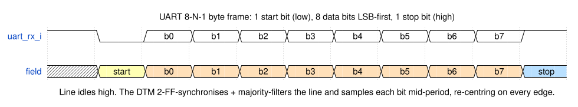
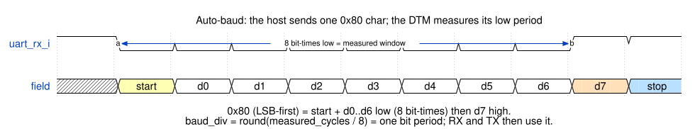
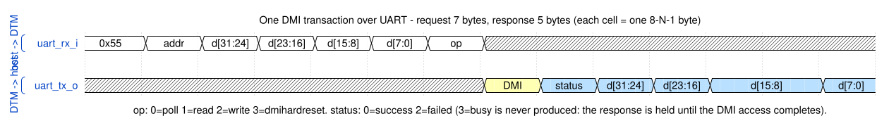

<p align="center">
  
</p>

# arv_dtm_uart — UART Debug Transport Module

*A self-calibrating 8-N-1 serial link that carries RISC-V DMI transactions to
the aRVern Debug Module, with request pipelining and host-driven recovery.*

---

## Contents

- [Overview](#overview)
  - [Behaviour at a glance](#behaviour-at-a-glance)
  - [Parameters](#parameters)
  - [Pins](#pins)
  - [Integration requirements](#integration-requirements)
- [Wire protocol](#wire-protocol)
  - [Byte frame (8-N-1)](#byte-frame-8-n-1)
  - [Opening a session: sync and echo](#opening-a-session-sync-and-echo)
  - [DMI transaction](#dmi-transaction)
  - [Request pipelining and `DTMSTS`](#request-pipelining-and-dtmsts)
  - [Recovery](#recovery)
  - [Host protocol contract](#host-protocol-contract)
- [Receiver](#receiver)
- [Auto-baud](#auto-baud)
- [Sizing `AB_BREAK_CLKS`](#sizing-ab_break_clks)
  - [Bounds](#bounds)
  - [Table](#table)
  - [Break window](#break-window)
  - [What the host sends](#what-the-host-sends)
- [Synthesis constraints](#synthesis-constraints)
- [DFT / scan](#dft--scan)
- [Verification](#verification)
  - [Bench](#bench)
  - [Builds](#builds)
  - [Test suite](#test-suite)
  - [Lint](#lint)
  - [Running](#running)
- [License](#license)

---

## Overview

`arv_dtm_uart` is the **low-cost** transport of the `arv_dtm` IP: an FPGA
board's native UART (the USB-to-serial bridge already on virtually every dev
board) carries DMI transactions to the core's Debug Module, driven by the
[`arvern-tools`](https://github.com/Arvern-Silicon/arvern-tools) host stack
(`arvern-loader` to load and run a program, `arvern-gdbserver` for GDB/IDE sessions,
`arvern-cli` for scripting, `arvern-minidebug` as a GUI). It needs
no JTAG pod and no pins beyond the UART that is already there. For the
professional standard see [JTAG](arv_dtm_jtag.md) or [cJTAG](arv_dtm_cjtag.md);
for the other two-pin option, [I2C](arv_dtm_i2c.md).

The module chains three blocks: a UART RX/TX PHY (this file), the shared
`arv_dtm_cmd` byte-stream interpreter, and the shared `arv_dtm_dmi_master`
APB4 master. Only the PHY is UART-specific; the logical `{address, op, data}`
DMI transaction is identical to the JTAG and I2C transports. The parts shared
by every transport — the DMI master and its APB4 contract with the Debug Module,
the always-on-clock rule, the part-number catalog — are in the overview
[`arv_dtm.md`](arv_dtm.md). This page is complete for a host-tool writer: the
whole wire protocol is here.

### Behaviour at a glance

| Host action | DTM response |
|---|---|
| Any byte before the link is locked | Not decoded: until the baud is locked the receiver assembles no bytes. The first low run seen is measured as the sync candidate, so the first byte of a session must be `0x80` — another byte locks a wrong divisor, which the echo reveals; the host resends `0x80`, falling back to a break ([Recovery](#recovery)). |
| `0x80` sync char | The bit period is measured from its 8-bit-time low run; when validated, the DTM locks and echoes `0x80` at the measured baud. No other unsolicited byte is ever sent. |
| Request `[0x55][addr][d31:24][d23:16][d15:8][d7:0][op]` with `op = 1` (read) or `2` (write) | The DMI op is launched; the 5-byte response `[status][d31:24][d23:16][d15:8][d7:0]` is sent once it completes, however long that takes. `status` is 0 (success) or 2 (failed, DM raised PSLVERR); busy is never returned. |
| `op = 0` (poll) | The last completed DMI result (status and data) is returned without a bus access; `addr` and `data` are ignored. |
| `op = 3` (dmihardreset) | Status 0, data 0; nothing else changes. A request is parsed only after the previous one has completed, so no DMI transfer is ever outstanding when `op = 3` executes; it exists so the op set matches JTAG. A re-arm (break, or three framing errors) is what abandons an in-flight transfer. |
| Read or write of address `0x7F` (`DTMSTS`) | Answered locally, never reaches the DMI bus: read returns the RX FIFO depth and the sticky overrun flag, write with data bit 0 = 1 clears the flag. Status 0. The result a later `op = 0` returns is unchanged. |
| Bytes arriving while a request is executing or a response is being sent | Queued in the RX FIFO (`RX_FIFO_DEPTH` bytes) and consumed when the interpreter returns to hunting `0x55`. |
| More bytes than the FIFO holds | The excess is dropped, the FIFO is flushed, the interpreter resynchronises to the next `0x55`; `DTMSTS.rx_overrun` is set and stays set until cleared by the host. |
| Byte with a low stop bit (framing error) | Dropped, and the request it belongs to is discarded: the RX FIFO is flushed and the interpreter resynchronises to the next `0x55`, so that request and every request still queued in the RX FIFO, before or behind it, get no response. Three consecutive framing errors unlock the baud (a resent `0x80` re-measures). |
| RX held low for `AB_BREAK_CLKS` clock cycles (break) | Baud unlocked, receiver and transmitter idled, RX FIFO flushed, interpreter reset to hunting `0x55`, any in-flight DMI transfer abandoned. The next `0x80` re-locks and is echoed. |
| Low pulse shorter than half a bit on an idle, locked line | Rejected at the mid-start-bit check; no byte. |
| During reset | `uart_tx_o = 1`; no DMI activity. |

### Parameters

| Parameter | Default | Description |
|-----------|---------|-------------|
| `ARST_EN` | `1` | Reset style — `1` = asynchronous assertion (default), `0` = synchronous. |
| `AB_BREAK_CLKS` | `1048576` | Break re-arm threshold in **`clk_i` cycles** (not bit periods). Also fixes the lowest usable baud, `16·f_clk/AB_BREAK_CLKS`. Must be ≥ 32 (below that the auto-baud can never lock). See [Sizing `AB_BREAK_CLKS`](#sizing-ab_break_clks). |
| `RX_FIFO_DEPTH` | `64` | RX request FIFO depth in bytes = the host's pipelining window, reported in `DTMSTS`. Must be ≥ 1; values above 255 report 255. |

Through the `arv_dtm` wrapper (`DTM_TYPE = 1`) the same three knobs are
`ARST_EN`, `AB_BREAK_CLKS` and `UART_RX_FIFO_DEPTH`. Parameter ranges are
checked by a simulation `$fatal` at elaboration only; synthesis builds a bad
value silently.

**There is no baud parameter.** The link is self-calibrating: the DTM measures
the host baud from the leading `0x80` sync char, so the host never needs
out-of-band knowledge of the DTM clock. The DMI address width is fixed at **7**
internally (not a parameter), the width the aRVern core's DMI decodes
(`dmi_paddr[8:2]`).

### Pins

```
clk_i        in   always-on oscillator (= DMI bus clock; NOT the gated core clock)
dbgresetn_i  in   active-low debug reset
uart_rx_i    in   serial in  (idle high)
uart_tx_o    out  serial out (idle high)
// + the aRVern DMI bus (APB4 master) — see arv_dtm.md
```

### Integration requirements

- **Clock.** `clk_i` must be the SoC's always-on (ungated) oscillator, so a
  serial command can wake a WFI clock-gated hart — the same requirement as every
  transport (see [`arv_dtm.md`](arv_dtm.md)). `clk_i` clocks the PHY,
  `arv_dtm_cmd` and the DMI bus: one domain, no clock-domain crossing inside
  the UART DTM.
- **Reset.** `dbgresetn_i` is asserted asynchronously and must be released
  synchronously to `clk_i` — a reset synchroniser in the SoC; the aRVern reset
  generator does this. The module is single-domain and contains no synchroniser
  of its own to hide a violation. At `ARST_EN = 0` hold it low for at least 3
  `clk_i` edges, with the clock running.
- **Baud range.** Lowest usable baud `16·f_clk/AB_BREAK_CLKS` (763 baud at
  50 MHz with the default); a host below it never locks. The fastest supported
  host baud is 16 `clk_i` per bit; `AB_DIV_FLOOR = 2` is the arithmetic limit of
  the divisor, not an operating point.
- **Host baud tolerance.** The divisor is the `0x80` low run divided by 8 and
  rounded, so a host bit up to 0.375 `clk_i` shorter than the divisor still
  locks it, and the receiver then samples each stop bit later against the
  host's bits, the more so the longer the byte runs without an edge to
  re-centre on (worst case `0xFF`, high from `d0` on). A byte followed at once
  by the next start bit needs that start edge after its stop sample: the margin
  is about 7 `clk_i` with the host at exactly 16 `clk_i` per bit, about 3.6
  `clk_i` at 15.63 (the fast edge of the divisor-16 lock window), and none at
  the fast edge of the divisor-8 window (about 7.6 `clk_i` per bit). Past it
  the start edge is missed and a later falling edge inside the byte is taken as
  a start. This is why 16 `clk_i` per bit is the ceiling.
- **Pads.** `uart_rx_i` is an asynchronous level oversampled on `clk_i`; the
  pad needs only to present an idle-high line. `uart_tx_o` is a plain
  push-pull output.
- **DFT.** No `scan_mode_i` port: the module generates no clock or reset
  ([DFT / scan](#dft--scan)).

---

## Wire protocol

### Byte frame (8-N-1)

Standard 8-N-1: one start bit (low), 8 data bits **LSB-first**, one stop bit
(high); the line idles high.



### Opening a session: sync and echo

The host opens every session by sending a single **`0x80`**. Transmitted
LSB-first it is `start + d0..d6` low then `d7` high, so its low period is
exactly **8 bit-times**; the DTM counts `clk_i` cycles across that low run,
derives the bit period, and — once the byte is validated — locks and transmits
`0x80` back **at the measured baud**. The host must consume that echo before
issuing commands: a correct echo is the confirmation that the link is up, and
a garbled one means the measurement was wrong or the echo was corrupted. The
host resends `0x80` a bounded number of times and then falls back to a
[break](#recovery): a wrong lock unlocks after three framing errors and a later
`0x80` re-measures, but a correct lock takes a further `0x80` as an ordinary
byte, so only the break repairs a corrupted echo.
The sync char is consumed by the PHY and never reaches the interpreter; it is
unrelated to the per-request `0x55`.



### DMI transaction

Each DMI transaction is a fixed-length byte frame:

```
Request  (host → DTM):  [0x55][addr][d31:24][d23:16][d15:8][d7:0][op]
Response (DTM → host):      [status][d31:24][d23:16][d15:8][d7:0]
```



| Field | Encoding |
|---|---|
| `0x55` | SYNC. Leads every request. The interpreter discards bytes until it sees `0x55`, then parses the fixed-length request that follows, so a stray or lost byte corrupts only the frame it lands in. |
| `addr` | 7-bit DMI register address in bits `[6:0]`; bit 7 must be 0 (it is not decoded — `0x80..0xFF` alias onto `0x00..0x7F`). `0x7F` is `DTMSTS`. |
| `d31:24 … d7:0` | 32-bit data, most significant byte first. Write data for `op = 2`; ignored for the other ops. |
| `op` | Bits `[1:0]`: `0` poll, `1` read, `2` write, `3` dmihardreset. Bits `[7:2]` must be 0 (not decoded). |
| `status` | Bits `[1:0]`: `0` success, `2` failed (the DM raised PSLVERR; the aRVern DM never does). `3` (busy) is never produced: the response is held until the DMI access completes. Bits `[7:2]` are 0. |

The response is **held until the DMI access completes**, so the host never
sees a busy code — it reads the status byte late instead. The wait is unbounded
on UART (there is no watchdog); a Debug Module that never answers is escaped by
a break. The response can begin **before the request's stop bit has ended** (an
`op = 3`, `op = 0` or `DTMSTS` reply starts a few `clk_i` after the op byte is
retired), so the host must be receiving continuously — full duplex — rather than
switching to receive after its last byte.

A read returns the DM's data. The data bytes of a write's response are
whatever the DM presented on `PRDATA` during the write transfer and carry no
defined meaning. A poll returns the last completed DMI result; neither a
`DTMSTS` access nor a `dmihardreset` changes it. `dmihardreset` returns status
0 and data 0. It finds no transfer outstanding, because the interpreter parses
a request only after the previous one has completed; a re-arm (a break, or
three consecutive framing errors) is what abandons an in-flight transfer, and
it does not clear the last completed result either.

### Request pipelining and `DTMSTS`

Request bytes that arrive while the interpreter is executing an op or sending
a response are queued in the RX FIFO and consumed as soon as the interpreter
returns to hunting `0x55`; on the wire the response of request *k* overlaps the
bytes of request *k+1*. The host may therefore stream requests ahead. The safe
bound is **at most `1 + floor(RX_FIFO_DEPTH / 7)` requests sent whose
responses have not yet been received** — 10 at the default depth of 64: one
request in execution plus nine 7-byte frames queued behind it.

Beyond that the FIFO **overruns**: the byte that finds it full is dropped, the
FIFO is flushed, and the interpreter resynchronises to the next `0x55` — the
truncated frame and every frame queued behind it are lost and none of them is
executed as a bogus op (`uart_overrun_misframe`). An op already in execution
completes normally. The event is recorded in the sticky `DTMSTS.rx_overrun`,
which survives breaks, aborts and flushes; only the host clears it. After the
flush the interpreter hunts `0x55`, and a data byte equal to `0x55` in a frame
that straddles the resync can be taken as the next SYNC (the frame it assembles is
usually a read, and a read of `data0` under `abstractauto` or of `sbdata0` under
`sbreadondata` acts on the target) — so a host that misses
an expected response should not keep streaming or send another request first: it
reconnects with a [break](#recovery), reads `DTMSTS`, clears the flag if it is
set, and resends from the first request that got no reply. A framing error
(below) loses requests the same way.

**`DTMSTS`** is a DTM-local register at DMI address **`0x7F`**, intercepted by
the interpreter and never forwarded to the DMI bus. It exists on both serial
transports (over I2C the depth reads 8).

| Access | Behaviour |
|---|---|
| Read (`op = 1`) | Returns `{16'b0, rx_fifo_depth[7:0], 7'b0, rx_overrun}` with status 0. `rx_fifo_depth` = `RX_FIFO_DEPTH`, saturated at 255. |
| Write (`op = 2`) | Data bit 0 = 1 clears `rx_overrun` (write-1-to-clear; a drop in the same cycle wins and stays recorded). Bit 0 = 0 is a no-op. Returns status 0 and the status word as it read before the clear. |
| `op = 0` / `op = 3` at `0x7F` | Not intercepted: an ordinary poll / dmihardreset. |

### Recovery

Two mechanisms return the link to a known state without a chip reset:

1. **Resend `0x80`.** Recovers a *changed* or *mis-measured* baud: on the wrong
   lock every byte's stop bit samples low, three consecutive framing errors
   (`AB_FERR_LIM`) unlock the baud, and a later `0x80` re-measures and is
   echoed. It cannot rescue a same-baud reconnect (no stop bit is corrupted),
   nor an interpreter left mid-frame by a crashed host (the `0x80` is swallowed
   as a payload byte).
2. **Break.** Hold RX **low for at least `AB_BREAK_CLKS / f_clk`** (one absolute
   time — see [Sizing `AB_BREAK_CLKS`](#sizing-ab_break_clks)), release it high,
   then send `0x80` and consume the echo. The break unlocks the baud from any
   state, idles the receiver and transmitter (a response byte in flight is
   dropped), flushes the RX FIFO, resets the interpreter to hunting `0x55`, and
   abandons any DMI transfer in flight. It is armed only once locked; before a
   lock, a long low is just a measurement candidate and is rejected as too slow.
   `break → 0x80 → echo` therefore re-establishes the link from anywhere, same
   baud or not.

Every re-arm (mechanism 1 or 2) also drops the in-flight DMI transaction
(`uart_abort_inflight`), so the Debug Module is never left with a transfer the
DTM has forgotten. A re-arm does not touch the Debug Module's state.

### Host protocol contract

- Open: send `0x80`, wait for the `0x80` echo, then transact. To (re)connect
  from an unknown state: break, then `0x80`, then the echo.
- Baud: any rate between `16·f_clk/AB_BREAK_CLKS` and 16 `clk_i` per bit; the
  DTM replies at the rate it measured.
- Request: exactly 7 bytes led by `0x55`; `addr[7]` and `op[7:2]` zero.
- Receive continuously: a response may start before the request's stop bit ends.
- Pipeline at most `1 + floor(RX_FIFO_DEPTH/7)` requests without their responses
  (read the depth from `DTMSTS`); after a missing response: break, `0x80`, echo,
  read `DTMSTS` (clear `rx_overrun` if set), then resend from the first request
  that got no reply.
- Never expect status 3; a response that does not come means the DMI access has
  not completed (or the link is lost): use a break to escape.
- `0x7F` is `DTMSTS`, not a DM register.

---

## Receiver

Four always-on stages sit between the pin and the byte:

1. **2-FF metastability synchroniser** (`arv_synchronizer`) — resolves the
   asynchronous RX line into `clk_i`.
2. **3-tap majority-vote glitch filter** — a single-cycle line glitch cannot
   flip the filtered level; the filter's edge strobes drive the stages below.
3. **Mid-bit sampling with per-edge re-centring** — each bit is sampled at
   mid-period, and the bit-period counter re-centres on *every* observed
   transition, so a host baud that drifts within a byte cannot walk the sample
   point off-bit. The sample strobe is combinational off the terminal count and
   decoupled from the re-centre (which only sets the counter's next value), so
   an edge can never suppress a sample.
4. **Start-bit validation** — the line is re-sampled at the middle of the start
   bit; if it is high again the pulse was a glitch wider than the majority
   filter, and the receiver returns to idle without a byte
   (`uart_start_glitch`).

A byte is retired only on a high stop bit. A framing error drops the byte and
discards the request it belonged to (RX FIFO flushed, interpreter back to
hunting `0x55`), so the fixed-length interpreter never completes a frame with
the next request's bytes (`uart_drop_misframe`). As after an overrun, a data
byte equal to `0x55` in the remainder of that frame can be taken as a SYNC;
consecutive framing errors also drive the auto-baud re-arm.

The RX synchroniser and its majority-filter history reset **high**
(`RST_VAL(1'b1)`), matching an idle line, so no phantom falling edge exists out
of reset and no flush window is needed.

---

## Auto-baud

The link works at any host baud with no recompile. Because the baud is
*discovered*, four mechanisms make the measurement robust with no nominal-baud
reference:

1. **3-phase acquisition** (ARM → MEAS → HOLD). The DTM locks only on a
   *validated* `0x80`: it times the low run, computes
   `baud_div = round(low_run / 8)`, rejects a divisor outside
   `[AB_DIV_FLOOR, AB_DIV_CEIL]` (a sub-Nyquist glitch run, or a lock so slow
   that one byte would outlast the break window — see
   [Bounds](#bounds); a low run already too long for the ceiling ends the
   measurement at once, whatever its length), then confirms the line stays high ~1.5 bit-times (so a
   byte with an early internal high→low edge, e.g. `0x40`, is rejected). A
   spurious first low pulse re-arms rather than freezing a garbage divisor.
2. **Sync echo.** On every successful (re)lock the DTM transmits `0x80` at the
   measured baud. The host validates the round-trip; a garbled echo (e.g. the
   `0x00`/`0xC0` ±12.5 % width-aliases of a single low pulse) means the
   measurement was wrong and the host resends `0x80`, a bounded number of times
   before falling back to a break.
3. **Framing-error re-arm.** A locked-*wrong* baud corrupts every stop bit;
   three consecutive framing errors clear the lock so a resent `0x80`
   re-measures. A lone glitch cannot re-arm a healthy link — the counter clears
   on any valid byte. This trips only when the baud actually *changes*.
4. **Break re-arm.** A low held for `AB_BREAK_CLKS` system clocks forces an
   unlock from any state and flushes the interpreter — the host-initiated
   reconnect that also rescues an interpreter stranded mid-frame.

Both RX sampling and TX baud derive from the measured divisor, so the reply
always tracks the host.

The break threshold counts **`clk_i` cycles, not bit periods** — deliberately.
The break exists to escape a *bad* lock, so its trigger must not depend on the
(possibly corrupt) measurement it is resetting: a lock mis-measured to a huge
divisor would inflate a baud-relative threshold beyond the host's reach.
Counting raw clocks makes recovery identical whether the lock is correct,
aliased, or wildly wrong, and gives the host one absolute low duration,
`AB_BREAK_CLKS / f_clk`, that depends only on the system clock.

---

## Sizing `AB_BREAK_CLKS`

### Bounds

`AB_BREAK_CLKS` is one trade-off: it must exceed the longest legal low so real
traffic never false-fires, but a larger value also lengthens the break pulse the
host must send. Two bounds derive from it, and the tighter one is the auto-baud
ceiling: a lock so slow that one byte would outlast the break window could never
be escaped by the break, so a measured divisor is rejected above
`AB_DIV_CEIL = AB_BREAK_CLKS / 16` clocks per bit (and below
`AB_DIV_FLOOR = 2`).

> **minimum usable baud = `16 · f_clk / AB_BREAK_CLKS`** — operate above it;
> a host below it never locks (no echo, no diagnostic).

The false-break bound (a `0x00` byte is 9 low bit-times, so
`9·f_clk/baud < AB_BREAK_CLKS`) is weaker and never binds.

### Table

Each cell is the minimum usable baud for that `AB_BREAK_CLKS` and `f_clk`. Pick
the *smallest* `AB_BREAK_CLKS` whose cell at your `f_clk` is still below your
intended minimum baud — that keeps the break pulse as short as possible.

| `AB_BREAK_CLKS` | 20 MHz | 50 MHz | 100 MHz | 200 MHz | 400 MHz | 800 MHz |
|---|---|---|---|---|---|---|
| 4 096 (4Ki) | 78 k | 195 k | 391 k | 781 k | 1.56 M | 3.13 M |
| 16 384 (16Ki) | 20 k | 49 k | 98 k | 195 k | 391 k | 781 k |
| 65 536 (64Ki) | 4.9 k | 12 k | 24 k | 49 k | 98 k | 195 k |
| 262 144 (256Ki) | 1.2 k | 3.1 k | 6.1 k | 12 k | 24 k | 49 k |
| 1 048 576 (1Mi) *(default)* | 305 | 763 | 1.5 k | 3.1 k | 6.1 k | 12 k |
| 4 194 304 (4Mi) | 76 | 191 | 381 | 763 | 1.5 k | 3.1 k |

The default `1048576` (1Mi) keeps a 9600-baud floor for any `f_clk` up to about
629 MHz (`9600 × 65536`); above that use `4Mi`. At 50 MHz, for example, the
default gives a minimum baud of 763 and a 21 ms break window.

### Break window

The flip side of the choice is the **break window** `AB_BREAK_CLKS / f_clk` —
the low duration the host must hold, and the reconnect latency. It grows with
the row: at 50 MHz, `65536` → 1.31 ms while `1048576` → 21 ms and `4Mi` → 84 ms.
A lower minimum baud costs a longer break. The 32-bit low-run counter covers
every entry (`4Mi` needs 23 bits).

### What the host sends

Hold RX low for **at least the break window**, then release it high — one
absolute time, no baud arithmetic. The portable way is a single `0x00` at a low
fixed baud (its 9 low bit-times last `9 / break_baud` seconds); the reference
host tool uses `break_baud = 300` → 30 ms, which clears the 1Mi default for any
`f_clk ≥ ~35 MHz`. Lower `break_baud` for a slower clock or a larger
`AB_BREAK_CLKS`; raise it (`1200` → 7.5 ms) with a smaller `AB_BREAK_CLKS` to
reconnect faster.

---

## Synthesis constraints

**`uart_rx_i` is not a clock.** It is an asynchronous level that the receive
path oversamples on `clk_i` (2-FF synchroniser → majority filter → mid-bit
sample), so no clock is created on the RX pad — RX is treated as data. The only
clock is `clk_i`. The port constraints file
(`synthesis/synopsys/constraints_ports.arv_dtm_uart.tcl`) assumes three
things: boundary delays of 20 % of the `clk_i` period on every input
(`uart_rx_i`, the APB4 `dmi_pready_i` / `dmi_prdata_i` / `dmi_pslverr_i`) and
60 % on every output (`uart_tx_o`, the APB4 address, control and data);
`dbgresetn_i` is a false path; and for DFT, `clk_i` is the single scan clock
with `dbgresetn_i` declared a reset in the asynchronous build and held
inactive as a test-mode constant in the synchronous one (where it enters the
flops on the data side). Contrast JTAG, where TCK clocks fabric registers
directly and must be declared — see [`arv_dtm_jtag.md`](arv_dtm_jtag.md).

`synthesis/synopsys/run_syn -design arv_dtm_uart` builds the module at its
defaults; `-rtl_config uart_default | uart_syncrst | wrap_uart |
wrap_uart_fifo128` builds one entry of `sim/rtl_sim/bin/rtl_configs.py`,
`-rtl_sweep` every entry. `run_check_reset_style` confirms the reset style of
the resulting netlist under PrimeTime.

---

## DFT / scan

This module has **no scan ports, and needs none**. A module owes scan
fixing only for clocks and resets it generates internally (the house rule is in
[`arv_dtm.md`](arv_dtm.md)); this PHY generates neither, forwarding
`dbgresetn_i` unmodified and gating no clock. Holding `dbgresetn_i` inactive
during scan shift is the integrator's responsibility.

---

## Verification

The flow uses **Icarus Verilog** (default) for simulation, **Verilator** for
lint and coverage, and **VC Static** for signoff lint. The lint and synthesis
sweeps read one configuration table, `sim/rtl_sim/bin/rtl_configs.py`.

### Bench

`bench/verilog/tb_arv_dtm.v` is the unified bench for every transport; built
with `-dtm uart` it instantiates the shipping `arv_dtm` wrapper with
`DTM_TYPE = 1` and drives the DUT through its UART pins only, using the host
tasks in `uart_tasks.v`, with the shared behavioural DMI slave
`dmi_slave_model.v` on the far side. Bench facts a contributor relies on:

- The always-on clock is 100 MHz. The host bit period is 16 `clk_i`
  (`HOST_CLKS_PER_BIT`) set ±2 ns off nominal per seed (±1.25 % at that rate),
  so the asynchronous RX path drifts within each byte, and a seed on the fast
  side runs the host slightly faster than 16 `clk_i` per bit — inside the
  divisor-16 lock window and the
  [host baud tolerance](#integration-requirements); tests that retune
  `host_bit_ns` (`uart_autobaud` 24, `uart_autobaud_rearm` / `_break` 40,
  `uart_slow_baud` 4096 `clk_i` per bit) set it without jitter.
- The DUT is built with `AB_BREAK_CLKS = 700` (above the longest legal locked
  low, a `0x00` at 40 `clk_i` per bit) so break tests stay short, and
  `UART_RX_FIFO_DEPTH` = `` `UART_FIFO_DEPTH `` (bench default 32, so the overrun
  tests flood 48 bytes). `+define+SLOW_BAUD` (set by `runsim` for
  `uart_slow_baud`, `uart_mid_baud` and `uart_divisor_walk`) raises `AB_BREAK_CLKS` to 65536 — ceiling 4096 `clk_i` per
  bit — and the bench watchdog from 5 ms to 60 ms.
- `uart_tasks.v`: `uart_send_byte`, `uart_autobaud_sync` (sends `0x80`, pops
  and checks the echo), `uart_resync` (the resend-`0x80` recovery loop),
  `uart_break` (1400 `clk_i` low, twice the bench threshold), `dmi_uart(addr,
  op, data, status, rdata)`. A background receiver captures every byte the DUT
  transmits into a FIFO (`fifo_pop`), so a reply that begins before the
  request's stop bit ends is never missed — the full-duplex behaviour the
  contract asks of a real host. `dtm_tasks.v` layers the transport-neutral
  `dtm_dmi_write / dtm_dmi_read / dtm_dmi_hardreset / dtm_init` on top.
- `dmi_slave_model.v` (128-word memory) has the knobs `slave_latency` (APB wait
  states; default 1 = the aRVern Debug Module's timing, 0 = a zero-wait-state slave),
  `slave_hold` (hold PREADY low), `slave_abort` (drop back to idle),
  `slave_fault_en` / `slave_fault_addr` (raise PSLVERR for one address). Its
  `PRDATA` is X outside PREADY, so a capture at the wrong cycle fails.
- Monitors in the bench, active for every test: an APB4 protocol monitor on
  the DMI port (PENABLE only after one SETUP cycle, address/control/data
  stable to completion, PSEL held to PREADY except across a dmihardreset,
  PPROT = 0) and a pin-tie monitor that requires the unselected transports'
  outputs at their idle levels (`tdo_oe = 0`, I2C pull-downs off,
  `tmsc_oe = 0`, `dbg_wakeup = 0`) on every cycle.
- Every UART test opens with the `0x80` handshake (`dtm_init`), so the auto-baud
  sync and echo path is exercised on every run. A test ends by raising
  `stimulus_done`; the bench prints `SIMULATION PASSED` when `error == 0`.

### Builds

`run_all` runs every test at the bench's elaboration parameters (see the hub's
[Bench](arv_dtm.md#bench)) with the asynchronous reset;
`run_all -sync_rst` builds the synchronous-reset variant (`ARST_EN = 0`) of
every test. Four UART tests are additionally run at the FPGA's FIFO depth
(`SIM_EXTRA_DEFINES="UART_FIFO_DEPTH=128"`, logs `<test>_uart_fifo128.log`).
`SIM_EXTRA_DEFINES` passes any space-separated `NAME[=VALUE]` defines into a
single build the same way. `-seed N` fixes the per-seed jitter and the random
start phase. The lint / synthesis configurations for this transport are
`uart_default`, `uart_syncrst`, `wrap_uart` and `wrap_uart_fifo128`
(`rtl_configs.py`); a new configuration goes in that table.

### Test suite

| Test | What it pins | Builds |
|------|--------------|--------|
| `dmi_rdwr` (`-dtm uart`) | Transport-neutral DMI write/read at several addresses (`0x7E` included), overwrite with no stale latch, the aRVern Debug Module's single wait state (`slave_latency = 1`), `op = 3`, and a failed-status read. Same stimulus as JTAG / cJTAG / I2C. | default, sync, fifo128 |
| `dmi_walk` (`-dtm uart`) | Walking-ones/zeros DMI address and data, five rounds, read back (address aliasing). | default, sync |
| `dmi_sync_reset_width` (`-dtm uart`) | A `dbgresetn` pulse of 3 or more `clk_i` edges never fabricates or replays a DMI transfer, and the link re-opens; 1- and 2-edge pulses are reported only. | default, sync |
| `unselected_pins` (`-dtm uart`) | Random edges on every JTAG, cJTAG and I2C input, `scan_mode_i` and `idcode_version_i` during DMI traffic: every transfer completes as without them, the unselected outputs stay idle, `dbg_wakeup_o` stays low. | default, sync |
| `uart_dmi_busy` | Busy is hidden: a stalled response (`slave_hold`) blocks the reply and returns the **correct** held-read value, not the master's stale prior data. | default, sync, fifo128 |
| `uart_dmi_fail` | A `PSLVERR` read and write answer status byte `0x02`; polls, a `DTMSTS` read and an `op = 3` in between keep the polled result at 2 and reach no bus; the next successful read answers `0x00` with its data and the poll follows it. A held failing read sends no byte until released, then `0x02`, never busy. | default, sync |
| `uart_framing` | A `0x55` with a low stop bit is dropped: the write it led never executes. | default, sync |
| `uart_drop_misframe` | A payload byte with a low stop bit discards its request: streamed ahead of a read, only the read is answered, with its own data; as the last frame, the next request (`DTMSTS`) is answered as itself; the write never executes. | default, sync |
| `uart_ferr_ahead_queued` | Slave held on R(k), W(k+1) queued, a framing error in R(k+2): only R(k) is answered, W(k+1) never reaches the DMI; the documented recovery performs it exactly once. | default, sync |
| `uart_autobaud` | Host at 24 `clk_i` per bit: `0x80` measured, echo validated, write/read and a failed-status case round-trip at that rate. | default, sync |
| `uart_slow_baud` | Host at 4096 `clk_i` per bit (`SLOW_BAUD` build): the divisor chain works beyond its bottom bits; two transfers at different addresses. | default, sync |
| `uart_autobaud_glitch` | A ~6 `clk_i` low glitch before the sync char is rejected (divisor below `AB_DIV_FLOOR`), the unit re-arms, the real `0x80` locks. | default, sync |
| `uart_autobaud_holdabort` | A line that goes low again during the trailing-high validation abandons the measurement (no echo); the genuine `0x80` afterwards locks. | default, sync |
| `uart_autobaud_rearm` | Lock at baud A, host jumps to B with no resync: three framing errors unlock, the resend-`0x80` loop re-locks, traffic round-trips at B, DM state intact. | default, sync |
| `uart_autobaud_break` | Interpreter desynchronised mid-frame (SYNC + 2 bytes, then "crash"), reconnect with `break → 0x80` at the same baud; a canary proves the flush blocks the write the stranded frame would have completed; a second leg reconnects at a different baud. | default, sync |
| `uart_baud_ceiling` | An over-long low does not lock a divisor (`AB_DIV_CEIL`); a normal `0x80` then locks. | default, sync |
| `uart_meas_wrap` | A low run of any length is rejected: the measurement gives up past the longest acceptable `0x80` instead of wrapping into a plausible divisor. | default, sync |
| `uart_mid_baud` | Locks at 17, 434, 868, 2047 and 3071 `clk_i` per bit (`SLOW_BAUD` build), a break between legs; 0x00/0xFF-heavy words round-trip at each. | default, sync |
| `uart_divisor_walk` | Locks at 17, 4094, 4096, 2730 and 1365 `clk_i` per bit (`SLOW_BAUD` build), a break between legs: across consecutive locks every divisor bit 1–12 rises and falls; a DMI word round-trips at each. | default, sync |
| `uart_baud_phase` | At 16 and 16.5 `clk_i` per bit and four sub-cycle phases: break, lock, then pipelined writes and reads of `0xFF`- and `0x00`-heavy words round-trip in order. A third leg runs the same at 15.63 `clk_i` per bit, past the contract at the fast edge of the divisor-16 lock window, and pins the host baud tolerance margin. | default, sync |
| `uart_rx_glitch` | A one-`clk_i` inversion, both polarities, swept across a bit of `0x55`: outvoted by the majority filter, byte intact. | default, sync |
| `uart_start_glitch` | Low pulses from 3 `clk_i` to 40 % of a bit on an idle locked line: no byte received; traffic round-trips afterwards. | default, sync |
| `uart_pipeline` | Several request frames streamed back-to-back with no gap for responses: every response arrives, correct and in order. | default, sync, fifo128 |
| `uart_poll_nop` | `op = 0` repeats the previous status and data and the APB select count does not move. | default, sync |
| `uart_abort_inflight` | A break during `S_WAIT` clears `inflight` (the abort reached the DMI master); launch never coincides with an outstanding transaction; the link works afterwards. | default, sync |
| `dtmsts_reg` (`-dtm uart`) | Read `0x7F` returns depth 32 / overrun 0 / status 0 with no bus access; a sentinel at a normal address is untouched. | default, sync, fifo128 |
| `uart_overrun` | DMI stalled, 48 bytes of `0x00` flood the 32-byte FIFO: `rx_overrun` reads 1, later requests parse clean, W1C clears it. | default, sync |
| `uart_break_overrun` | An overrun followed by break + resync still reads `rx_overrun = 1`; a normal transaction after the break works; W1C clears it. | default, sync |
| `uart_overrun_misframe` | Frames overflow the FIFO part-way through a frame; after the release every DMI write on the APB is one the host sent, with the host's data. | default, sync |

### Lint

```bash
cd sim/rtl_sim/run
./run_lint                  # Verilator --lint-only -Wall -Wpedantic, every toplevel at its defaults
./run_lint -sweep           # every (top, parameter) point of bin/rtl_configs.py
```

`lint/vc_static/run_vclint [-rtl_config <N|name> | -rtl_sweep | -list_configs]`
runs the VC Static signoff lint over the same table, from a shell with
`vc_static_shell` on PATH; reports land in `lint/vc_static/results/`.

### Running

```bash
cd sim/rtl_sim/run
./run dmi_rdwr -dtm uart           # generic DMI r/w over UART (dumps tb_arv_dtm.vcd)
./run uart_autobaud_break          # any uart_* test (the prefix selects the transport)
./run uart_pipeline -seed 7        # fixed seed
SIM_EXTRA_DEFINES="UART_FIFO_DEPTH=128" ./run uart_pipeline
./run_all                          # whole block-level suite, asynchronous reset
./run_all -sync_rst                # same, ARST_EN = 0
./run_all -cov                     # Verilator coverage sweep (results in run/cov/)
```

A test passes when its log contains `SIMULATION PASSED`. `run_all` writes one
log per run to `log/<iter>/<name>.log` and the summary to
`log/summary.<iter>.log`.

---

## License

BSD-3-Clause. See the repository root `LICENSE`.
